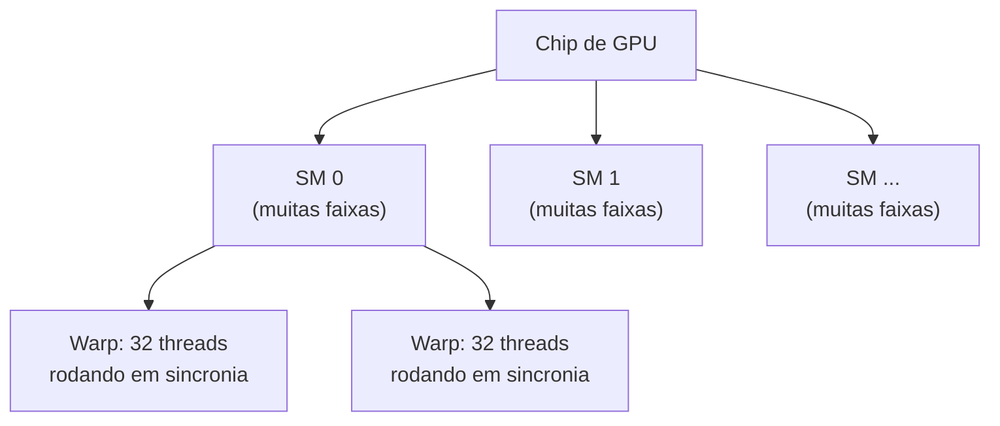
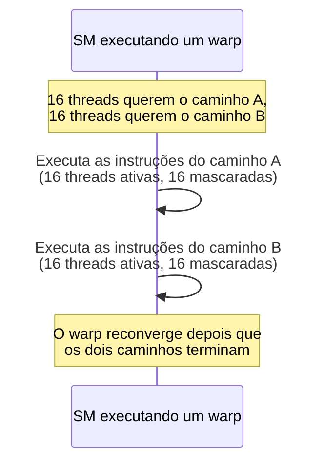

## Objetivos de Aprendizagem

- Descrever a estrutura de alto nível de uma GPU: muitas faixas simples organizadas em multiprocessadores de streaming (SMs).
- Definir um warp e explicar por que 32 threads executando em sincronia são a unidade fundamental de escalonamento da GPU.
- Explicar o SIMT com precisão e como ele difere do modelo SIMD estrito do conceito anterior, especificamente quanto à predicação por thread.
- Rastrear, passo a passo, o que acontece quando threads de um mesmo warp seguem desvios diferentes (divergência de warp) e calcular seu custo real de desempenho.
- Dizer explicitamente o que este conceito cobre e o que não cobre, distinguindo a arquitetura de GPU (este conceito) do modelo de programação CUDA/OpenCL (`systems/parallel-computing`).

## Contexto e Motivação

O conceito anterior terminou com uma limitação genuína do SIMD estrito: toda faixa de uma instrução SIMD precisa fazer exatamente a mesma operação, o que desmorona no momento em que uma carga de trabalho com paralelismo de dados contém um desvio dependente dos dados, com alguns elementos precisando de um caminho de código e outros precisando de outro. As GPUs são construídas para rodar exatamente esse tipo de carga de trabalho (código massivamente paralelo em dados, mas com desvios reais por elemento, ainda que normalmente limitados), e sua arquitetura é a resposta direta de hardware a essa lacuna: o SIMT, "Single Instruction, Multiple Threads", o termo da própria NVIDIA (usado em toda a sua documentação oficial de CUDA) para um modelo que é um primo próximo do SIMD, estendido com um mecanismo real para desvios divergentes.

O escopo deste conceito é deliberadamente estreito: ele cobre o *modelo de execução do hardware* da GPU (como ela é de fato estruturada para rodar muitas threads com eficiência e quanto essa estrutura custa quando threads discordam sobre qual desvio seguir) e para aí. Escrever programas de GPU de verdade (CUDA, kernels OpenCL, todo o modelo de programação de lançar milhares de threads e raciocinar sobre sua cooperação) é material real e substancial que este currículo reserva para `systems/parallel-computing`, ainda não alcançada.

## Teoria Central

### Estrutura da GPU: milhares de faixas simples, organizadas em SMs

Uma GPU agrupa um número muito grande de faixas de processamento simples (muito mais numerosas, e individualmente muito mais simples, do que o pequeno número de núcleos complexos, capazes de execução fora de ordem, de uma CPU), organizadas em grupos chamados **multiprocessadores de streaming (SMs)**. Cada SM gerencia muitas faixas e escalona trabalho nelas; um chip de GPU normalmente contém muitos SMs, cada um capaz de rodar uma quantidade substancial de threads ao mesmo tempo.



### O warp: a unidade real de escalonamento da GPU

Quando um grande número de threads é atribuído para rodar num SM, o SM as subdivide em grupos de tamanho fixo de 32 threads chamados **warps**. Toda thread de um mesmo warp executa *exatamente a mesma instrução*, *exatamente no mesmo momento*, sobre seu próprio dado individual: um warp é, mecanicamente, exatamente uma unidade SIMD de 32 faixas, e é precisamente por isso que os conceitos de SIMD do conceito anterior se generalizam de forma tão direta para a arquitetura de GPU. Um warp se comporta como um único fluxo de instruções SIMD muito largo, aplicado a 32 faixas ao mesmo tempo.

### SIMT vs. SIMD: predicação por thread para desvios divergentes

O acréscimo arquitetural genuíno que o SIMT faz em relação ao SIMD estrito é um mecanismo para tratar o caso que o Exemplo 3 do conceito anterior identificou como a fraqueza central do SIMD: o que acontece quando faixas diferentes (threads dentro de um warp) precisam seguir desvios diferentes? A resposta do SIMT é **predicação com serialização**: quando as threads de um warp divergem (algumas seguindo um desvio, outras seguindo outro), o hardware *não* executa os dois caminhos de fato em paralelo. Em vez disso, ele executa cada caminho divergente **em série**, uma vez por caminho distinto seguido, com só as threads que de fato precisam daquele caminho específico ativas (seus resultados mantidos), enquanto as outras threads ficam mascaradas (desativadas, sem fazer trabalho útil, embora a *instrução* ainda seja emitida para elas).



### O custo real: divergência de warp

Esse mecanismo é o que permite ao SIMT tolerar desvios genuinamente por thread, ao contrário do SIMD estrito, mas não é de graça. Um warp que diverge em dois caminhos distintos leva, no pior caso, o tempo *somado* de executar os dois caminhos em série, mesmo que, a qualquer momento, metade das faixas não esteja fazendo trabalho útil nenhum. Um warp em que toda thread segue o *mesmo* caminho (o caso comum para código genuinamente uniforme e trivialmente paralelo em dados) não paga custo nenhum de divergência e roda com eficiência SIMD total. É exatamente por isso que a programação de GPU favorece código estruturado para minimizar a divergência dentro de um warp, mesmo que o hardware tecnicamente a tolere quando ela ocorre.

## Exemplos Resolvidos

### Exemplo 1: um warp sem divergência, com eficiência total

```c
// Kernel de GPU: cada thread soma um par de elementos do array
result[i] = a[i] + b[i];
```

Toda thread de todo warp executa a mesma única instrução (a soma), sem desvio nenhum: isso roda com eficiência SIMT/SIMD total, toda faixa fazendo trabalho útil em todo ciclo, coincidindo exatamente com o caso SIMD ideal do conceito anterior.

### Exemplo 2: um warp com divergência, quantificando o custo

```c
// Kernel de GPU: as threads seguem caminhos diferentes conforme os próprios dados
if (x[i] > 0) {
    result[i] = expensive_positive_path(x[i]);   // leva 100 ciclos
} else {
    result[i] = expensive_negative_path(x[i]);    // leva 80 ciclos
}
```

Suponha que, dentro de um warp de 32 threads, 16 threads tenham `x[i] > 0` e 16 não:

```text
Sem tratamento de divergência (impossível sob SIMT, mostrado para contraste):
  se toda thread conseguisse de algum jeito seguir o próprio caminho de fato em paralelo,
  tempo total ≈ max(100, 80) = 100 ciclos

COM a serialização real do SIMT:
  Caminho A (16 threads ativas, 16 mascaradas): 100 ciclos
  Caminho B (16 threads ativas, 16 mascaradas): 80 ciclos
  Tempo total do warp = 100 + 80 = 180 ciclos
```

O warp divergente leva 180 ciclos, quase o dobro dos 100 ciclos que levaria se toda thread do warp por acaso concordasse no mesmo caminho: um custo real, direto e totalmente típico da divergência de warp, pago especificamente porque o hardware precisa serializar caminhos distintos, em vez de rodá-los de fato ao mesmo tempo.

### Exemplo 3: distinguindo o que este conceito cobre do que não cobre

```text
Este conceito (arquitetura de GPU / SIMT):
  - O que é um warp e por que 32 threads rodam em sincronia
  - Como a divergência é tratada (serialização + máscara) e quanto custa
  - Por que código uniforme, sem divergência, roda com eficiência total

NÃO é este conceito (reservado para `systems/parallel-computing`):
  - Como de fato ESCREVER um kernel CUDA ou OpenCL
  - Como lançar uma grade de blocos de threads e raciocinar sobre seu dimensionamento
  - Gerenciamento de memória entre um host de CPU e um dispositivo de GPU
  - Primitivas de sincronização específicas da programação de GPU
```

Um leitor que entende este conceito por completo consegue explicar *por que* um dado kernel de GPU pode rodar mais devagar do que o esperado (divergência, do Exemplo 2) sem ainda saber como escrever esse kernel, para começo de conversa: exatamente o escopo pretendido deste conceito, deliberadamente restrito à arquitetura.

## Equívocos Comuns e Armadilhas

- **"SIMT é só outro nome para SIMD."** O SIMT acrescenta especificamente predicação por thread e execução serializada dos caminhos divergentes, um mecanismo real para o qual o SIMD estrito (como visto no conceito anterior) não tem nenhum equivalente: essa é a diferença genuína e substantiva, e não uma preferência de nomenclatura.
- **"Uma GPU sempre executa cada thread de forma verdadeiramente independente e em paralelo, qualquer que seja o desvio."** O Exemplo 2 mostra o contrário: threads do *mesmo warp* que divergem são serializadas, com cada caminho executado com as outras faixas mascaradas; a execução verdadeiramente independente só acontece *entre* warps diferentes, e não dentro de um warp que diverge.
- **"A divergência de warp causa resultados incorretos."** Nunca: o caminho correto de cada thread acaba sendo executado, com resultados corretos para aquela thread; o custo é puramente de tempo (a quase duplicação do Exemplo 2), em paralelo exato com o falso compartilhamento (um conceito anterior), que era um custo real de desempenho sem impacto nenhum na correção.
- **"Entender este conceito significa saber escrever código de GPU."** Como o Exemplo 3 deixa explícito, este conceito cobre só o modelo de execução do hardware; o modelo de programação de fato (CUDA/OpenCL, lançamento de kernels, gerenciamento de memória host/dispositivo) é material real, substancial e separado, de `systems/parallel-computing`.

## Resumo

Uma GPU organiza muitas faixas simples em multiprocessadores de streaming, que escalonam threads em grupos fixos de 32 chamados warps: mecanicamente, uma unidade SIMD de 32 faixas, estendida pelo acréscimo real do SIMT, a predicação por thread, que permite tratar desvios divergentes dentro de um warp serializando cada caminho distinto, com as threads não envolvidas mascaradas, a um custo de tempo real e quantificável (Exemplo 2), em vez de uma execução verdadeiramente paralela dos dois caminhos. Código uniforme, sem divergência, roda com eficiência equivalente à do SIMD total, o que torna a arquitetura de GPU uma escolha natural exatamente para as cargas de trabalho trivialmente paralelas em dados (processamento de imagens e áudio, laços internos numéricos) que o conceito anterior de SIMD já identificou como o ponto forte do SIMD, estendidas para tolerar um desvio real ocasional. Tendo coberto as quatro grandes técnicas desta disciplina além da CPU básica de ciclo único (pipelining, a hierarquia de memória, multinúcleo/coerência e arquitetura SIMD/GPU), a disciplina se encerra com um projeto final que amarra os fios históricos e técnicos entre elas.

## Documentation Links

- [NVIDIA CUDA Programming Guide: Advanced Kernel Programming (SIMT/Warps)](https://docs.nvidia.com/cuda/cuda-programming-guide/03-advanced/advanced-kernel-programming.html): a própria documentação primária da NVIDIA que define SIMT, warps e divergência de warp.
- [ACM/IEEE CS2013: Architecture and Organization Knowledge Area](https://csed.acm.org/knowledge-areas-architecture-and-organization-ar-cs2013-version/): lista processadores vetoriais e GPUs como tema obrigatório de Performance Enhancements.
