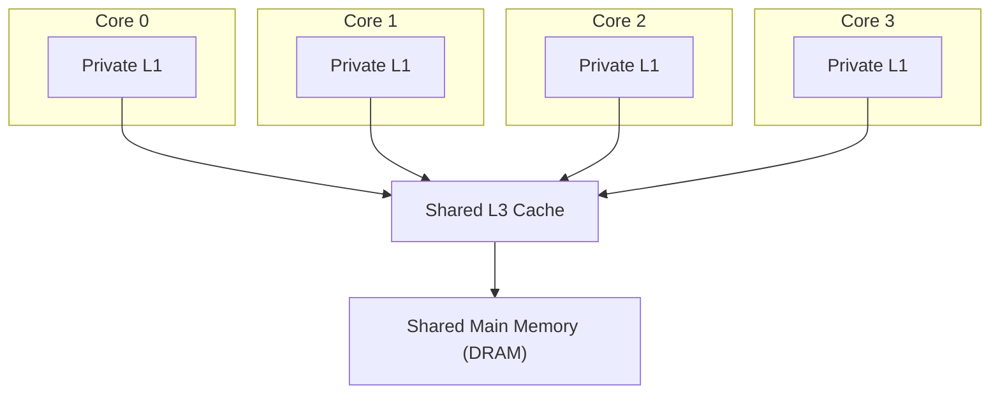

## Learning Objectives

- Describe the typical multicore cache layout: private L1 (and often L2) per core, shared L3, shared main memory.
- Explain why giving each core its own private L1 is necessary for performance, referencing AMAT and hit time from earlier in this cluster.
- Explain why sharing L3 and main memory across cores is a deliberate, sensible design choice, not just a cost-cutting shortcut.
- State the new correctness question this layout raises that a single-core system, from every earlier concept in this discipline, never had to face.
- Distinguish this shared-memory architecture question from the parallel *programming model* (OpenMP, threads) that will be covered separately, in `systems/parallel-computing`.

## Context & Motivation

The previous concept established *why* chip designers turned to multiple cores instead of one increasingly complex core. This concept describes the resulting hardware layout in enough detail to motivate the correctness problem the rest of this cluster exists to solve. Every single concept in this discipline up to this point — pipelining, hazards, the entire memory hierarchy — implicitly assumed exactly one core, with exactly one path to memory. That assumption ends here, permanently, for the remainder of the discipline.

CMU 15-418, "Parallel Computer Architecture and Programming," opens its own treatment of multicore systems with essentially this same layout, precisely because it is close to universal across real multicore chips: understanding it precisely is a prerequisite for understanding cache coherence, the concept immediately following this one.

## Core Theory

### The typical layout: private low levels, shared high levels

A real multicore chip commonly gives each individual core its own **private** L1 cache (and, in many designs, its own private L2 as well), while a single, larger **L3** cache — and the one physical main memory (DRAM) behind it — is **shared** across every core on the chip:



### Why L1 must be private: hit time matters most at the fastest level

Recall from Average Memory Access Time and Multilevel Caches that a level's hit time contributes directly, unconditionally, to every single access at that level, while its miss penalty only applies to the fraction of accesses that actually miss. L1's whole purpose is to serve the overwhelming majority of accesses at the lowest possible hit time — a handful of cycles. If L1 were shared across cores, every core's access would need to arbitrate for that one shared resource, and physical distance alone (a shared L1 has to be reachable from every core, which for cores physically distributed across a chip means it can't be equally close to all of them) would force a longer hit time than a private, physically adjacent L1 can offer each individual core. Keeping L1 (and often L2) private is a direct, deliberate consequence of exactly the same hit-time-dominates reasoning this cluster's AMAT concept already established.

### Why L3 and memory are shared: economics and genuine cross-core sharing

L3 is shared for two real, complementary reasons. First, economics: a single larger shared cache uses silicon more efficiently than N smaller private copies of the same total capacity, since any one core's momentarily idle share of L3 capacity is automatically available to a different, busier core, rather than sitting wasted in an unused private L3 the idle core isn't currently filling. Second, genuine cross-core sharing: if two cores are actually cooperating on related work (say, two threads of the same program, reading the same shared data structure), a shared L3 lets one core's fetch benefit the other directly — the second core can hit in the shared L3 instead of paying a full trip to DRAM, which two entirely private hierarchies could never offer. Main memory being shared is even more fundamental — it is the same one physical DRAM installed on the system, addressed identically by every core, which is precisely what makes "shared memory" the honest name for this whole architecture.

### The new correctness question this layout raises

Here is the problem this specific layout creates, which no concept anywhere earlier in this discipline has had to confront: if Core 0 and Core 1 are both allowed to cache their own private copies of the exact same memory address (both hold it in their respective private L1s), and Core 0 then *writes* a new value to that address, does Core 1's private cached copy somehow know to update or invalidate itself? Nothing described in this concept's layout, on its own, answers that question — a private L1's write, from Write Policies: Write-Through and Write-Back, only ever considered how *its own* copy relates to memory below it; it said nothing about a *different* core's private copy of the very same address. This is precisely the coherence problem the next concept, Cache Coherence and the MESI Protocol, states and solves.

### Scope: architecture here, programming model elsewhere

This concept, and the ones immediately following it in this cluster, describe what the *hardware* provides — a shared address space, with the coherence guarantees the next two concepts develop. How a programmer actually writes code to exploit multiple cores — threads, OpenMP directives, explicit synchronization primitives, task decomposition strategies — is a separate, substantial topic, deliberately reserved for `systems/parallel-computing`, a discipline not yet reached in this curriculum. This cluster is careful to stay on the hardware side of that boundary throughout.

## Worked Examples

### Example 1: Tracing where a single address's data can physically live at once

Suppose address `0x1000` is actively being used by both Core 0 and Core 1, each having recently read it.

```text
Core 0's private L1: holds a copy of the block containing 0x1000
Core 1's private L1: holds ITS OWN, separate copy of the block containing 0x1000
Shared L3:            holds a copy too (having supplied both L1 misses originally)
Main memory (DRAM):   holds the "official" copy, from which L3 was originally filled
```

Up to four distinct physical copies of the same logical data can exist simultaneously in this layout — a direct, structural consequence of giving each core its own private L1, and the precise reason a coherence mechanism is needed at all: nothing here guarantees these four copies stay consistent with each other on a write.

### Example 2: Why a shared L3 genuinely helps cooperating threads

Two threads of the same program, running on Core 0 and Core 1, both need to read a large, shared lookup table.

```text
Core 0 reads the table first: MISSES in its private L1, MISSES in shared L3,
                                fetches all the way from DRAM, populates L3 AND
                                Core 0's private L1.
Core 1 reads the SAME table shortly after: MISSES in its own private L1 (Core 1
                                has never seen this data before), but HITS in
                                the shared L3 — Core 0's earlier fetch already
                                populated it there, avoiding a second trip to DRAM.
```

This is a real, measurable benefit specific to the shared-L3 design: Core 1's access is faster than it would have been with two entirely separate, private L3s, precisely because the two cores are genuinely cooperating on the same data — exactly the second reason for sharing L3 given in the Core Theory section.

### Example 3: Classifying a described chip using this concept's vocabulary

A processor's specification states: "8 cores, each with a private 48 KB L1 and private 512 KB L2; 32 MB L3 shared across all 8 cores; single 64 GB DRAM main memory pool." Using this concept's terms:

```text
Private per-core:  L1 (48 KB) and L2 (512 KB) — fast, low hit time, dedicated
                    to each core individually.
Shared across all: L3 (32 MB) and DRAM (64 GB) — larger, slower, pooled for
                    efficient use and genuine cross-core data sharing.
```

This maps directly onto the layout diagrammed in the Core Theory section — a real, typical multicore design, not a simplified teaching abstraction invented for this discipline.

## Common Misconceptions & Pitfalls

- **"Sharing L3 is purely a cost-saving shortcut, with no genuine performance benefit."** Example 2 shows a real, measurable performance benefit specific to sharing — a second core's access to data a first core already fetched can hit in shared L3 rather than paying a full DRAM trip, something two isolated private caches could never provide.
- **"If L3 is shared, L1 could be shared too, for the same reasons."** The reasoning is different at each level: L3 sharing trades a small hit-time cost (arbitration, physical distance) for genuine capacity efficiency and cross-core benefit, which is worthwhile because L3 misses are already relatively rare and expensive regardless. L1's hit time dominates the AMAT of *every single access*, so even a small shared-access penalty there would be paid far more often and would meaningfully hurt overall performance — which is exactly why private L1 is nearly universal in real designs.
- **"This concept's layout automatically keeps every core's view of memory consistent."** The opposite is true, and is the entire point of ending this concept where it does: nothing described here prevents Core 0 and Core 1 from holding stale, inconsistent private copies of the same address after one of them writes to it — that is a real, unsolved problem left for the very next concept.
- **"Understanding this hardware layout is the same as knowing how to write multithreaded code."** This concept, and the coherence mechanism after it, describe hardware guarantees only. Actually writing correct parallel programs — threads, synchronization, work decomposition — is separate material, explicitly deferred to `systems/parallel-computing`.

## Summary

A typical multicore chip gives each core its own private, fast L1 (and often L2) cache — necessary because hit time dominates AMAT and a shared low-level cache would slow down every single access — while sharing a larger L3 cache and the one physical main memory across all cores, both for efficient silicon use and for genuine performance benefits when cores cooperate on the same data. This layout, however, allows the same logical memory address to exist as several distinct, independently cached physical copies across different cores' private caches simultaneously, and nothing in the layout itself prevents those copies from becoming inconsistent once one core writes — a genuinely new correctness question, unlike anything faced by any single-core concept earlier in this discipline. The next concept, Cache Coherence and the MESI Protocol, states this problem precisely and develops the real, standard hardware protocol that solves it.

## Documentation Links

- [ACM/IEEE CS2013 — Architecture and Organization Knowledge Area](https://csed.acm.org/knowledge-areas-architecture-and-organization-ar-cs2013-version/) — lists shared-memory multicore/multiprocessor organization as a required Architecture and Organization topic.
- [CMU 15-418 — Snooping Cache Coherence Lecture](https://www.cs.cmu.edu/afs/cs/academic/class/15418-s12/www/lectures/11_coherence2.pdf) — course covering exactly this private-L1/shared-L3 multicore layout as the setup for cache coherence.
