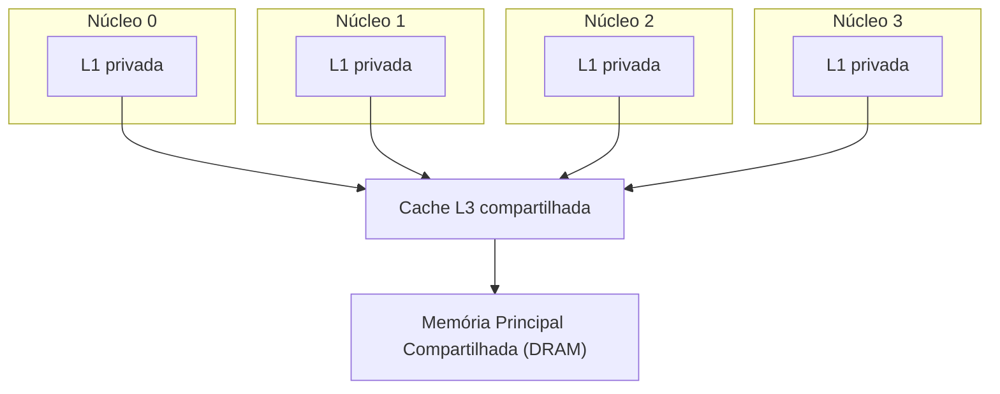

## Objetivos de Aprendizagem

- Descrever o layout típico de cache multinúcleo: L1 privada (e muitas vezes L2) por núcleo, L3 compartilhada, memória principal compartilhada.
- Explicar por que dar a cada núcleo sua própria L1 privada é necessário para o desempenho, retomando o AMAT e o tempo de acerto vistos antes neste bloco.
- Explicar por que compartilhar a L3 e a memória principal entre os núcleos é uma escolha de projeto deliberada e sensata, e não só um atalho para cortar custos.
- Enunciar a nova pergunta de correção que este layout levanta e que um sistema de núcleo único, de todos os conceitos anteriores desta disciplina, nunca precisou enfrentar.
- Distinguir esta questão de arquitetura de memória compartilhada do *modelo de programação* paralela (OpenMP, threads), que será visto separadamente, em `systems/parallel-computing`.

## Contexto e Motivação

O conceito anterior estabeleceu *por que* os projetistas de chips se voltaram para vários núcleos em vez de um núcleo cada vez mais complexo. Este conceito descreve o layout de hardware resultante com detalhe suficiente para motivar o problema de correção que o resto deste bloco existe para resolver. Todo conceito desta disciplina até aqui (pipelining, hazards, toda a hierarquia de memória) supôs implicitamente exatamente um núcleo, com exatamente um caminho até a memória. Essa suposição termina aqui, de forma permanente, pelo resto da disciplina.

O CMU 15-418, "Parallel Computer Architecture and Programming", abre seu próprio tratamento de sistemas multinúcleo essencialmente com este mesmo layout, justamente porque ele é quase universal entre chips multinúcleo reais: entendê-lo com precisão é pré-requisito para entender a coerência de cache, o conceito logo a seguir.

## Teoria Central

### O layout típico: níveis baixos privados, níveis altos compartilhados

Um chip multinúcleo real costuma dar a cada núcleo individual sua própria cache L1 **privada** (e, em muitos projetos, também sua própria L2 privada), enquanto uma única cache **L3**, maior, e a única memória principal física (DRAM) por trás dela são **compartilhadas** entre todos os núcleos do chip:



### Por que a L1 precisa ser privada: o tempo de acerto importa mais no nível mais rápido

Lembre de Tempo Médio de Acesso à Memória e Caches Multinível que o tempo de acerto de um nível contribui de forma direta e incondicional para cada acesso naquele nível, enquanto sua penalidade de falha só se aplica à fração dos acessos que de fato falham. Todo o propósito da L1 é atender a esmagadora maioria dos acessos com o menor tempo de acerto possível, um punhado de ciclos. Se a L1 fosse compartilhada entre os núcleos, o acesso de cada núcleo precisaria disputar esse único recurso compartilhado, e só a distância física (uma L1 compartilhada precisa ser alcançável a partir de todo núcleo, o que, para núcleos fisicamente distribuídos pelo chip, significa que ela não pode estar igualmente perto de todos) forçaria um tempo de acerto maior do que uma L1 privada, fisicamente adjacente, consegue oferecer a cada núcleo individual. Manter a L1 (e muitas vezes a L2) privada é uma consequência direta e deliberada exatamente do mesmo raciocínio de "o tempo de acerto domina" que o conceito de AMAT deste bloco já estabeleceu.

### Por que a L3 e a memória são compartilhadas: economia e compartilhamento real entre núcleos

A L3 é compartilhada por dois motivos reais e complementares. Primeiro, economia: uma única cache compartilhada maior usa o silício com mais eficiência do que N cópias privadas menores da mesma capacidade total, já que a parte momentaneamente ociosa da capacidade de L3 de um núcleo fica automaticamente disponível para outro núcleo, mais ocupado, em vez de ficar desperdiçada numa L3 privada sem uso que o núcleo ocioso não está preenchendo. Segundo, compartilhamento real entre núcleos: se dois núcleos estão de fato cooperando num trabalho relacionado (digamos, duas threads do mesmo programa lendo a mesma estrutura de dados compartilhada), uma L3 compartilhada permite que a busca de um núcleo beneficie o outro diretamente. O segundo núcleo pode acertar na L3 compartilhada em vez de pagar uma ida completa à DRAM, algo que duas hierarquias inteiramente privadas jamais conseguiriam oferecer. A memória principal ser compartilhada é ainda mais fundamental: é a mesma única DRAM física instalada no sistema, endereçada de forma idêntica por todo núcleo, que é exatamente o que torna "memória compartilhada" o nome honesto de toda esta arquitetura.

### A nova pergunta de correção que este layout levanta

Eis o problema que este layout específico cria e que nenhum conceito anterior desta disciplina precisou enfrentar: se o Núcleo 0 e o Núcleo 1 podem ambos guardar em cache suas próprias cópias privadas do mesmíssimo endereço de memória (os dois o guardam nas respectivas L1 privadas), e o Núcleo 0 então *escreve* um valor novo nesse endereço, a cópia privada em cache do Núcleo 1 de algum modo sabe que precisa se atualizar ou se invalidar? Nada descrito no layout deste conceito, por si só, responde essa pergunta: a escrita numa L1 privada, de Políticas de Escrita: Write-Through e Write-Back, só considerava como a *própria* cópia se relaciona com a memória abaixo dela; não dizia nada sobre a cópia privada de um *outro* núcleo do mesmíssimo endereço. Esse é precisamente o problema de coerência que o próximo conceito, Coerência de Cache e o Protocolo MESI, enuncia e resolve.

### Escopo: arquitetura aqui, modelo de programação em outro lugar

Este conceito, e os que o seguem logo depois neste bloco, descrevem o que o *hardware* oferece: um espaço de endereçamento compartilhado, com as garantias de coerência que os próximos dois conceitos desenvolvem. Como um programador de fato escreve código para explorar vários núcleos (threads, diretivas OpenMP, primitivas de sincronização explícitas, estratégias de decomposição de tarefas) é um tema separado e substancial, deliberadamente reservado para `systems/parallel-computing`, uma disciplina ainda não alcançada neste currículo. Este bloco toma cuidado para ficar do lado do hardware dessa fronteira o tempo todo.

## Exemplos Resolvidos

### Exemplo 1: rastreando onde os dados de um único endereço podem morar fisicamente ao mesmo tempo

Suponha que o endereço `0x1000` esteja sendo usado ativamente tanto pelo Núcleo 0 quanto pelo Núcleo 1, cada um tendo-o lido recentemente.

```text
L1 privada do Núcleo 0: guarda uma cópia do bloco que contém 0x1000
L1 privada do Núcleo 1: guarda a SUA PRÓPRIA cópia, separada, do bloco que contém 0x1000
L3 compartilhada:        também guarda uma cópia (tendo atendido as duas falhas de L1 originalmente)
Memória principal (DRAM): guarda a cópia "oficial", a partir da qual a L3 foi preenchida originalmente
```

Até quatro cópias físicas distintas do mesmo dado lógico podem existir ao mesmo tempo neste layout, uma consequência direta e estrutural de dar a cada núcleo sua própria L1 privada, e o motivo preciso pelo qual sequer é preciso um mecanismo de coerência: nada aqui garante que essas quatro cópias continuem consistentes entre si numa escrita.

### Exemplo 2: por que uma L3 compartilhada de fato ajuda threads que cooperam

Duas threads do mesmo programa, rodando no Núcleo 0 e no Núcleo 1, precisam ambas ler uma grande tabela de consulta compartilhada.

```text
O Núcleo 0 lê a tabela primeiro: FALHA na sua L1 privada, FALHA na L3 compartilhada,
                                 busca lá na DRAM, preenche a L3 E
                                 a L1 privada do Núcleo 0.
O Núcleo 1 lê a MESMA tabela logo depois: FALHA na própria L1 privada (o Núcleo 1
                                 nunca viu esses dados antes), mas ACERTA na
                                 L3 compartilhada: a busca anterior do Núcleo 0 já
                                 a preencheu ali, evitando uma segunda ida à DRAM.
```

Este é um benefício real e mensurável, específico do projeto com L3 compartilhada: o acesso do Núcleo 1 é mais rápido do que teria sido com duas L3 privadas totalmente separadas, justamente porque os dois núcleos estão de fato cooperando sobre os mesmos dados, exatamente o segundo motivo para compartilhar a L3 dado na seção de Teoria Central.

### Exemplo 3: classificando um chip descrito com o vocabulário deste conceito

A especificação de um processador diz: "8 núcleos, cada um com L1 privada de 48 KB e L2 privada de 512 KB; L3 de 32 MB compartilhada entre os 8 núcleos; um único conjunto de 64 GB de memória principal DRAM". Usando os termos deste conceito:

```text
Privado por núcleo:   L1 (48 KB) e L2 (512 KB): rápidas, com tempo de acerto baixo,
                       dedicadas a cada núcleo individualmente.
Compartilhado por todos: L3 (32 MB) e DRAM (64 GB): maiores, mais lentas, em conjunto
                       para uso eficiente e compartilhamento real de dados entre núcleos.
```

Isso corresponde diretamente ao layout diagramado na seção de Teoria Central: um projeto multinúcleo real e típico, e não uma abstração didática simplificada inventada para esta disciplina.

## Equívocos Comuns e Armadilhas

- **"Compartilhar a L3 é puramente um atalho para economizar, sem benefício real de desempenho."** O Exemplo 2 mostra um benefício de desempenho real e mensurável, específico do compartilhamento: o acesso de um segundo núcleo a dados que um primeiro núcleo já buscou pode acertar na L3 compartilhada, em vez de pagar uma ida completa à DRAM, algo que duas caches privadas isoladas jamais conseguiriam oferecer.
- **"Se a L3 é compartilhada, a L1 também poderia ser, pelos mesmos motivos."** O raciocínio é diferente em cada nível: compartilhar a L3 troca um pequeno custo de tempo de acerto (disputa, distância física) por eficiência genuína de capacidade e benefício entre núcleos, o que vale a pena porque as falhas na L3 já são relativamente raras e caras de qualquer jeito. O tempo de acerto da L1 domina o AMAT de *cada acesso*, então até uma pequena penalidade de acesso compartilhado ali seria paga com muito mais frequência e prejudicaria de forma significativa o desempenho geral, e é exatamente por isso que a L1 privada é quase universal em projetos reais.
- **"O layout deste conceito mantém automaticamente consistente a visão da memória de todo núcleo."** É o oposto, e é todo o motivo de este conceito terminar onde termina: nada descrito aqui impede que o Núcleo 0 e o Núcleo 1 guardem cópias privadas velhas e inconsistentes do mesmo endereço depois que um deles escreve nele. É um problema real, ainda não resolvido, deixado para o próximo conceito.
- **"Entender este layout de hardware é o mesmo que saber escrever código multithread."** Este conceito, e o mecanismo de coerência depois dele, descrevem só garantias de hardware. Escrever de fato programas paralelos corretos (threads, sincronização, decomposição do trabalho) é material separado, explicitamente adiado para `systems/parallel-computing`.

## Resumo

Um chip multinúcleo típico dá a cada núcleo sua própria cache L1 (e muitas vezes L2) privada e rápida, o que é necessário porque o tempo de acerto domina o AMAT e uma cache compartilhada de nível baixo deixaria cada acesso mais lento, enquanto compartilha uma cache L3 maior e a única memória principal física entre todos os núcleos, tanto pelo uso eficiente do silício quanto pelos benefícios reais de desempenho quando os núcleos cooperam sobre os mesmos dados. Esse layout, porém, permite que o mesmo endereço lógico de memória exista como várias cópias físicas distintas, guardadas de forma independente nas caches privadas de núcleos diferentes ao mesmo tempo, e nada no próprio layout impede que essas cópias se tornem inconsistentes quando um núcleo escreve. É uma pergunta de correção genuinamente nova, diferente de tudo o que qualquer conceito de núcleo único desta disciplina enfrentou antes. O próximo conceito, Coerência de Cache e o Protocolo MESI, enuncia esse problema com precisão e desenvolve o protocolo de hardware real e padrão que o resolve.

## Documentation Links

- [ACM/IEEE CS2013: Architecture and Organization Knowledge Area](https://csed.acm.org/knowledge-areas-architecture-and-organization-ar-cs2013-version/): lista a organização multinúcleo/multiprocessador de memória compartilhada como tema obrigatório de Architecture and Organization.
- [CMU 15-418: Snooping Cache Coherence Lecture](https://www.cs.cmu.edu/afs/cs/academic/class/15418-s12/www/lectures/11_coherence2.pdf): curso que cobre exatamente este layout multinúcleo de L1 privada/L3 compartilhada como preparação para a coerência de cache.
