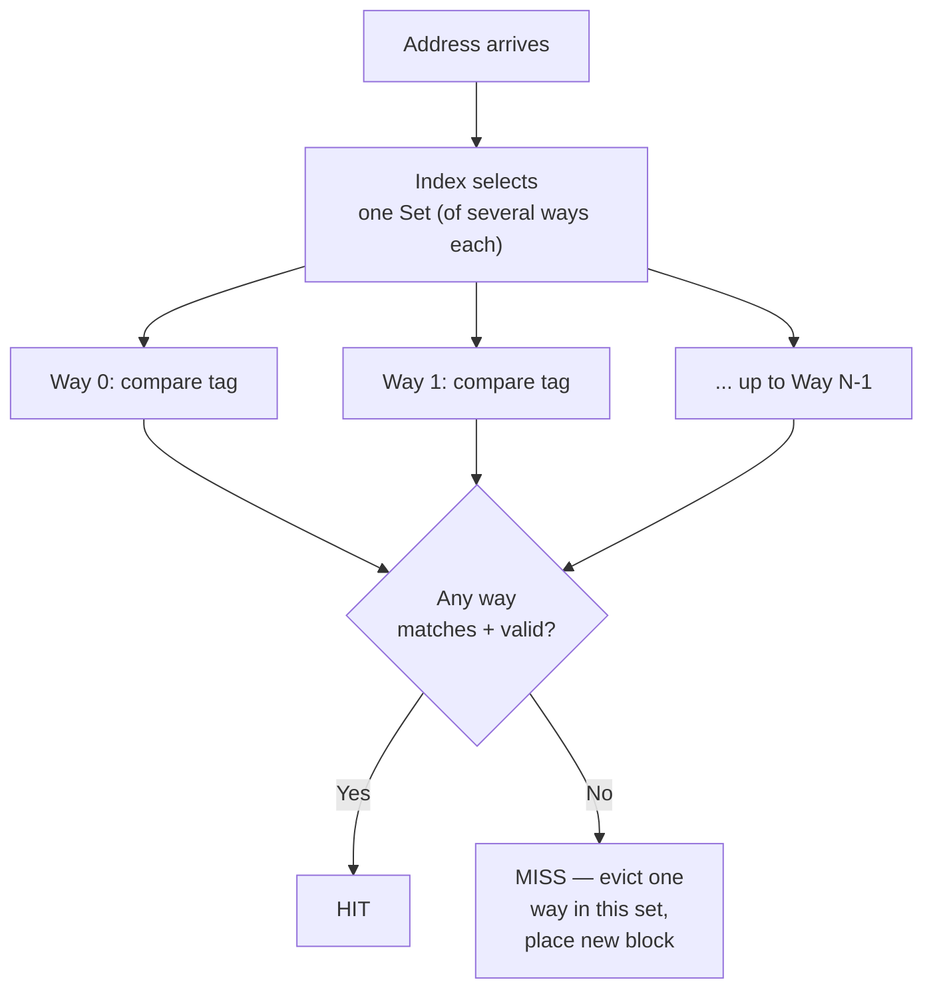

## Learning Objectives

- Explain how an N-way set-associative cache generalizes direct mapping by giving each index N candidate slots instead of one.
- Trace a lookup in a set-associative cache: how the index selects a set, and how the tag comparison now happens against every way in that set.
- Explain fully associative caching as the limiting case of set associativity where the whole cache is one set.
- Compute the tag/index/offset bit split for a given associativity, and explain why increasing associativity (for a fixed total cache size) shrinks the index field.
- State the real hardware cost associativity introduces, explaining why it isn't simply increased without limit.

## Context & Motivation

The previous concept's Example 3 showed a genuine, common weakness of direct mapping: two actively used blocks that happen to share the same index fight over one slot, evicting each other repeatedly even while other slots sit completely idle. Set associativity is the direct fix for exactly this problem, and it is worth understanding as a single, continuous dial rather than a binary choice — direct mapping and fully associative caching turn out to be the two extreme endpoints of the very same idea, with a whole spectrum of practical designs in between.

CMU 15-213's cache lecture, and the corresponding chapter of CS:APP, present set associativity in exactly this way: as a tradeoff between direct mapping's simplicity/speed and fully associative caching's flexibility/cost, letting a real design choose a specific point on that spectrum based on how much conflict-miss reduction is worth how much extra comparison hardware.

## Core Theory

### Generalizing direct mapping: N candidate slots instead of one

An **N-way set-associative** cache groups its slots into **sets**, each containing exactly N slots (called "ways"). The index bits of an address now select which *set* a block can live in — but within that set, the block can occupy *any* of the N ways, chosen by whichever specific replacement rule the cache implements (the subject of the next concept). A lookup now compares the requested tag against **all N** ways in the selected set simultaneously, rather than against just one candidate slot as in direct mapping:



Direct mapping, from the previous concept, is exactly the special case N=1: one way per set, no choice of where within a set a block goes, because there is only one place it could go.

### Fully associative: the other extreme

A **fully associative** cache is the limiting case where the entire cache is one single set — every slot is a candidate for every address, with no index bits needed at all (the index field simply shrinks to zero width, and every bit above the block offset becomes part of the tag). A lookup compares the requested tag against *every single slot* in the whole cache simultaneously. This completely eliminates conflict misses of the kind seen in the previous concept's Example 3 — any two blocks can coexist in the cache regardless of their addresses, as long as the cache has free capacity anywhere at all — but at the cost of needing as many parallel tag comparators as the cache has slots, which becomes prohibitively expensive in real hardware for anything but a small cache.

### The full spectrum

```text
Associativity   Ways per set    Comparisons per lookup    Conflict misses
--------------  --------------  -------------------------  ----------------
Direct-mapped   1               1                           Most (worst)
2-way           2               2                           Fewer
4-way           4               4                           Fewer still
8-way           8               8                           Fewer still
Fully assoc.    = cache size    = number of slots (most)     None
```

Real processor caches commonly use 4-way or 8-way set associativity for L1 and L2 caches — a deliberate middle point trading a modest, fixed amount of extra comparison hardware for a substantial reduction in conflict misses, without paying the full comparator cost of a fully associative design.

### Why address bit-widths shift with associativity

For a fixed total cache size and block size, increasing associativity (more ways per set) means *fewer sets*, since the same total number of slots is now divided into fewer, larger groups. Fewer sets means fewer index bits are needed to select among them — and those bits that are no longer needed for the index simply become additional tag bits instead, since the total address width doesn't change.

## Worked Examples

### Example 1: Re-deriving the address split for a 4-way set-associative cache

Using the same total cache from the previous concept's Example 1 (256 slots total, 64-byte blocks, 32-bit addresses), now organized as 4-way set-associative instead of direct-mapped:

```text
Total slots           = 256
Ways per set           = 4
Number of sets         = 256 / 4 = 64

Offset bits  = log2(64)  = 6 bits   (unchanged — block size didn't change)
Index bits   = log2(64 sets) = 6 bits   (down from 8, since there are fewer sets)
Tag bits     = 32 − 6 − 6 = 20 bits   (up from 18 — the 2 bits freed from the
                                         index become extra tag bits)
```

The *total* cache capacity (256 slots × 64 bytes = 16 KB) is identical to the direct-mapped design in the previous concept's example — only the internal organization changed, trading 2 bits of index precision for a wider tag and the flexibility of choosing among 4 ways per set.

### Example 2: Resolving the previous concept's conflict-miss example

Recall the previous concept's Example 3: arrays `A` and `B`, alternately accessed, whose addresses happen to share the same index under direct mapping, evicting each other on every single access. Re-running that same access pattern against a 4-way set-associative cache using the same total capacity:

```text
A[i]'s block maps to set S, way choice available among 4 ways.
B[i]'s block ALSO maps to set S (same index bits as before) — but since
this set has 4 ways, B[i]'s block can occupy a DIFFERENT way in the same
set, without evicting A[i]'s block at all.
```

As long as no more than 4 distinct, simultaneously-active blocks collide on the same set, both `A[i]` and `B[i]` (and even two more colliding blocks) can coexist happily, turning what was a guaranteed miss on every access under direct mapping into a hit after the first access to each — a direct, concrete resolution of the earlier example's specific weakness.

### Example 3: When even 4-way associativity isn't enough

Suppose a program's inner loop actively cycles through 6 distinct arrays whose addresses all happen to share the same index bits (a real, if less common, occurrence for certain array sizes and layouts). With only 4 ways per set, the 5th and 6th arrays' accesses still evict earlier ones in the same set, causing conflict misses even under 4-way associativity:

```text
6 blocks competing for 4 ways in the same set → at least 2 blocks must
be evicted and re-fetched repeatedly, exactly like the direct-mapped
case, just with a higher threshold (5+ colliding blocks) before it occurs.
```

This shows associativity reduces, rather than categorically eliminates, conflict misses for any *finite* number of ways — only a fully associative cache (where every slot is a candidate for every address) removes conflict misses entirely, regardless of how many distinct blocks happen to collide on what would otherwise be the same index.

## Common Misconceptions & Pitfalls

- **"More associativity is always worth it."** Each additional way requires its own parallel tag comparator, adding real hardware cost and, since more comparisons take marginally longer to resolve, can slightly increase hit time — the next concept's discussion of average memory access time makes this a genuine, quantifiable tradeoff rather than a free improvement.
- **"Direct-mapped and fully associative are fundamentally different designs."** They are the two endpoints of the exact same set-associative idea (N=1 and N=total slots respectively) — understanding one as a special case of the other, rather than as unrelated schemes, is precisely the point of this concept.
- **"Set associativity eliminates all cache misses caused by insufficient capacity."** It only reduces conflict misses (two blocks fighting over the same limited set of ways). A working set genuinely larger than the whole cache's total capacity still produces capacity misses regardless of associativity — a distinct cause the next few concepts return to.
- **"Fully associative caches are strictly better and should always be used."** Example 3's spectrum table shows the real cost: a fully associative cache needs as many comparators as it has total slots, which is only practical for small caches (some real designs use full associativity for small, specialized structures like a translation lookaside buffer, but not for a multi-megabyte L2 or L3 cache).

## Summary

Set associativity generalizes direct mapping by giving each index N candidate ways instead of one, letting up to N distinct blocks that happen to share an index coexist without evicting each other; direct mapping (N=1) and fully associative caching (N = the entire cache) are the two extremes of this same spectrum, with real processor caches commonly settling on 4-way or 8-way as a deliberate middle point. Higher associativity reduces conflict misses at the real cost of more parallel tag comparators and marginally longer hit times, and even a high but finite associativity can still suffer conflict misses if enough distinct blocks collide on the same set, as only a fully associative design removes that specific cause entirely. With a full set of ways to choose among, the cache now needs an actual rule for *which* way to evict when a set is full — exactly the subject of the next concept, Cache Replacement Policies.

## Documentation Links

- [CMU 15-213 — Cache Memories Lecture](http://www.cs.cmu.edu/afs/cs/academic/class/15213-s14/www/lectures/11-cache-memories.pdf) — covers the direct-mapped/set-associative/fully-associative spectrum with the same address-splitting framework.
- [Bryant & O'Hallaron — Computer Systems: A Programmer's Perspective (CS:APP)](https://csapp.cs.cmu.edu/) — Chapter 6 develops set-associative cache organization as a generalization of direct mapping.
