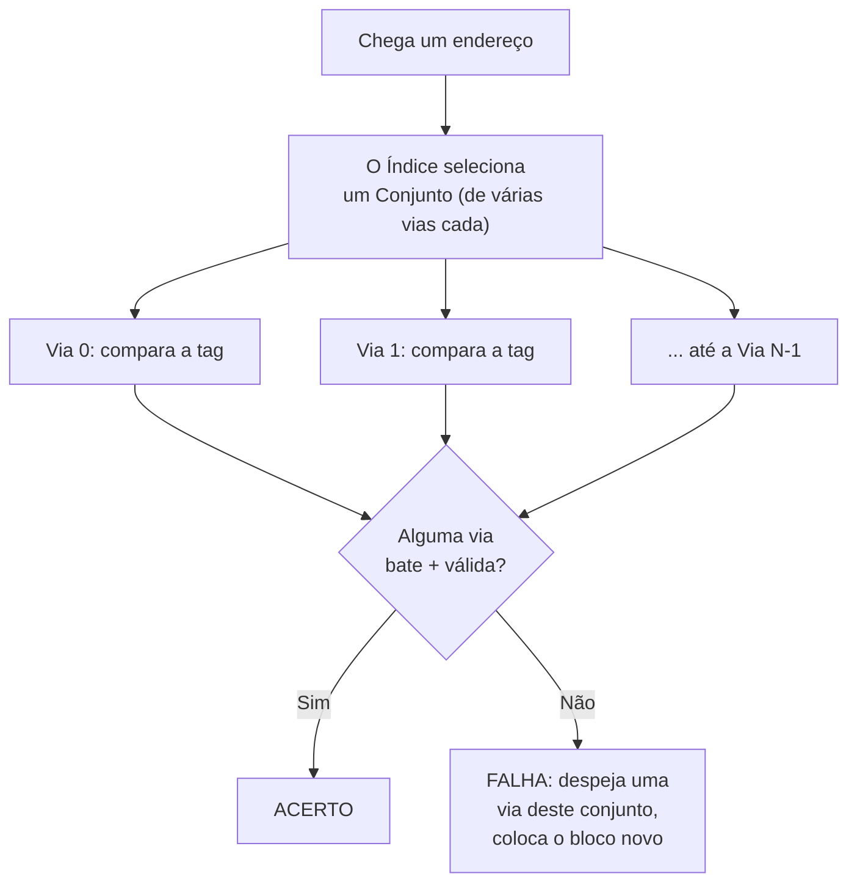

## Objetivos de Aprendizagem

- Explicar como uma cache associativa por conjunto de N vias generaliza o mapeamento direto dando a cada índice N slots candidatos em vez de um.
- Rastrear uma consulta numa cache associativa por conjunto: como o índice seleciona um conjunto e como a comparação de tags agora acontece contra todas as vias desse conjunto.
- Explicar a cache totalmente associativa como o caso-limite da associatividade por conjunto, em que a cache inteira é um único conjunto.
- Calcular a divisão de bits de tag/índice/deslocamento para uma dada associatividade e explicar por que aumentar a associatividade (com tamanho total de cache fixo) encolhe o campo de índice.
- Indicar o custo real de hardware que a associatividade introduz, explicando por que ela não é simplesmente aumentada sem limite.

## Contexto e Motivação

O Exemplo 3 do conceito anterior mostrou uma fraqueza genuína e comum do mapeamento direto: dois blocos usados ativamente que por acaso compartilham o mesmo índice brigam por um slot, despejando um ao outro repetidamente enquanto outros slots ficam totalmente parados. A associatividade por conjunto é a correção direta exatamente desse problema, e vale entendê-la como um único botão contínuo, e não como uma escolha binária: o mapeamento direto e a cache totalmente associativa se revelam as duas extremidades da mesmíssima ideia, com todo um espectro de projetos práticos no meio.

A aula de caches do CMU 15-213 e o capítulo correspondente do CS:APP apresentam a associatividade por conjunto exatamente assim: como uma troca entre a simplicidade/velocidade do mapeamento direto e a flexibilidade/custo da cache totalmente associativa, permitindo que um projeto real escolha um ponto específico desse espectro conforme quanto de redução de falhas por conflito vale quanto de hardware extra de comparação.

## Teoria Central

### Generalizando o mapeamento direto: N slots candidatos em vez de um

Uma cache **associativa por conjunto de N vias** agrupa seus slots em **conjuntos**, cada um com exatamente N slots (chamados de "vias"). Os bits de índice de um endereço agora selecionam em qual *conjunto* um bloco pode morar, mas, dentro desse conjunto, o bloco pode ocupar *qualquer uma* das N vias, escolhida pela regra de substituição específica que a cache implementa (o tema do próximo conceito). Uma consulta agora compara a tag pedida contra **todas as N** vias do conjunto selecionado ao mesmo tempo, em vez de contra só um slot candidato como no mapeamento direto:



O mapeamento direto, do conceito anterior, é exatamente o caso especial N=1: uma via por conjunto, sem escolha de onde, dentro de um conjunto, um bloco fica, porque só existe um lugar possível.

### Totalmente associativa: o outro extremo

Uma cache **totalmente associativa** é o caso-limite em que a cache inteira é um único conjunto: todo slot é candidato para todo endereço, sem necessidade nenhuma de bits de índice (o campo de índice simplesmente encolhe para largura zero, e todo bit acima do deslocamento no bloco passa a fazer parte da tag). Uma consulta compara a tag pedida contra *cada slot* da cache inteira ao mesmo tempo. Isso elimina por completo as falhas por conflito do tipo visto no Exemplo 3 do conceito anterior (quaisquer dois blocos podem coexistir na cache, quaisquer que sejam seus endereços, desde que a cache tenha capacidade livre em qualquer lugar), mas ao custo de precisar de tantos comparadores de tag em paralelo quanto a cache tem slots, o que se torna proibitivamente caro em hardware real para qualquer coisa que não seja uma cache pequena.

### O espectro completo

```text
Associatividade    Vias por conjunto   Comparações por consulta    Falhas por conflito
-----------------  ------------------  --------------------------  -------------------
Mapeamento direto  1                   1                            As mais (pior)
2 vias             2                   2                            Menos
4 vias             4                   4                            Menos ainda
8 vias             8                   8                            Menos ainda
Totalmente assoc.  = tamanho da cache  = número de slots (o máximo)  Nenhuma
```

Caches de processadores reais costumam usar associatividade de 4 ou 8 vias nas caches L1 e L2, um ponto intermediário deliberado que troca uma quantidade modesta e fixa de hardware extra de comparação por uma redução substancial das falhas por conflito, sem pagar o custo completo de comparadores de um projeto totalmente associativo.

### Por que as larguras de bits do endereço mudam com a associatividade

Para um tamanho total de cache e um tamanho de bloco fixos, aumentar a associatividade (mais vias por conjunto) significa *menos conjuntos*, já que o mesmo número total de slots agora é dividido em grupos menos numerosos e maiores. Menos conjuntos significam que são necessários menos bits de índice para escolher entre eles, e os bits que deixam de ser necessários para o índice simplesmente viram bits de tag adicionais, já que a largura total do endereço não muda.

## Exemplos Resolvidos

### Exemplo 1: refazendo a divisão do endereço para uma cache associativa por conjunto de 4 vias

Usando a mesma cache total do Exemplo 1 do conceito anterior (256 slots no total, blocos de 64 bytes, endereços de 32 bits), agora organizada como associativa por conjunto de 4 vias em vez de mapeamento direto:

```text
Total de slots         = 256
Vias por conjunto      = 4
Número de conjuntos    = 256 / 4 = 64

Bits de deslocamento = log2(64)  = 6 bits   (inalterado: o tamanho do bloco não mudou)
Bits de índice       = log2(64 conjuntos) = 6 bits   (eram 8, já que há menos conjuntos)
Bits de tag          = 32 − 6 − 6 = 20 bits   (eram 18: os 2 bits liberados do
                                                índice viram bits extras de tag)
```

A capacidade *total* da cache (256 slots × 64 bytes = 16 KB) é idêntica à do projeto de mapeamento direto do exemplo do conceito anterior; só a organização interna mudou, trocando 2 bits de precisão de índice por uma tag mais larga e pela flexibilidade de escolher entre 4 vias por conjunto.

### Exemplo 2: resolvendo o exemplo de falha por conflito do conceito anterior

Lembre do Exemplo 3 do conceito anterior: os arrays `A` e `B`, acessados alternadamente, cujos endereços por acaso compartilham o mesmo índice no mapeamento direto, despejando um ao outro em cada acesso. Repetindo esse mesmo padrão de acesso numa cache associativa por conjunto de 4 vias com a mesma capacidade total:

```text
O bloco de A[i] mapeia para o conjunto S, com escolha de via entre 4 vias.
O bloco de B[i] TAMBÉM mapeia para o conjunto S (os mesmos bits de índice de antes), mas como
este conjunto tem 4 vias, o bloco de B[i] pode ocupar uma via DIFERENTE do mesmo
conjunto, sem despejar o bloco de A[i].
```

Desde que no máximo 4 blocos distintos, ativos ao mesmo tempo, colidam no mesmo conjunto, tanto `A[i]` quanto `B[i]` (e até mais dois blocos que colidam) podem coexistir sem problemas, transformando o que era uma falha garantida em cada acesso no mapeamento direto num acerto depois do primeiro acesso a cada um: uma resolução direta e concreta da fraqueza específica do exemplo anterior.

### Exemplo 3: quando nem a associatividade de 4 vias basta

Suponha que o laço interno de um programa percorra ativamente 6 arrays distintos cujos endereços por acaso compartilham os mesmos bits de índice (algo real, ainda que menos comum, para certos tamanhos e layouts de arrays). Com só 4 vias por conjunto, os acessos do 5º e do 6º arrays ainda despejam os anteriores no mesmo conjunto, causando falhas por conflito mesmo com associatividade de 4 vias:

```text
6 blocos disputando 4 vias no mesmo conjunto → pelo menos 2 blocos precisam
ser despejados e buscados de novo repetidamente, exatamente como no caso de
mapeamento direto, só que com um limiar maior (5+ blocos colidindo) antes de acontecer.
```

Isso mostra que a associatividade reduz, em vez de eliminar categoricamente, as falhas por conflito para qualquer número *finito* de vias; só uma cache totalmente associativa (em que todo slot é candidato para todo endereço) remove por completo as falhas por conflito, não importa quantos blocos distintos por acaso colidam no que, de outro modo, seria o mesmo índice.

## Equívocos Comuns e Armadilhas

- **"Mais associatividade sempre vale a pena."** Cada via adicional exige seu próprio comparador de tag em paralelo, acrescentando custo real de hardware e, como mais comparações levam um pouco mais de tempo para se resolver, pode aumentar ligeiramente o tempo de acerto. A discussão de tempo médio de acesso à memória do próximo conceito torna isso uma troca genuína e quantificável, e não uma melhora gratuita.
- **"Mapeamento direto e totalmente associativa são projetos fundamentalmente diferentes."** São as duas extremidades exatamente da mesma ideia associativa por conjunto (N=1 e N=total de slots, respectivamente); entender um como caso especial do outro, em vez de como esquemas sem relação, é precisamente o ponto deste conceito.
- **"A associatividade por conjunto elimina todas as falhas de cache causadas por capacidade insuficiente."** Ela só reduz as falhas por conflito (dois blocos brigando pelo mesmo conjunto limitado de vias). Um conjunto de trabalho genuinamente maior que a capacidade total da cache inteira ainda produz falhas por capacidade, qualquer que seja a associatividade, uma causa distinta à qual os próximos conceitos voltam.
- **"Caches totalmente associativas são estritamente melhores e deveriam ser usadas sempre."** A tabela do espectro mostra o custo real: uma cache totalmente associativa precisa de tantos comparadores quanto tem slots no total, o que só é prático para caches pequenas (alguns projetos reais usam associatividade total em estruturas pequenas e especializadas como uma TLB, mas não numa L2 ou L3 de vários megabytes).

## Resumo

A associatividade por conjunto generaliza o mapeamento direto dando a cada índice N vias candidatas em vez de uma, permitindo que até N blocos distintos que por acaso compartilham um índice coexistam sem despejar uns aos outros; o mapeamento direto (N=1) e a cache totalmente associativa (N = a cache inteira) são os dois extremos desse mesmo espectro, com caches de processadores reais costumando ficar em 4 ou 8 vias como ponto intermediário deliberado. Uma associatividade maior reduz as falhas por conflito ao custo real de mais comparadores de tag em paralelo e de tempos de acerto um pouco maiores, e até uma associatividade alta, mas finita, ainda pode sofrer falhas por conflito se blocos distintos suficientes colidirem no mesmo conjunto, já que só um projeto totalmente associativo remove essa causa específica por completo. Com um conjunto completo de vias entre as quais escolher, a cache agora precisa de uma regra de fato para *qual* via despejar quando um conjunto está cheio: exatamente o tema do próximo conceito, Políticas de Substituição de Cache.

## Documentation Links

- [CMU 15-213: Cache Memories Lecture](http://www.cs.cmu.edu/afs/cs/academic/class/15213-s14/www/lectures/11-cache-memories.pdf): cobre o espectro mapeamento direto/associativa por conjunto/totalmente associativa com o mesmo arcabouço de divisão de endereços.
- [Bryant & O'Hallaron: Computer Systems: A Programmer's Perspective (CS:APP)](https://csapp.cs.cmu.edu/): o Capítulo 6 desenvolve a organização de cache associativa por conjunto como uma generalização do mapeamento direto.
