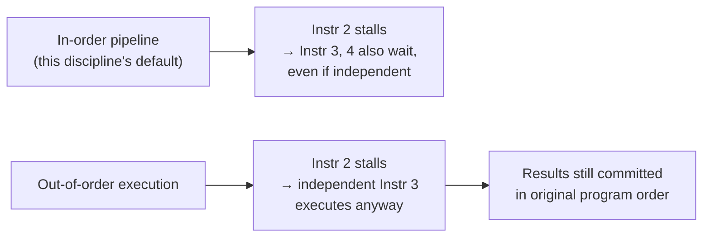

## Learning Objectives

- Explain what "speculative execution" means beyond simple branch prediction: executing, not just fetching, instructions whose control dependency isn't yet confirmed.
- Explain what "out-of-order execution" means, and why it requires tracking dependencies more carefully than this discipline's simple in-order pipeline does.
- State, at a conceptual level, why both techniques exist: to keep functional units busy doing useful work instead of idling on a stall.
- Explain, without deriving the full mechanism, what a misprediction rollback has to undo that a simple in-order flush (from Control Hazards) does not.
- Explain explicitly why this concept is scoped shallow here, and where the full mechanics (reorder buffers, register renaming, Tomasulo-style scheduling) are deferred to.

## Context & Motivation

Every hazard-handling technique covered so far in this cluster — forwarding, load-use stalling, branch flushing, branch prediction — assumes a strictly in-order pipeline: instructions enter, move through the five stages, and complete in exactly the order they were fetched, one at a time, at most one per stage per cycle. Real, high-performance processors go considerably further than this simple model in two related directions, both aimed at the same goal the Iron Law has been organizing this entire discipline around: reducing effective CPI by keeping functional units busy instead of idle.

This concept exists specifically to name these two techniques, explain honestly why they matter, and then explicitly stop short of building them in full. ACM/IEEE CS2013's Architecture and Organization Knowledge Area places branch prediction and speculative/out-of-order execution together under its Performance Enhancements unit, but treats them as progressively more advanced material beyond the "simple datapaths...instruction pipelining, hazard detection and resolution" already covered in this cluster's earlier concepts — a real curricular signal that the full mechanics (register renaming, reorder buffers, Tomasulo-style dynamic scheduling) belong to a more advanced course this discipline has not yet reached, not to an introductory computer architecture sequence.

## Core Theory

### Speculative execution: beyond predicting a direction

Branch prediction, the previous concept, decides which direction to *fetch* from. Speculative execution goes one step further: it doesn't just fetch predicted-path instructions, it lets them actually *execute* — run through the ALU, even access memory — before the branch they depend on has been confirmed correct. This matters because in a pipeline deeper or wider than this discipline's simple 5-stage design (or one that can issue more than one instruction per cycle), simply fetching ahead isn't enough to keep every functional unit continuously busy; those fetched instructions need to actually execute, speculatively, for the processor to extract real performance from the correct predictions instead of just avoiding a stall.

The price of speculative execution is that some of that already-completed work has to be undone when a prediction turns out wrong — not merely flushed before it starts (as in the simple in-order flush from Control Hazards), but actively rolled back after it has already run, in processors that let speculative results affect more visible state than this discipline's pipeline does. Building the exact mechanism for that rollback (typically a reorder buffer that holds speculative results until they're confirmed safe to commit) is exactly the kind of hardware structure this concept deliberately does not derive in full here.

### Out-of-order execution: letting independent work go first

This discipline's pipeline issues instructions strictly in the order they were fetched — if one instruction stalls (say, on a load-use hazard), every instruction behind it stalls too, even if some of those later instructions have no dependency on the stalled one at all and could otherwise run immediately. Out-of-order execution relaxes this: it lets a later, independent instruction execute ahead of an earlier one that's stuck waiting on a not-yet-ready operand, as long as doing so doesn't change the program's observable result.

This is a genuinely more complex undertaking than anything built in this discipline so far, because it requires tracking, for every in-flight instruction, exactly which values it truly depends on (not just the register *numbers* it reads and writes, since the same register name can be reused by unrelated instructions close together — a problem called register renaming, again outside this concept's scope) and enforcing that instructions still *appear* to complete in the original program order from any external observer's point of view, even though they may have actually executed in a different order internally.



### Why both exist: the same Iron Law motivation, applied further

Both techniques are answers to the exact same question that opened this cluster: how to reduce effective CPI given a fixed clock cycle time. In-order stalling (Load-Use Hazard) and in-order flushing (Control Hazards, Branch Prediction) both accept some wasted cycles as the honest cost of correctness in a simple design; speculative and out-of-order execution instead try to find *useful* work to do during what would otherwise be a wasted cycle, at the cost of the extra hardware complexity needed to guarantee that the final, observable result is identical to what a correct in-order execution would have produced.

## Worked Examples

### Example 1: A case where out-of-order execution helps and in-order doesn't

```text
lw   x1, 0(x2)        # a cache-missing load — may take many cycles (previewed in
                        # the Memory Hierarchy cluster, several concepts from now)
add  x3, x4, x5         # completely independent of x1 — could run immediately
sub  x6, x1, x7         # depends on x1 — must wait for the load to finish
```

An in-order pipeline stalls `add` behind the slow `lw`, even though `add` has no dependency on it at all, wasting cycles while the load is outstanding. An out-of-order processor lets `add` execute during that same wait, extracting real, useful work from cycles the in-order design would otherwise waste — while `sub` still correctly waits for `x1`'s actual value.

### Example 2: What a misprediction has to undo, beyond a simple flush

```text
beq x1, x2, TARGET          # predicted not-taken; actually taken
add x3, x3, x4               # speculatively EXECUTED (not just fetched) — result
                              #   held speculatively, not yet visible to other instructions
sw  x3, 0(x9)                 # speculatively executed a STORE — if this were allowed
                              #   to actually reach memory before confirmation, it would
                              #   be visible to any other instruction reading that address
```

In the simple in-order pipeline this discipline built, a flush catches wrong instructions *before* they reach MEM or WB, so nothing observable ever changes. A more aggressive speculative design that executes further ahead has to be far more careful — a speculative store, in particular, must not be allowed to actually commit to memory until the branch is confirmed correct, which is exactly the kind of buffering and commit-ordering machinery (again, a reorder buffer) this concept names but does not build.

### Example 3: Reading a real processor spec sheet with this concept's vocabulary

A processor's marketing material claims "4-wide out-of-order superscalar execution with speculative branch execution." Using only the vocabulary developed in this concept (not its full mechanics), this claims: the processor can issue up to 4 instructions per cycle (superscalar — a step beyond even the pipelining depth this discipline builds), execute them in an order that may differ from the program's original order when dependencies allow (out-of-order), and continue executing instructions past a not-yet-confirmed branch, based on a prediction (speculative) — three related but distinct performance techniques, each building on the honest cost/benefit analysis this entire cluster has been developing since the Iron Law.

## Common Misconceptions & Pitfalls

- **"Speculative execution and branch prediction are the same thing."** Branch prediction decides which direction to *fetch*; speculative execution is the further, riskier step of actually *executing* instructions along that predicted path before it's confirmed — a real processor typically does both together, but they are conceptually separable techniques.
- **"Out-of-order execution means instructions finish in a random, unpredictable order visible to a programmer."** The entire point of the (undeveloped-here) hardware machinery is the opposite: instructions may execute internally in a different order than fetched, but they must still *commit* — become visible to the rest of the system — in the original program order, so a correctly written single-threaded program behaves identically to how it would on a simple in-order machine.
- **"This is just a more elaborate version of forwarding."** Forwarding (Data Hazards) moves an already-known value from one place to another within a fixed, in-order pipeline; out-of-order execution instead changes the actual sequence in which instructions are allowed to *run*, which is a fundamentally different and more complex kind of hardware problem.
- **"Since this discipline doesn't build the full mechanism, speculative/out-of-order execution isn't important in real processors."** The opposite is true — it's precisely because these techniques are essential to how real, high-performance processors actually work that CS2013 lists them explicitly; they are deferred here specifically because doing them justice (reorder buffers, register renaming, Tomasulo-style scheduling) is genuinely more than an introductory computer architecture course can responsibly cover, not because they're a minor detail.

## Summary

Speculative execution lets a processor actually execute (not just fetch) instructions along a predicted-but-unconfirmed path, and out-of-order execution lets independent instructions run ahead of an earlier one stalled on a not-yet-ready value — both are further answers to the same CPI-reduction goal this entire pipelining cluster has pursued since the Iron Law, at the cost of hardware complexity (reorder buffers, register renaming, and dependency tracking) this concept deliberately does not build, leaving the full mechanics to a more advanced course. With the pipelining cluster now complete — from the basic 5-stage structure through structural, data, and control hazards, to branch prediction and a conceptual preview of where real high-performance designs go further — the discipline turns next to an entirely different bottleneck the Iron Law's CPI factor can hide: how long it actually takes to get a value out of memory in the first place, developed starting with `the-memory-hierarchy-and-locality`.

## Documentation Links

- [ACM/IEEE CS2013 — Architecture and Organization Knowledge Area](https://csed.acm.org/knowledge-areas-architecture-and-organization-ar-cs2013-version/) — lists speculative execution and out-of-order execution as Performance Enhancements topics, distinct from and beyond basic pipelining.
- [Harris & Harris — Digital Design and Computer Architecture, RISC-V Edition](https://shop.elsevier.com/books/digital-design-and-computer-architecture-risc-v-edition/harris/978-0-12-820064-3) — introduces speculative and out-of-order execution as advanced extensions beyond the pipelined processor this discipline builds in full.
