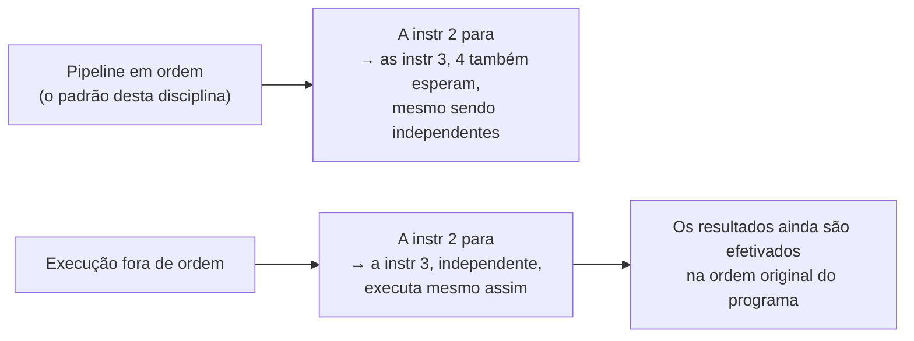

## Objetivos de Aprendizagem

- Explicar o que "execução especulativa" significa além da simples previsão de desvios: executar, e não só buscar, instruções cuja dependência de controle ainda não foi confirmada.
- Explicar o que "execução fora de ordem" significa e por que ela exige acompanhar dependências com mais cuidado do que o pipeline simples em ordem desta disciplina.
- Dizer, em nível conceitual, por que as duas técnicas existem: para manter as unidades funcionais ocupadas com trabalho útil, em vez de ociosas durante uma parada.
- Explicar, sem derivar o mecanismo completo, o que desfazer um erro de previsão precisa reverter e que um flush simples em ordem (de Hazards de Controle) não precisa.
- Explicar explicitamente por que o escopo deste conceito é raso aqui e para onde a mecânica completa (reorder buffers, renomeação de registradores, escalonamento no estilo de Tomasulo) é adiada.

## Contexto e Motivação

Toda técnica de tratamento de hazards vista até agora neste bloco (forwarding, parada por load-use, flush de desvio, previsão de desvios) supõe um pipeline estritamente em ordem: as instruções entram, passam pelos cinco estágios e terminam exatamente na ordem em que foram buscadas, uma de cada vez, no máximo uma por estágio por ciclo. Processadores reais de alto desempenho vão consideravelmente além desse modelo simples em duas direções relacionadas, ambas visando o mesmo objetivo em torno do qual a Lei de Ferro vem organizando toda esta disciplina: reduzir o CPI efetivo mantendo as unidades funcionais ocupadas, em vez de ociosas.

Este conceito existe especificamente para nomear essas duas técnicas, explicar com honestidade por que importam e então parar explicitamente antes de construí-las por completo. A área de conhecimento Architecture and Organization do ACM/IEEE CS2013 coloca a previsão de desvios e a execução especulativa/fora de ordem juntas na sua unidade de Performance Enhancements, mas as trata como material progressivamente mais avançado, além dos "datapaths simples... pipelining de instruções, detecção e resolução de hazards" já vistos nos conceitos anteriores deste bloco. É um sinal curricular real de que a mecânica completa (renomeação de registradores, reorder buffers, escalonamento dinâmico no estilo de Tomasulo) pertence a um curso mais avançado, que esta disciplina ainda não alcançou, e não a uma sequência introdutória de arquitetura de computadores.

## Teoria Central

### Execução especulativa: além de prever uma direção

A previsão de desvios, o conceito anterior, decide de qual direção *buscar*. A execução especulativa vai um passo além: ela não só busca as instruções do caminho previsto, como as deixa de fato *executar* (passar pela ULA, até acessar a memória) antes que o desvio do qual dependem tenha sido confirmado como correto. Isso importa porque, num pipeline mais profundo ou mais largo que o projeto simples de 5 estágios desta disciplina (ou num que consiga emitir mais de uma instrução por ciclo), só buscar à frente não basta para manter toda unidade funcional continuamente ocupada; essas instruções buscadas precisam de fato executar, especulativamente, para o processador extrair desempenho real das previsões corretas, em vez de só evitar uma parada.

O preço da execução especulativa é que parte desse trabalho já concluído precisa ser desfeita quando uma previsão se mostra errada: não só descartada antes de começar (como no flush simples em ordem de Hazards de Controle), mas ativamente revertida depois de já ter rodado, em processadores que deixam resultados especulativos afetarem um estado mais visível do que o pipeline desta disciplina deixa. Construir o mecanismo exato dessa reversão (normalmente um reorder buffer que guarda os resultados especulativos até eles serem confirmados como seguros para efetivar) é exatamente o tipo de estrutura de hardware que este conceito deliberadamente não deriva por completo aqui.

### Execução fora de ordem: deixando o trabalho independente ir primeiro

O pipeline desta disciplina emite as instruções estritamente na ordem em que foram buscadas: se uma instrução para (digamos, num hazard de load-use), toda instrução atrás dela também para, mesmo que algumas dessas instruções posteriores não tenham dependência nenhuma da parada e pudessem, de outro modo, rodar de imediato. A execução fora de ordem relaxa isso: permite que uma instrução posterior e independente execute à frente de uma anterior que está presa esperando um operando ainda não pronto, desde que isso não mude o resultado observável do programa.

É uma empreitada genuinamente mais complexa do que qualquer coisa construída nesta disciplina até aqui, porque exige acompanhar, para toda instrução em andamento, exatamente de quais valores ela de fato depende (e não só os *números* dos registradores que lê e escreve, já que o mesmo nome de registrador pode ser reutilizado por instruções sem relação, próximas umas das outras, um problema chamado de renomeação de registradores, de novo fora do escopo deste conceito) e garantir que as instruções ainda *pareçam* terminar na ordem original do programa, do ponto de vista de qualquer observador externo, mesmo que internamente tenham executado numa ordem diferente.



### Por que as duas existem: a mesma motivação da Lei de Ferro, levada mais longe

As duas técnicas são respostas exatamente à mesma pergunta que abriu este bloco: como reduzir o CPI efetivo com um tempo de ciclo de clock fixo. A parada em ordem (Hazard de Load-Use) e o flush em ordem (Hazards de Controle, Previsão de Desvios) aceitam ambos alguns ciclos desperdiçados como o custo honesto da correção num projeto simples; a execução especulativa e a fora de ordem, em vez disso, tentam encontrar trabalho *útil* para fazer durante o que, de outro modo, seria um ciclo desperdiçado, ao custo da complexidade extra de hardware necessária para garantir que o resultado final e observável seja idêntico ao que uma execução correta em ordem teria produzido.

## Exemplos Resolvidos

### Exemplo 1: um caso em que a execução fora de ordem ajuda e a em ordem não

```text
lw   x1, 0(x2)        # um load que falha na cache: pode levar muitos ciclos (antecipado
                        # no bloco de Hierarquia de Memória, alguns conceitos adiante)
add  x3, x4, x5         # completamente independente de x1: poderia rodar de imediato
sub  x6, x1, x7         # depende de x1: precisa esperar o load terminar
```

Um pipeline em ordem para o `add` atrás do `lw` lento, mesmo que `add` não tenha dependência nenhuma dele, desperdiçando ciclos enquanto o load está pendente. Um processador fora de ordem deixa `add` executar durante essa mesma espera, extraindo trabalho real e útil de ciclos que o projeto em ordem desperdiçaria, enquanto `sub` continua esperando corretamente pelo valor real de `x1`.

### Exemplo 2: o que um erro de previsão precisa desfazer, além de um flush simples

```text
beq x1, x2, TARGET          # previsto não tomado; na verdade tomado
add x3, x3, x4               # EXECUTADA especulativamente (não só buscada): o resultado
                              #   fica guardado de forma especulativa, ainda invisível às outras instruções
sw  x3, 0(x9)                 # um STORE executado especulativamente: se pudesse
                              #   de fato chegar à memória antes da confirmação, ficaria
                              #   visível para qualquer outra instrução que lesse aquele endereço
```

No pipeline simples em ordem que esta disciplina construiu, um flush pega as instruções erradas *antes* que cheguem a MEM ou WB, então nada observável jamais muda. Um projeto especulativo mais agressivo, que executa mais à frente, precisa tomar muito mais cuidado: um store especulativo, em particular, não pode ter permissão para de fato se efetivar na memória até o desvio ser confirmado como correto, e é exatamente esse tipo de maquinaria de buffer e ordenação de efetivação (de novo, um reorder buffer) que este conceito nomeia, mas não constrói.

### Exemplo 3: lendo a ficha técnica de um processador real com o vocabulário deste conceito

O material de marketing de um processador diz "execução superescalar fora de ordem com 4 vias e execução especulativa de desvios". Usando só o vocabulário desenvolvido neste conceito (e não sua mecânica completa), isso afirma: o processador consegue emitir até 4 instruções por ciclo (superescalar, um passo além até da profundidade de pipelining que esta disciplina constrói), executá-las numa ordem que pode diferir da ordem original do programa quando as dependências permitem (fora de ordem) e continuar executando instruções além de um desvio ainda não confirmado, com base numa previsão (especulativa). São três técnicas de desempenho relacionadas, mas distintas, cada uma construída sobre a análise honesta de custo e benefício que todo este bloco vem desenvolvendo desde a Lei de Ferro.

## Equívocos Comuns e Armadilhas

- **"Execução especulativa e previsão de desvios são a mesma coisa."** A previsão de desvios decide em que direção *buscar*; a execução especulativa é o passo seguinte, mais arriscado, de de fato *executar* instruções ao longo desse caminho previsto antes de ele ser confirmado. Um processador real normalmente faz as duas coisas juntas, mas são técnicas conceitualmente separáveis.
- **"Execução fora de ordem significa que as instruções terminam numa ordem aleatória e imprevisível, visível ao programador."** Todo o propósito da maquinaria de hardware (não desenvolvida aqui) é o oposto: as instruções podem executar internamente numa ordem diferente da buscada, mas ainda precisam *efetivar* (tornar-se visíveis ao resto do sistema) na ordem original do programa, para que um programa de uma thread escrito corretamente se comporte de forma idêntica a como se comportaria numa máquina simples em ordem.
- **"Isso é só uma versão mais elaborada do forwarding."** O forwarding (Hazards de Dados) move um valor já conhecido de um lugar para outro dentro de um pipeline fixo e em ordem; a execução fora de ordem, em vez disso, muda a sequência real em que as instruções podem *rodar*, um tipo de problema de hardware fundamentalmente diferente e mais complexo.
- **"Como esta disciplina não constrói o mecanismo completo, a execução especulativa/fora de ordem não é importante em processadores reais."** É o contrário: é justamente por essas técnicas serem essenciais para o funcionamento real de processadores de alto desempenho que o CS2013 as lista explicitamente. Elas são adiadas aqui especificamente porque fazer justiça a elas (reorder buffers, renomeação de registradores, escalonamento no estilo de Tomasulo) é genuinamente mais do que um curso introdutório de arquitetura de computadores consegue cobrir com responsabilidade, e não por serem um detalhe menor.

## Resumo

A execução especulativa permite a um processador de fato executar (e não só buscar) instruções ao longo de um caminho previsto, mas ainda não confirmado, e a execução fora de ordem permite que instruções independentes rodem à frente de uma anterior parada esperando um valor ainda não pronto. As duas são respostas adicionais ao mesmo objetivo de redução de CPI que todo este bloco de pipelining perseguiu desde a Lei de Ferro, ao custo de uma complexidade de hardware (reorder buffers, renomeação de registradores e acompanhamento de dependências) que este conceito deliberadamente não constrói, deixando a mecânica completa para um curso mais avançado. Com o bloco de pipelining agora completo (da estrutura básica de 5 estágios, passando pelos hazards estruturais, de dados e de controle, até a previsão de desvios e uma prévia conceitual de onde os projetos reais de alto desempenho vão além), a disciplina se volta a seguir para um gargalo totalmente diferente que o fator CPI da Lei de Ferro pode esconder: quanto tempo de fato leva para tirar um valor da memória, para começo de conversa, desenvolvido a partir de `the-memory-hierarchy-and-locality`.

## Documentation Links

- [ACM/IEEE CS2013: Architecture and Organization Knowledge Area](https://csed.acm.org/knowledge-areas-architecture-and-organization-ar-cs2013-version/): lista a execução especulativa e a execução fora de ordem como temas de Performance Enhancements, distintos do pipelining básico e além dele.
- [Harris & Harris: Digital Design and Computer Architecture, RISC-V Edition](https://shop.elsevier.com/books/digital-design-and-computer-architecture-risc-v-edition/harris/978-0-12-820064-3): apresenta a execução especulativa e a fora de ordem como extensões avançadas além do processador com pipeline que esta disciplina constrói por completo.
