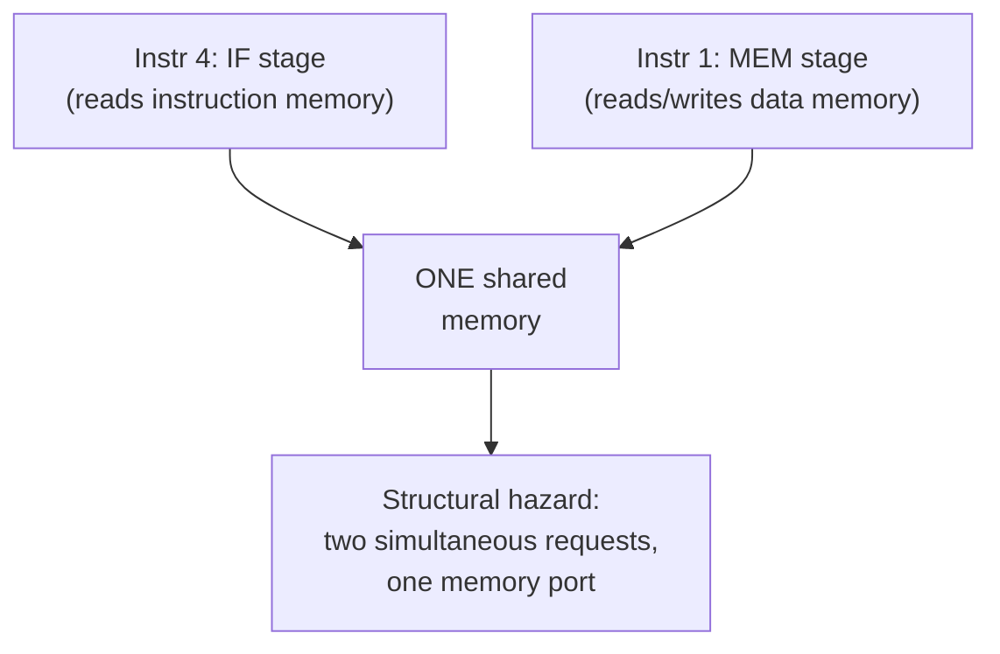

## Learning Objectives

- Define a structural hazard as two instructions, in different pipeline stages, simultaneously needing the same physical hardware resource.
- Identify the classic example: a single, unified memory shared by instruction fetch and data access.
- Explain why splitting memory into separate instruction and data caches removes this specific hazard, and how that decision connects forward to the memory hierarchy cluster.
- Explain why the register file's two-read-one-write structure is a second, subtler place a structural hazard could occur, and how a real design avoids it.
- Distinguish a structural hazard (a hardware resource conflict) from a data hazard and a control hazard, previewed as the next two concepts.

## Context & Motivation

The 5-stage pipeline from the previous concept promised that once it fills, a new instruction can be fetched every single cycle, and every stage stays busy working on a different instruction. That promise has a hidden assumption: that every stage has its own hardware, with nothing shared between two stages that might be active at the same moment on two different instructions. A structural hazard is exactly what happens when that assumption is false — two instructions in different pipeline stages both need the very same physical circuit in the very same cycle, and only one of them can actually have it.

This is the simplest of the three hazard categories this discipline covers (structural, data, control), precisely because the fix is almost always to add more hardware rather than to add cleverness: if two things want to use the same circuit at the same time, and that circuit is cheap enough to duplicate, duplicating it makes the conflict disappear entirely. The classic textbook example — one memory shared between instruction fetch and data access — is worth understanding in detail here specifically because its resolution (separate instruction and data caches) is not an arbitrary design choice; it is the exact design decision this discipline's own memory hierarchy cluster, starting several concepts from now, is built around.

## Core Theory

### The classic case: one memory, two simultaneous requesters

Consider cycle 4 of the four-instruction pipeline diagram from the previous concept: Instruction 4 is in IF (fetching its own instruction word from memory), while Instruction 1 is simultaneously in MEM (accessing data memory, for a load or store). If instruction memory and data memory were the *same* physical memory with only one address port, these two accesses would collide: the hardware cannot fetch one instruction's bits and simultaneously read or write a completely different address for a different instruction's data access, using only one memory port, in the same single cycle.



### The fix: split instruction memory and data memory

The standard resolution, already assumed by the pipeline diagrams in the previous concept without comment, is to give instruction fetch and data access two entirely separate memories (or, in a real modern design, two separate caches — an instruction cache and a data cache, sometimes together called a "Harvard-style" split at the cache level even though main memory itself remains unified). Because IF always happens in the pipeline's first stage and MEM always happens in its fourth stage, an instruction currently in IF and a different instruction currently in MEM are always three stages apart — meaning this exact conflict pattern (one instruction fetching while an earlier one accesses data) happens on every single cycle once the pipeline is full, not as a rare edge case. Splitting the memory is not an optional optimization; it is the specific piece of hardware duplication that keeps this discipline's very first fixed-cost stage-overlap promise true.

### A second, subtler structural resource: the register file

The register file must be read twice (two source operands) in ID and written once (the result) in WB, for potentially two different instructions in the same cycle. A real register file is built with two independent read ports and one independent write port precisely so that an ID-stage read and a WB-stage write, for two different in-flight instructions, can both happen in the same cycle without contention. If a register file only had one read port and one write port shared, a structural hazard would occur on every cycle where one instruction needs to read two operands (already two requests) while another instruction needs to write back — the same fix applies: add enough physical ports that the pipeline's inherent, every-cycle overlap pattern never has to share one.

### General principle

A structural hazard is fundamentally different from the data and control hazards covered in the next two concepts: it is purely about physical hardware resources, not about the logical relationship between instructions' data or control flow. The fix is correspondingly simple and mechanical — identify which resources are used by which stages, count how many simultaneous uses the pipeline's steady-state overlap pattern actually requires, and provision that many independent copies (memory ports, register file ports, ALUs) of each resource. This is a cost/complexity tradeoff, not a fundamental limit: a real design could, in principle, choose to stall instead of duplicating hardware, trading extra cycles for cheaper hardware, but for a resource used on literally every cycle (like instruction fetch), stalling would erase most of the throughput pipelining was built to gain — so duplication, not stalling, is the standard answer specifically for the instruction/data memory case.

## Worked Examples

### Example 1: Confirming the every-cycle overlap pattern

Using the fixed 5-stage structure (IF always stage 1, MEM always stage 4), show that IF and MEM are always exactly 3 stages apart for two instructions 3 cycles apart in issue order:

```text
Cycle:      1    2    3    4    5    6    7
Instr N:    IF   ID   EX   MEM  WB
Instr N+3:            IF   ID   EX   MEM  WB
```

At cycle 4, Instr N is in MEM and Instr N+3 is in IF — simultaneously, every single time the pipeline is full, for every N. This confirms the conflict in Example 1 of the Core Theory section is not an occasional coincidence but a structural, every-cycle certainty in this exact 5-stage design, which is precisely why it must be designed around rather than tolerated.

### Example 2: Sizing the register file's ports for the steady state

In the 5-stage pipeline's steady state, exactly one instruction occupies ID (needing to read two source registers) and exactly one different instruction occupies WB (needing to write one destination register) in every single cycle. List the minimum port count the register file needs to avoid a structural hazard on every cycle:

```text
Register file ports needed    Reason
---------------------------   --------------------------------------------
2 read ports                  ID stage reads two source operands
1 write port                  WB stage writes one destination result
```

A register file built with exactly 2 read ports and 1 write port (the standard "2R1W" configuration used in essentially every real RISC pipeline) exactly matches this steady-state demand — no more ports are needed, since no single cycle ever requires more than 2 reads and 1 write in this fixed pipeline structure, and no fewer would suffice without introducing a hazard on every cycle.

### Example 3: A read/write same-cycle same-register case (not a structural hazard)

Suppose, in one cycle, the instruction in WB is writing a new value into register x5, while the instruction in ID is simultaneously trying to read x5 as a source operand. Is this a structural hazard?

```text
No — this is a data hazard (the two instructions in different stages happen to reference
the same register), not a structural hazard (the register file has enough independent
read and write ports for both accesses to physically happen in the same cycle without
contention). Whether the ID stage's read correctly sees the WB stage's just-written
value, or an older stale value, is exactly the question the next two concepts —
Data Hazards and Forwarding, then the Load-Use Hazard — exist to resolve.
```

This distinction matters precisely because it separates "can the hardware physically do both things at once" (structural — the topic of this concept) from "is the *value* each instruction sees actually correct" (data — the topic of the next one).

## Common Misconceptions & Pitfalls

- **"Every hazard is a structural hazard."** Structural hazards are specifically about physical resource contention (two things wanting the same circuit). The far more common and more subtle hazards in a real pipeline — data hazards and control hazards, covered next — are about the *logical* relationship between instructions, not about hardware resource counts, and are not fixed simply by adding more copies of a circuit.
- **"Splitting instruction and data memory is just an optimization for speed, unrelated to correctness."** In a pipelined design it is a correctness requirement: without separate memories (or caches), the structural hazard in Example 1 would occur on every single cycle once the pipeline fills, making a single-ported memory design simply unable to sustain the pipeline's steady-state overlap at all.
- **"More register file ports are always better."** Example 2 shows the port count is derived exactly from the steady-state demand of this specific 5-stage design (2 reads, 1 write per cycle) — adding more ports than a pipeline actually needs in any single cycle adds cost and complexity without removing any hazard that would otherwise occur.
- **"A same-cycle read and write to the same register is automatically a hardware conflict."** Example 3 shows the opposite: the register file's ports handle the *physical* access fine; whatever correctness question remains about *which value* gets read is a data hazard, not a structural one.

## Summary

A structural hazard occurs when two instructions, simultaneously occupying different pipeline stages, need the exact same physical hardware resource in the exact same cycle — the classic case being a single memory shared by instruction fetch (always stage 1) and data access (always stage 4), which this fixed 5-stage pipeline's every-cycle overlap pattern guarantees will collide on every single cycle once full. The standard fix is to duplicate the contended resource — separate instruction and data memories/caches, and a register file with enough independent read and write ports (2 reads, 1 write, exactly matching this pipeline's steady-state demand) — rather than to stall, since stalling on a resource needed every single cycle would erase most of pipelining's throughput gain. The next concept, Data Hazards and Forwarding, moves from this purely hardware-resource question to a logically different one: even with no resource contention at all, can one instruction see the *correct value* produced by a very recent instruction still in flight?

## Documentation Links

- [Harris & Harris — Digital Design and Computer Architecture, RISC-V Edition](https://shop.elsevier.com/books/digital-design-and-computer-architecture-risc-v-edition/harris/978-0-12-820064-3) — covers structural hazards and the split instruction/data memory resolution as part of building the pipelined processor.
- [Berkeley CS61C — Great Ideas in Computer Architecture](https://cs61c.org/fa26/) — covers pipeline hazard categories, including structural hazards, as part of its pipelining unit.
