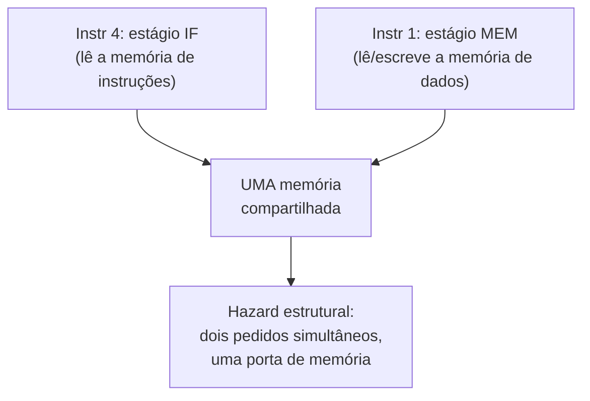

## Objetivos de Aprendizagem

- Definir um hazard estrutural como duas instruções, em estágios diferentes do pipeline, precisando ao mesmo tempo do mesmo recurso físico de hardware.
- Identificar o exemplo clássico: uma única memória unificada compartilhada pela busca de instruções e pelo acesso a dados.
- Explicar por que dividir a memória em caches separadas de instruções e de dados remove este hazard específico e como essa decisão se liga, adiante, ao bloco de hierarquia de memória.
- Explicar por que a estrutura de duas leituras e uma escrita do banco de registradores é um segundo lugar, mais sutil, onde um hazard estrutural poderia ocorrer, e como um projeto real o evita.
- Distinguir um hazard estrutural (um conflito por recurso de hardware) de um hazard de dados e de um hazard de controle, antecipados como os próximos dois conceitos.

## Contexto e Motivação

O pipeline de 5 estágios do conceito anterior prometeu que, quando ele enche, uma instrução nova pode ser buscada a cada ciclo, e todo estágio fica ocupado trabalhando numa instrução diferente. Essa promessa tem uma suposição escondida: que todo estágio tem seu próprio hardware, sem nada compartilhado entre dois estágios que possam estar ativos no mesmo momento com duas instruções diferentes. Um hazard estrutural é exatamente o que acontece quando essa suposição é falsa: duas instruções em estágios diferentes do pipeline precisam do mesmíssimo circuito físico no mesmíssimo ciclo, e só uma delas pode de fato tê-lo.

Esta é a mais simples das três categorias de hazard que esta disciplina cobre (estrutural, de dados, de controle), justamente porque a correção quase sempre é acrescentar mais hardware, e não mais engenhosidade: se duas coisas querem usar o mesmo circuito ao mesmo tempo, e esse circuito é barato o bastante para ser duplicado, duplicá-lo faz o conflito desaparecer por completo. O exemplo clássico de livro-texto (uma memória compartilhada entre a busca de instruções e o acesso a dados) vale ser entendido em detalhe aqui especificamente porque sua resolução (caches separadas de instruções e de dados) não é uma escolha de projeto arbitrária; é exatamente a decisão de projeto em torno da qual o próprio bloco de hierarquia de memória desta disciplina, alguns conceitos adiante, é construído.

## Teoria Central

### O caso clássico: uma memória, dois solicitantes ao mesmo tempo

Considere o ciclo 4 do diagrama de pipeline com quatro instruções do conceito anterior: a Instrução 4 está em IF (buscando sua própria palavra de instrução na memória), enquanto a Instrução 1 está, ao mesmo tempo, em MEM (acessando a memória de dados, para um load ou store). Se a memória de instruções e a memória de dados fossem a *mesma* memória física, com uma única porta de endereço, esses dois acessos colidiriam: o hardware não consegue buscar os bits de uma instrução e, ao mesmo tempo, ler ou escrever um endereço completamente diferente para o acesso a dados de outra instrução, usando só uma porta de memória, no mesmo ciclo.



### A correção: separar a memória de instruções da memória de dados

A resolução padrão, já suposta sem comentário pelos diagramas de pipeline do conceito anterior, é dar à busca de instruções e ao acesso a dados duas memórias totalmente separadas (ou, num projeto moderno real, duas caches separadas, uma cache de instruções e uma cache de dados, às vezes chamadas juntas de divisão "no estilo Harvard" no nível da cache, embora a própria memória principal continue unificada). Como IF sempre acontece no primeiro estágio do pipeline e MEM sempre acontece no quarto, uma instrução que está em IF e outra instrução que está em MEM estão sempre a três estágios de distância, o que significa que exatamente este padrão de conflito (uma instrução buscando enquanto uma anterior acessa dados) acontece em todo ciclo quando o pipeline está cheio, e não como um caso raro. Dividir a memória não é uma otimização opcional; é a peça específica de duplicação de hardware que mantém verdadeira a primeiríssima promessa de sobreposição de estágios a custo fixo desta disciplina.

### Um segundo recurso estrutural, mais sutil: o banco de registradores

O banco de registradores precisa ser lido duas vezes (dois operandos de origem) em ID e escrito uma vez (o resultado) em WB, possivelmente para duas instruções diferentes no mesmo ciclo. Um banco de registradores real é construído com duas portas de leitura independentes e uma porta de escrita independente justamente para que uma leitura no estágio ID e uma escrita no estágio WB, de duas instruções diferentes em andamento, possam acontecer no mesmo ciclo sem disputa. Se um banco de registradores tivesse só uma porta de leitura e uma de escrita compartilhadas, um hazard estrutural ocorreria em todo ciclo em que uma instrução precisasse ler dois operandos (já dois pedidos) enquanto outra precisasse escrever de volta. A mesma correção se aplica: acrescentar portas físicas suficientes para que o padrão de sobreposição inerente do pipeline, a cada ciclo, nunca precise dividir uma delas.

### Princípio geral

Um hazard estrutural é fundamentalmente diferente dos hazards de dados e de controle vistos nos próximos dois conceitos: ele trata puramente de recursos físicos de hardware, e não da relação lógica entre os dados ou o fluxo de controle das instruções. A correção é correspondentemente simples e mecânica: identificar quais recursos são usados por quais estágios, contar quantos usos simultâneos o padrão de sobreposição em regime do pipeline de fato exige e prover essa quantidade de cópias independentes (portas de memória, portas do banco de registradores, ULAs) de cada recurso. É uma troca de custo/complexidade, e não um limite fundamental: um projeto real poderia, em princípio, escolher parar em vez de duplicar hardware, trocando ciclos extras por hardware mais barato. Mas, para um recurso usado literalmente em todo ciclo (como a busca de instruções), parar apagaria a maior parte da vazão que o pipelining foi construído para ganhar; então a duplicação, e não a parada, é a resposta padrão especificamente para o caso da memória de instruções/dados.

## Exemplos Resolvidos

### Exemplo 1: confirmando o padrão de sobreposição a cada ciclo

Usando a estrutura fixa de 5 estágios (IF sempre no estágio 1, MEM sempre no estágio 4), mostre que IF e MEM estão sempre exatamente a 3 estágios de distância para duas instruções emitidas com 3 ciclos de diferença:

```text
Ciclo:      1    2    3    4    5    6    7
Instr N:    IF   ID   EX   MEM  WB
Instr N+3:            IF   ID   EX   MEM  WB
```

No ciclo 4, a Instr N está em MEM e a Instr N+3 está em IF, ao mesmo tempo, toda vez que o pipeline está cheio, para todo N. Isso confirma que o conflito da seção de Teoria Central não é uma coincidência ocasional, e sim uma certeza estrutural, a cada ciclo, exatamente neste projeto de 5 estágios, e é precisamente por isso que ele precisa ser contornado no projeto, em vez de tolerado.

### Exemplo 2: dimensionando as portas do banco de registradores para o regime

No regime do pipeline de 5 estágios, exatamente uma instrução ocupa ID (precisando ler dois registradores de origem) e exatamente uma outra instrução ocupa WB (precisando escrever um registrador de destino) em todo ciclo. Liste a quantidade mínima de portas de que o banco de registradores precisa para evitar um hazard estrutural em todo ciclo:

```text
Portas necessárias no banco de registradores   Motivo
---------------------------------------------  --------------------------------------------
2 portas de leitura                            O estágio ID lê dois operandos de origem
1 porta de escrita                             O estágio WB escreve um resultado de destino
```

Um banco de registradores construído com exatamente 2 portas de leitura e 1 de escrita (a configuração padrão "2R1W" usada em praticamente todo pipeline RISC real) atende exatamente essa demanda de regime: não são necessárias mais portas, já que nenhum ciclo jamais exige mais de 2 leituras e 1 escrita nesta estrutura fixa de pipeline, e menos não bastariam sem introduzir um hazard em todo ciclo.

### Exemplo 3: leitura e escrita no mesmo registrador no mesmo ciclo (não é um hazard estrutural)

Suponha que, num ciclo, a instrução em WB esteja escrevendo um valor novo no registrador x5, enquanto a instrução em ID está, ao mesmo tempo, tentando ler x5 como operando de origem. Isso é um hazard estrutural?

```text
Não: isto é um hazard de dados (as duas instruções em estágios diferentes por acaso referenciam
o mesmo registrador), e não um hazard estrutural (o banco de registradores tem portas de leitura
e de escrita independentes suficientes para os dois acessos acontecerem fisicamente no mesmo ciclo
sem disputa). Se a leitura do estágio ID enxerga corretamente o valor recém-escrito pelo estágio WB,
ou um valor velho, é exatamente a pergunta que os próximos dois conceitos
(Hazards de Dados e Forwarding, e depois o Hazard de Load-Use) existem para resolver.
```

Essa distinção importa justamente porque separa "o hardware consegue fisicamente fazer as duas coisas ao mesmo tempo" (estrutural, o tema deste conceito) de "o *valor* que cada instrução enxerga está de fato correto" (dados, o tema do próximo).

## Equívocos Comuns e Armadilhas

- **"Todo hazard é um hazard estrutural."** Os hazards estruturais tratam especificamente de disputa por recursos físicos (duas coisas querendo o mesmo circuito). Os hazards muito mais comuns e mais sutis num pipeline real (de dados e de controle, vistos a seguir) tratam da relação *lógica* entre as instruções, e não de contagens de recursos de hardware, e não se corrigem simplesmente acrescentando mais cópias de um circuito.
- **"Separar a memória de instruções da de dados é só uma otimização de velocidade, sem relação com a correção."** Num projeto com pipeline, é uma exigência de correção: sem memórias (ou caches) separadas, o hazard estrutural do Exemplo 1 ocorreria em todo ciclo depois que o pipeline enchesse, tornando um projeto de memória com porta única simplesmente incapaz de sustentar a sobreposição em regime do pipeline.
- **"Mais portas no banco de registradores são sempre melhores."** O Exemplo 2 mostra que a quantidade de portas é derivada exatamente da demanda em regime deste projeto específico de 5 estágios (2 leituras, 1 escrita por ciclo); acrescentar mais portas do que um pipeline de fato precisa em qualquer ciclo aumenta custo e complexidade sem remover nenhum hazard que, de outro modo, ocorreria.
- **"Uma leitura e uma escrita no mesmo registrador no mesmo ciclo são automaticamente um conflito de hardware."** O Exemplo 3 mostra o oposto: as portas do banco de registradores dão conta do acesso *físico* sem problema; qualquer pergunta de correção que reste sobre *qual valor* é lido é um hazard de dados, e não estrutural.

## Resumo

Um hazard estrutural ocorre quando duas instruções, ocupando ao mesmo tempo estágios diferentes do pipeline, precisam exatamente do mesmo recurso físico de hardware exatamente no mesmo ciclo. O caso clássico é uma única memória compartilhada pela busca de instruções (sempre o estágio 1) e pelo acesso a dados (sempre o estágio 4), que o padrão de sobreposição a cada ciclo deste pipeline fixo de 5 estágios garante que vai colidir em todo ciclo quando estiver cheio. A correção padrão é duplicar o recurso disputado (memórias/caches separadas de instruções e de dados, e um banco de registradores com portas independentes de leitura e de escrita suficientes, 2 leituras e 1 escrita, exatamente a demanda em regime deste pipeline), em vez de parar, já que parar por um recurso necessário em todo ciclo apagaria a maior parte do ganho de vazão do pipelining. O próximo conceito, Hazards de Dados e Forwarding, passa desta questão puramente de recursos de hardware para uma logicamente diferente: mesmo sem nenhuma disputa por recursos, uma instrução consegue enxergar o *valor correto* produzido por uma instrução muito recente ainda em andamento?

## Documentation Links

- [Harris & Harris: Digital Design and Computer Architecture, RISC-V Edition](https://shop.elsevier.com/books/digital-design-and-computer-architecture-risc-v-edition/harris/978-0-12-820064-3): cobre os hazards estruturais e a resolução por divisão das memórias de instruções/dados como parte da construção do processador com pipeline.
- [Berkeley CS61C: Great Ideas in Computer Architecture](https://cs61c.org/fa26/): cobre as categorias de hazards de pipeline, incluindo os hazards estruturais, como parte da sua unidade de pipelining.
