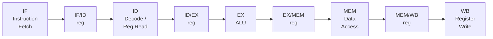

## Learning Objectives

- Name the five stages of the classic RISC pipeline (IF, ID, EX, MEM, WB) and state what work each stage performs.
- Explain the role of a pipeline register placed between two adjacent stages, and what it must latch.
- Draw and read a pipeline diagram showing several instructions occupying different stages in the same cycle.
- Explain why the datapath already built in Digital Logic & Computer Organization needs almost no new functional units to become pipelined — only pipeline registers and, eventually, hazard-handling logic.
- Identify, for a given instruction type, which stages it actually uses and which it merely passes through unused.

## Context & Motivation

The previous concept established, in the abstract, that overlapping instructions across stages raises throughput. This concept makes that idea concrete by giving it an exact hardware shape: the classic 5-stage RISC pipeline, the specific structure this discipline (like MIT 6.004's "Pipelining the Beta" and the pipelined chapter of Harris & Harris) builds from the same single-cycle datapath already assembled at the end of Digital Logic & Computer Organization.

The reassuring fact worth stating plainly is that pipelining does *not* require redesigning the ALU, the register file, or memory — the functional units built for the single-cycle CPU are reused essentially unchanged. What pipelining adds is a set of **pipeline registers**, one placed between each pair of adjacent stages, whose only job is to latch every signal a later stage will need, so that stage can keep working on it in a later cycle after the earlier stage has already moved on to a different instruction. This concept's job is to name the five stages precisely and show where those pipeline registers go; the concepts that follow spend their effort on everything that goes wrong when instructions in different stages need to interact — which is where the real complexity of pipelining actually lives.

## Core Theory

### The five stages

The classic RISC pipeline splits instruction execution into exactly the five steps already implicit in the single-cycle datapath's fetch-decode-execute cycle:

1. **IF — Instruction Fetch.** Read the instruction word from instruction memory at the address in the program counter (PC), and compute PC+4 (or the ISA's equivalent) as the default next PC.
2. **ID — Instruction Decode / Register Read.** Decode the opcode and read the two source register operands from the register file; also sign-extend any immediate field the instruction carries.
3. **EX — Execute.** The ALU computes the instruction's actual result — an arithmetic/logic operation, or a memory address for a load/store, or a branch target/condition.
4. **MEM — Memory Access.** For a load, read data memory at the address computed in EX; for a store, write to it. Instructions that don't touch memory (like a register-to-register add) simply pass through this stage doing nothing.
5. **WB — Write-Back.** Write the instruction's final result back into the register file — the ALU result for an arithmetic instruction, or the loaded value for a load.

### Pipeline registers

Between each pair of adjacent stages sits a pipeline register — IF/ID, ID/EX, EX/MEM, and MEM/WB — that is written on every clock edge with everything the next stage (and, transitively, later stages) will need. For example, the ID/EX register must carry forward not just the two register values just read, but also the destination register number and the control signals (is this a load? a branch? what ALU operation?) computed back in ID, since the EX, MEM, and WB stages still need to know what kind of instruction this is long after the ID stage itself has moved on to decoding the next instruction.



### Reusing the single-cycle datapath's functional units

Every functional unit from Assembling a Complete Single-Cycle CPU reappears here unchanged: the same register file (now read once per instruction in ID and written once per instruction in WB, instead of both happening within the same single cycle), the same ALU (now doing its work in its own dedicated EX cycle instead of sharing a cycle with everything else), and the same data memory (now accessed in its own dedicated MEM cycle). What is genuinely new is not any functional unit, but the pipeline registers holding each instruction's in-flight state as it moves rightward through the diagram, one stage per cycle.

### Not every instruction uses every stage the same way

An instruction that doesn't touch memory — a register-to-register add, for instance — still physically passes through the MEM stage, simply doing nothing useful there, because in a fixed 5-stage pipeline every instruction takes the same five cycles to traverse the whole pipe, whether or not it needs every stage's actual function. This uniformity — every instruction takes exactly 5 cycles from Fetch to Write-back, regardless of type — is precisely what keeps the pipeline's control logic simple; the alternative (instructions of different length skipping stages they don't need) would reintroduce structural complexity for a benefit this simple pipeline design deliberately forgoes.

## Worked Examples

### Example 1: Tracing one instruction through all five stages

Consider the instruction `add x5, x6, x7` (compute x6 + x7, store the result in x5) entering the pipeline at cycle 1:

```text
Cycle:        1    2    3    4    5
add x5,x6,x7: IF   ID   EX   MEM  WB
```

- Cycle 1 (IF): fetch the `add` instruction's bits from instruction memory.
- Cycle 2 (ID): decode it as an `add`; read x6 and x7 from the register file.
- Cycle 3 (EX): the ALU computes x6 + x7.
- Cycle 4 (MEM): passes through unused — `add` never touches data memory.
- Cycle 5 (WB): the ALU's result from cycle 3 is written into x5.

### Example 2: A full pipeline diagram for four instructions

```text
Cycle:    1    2    3    4    5    6    7    8
Instr 1:  IF   ID   EX   MEM  WB
Instr 2:       IF   ID   EX   MEM  WB
Instr 3:            IF   ID   EX   MEM  WB
Instr 4:                 IF   ID   EX   MEM  WB
```

By cycle 4, all five stages of the pipeline are simultaneously busy — Instr 4 is in IF, Instr 3 in ID, Instr 2 in EX, Instr 1 in MEM — and from this point on, one instruction completes its WB every single cycle. This "pipeline full" steady state is exactly what makes the throughput approach one instruction per cycle for a long program, matching the ideal-speedup discussion in the previous concept.

### Example 3: What the ID/EX pipeline register must actually carry

For the instruction `lw x9, 8(x10)` (load the word at address x10+8 into x9), list what the ID/EX pipeline register must latch after the ID stage, and why each piece is still needed later:

```text
Field carried in ID/EX register    Why a later stage still needs it
----------------------------------  ---------------------------------
Value of register x10               EX needs it to compute the address
Sign-extended immediate (8)         EX needs it to compute the address
Destination register number (x9)    WB needs to know where to write
Control signal: "this is a load"    MEM needs to know to read memory
                                     (not just pass through);
                                     WB needs to know to write the
                                     loaded value, not an ALU result
```

Every one of these fields was already available back in ID, but ID itself has moved on to decoding the *next* instruction by the time EX, MEM, and WB actually need them — which is exactly why the pipeline register exists: to carry each instruction's own information forward in lockstep with the instruction itself as it advances one stage per cycle.

## Common Misconceptions & Pitfalls

- **"Pipelining requires a completely new ALU, memory, and register file design."** It reuses all three from the single-cycle datapath essentially unchanged; the new hardware is almost entirely the pipeline registers between stages, plus (starting in the next few concepts) hazard-detection and forwarding logic.
- **"An instruction that doesn't need a stage skips it."** In this fixed 5-stage design, every instruction passes through all five stages in fixed order, taking exactly 5 cycles end to end, even when a stage (like MEM for a non-memory instruction) has nothing useful to do on that instruction.
- **"The pipeline registers just delay data — they don't need to carry control information."** Example 3 shows the opposite: control signals (is this a load? a branch? what ALU operation?) computed in ID must travel forward through the same pipeline registers as the data, since EX, MEM, and WB all depend on knowing what kind of instruction they're currently processing.
- **"Once the pipeline is full, it always completes exactly one instruction per cycle forever."** That is the ideal case this concept illustrates with no hazards; the very next concepts (Structural Hazards, Data Hazards, Control Hazards) are all about the real, specific ways that steady one-per-cycle rhythm can and does break.

## Summary

The classic RISC pipeline splits every instruction's execution into five fixed stages — IF, ID, EX, MEM, WB — reusing the exact functional units (register file, ALU, data memory) already built for the single-cycle CPU, with pipeline registers inserted between each stage to carry both data and control information forward in lockstep as an instruction advances one stage per cycle. Once the pipeline fills, several instructions occupy different stages simultaneously, and in the ideal case a new instruction completes its write-back every single cycle. This concept describes that ideal, steady-state behavior; the hazard concepts that follow it are all about the specific, real ways two instructions genuinely in flight at the same time can interfere with each other, and what hardware or scheduling techniques resolve each kind of interference.

## Documentation Links

- [Harris & Harris — Digital Design and Computer Architecture, RISC-V Edition](https://shop.elsevier.com/books/digital-design-and-computer-architecture-risc-v-edition/harris/978-0-12-820064-3) — builds the pipelined datapath directly from the same single-cycle design and RISC-V ISA this discipline uses.
- [MIT 6.004 — Pipelining the Beta](https://ocw.mit.edu/courses/6-004-computation-structures-spring-2017/pages/c15/) — pipelines the Beta processor stage by stage with the same 5-stage structure.
