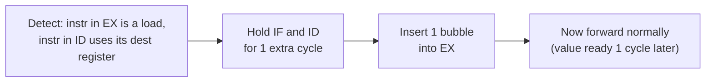

## Learning Objectives

- Explain precisely why forwarding alone cannot resolve a load immediately followed by an instruction using its result.
- Trace, cycle by cycle, how a hazard-detection unit inserts a one-cycle bubble to resolve the load-use hazard.
- Compute the CPI cost of a load-use stall for a program with a known frequency of this pattern.
- Explain how compiler instruction scheduling can reduce, though not eliminate, the frequency of load-use stalls.
- Distinguish a pipeline "stall" (a bubble injected into the pipeline) from a "flush" (discarding an already-fetched instruction), previewed for the control-hazard concept that follows.

## Context & Motivation

The previous concept showed that ordinary data hazards — one instruction using a value an earlier one just computed — are resolved for free, with zero stall cycles, by forwarding a value directly from a later pipeline stage's output to an earlier stage's input. That mechanism relies on one quiet assumption: that the producing instruction's value already exists, sitting in some pipeline register, by the exact cycle the consuming instruction needs it. For a load instruction, that assumption fails, for a reason rooted purely in the pipeline's fixed timing, not in any flaw of the forwarding hardware itself.

This matters enough to deserve its own concept, rather than being folded into a footnote of the previous one, because `lw` immediately followed by an instruction that uses the loaded value is exceptionally common real code — `int x = arr[i]; return x + 1;` compiles to precisely this pattern. Understanding exactly why this one case resists the forwarding fix, and exactly what the hardware does instead, completes the discipline's honest account of what pipelining costs, continuing the theme the Iron Law opened this whole cluster with: every performance gain has to be paid for somewhere, and this is one of the places pipelining's bill comes due.

## Core Theory

### Why forwarding runs out of time for a load

Return to the timing that ended the previous concept:

```text
Cycle:            1    2    3    4    5    6
lw x1,0(x2):      IF   ID   EX   MEM  WB
add x3,x1,x4:          IF   ID   EX   MEM  WB
```

`lw`'s loaded value isn't computed until its own MEM stage completes, in cycle 4. But `add`, the very next instruction, needs that value as an input to its *own* EX stage — which also runs in cycle 4, the exact same cycle. Forwarding routes a value from wherever it currently, correctly exists to wherever it's needed next; here, the value simply does not exist anywhere yet at the moment it would need to be forwarded. No amount of extra wiring changes this — the value is fundamentally not ready one cycle earlier than the load's own MEM stage produces it, and `add`'s EX stage is scheduled exactly one cycle after `lw`'s EX stage, one stage too soon.

### The fix: detect it, and insert one stall cycle

A hazard-detection unit, watching the instruction currently in ID (about to enter EX next cycle) and the instruction ahead of it in EX, checks specifically for this pattern: is the instruction in EX a load, and does the instruction in ID use that load's destination register as a source operand? If so, the hardware **stalls** the pipeline for exactly one cycle: it holds the dependent instruction (and the load itself, which has now legitimately reached MEM) in place for one extra cycle, and inserts a **bubble** — a cycle in which the stage that would otherwise have started a new instruction instead does nothing (equivalent to inserting a no-op) — into the EX stage that would have prematurely tried to use the not-yet-ready value.



After exactly one bubble cycle, the load's value — now sitting in the EX/MEM pipeline register (having completed MEM one cycle earlier than the delayed dependent instruction now reaches EX) — can be forwarded normally, using the exact same forwarding hardware from the previous concept. The load-use hazard costs exactly **one** stall cycle, no more, precisely because delaying the dependent instruction by one cycle is enough to let the ordinary EX/MEM-to-EX forwarding path from the previous concept take over.

### The one-cycle cost, traced explicitly

```text
Cycle:            1    2    3    4    5    6    7
lw x1,0(x2):      IF   ID   EX   MEM  WB
add x3,x1,x4:          IF   ID   ID*  EX   MEM  WB
                                  (bubble in EX
                                   this cycle instead)
```

The `add` instruction sits in ID for two cycles instead of one (repeating the ID stage, or equivalently holding its ID/EX register output as a bubble for one cycle — different textbooks draw this detail slightly differently, but the net cost is identical): the pipeline effectively loses one cycle of forward progress, and every instruction fetched after `add` is likewise delayed by that same one cycle.

### Mitigation: compiler scheduling

Because the hazard only triggers when the instruction *immediately* following a load uses that load's result, a compiler that reorders independent, unrelated instructions to sit between a load and its first use can hide the one-cycle penalty entirely — the load's value becomes ready during exactly the cycle an unrelated instruction is legitimately running in EX, and by the time the real dependent instruction reaches EX, the value is available via ordinary forwarding with no stall at all. This is a genuine, real compiler optimization (often called load delay slot filling in some historical ISAs, or simply instruction scheduling in modern ones) — but it is a mitigation, not an elimination: a compiler cannot always find independent work to insert (a tight dependency chain like `x1 = arr[i]; x2 = x1 + 1;` has no unrelated instruction available), so the hazard-detection hardware described here must exist regardless of how good the compiler is.

## Worked Examples

### Example 1: Computing the CPI cost from a stall frequency

Suppose profiling a real program shows that 20% of all executed instructions are loads, and of those loads, 30% are immediately followed by an instruction using the loaded value (triggering a one-cycle stall). Assuming a base CPI of 1 with no hazards at all, compute the effective CPI including load-use stalls:

```text
Fraction of instructions causing a 1-cycle stall = 0.20 × 0.30 = 0.06 (6%)
Extra cycles per instruction, on average          = 0.06 × 1 stall cycle = 0.06
Effective CPI                                     = 1 + 0.06 = 1.06
```

A seemingly small 6% stall frequency raises CPI by 6% — directly worsening one factor of the Iron Law from `cpu-performance-and-the-iron-law-of-performance`, and a completely realistic, measurable effect in real pipelined processors.

### Example 2: A dependency chain the compiler cannot hide

```text
lw  x1, 0(x2)         # x1 := memory[x2]
add x1, x1, x1         # x1 := x1 + x1  (needs x1 the instant after the load)
```

There is no unrelated instruction available to insert between these two lines without changing the program's meaning — `add` depends directly and immediately on `lw`'s result, with nothing else for the compiler to schedule in between. This concrete case is exactly why the hazard-detection-and-stall hardware in this concept is a required part of the pipeline's control logic, not an optional feature a sufficiently clever compiler could make unnecessary.

### Example 3: Successful compiler scheduling

```text
Before scheduling:                   After scheduling (functionally identical):
lw  x1, 0(x2)                        lw  x1, 0(x2)
add x3, x1, x4   (stalls 1 cycle)    or  x9, x9, x9   (independent, fills the gap)
                                      add x3, x1, x4   (no stall — value now
                                                          ready via ordinary forward)
```

By moving an unrelated `or` instruction (which was going to execute somewhere in the program anyway) to sit immediately after the load, the compiler ensures that by the time `add` reaches EX, `lw`'s result has already advanced one extra cycle further into the pipeline and is available via the same EX/MEM-to-EX or MEM/WB-to-EX forwarding paths from the previous concept — eliminating the stall with no change to the program's actual behavior, only its instruction order.

## Common Misconceptions & Pitfalls

- **"Forwarding should be able to fix this too, with a smarter circuit."** No amount of additional wiring changes the physical timing: the loaded value simply does not exist as a signal anywhere in the hardware until the load's own MEM stage completes, one cycle later than the dependent instruction's EX stage would otherwise run. A stall is the fundamental fix, not a hardware limitation waiting to be engineered away.
- **"A load-use stall costs more than one cycle."** In this simple 5-stage pipeline, it costs exactly one cycle, because delaying the dependent instruction by exactly one cycle is sufficient to align it with the same forwarding paths already built for ordinary data hazards.
- **"The compiler can always eliminate load-use stalls by reordering."** Example 2 shows a genuine, common case (a tight, immediate dependency) where no reordering is possible without changing program meaning — compiler scheduling reduces the *frequency* of stalls in real programs, but the hazard-detection hardware must still exist to handle the cases it cannot hide.
- **"A stall and a flush are the same thing."** A stall (this concept) holds instructions in place for one or more cycles and loses no already-fetched, correct instructions — it just delays them. A flush (introduced in the next concept, for control hazards) discards instructions that were fetched based on a wrong assumption and must be redone from scratch — a strictly more expensive kind of pipeline disruption.

## Summary

A load-use hazard — a load immediately followed by an instruction using its result — cannot be resolved by forwarding alone, because the loaded value genuinely does not exist anywhere in the hardware until the load's own MEM stage completes, exactly one cycle after the dependent instruction's EX stage would otherwise need it. The hazard-detection unit resolves this by stalling the pipeline for exactly one cycle, inserting a bubble, after which the ordinary forwarding paths from the previous concept take over normally; a good compiler can often hide this one-cycle cost by scheduling independent instructions into the gap, though not always, since some dependency chains leave no independent work available. Having now covered the two hazard types data can cause (ordinary RAW, solved for free by forwarding; load-use, solved with exactly one stall), the next concept turns to a fundamentally different source of pipeline disruption: control hazards, where the problem isn't a value being late, but the pipeline not yet knowing which instructions it should even be fetching.

## Documentation Links

- [Harris & Harris — Digital Design and Computer Architecture, RISC-V Edition](https://shop.elsevier.com/books/digital-design-and-computer-architecture-risc-v-edition/harris/978-0-12-820064-3) — covers the load-use hazard, hazard-detection unit design, and the exact one-cycle stall this concept develops.
- [Bryant & O'Hallaron — Computer Systems: A Programmer's Perspective (CS:APP)](https://csapp.cs.cmu.edu/) — the PIPE processor's hazard-handling logic includes the same load/use stall condition for its Y86-64 pipeline.
