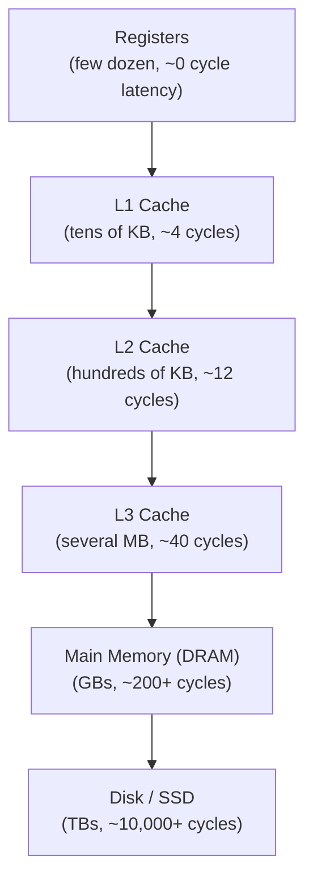

## Learning Objectives

- Draw the memory hierarchy pyramid and explain the capacity/speed/cost tradeoff at each level.
- State the two forms of locality (temporal and spatial) and give a concrete code example of each.
- Explain why locality is an empirical property of real programs, not a mathematical guarantee, and why the hierarchy only works because it holds in practice.
- Explain how RAM Organization and Address Decoding, from Digital Logic & Computer Organization, is the literal hardware a cache sits in front of.
- Preview the specific engineering questions (organization, associativity, replacement, write policy) the rest of this cluster answers about how a cache actually works.

## Context & Motivation

The pipelining cluster just completed spent its entire effort reducing CPI by keeping the processor's execution stages busy every cycle. All of that work is wasted if the processor then has to wait dozens or hundreds of cycles every time it needs to read or write memory — and in real systems, that wait is not a rare edge case. Bryant and O'Hallaron's *Computer Systems: A Programmer's Perspective* devotes an entire chapter to exactly this tension: a modern DRAM main memory is dramatically slower, relative to a modern processor's clock, than a decades-old comparison would suggest, and closing that gap without simply accepting the slowdown is the whole reason a memory hierarchy exists.

RAM Organization and Address Decoding, in Digital Logic & Computer Organization, built the actual circuit — a decoder tree selecting one row out of millions — that gives an array O(1) random access, as taken for granted in Data Structures I. That circuit is real, but it describes *one* level of memory; it says nothing about how fast that level is relative to the processor consuming its output, or what happens when a design needs both large capacity and fast access, two properties that are fundamentally in tension for any single memory technology. The memory hierarchy is the architectural answer to that tension, and this concept opens the discipline's second major cluster by explaining, in general terms, why it works before the following concepts build a specific cache's actual mechanics.

## Core Theory

### The pyramid: trading capacity for speed

Real systems stack several different memory technologies, each faster and smaller (and more expensive per byte) than the one below it:



Every level down this pyramid trades roughly an order of magnitude of capacity for roughly an order of magnitude (or more) of latency. No single technology offers both the capacity of DRAM and the speed of an on-chip cache at an acceptable cost — this is a real physical and economic constraint (small, fast SRAM cells used for cache are inherently more expensive per bit than the denser DRAM cells used for main memory), not an arbitrary industry choice.

### Why the hierarchy works at all: locality

If real programs accessed memory in a genuinely uniform, unpredictable pattern, a small cache at the top of this pyramid would help almost nothing — most accesses would simply miss it and fall through to the slow levels below. The reason the hierarchy actually delivers most of its benefit is an empirical property of essentially all real programs, called **locality of reference**, which comes in two forms:

- **Temporal locality**: if a memory location is accessed once, it is likely to be accessed again soon. A loop counter, or a frequently called function's code, is read over and over in a short span of time.
- **Spatial locality**: if a memory location is accessed, nearby locations are likely to be accessed soon too. Iterating over an array touches consecutive addresses one after another; a struct's fields, laid out contiguously (as covered in Structs, Unions, and Memory Layout), are frequently accessed together.

A cache exploits both forms simultaneously: bringing in an entire contiguous block of memory around a requested address (exploiting spatial locality, since nearby addresses are likely to be needed next) and keeping recently used blocks around rather than immediately discarding them (exploiting temporal locality, since the same address is likely to be needed again soon).

### Locality is empirical, not guaranteed

It is worth stating plainly that nothing in the hardware *forces* a program to exhibit locality — a program that accesses memory in a genuinely random pattern across a huge address range gets no benefit from a cache at all, and can even be slowed down slightly by the extra tag-checking logic. The entire memory hierarchy is a bet, made by decades of processor designers, that real programs — because of how loops, arrays, and function calls actually work in essentially every programming language — overwhelmingly do exhibit strong locality. Cache-Friendly Code and Locality in Practice, later in this cluster, returns to this point with a concrete, measurable example of a program that can be rewritten to exploit locality far better without changing what it computes at all.

### What a cache actually is, mechanically

At the mechanical level a cache is simply a small, fast piece of memory (built from the same kind of storage circuits — flip-flops or, more realistically, denser SRAM cells — introduced in Digital Logic & Computer Organization) that sits between the processor and a slower memory level, transparently holding copies of recently used data. Every one of the specific engineering questions a real cache design has to answer — which slot does a given address map to? what happens when a slot is full and a new block needs to come in? what happens when a cached value is written to? — is exactly what the remaining concepts in this cluster work through, one at a time.

## Worked Examples

### Example 1: Identifying temporal and spatial locality in real code

```python
total = 0
for i in range(len(numbers)):        # spatial locality: numbers[0], numbers[1], ...
    total += numbers[i]               #   are consecutive addresses, accessed in order
print(total)                          # temporal locality: `total` itself is read
                                       #   and written on every single iteration
```

`numbers[i]` exhibits spatial locality — each iteration's address is immediately adjacent to the previous one. `total` exhibits temporal locality — the exact same memory location (or, in an optimized version, the exact same register) is accessed on every single iteration of the loop, making it an ideal candidate for staying in the fastest level of the hierarchy throughout.

### Example 2: Quantifying the latency gap this hierarchy exists to hide

Using the representative cycle counts from the pyramid diagram above, suppose a processor executes an instruction every cycle (best case, no other hazards) but a memory access that misses the cache entirely takes the full ~200-cycle DRAM latency:

```text
Without any cache: every memory access costs ~200 cycles
With a cache, hit rate 95%: average memory access time ≈
    0.95 × (~4 cycles, L1 hit) + 0.05 × (~200 cycles, miss to DRAM)
  ≈ 3.8 + 10 = 13.8 cycles
```

A 95% hit rate — a realistic number for code with decent locality — drops the *average* cost of a memory access from 200 cycles to under 14, roughly a 14× improvement, entirely from exploiting locality rather than from any change to the underlying DRAM technology itself. (This is a preview of the exact Average Memory Access Time calculation the cluster develops formally several concepts from now.)

### Example 3: A program that defeats locality on purpose

```python
import random
total = 0
indices = list(range(len(huge_array)))
random.shuffle(indices)
for i in indices:                    # accesses huge_array in a genuinely random order
    total += huge_array[i]
```

Shuffling the access order destroys spatial locality entirely (consecutive accesses land at unrelated addresses) and, for an array large enough that it doesn't fit in any cache level, offers essentially no temporal locality to exploit either (revisiting the same index is unlikely before its cache line has been evicted by unrelated accesses). This program computes the exact same sum as Example 1's sequential version, with the exact same asymptotic complexity, but runs measurably slower on real hardware — a direct, honest illustration of why locality, not algorithmic complexity alone, governs real-world memory performance.

## Common Misconceptions & Pitfalls

- **"A bigger cache is always simply better."** A bigger cache captures more of a program's working set, but it is also slower to search (more physical distance for signals to travel, more comparison logic) and more expensive to build — which is precisely why real systems use several levels of increasing size and decreasing speed rather than one enormous fast cache, a tradeoff the multilevel-cache concept later in this cluster returns to directly.
- **"The memory hierarchy guarantees fast memory access for every program."** It only helps programs that actually exhibit locality — Example 3 shows a program, with identical output and complexity to Example 1, that gets essentially no benefit from any cache level at all.
- **"Locality is a property of the hardware."** Locality is a property of the *program's access pattern* — the hardware (the cache) is simply built to exploit locality when it exists; it cannot manufacture locality in a program that has none.
- **"A cache and a register file are the same idea."** Both hold data close to the processor, but a register file (from Digital Logic & Computer Organization) is a small, explicitly named, compiler-managed set of storage locations directly addressed by instructions; a cache is transparent — invisible to the ISA and to software — automatically deciding what to hold based on observed access patterns, not explicit naming.

## Summary

The memory hierarchy stacks several storage technologies — registers, multiple cache levels, DRAM main memory, disk — each trading roughly an order of magnitude of capacity for roughly an order of magnitude of speed, a real physical and economic constraint no single technology escapes. It only delivers most of its benefit because real programs exhibit locality of reference — temporal (the same location reused soon) and spatial (nearby locations used soon) — an empirical property of real code, not a hardware guarantee, which a cache exploits by holding recently used blocks and bringing in whole contiguous blocks around each requested address. The remaining concepts in this cluster work through exactly how a real cache is organized, replaced, and written to, starting with Cache Organization: Blocks, Tags, and Direct Mapping.

## Documentation Links

- [Bryant & O'Hallaron — Computer Systems: A Programmer's Perspective (CS:APP)](https://csapp.cs.cmu.edu/) — Chapter 6, "The Memory Hierarchy," motivates and develops locality and the hierarchy in exactly this order.
- [CMU 15-213 — Cache Memories Lecture](http://www.cs.cmu.edu/afs/cs/academic/class/15213-s14/www/lectures/11-cache-memories.pdf) — introduces the memory hierarchy and locality as the foundation for the cache mechanics covered in the same course.
