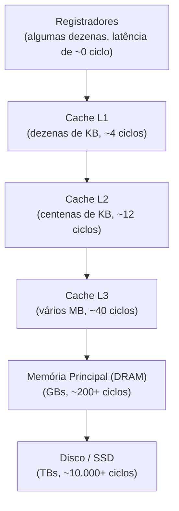

## Objetivos de Aprendizagem

- Desenhar a pirâmide da hierarquia de memória e explicar a troca entre capacidade, velocidade e custo em cada nível.
- Enunciar as duas formas de localidade (temporal e espacial) e dar um exemplo concreto de código de cada uma.
- Explicar por que a localidade é uma propriedade empírica dos programas reais, e não uma garantia matemática, e por que a hierarquia só funciona porque ela vale na prática.
- Explicar como RAM Organization and Address Decoding, de Lógica Digital e Organização de Computadores, é o hardware literal na frente do qual uma cache fica.
- Antecipar as perguntas de engenharia específicas (organização, associatividade, substituição, política de escrita) que o resto deste bloco responde sobre como uma cache de fato funciona.

## Contexto e Motivação

O bloco de pipelining recém-concluído gastou todo o seu esforço reduzindo o CPI ao manter os estágios de execução do processador ocupados a cada ciclo. Todo esse trabalho vai para o lixo se o processador depois precisar esperar dezenas ou centenas de ciclos toda vez que precisar ler ou escrever na memória, e, em sistemas reais, essa espera não é um caso raro. O *Computer Systems: A Programmer's Perspective* de Bryant e O'Hallaron dedica um capítulo inteiro exatamente a essa tensão: uma memória principal DRAM moderna é drasticamente mais lenta, em relação ao clock de um processador moderno, do que uma comparação de décadas atrás sugeriria, e fechar essa diferença sem simplesmente aceitar a lentidão é todo o motivo de existir uma hierarquia de memória.

RAM Organization and Address Decoding, em Lógica Digital e Organização de Computadores, construiu o circuito real (uma árvore de decodificadores escolhendo uma linha entre milhões) que dá a um array o acesso aleatório O(1) tomado como certo em Estruturas de Dados I. Esse circuito é real, mas descreve *um* nível de memória; não diz nada sobre quão rápido esse nível é em relação ao processador que consome sua saída, nem sobre o que acontece quando um projeto precisa ao mesmo tempo de grande capacidade e de acesso rápido, duas propriedades fundamentalmente em tensão para qualquer tecnologia de memória isolada. A hierarquia de memória é a resposta arquitetural a essa tensão, e este conceito abre o segundo grande bloco da disciplina explicando, em termos gerais, por que ela funciona, antes de os conceitos seguintes construírem a mecânica real de uma cache específica.

## Teoria Central

### A pirâmide: trocando capacidade por velocidade

Sistemas reais empilham várias tecnologias de memória diferentes, cada uma mais rápida e menor (e mais cara por byte) que a de baixo:



Cada nível descendo nesta pirâmide troca mais ou menos uma ordem de grandeza de capacidade por mais ou menos uma ordem de grandeza (ou mais) de latência. Nenhuma tecnologia isolada oferece ao mesmo tempo a capacidade da DRAM e a velocidade de uma cache no chip a um custo aceitável: é uma restrição física e econômica real (as células SRAM pequenas e rápidas usadas em caches são inerentemente mais caras por bit que as células DRAM mais densas usadas na memória principal), e não uma escolha arbitrária da indústria.

### Por que a hierarquia sequer funciona: a localidade

Se programas reais acessassem a memória num padrão genuinamente uniforme e imprevisível, uma cache pequena no topo desta pirâmide quase não ajudaria: a maioria dos acessos simplesmente falharia nela e cairia nos níveis lentos de baixo. O motivo pelo qual a hierarquia de fato entrega a maior parte do seu benefício é uma propriedade empírica de praticamente todo programa real, chamada **localidade de referência**, que vem em duas formas:

- **Localidade temporal**: se um local de memória é acessado uma vez, é provável que seja acessado de novo em breve. Um contador de laço, ou o código de uma função chamada com frequência, é lido repetidas vezes num curto intervalo de tempo.
- **Localidade espacial**: se um local de memória é acessado, é provável que locais próximos também sejam acessados em breve. Percorrer um array toca endereços consecutivos, um após o outro; os campos de uma struct, dispostos de forma contígua (como visto em Structs, Unions, and Memory Layout), costumam ser acessados juntos.

Uma cache explora as duas formas ao mesmo tempo: trazendo um bloco contíguo inteiro de memória em torno de um endereço pedido (explorando a localidade espacial, já que endereços próximos provavelmente serão necessários em seguida) e mantendo por perto os blocos usados recentemente, em vez de descartá-los de imediato (explorando a localidade temporal, já que o mesmo endereço provavelmente será necessário de novo em breve).

### A localidade é empírica, e não garantida

Vale dizer com todas as letras que nada no hardware *força* um programa a exibir localidade: um programa que acessa a memória num padrão genuinamente aleatório, numa faixa enorme de endereços, não ganha benefício nenhum de uma cache e pode até ficar um pouco mais lento por causa da lógica extra de verificação de tags. Toda a hierarquia de memória é uma aposta, feita por décadas de projetistas de processadores, de que programas reais (por causa de como laços, arrays e chamadas de função de fato funcionam em praticamente toda linguagem de programação) exibem, na esmagadora maioria, forte localidade. Código Amigável à Cache e Localidade na Prática, mais adiante neste bloco, volta a esse ponto com um exemplo concreto e mensurável de um programa que pode ser reescrito para explorar muito melhor a localidade sem mudar nada do que calcula.

### O que uma cache de fato é, mecanicamente

No nível mecânico, uma cache é simplesmente um pedaço pequeno e rápido de memória (construído com o mesmo tipo de circuitos de armazenamento, flip-flops ou, de forma mais realista, células SRAM mais densas, apresentados em Lógica Digital e Organização de Computadores) que fica entre o processador e um nível de memória mais lento, guardando de forma transparente cópias de dados usados recentemente. Cada uma das perguntas de engenharia específicas que um projeto real de cache precisa responder (para qual slot um dado endereço mapeia? o que acontece quando um slot está cheio e um bloco novo precisa entrar? o que acontece quando um valor em cache é escrito?) é exatamente o que os conceitos restantes deste bloco trabalham, um de cada vez.

## Exemplos Resolvidos

### Exemplo 1: identificando localidade temporal e espacial em código real

```python
total = 0
for i in range(len(numbers)):        # localidade espacial: numbers[0], numbers[1], ...
    total += numbers[i]               #   são endereços consecutivos, acessados em ordem
print(total)                          # localidade temporal: o próprio `total` é lido
                                       #   e escrito a cada iteração
```

`numbers[i]` exibe localidade espacial: o endereço de cada iteração fica imediatamente ao lado do anterior. `total` exibe localidade temporal: exatamente o mesmo local de memória (ou, numa versão otimizada, exatamente o mesmo registrador) é acessado a cada iteração do laço, o que o torna um candidato ideal a ficar no nível mais rápido da hierarquia o tempo todo.

### Exemplo 2: quantificando a diferença de latência que esta hierarquia existe para esconder

Usando os números representativos de ciclos do diagrama da pirâmide acima, suponha que um processador execute uma instrução por ciclo (melhor caso, sem outros hazards), mas que um acesso à memória que falha por completo na cache leve a latência total de ~200 ciclos da DRAM:

```text
Sem cache nenhuma: todo acesso à memória custa ~200 ciclos
Com uma cache, taxa de acerto de 95%: tempo médio de acesso à memória ≈
    0.95 × (~4 ciclos, acerto na L1) + 0.05 × (~200 ciclos, falha até a DRAM)
  ≈ 3.8 + 10 = 13.8 ciclos
```

Uma taxa de acerto de 95% (um número realista para código com boa localidade) derruba o custo *médio* de um acesso à memória de 200 ciclos para menos de 14, uma melhora de cerca de 14×, inteiramente por explorar a localidade, e não por qualquer mudança na própria tecnologia de DRAM subjacente. (É uma prévia exatamente do cálculo do Tempo Médio de Acesso à Memória que o bloco desenvolve formalmente alguns conceitos adiante.)

### Exemplo 3: um programa que derrota a localidade de propósito

```python
import random
total = 0
indices = list(range(len(huge_array)))
random.shuffle(indices)
for i in indices:                    # acessa huge_array numa ordem genuinamente aleatória
    total += huge_array[i]
```

Embaralhar a ordem de acesso destrói por completo a localidade espacial (acessos consecutivos caem em endereços sem relação) e, para um array grande o bastante para não caber em nenhum nível de cache, praticamente não oferece localidade temporal para explorar (revisitar o mesmo índice é improvável antes de sua linha de cache ser despejada por acessos sem relação). Este programa calcula exatamente a mesma soma da versão sequencial do Exemplo 1, com exatamente a mesma complexidade assintótica, mas roda de forma mensuravelmente mais lenta em hardware real: uma ilustração direta e honesta de por que a localidade, e não só a complexidade algorítmica, governa o desempenho de memória no mundo real.

## Equívocos Comuns e Armadilhas

- **"Uma cache maior é sempre simplesmente melhor."** Uma cache maior captura mais do conjunto de trabalho de um programa, mas também é mais lenta de pesquisar (mais distância física para os sinais percorrerem, mais lógica de comparação) e mais cara de construir. É exatamente por isso que sistemas reais usam vários níveis de tamanho crescente e velocidade decrescente, em vez de uma única cache enorme e rápida, uma troca à qual o conceito de cache multinível mais adiante neste bloco volta diretamente.
- **"A hierarquia de memória garante acesso rápido à memória para todo programa."** Ela só ajuda programas que de fato exibem localidade. O Exemplo 3 mostra um programa, com saída e complexidade idênticas às do Exemplo 1, que praticamente não ganha benefício nenhum de nenhum nível de cache.
- **"A localidade é uma propriedade do hardware."** A localidade é uma propriedade do *padrão de acesso do programa*; o hardware (a cache) é simplesmente construído para explorar a localidade quando ela existe; ele não consegue fabricar localidade num programa que não a tem.
- **"Uma cache e um banco de registradores são a mesma ideia."** Os dois guardam dados perto do processador, mas um banco de registradores (de Lógica Digital e Organização de Computadores) é um pequeno conjunto de locais de armazenamento nomeados explicitamente, gerenciados pelo compilador e endereçados diretamente pelas instruções; uma cache é transparente, invisível para a ISA e para o software, decidindo automaticamente o que guardar com base nos padrões de acesso observados, e não por nomes explícitos.

## Resumo

A hierarquia de memória empilha várias tecnologias de armazenamento (registradores, vários níveis de cache, memória principal DRAM, disco), cada uma trocando mais ou menos uma ordem de grandeza de capacidade por mais ou menos uma ordem de grandeza de velocidade, uma restrição física e econômica real da qual nenhuma tecnologia isolada escapa. Ela só entrega a maior parte do seu benefício porque programas reais exibem localidade de referência (temporal, o mesmo local reutilizado em breve; e espacial, locais próximos usados em breve), uma propriedade empírica do código real, e não uma garantia do hardware, que uma cache explora guardando os blocos usados recentemente e trazendo blocos contíguos inteiros em torno de cada endereço pedido. Os conceitos restantes deste bloco trabalham exatamente como uma cache real é organizada, substituída e escrita, começando por Organização da Cache: Blocos, Tags e Mapeamento Direto.

## Documentation Links

- [Bryant & O'Hallaron: Computer Systems: A Programmer's Perspective (CS:APP)](https://csapp.cs.cmu.edu/): o Capítulo 6, "The Memory Hierarchy", motiva e desenvolve a localidade e a hierarquia exatamente nesta ordem.
- [CMU 15-213: Cache Memories Lecture](http://www.cs.cmu.edu/afs/cs/academic/class/15213-s14/www/lectures/11-cache-memories.pdf): apresenta a hierarquia de memória e a localidade como o fundamento da mecânica de cache vista no mesmo curso.
