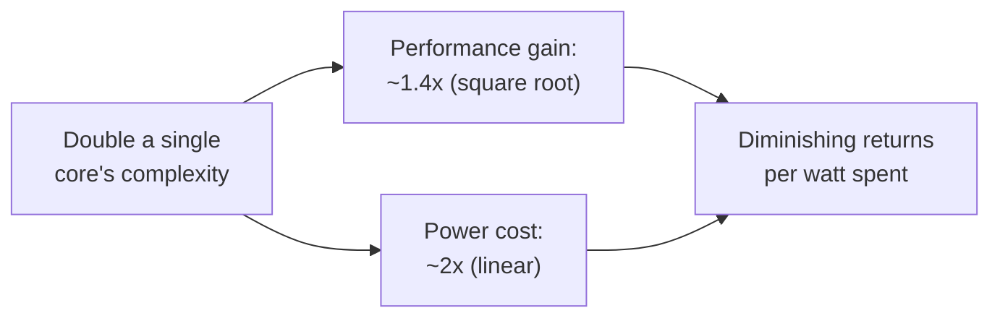

## Learning Objectives

- State Pollack's Rule and explain what it implies about the cost-effectiveness of making a single core larger and more complex.
- Explain why power consumption scaling linearly with complexity, while performance scales only with its square root, creates a genuine physical limit rather than an economic preference.
- Summarize the historical shift Herb Sutter's "The Free Lunch Is Over" documents, and why "the free lunch" is an apt description of what came before it.
- Connect this concept back to the ILP wall (from speculative/out-of-order execution) and the memory wall (from AMAT) as three separate, converging pressures.
- Explain, at a high level, why "two simpler cores" can be a better use of a fixed transistor budget than "one bigger core," using Pollack's Rule directly.

## Context & Motivation

Every technique covered in this discipline so far — deeper pipelining, branch prediction, speculative and out-of-order execution, bigger and smarter caches — has been a way of making a *single* core faster on a *single* stream of instructions, by throwing more transistors and cleverness at the same fundamental design. For decades, this approach worked spectacularly well, and it worked in a specific, historically real way: each new generation of chips ran existing, unmodified software measurably faster, for free, with no work required from the software side at all — simply buy the new chip.

Around the mid-2000s, this stopped being true, for reasons this concept treats as real physical and economic constraints, not an arbitrary industry fad. Herb Sutter's 2005 essay, "The Free Lunch Is Over," is the canonical, still widely cited statement of exactly this turning point, aimed specifically at software developers who had, until then, never needed to think hard about parallelism to get faster programs. Understanding *why* the free lunch ended — not just that it did — is what motivates every concept in the remainder of this discipline: multicore architectures, cache coherence, and SIMD/GPU execution are all, in different ways, responses to the same wall this concept names.

## Core Theory

### Pollack's Rule: performance scales with the square root of complexity

Fred Pollack, an Intel processor architect, observed an empirical relationship that has held up remarkably well across processor generations: increasing a single core's complexity (roughly, its silicon area devoted to logic — bigger caches, wider pipelines, more aggressive out-of-order machinery, more speculative execution resources) by some factor increases its performance by only roughly the *square root* of that factor. Doubling a core's logic complexity yields only about 1.4× (√2) more performance, not 2×.

### Power scales linearly — and that's the wall

Power consumption does not follow the same diminishing curve — it scales roughly *linearly* with the same complexity increase (more transistors switching means more power drawn, in a much more direct, one-to-one relationship than performance's diminishing square-root return). Putting these two facts together: doubling a single core's complexity to get 1.4× the performance costs roughly 2× the power. This is not primarily an economic inconvenience (though it is that too) — it is a genuine physical constraint, since a real chip can only dissipate so much heat before it either becomes unreliable or requires cooling solutions that are themselves impractical for the product (a laptop, a phone, a rack-mounted server) it needs to fit into.



### Two cores instead of one bigger core

Pollack's Rule points directly at an alternative use of the same transistor budget: instead of spending it making one core larger and more complex (for a mere 1.4× return), spend it building **two** simpler, smaller cores of roughly the *original* complexity each. Two cores of the original complexity, running two independent streams of work simultaneously, can together deliver roughly 2× the aggregate throughput — a substantially better return on the same transistor and power budget than the 1.4× a single bigger core would have delivered, *provided* there is actually independent work available to run on both cores at once. That proviso is the entire reason this shift is a genuine turning point for software, not just for chip design: extracting that 2× benefit now requires a program to actually be structured to use two cores, something the vast majority of existing single-threaded software, written under decades of the old free-lunch assumption, simply wasn't.

### The historical turn, and why "free lunch" is the right description

For roughly three decades before this, a working, correct, single-threaded program reliably ran faster on each new processor generation, purely from clock frequency increases and single-core microarchitectural improvements (many covered earlier in this discipline: deeper pipelines, better branch prediction, more aggressive out-of-order execution) — genuinely "free" from the software's point of view, requiring no code changes to benefit. Sutter's essay documents the industry's public pivot, around 2004-2005, toward multicore designs specifically because the power wall made continuing to scale single-core complexity an increasingly poor trade — and states plainly that this free performance ride was ending: future performance gains would overwhelmingly come from parallelism across cores, which, unlike a clock speed bump, *does* require software to be explicitly written (or rewritten) to take advantage of it.

## Worked Examples

### Example 1: Applying Pollack's Rule with concrete numbers

A core with complexity (logic area) C delivers performance P. A redesigned core with complexity 4C is built instead:

```text
Performance of 4C-complexity core ≈ P × sqrt(4) = P × 2 = 2P
Power of 4C-complexity core       ≈ (power of C-complexity core) × 4
```

Quadrupling a single core's complexity yields only double its performance, while quadrupling its power draw — a worsening ratio of performance-per-watt as complexity grows, exactly the diminishing return Pollack's Rule predicts, and precisely the pressure this concept identifies as unsustainable indefinitely.

### Example 2: Comparing one big core against two small cores for the same power budget

Using the same transistor/power budget as Example 1 (enough for one core of complexity 4C, or, roughly equivalently in power terms, four cores of complexity C each, since power scales linearly with complexity):

```text
One core, complexity 4C:  performance ≈ 2P (from Example 1), using ALL the power budget
                            on a single stream of work.

Four cores, complexity C each: each core individually still delivers P (unchanged from
                            the original design), and if 4 independent streams of work
                            are available, aggregate throughput ≈ 4 × P = 4P — DOUBLE
                            the one-big-core design's throughput, for roughly the same
                            total power budget.
```

The four-small-cores design wins decisively — but only if there are genuinely 4 independent things to compute simultaneously; for a single, inherently sequential task, the one-big-core design's 2P still beats any one of the four small cores' individual P, which is exactly the caveat that makes multicore a software problem, not just a hardware upgrade.

### Example 3: Reading a real product line through this lens

A chip vendor releases a new processor generation advertised as "more cores, similar per-core clock speed" rather than "significantly higher per-core clock speed than last generation." Using this concept's vocabulary: this reflects the vendor choosing to spend a fixed power/complexity budget on Example 2's four-small-cores strategy (better aggregate throughput for parallel workloads) rather than Example 1's one-bigger-core strategy (better single-thread performance, but a worse performance-per-watt return) — a direct, observable consequence of the same power wall this concept develops, not a marketing choice made in a vacuum.

## Common Misconceptions & Pitfalls

- **"The power wall means single-core performance stopped improving entirely after 2005."** Single-core improvements continued (this discipline's own branch prediction and speculative/out-of-order concepts describe techniques still actively refined), just at a much slower rate than the previous decades' free clock-speed scaling — the wall changed the *rate and source* of improvement, not stopped it outright.
- **"More cores is always strictly better than fewer, faster cores."** Example 2's conclusion depends entirely on independent work being available to fill every core — for genuinely sequential work, a design that spent its budget on one faster core (even at Pollack's Rule's worse performance-per-watt ratio) can still win in practice, which is exactly why real chips balance both strategies rather than pursuing either exclusively.
- **"Pollack's Rule is a law of physics, like Ohm's Law."** It's an empirically observed engineering regularity across many real processor generations, not a fundamental physical law — real designs have found ways to improve on the raw scaling in specific cases, but it has held up well enough, over enough processor generations, to be treated as a reliable planning heuristic in this discipline and in real industry roadmaps.
- **"This is purely a hardware story with no consequence for software."** The opposite is the entire point of Sutter's essay and this concept's placement in the discipline: extracting the multicore era's performance gains genuinely requires software written to exploit parallel execution, a real, structural change from the previous decades' free, code-unmodified performance improvements.

## Summary

Pollack's Rule — performance scales only with the square root of added single-core complexity, while power scales linearly with it — creates a genuine physical wall on how much further a single core can be usefully scaled, making a fixed transistor/power budget spent on several simpler cores a better aggregate-throughput trade than the same budget spent on one larger core, provided independent work exists to fill them. This is the real, historically documented (Herb Sutter, 2005) turning point that ended decades of "free," code-unmodified single-thread performance gains and shifted the industry toward the multicore designs this discipline's remaining concepts are about — starting with the next concept, Multicore Architectures and Shared Memory, which describes the actual hardware layout that shift produced.

## Documentation Links

- [Herb Sutter — The Free Lunch Is Over](http://www.gotw.ca/publications/concurrency-ddj.htm) — the canonical essay documenting and naming this historical shift toward multicore and concurrency.
- [Cambridge ACS — Performance Prediction: Pollack's Rule](https://www.cl.cam.ac.uk/research/srg/han/ACS-P35/obj-5.1/zhp3123b9dbe.html) — course material stating Pollack's Rule and its performance-vs-power scaling implications precisely.
