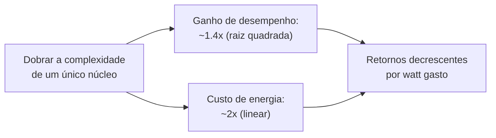

## Objetivos de Aprendizagem

- Enunciar a Regra de Pollack e explicar o que ela implica sobre a relação custo-benefício de tornar um único núcleo maior e mais complexo.
- Explicar por que o consumo de energia escalar linearmente com a complexidade, enquanto o desempenho escala só com sua raiz quadrada, cria um limite físico genuíno, e não uma preferência econômica.
- Resumir a mudança histórica que o "The Free Lunch Is Over" de Herb Sutter documenta e por que "o almoço grátis" é uma descrição adequada do que veio antes dela.
- Ligar este conceito à barreira do ILP (da execução especulativa/fora de ordem) e à barreira da memória (do AMAT) como três pressões separadas e convergentes.
- Explicar, em alto nível, por que "dois núcleos mais simples" podem ser um uso melhor de um orçamento fixo de transistores do que "um núcleo maior", usando diretamente a Regra de Pollack.

## Contexto e Motivação

Toda técnica vista nesta disciplina até aqui (pipelining mais profundo, previsão de desvios, execução especulativa e fora de ordem, caches maiores e mais espertas) foi uma forma de deixar um *único* núcleo mais rápido num *único* fluxo de instruções, jogando mais transistores e mais engenhosidade no mesmo projeto fundamental. Por décadas, essa abordagem funcionou espetacularmente bem, e funcionou de um jeito específico e historicamente real: cada nova geração de chips rodava o software existente, sem modificação, de forma mensuravelmente mais rápida, de graça, sem nenhum trabalho do lado do software; bastava comprar o chip novo.

Por volta de meados dos anos 2000, isso deixou de ser verdade, por motivos que este conceito trata como restrições físicas e econômicas reais, e não como uma moda arbitrária da indústria. O ensaio de 2005 de Herb Sutter, "The Free Lunch Is Over", é a declaração canônica, ainda amplamente citada, exatamente desse ponto de virada, voltada especificamente para desenvolvedores de software que, até então, nunca tinham precisado pensar muito em paralelismo para ter programas mais rápidos. Entender *por que* o almoço grátis acabou (e não só que acabou) é o que motiva todo conceito do restante desta disciplina: arquiteturas multinúcleo, coerência de cache e execução SIMD/GPU são todas, de formas diferentes, respostas à mesma barreira que este conceito nomeia.

## Teoria Central

### A Regra de Pollack: o desempenho escala com a raiz quadrada da complexidade

Fred Pollack, arquiteto de processadores da Intel, observou uma relação empírica que se manteve notavelmente bem ao longo de gerações de processadores: aumentar a complexidade de um único núcleo (grosso modo, a área de silício dedicada à lógica: caches maiores, pipelines mais largos, maquinaria fora de ordem mais agressiva, mais recursos de execução especulativa) por algum fator aumenta seu desempenho só por cerca da *raiz quadrada* desse fator. Dobrar a complexidade lógica de um núcleo rende só cerca de 1.4× (√2) mais desempenho, e não 2×.

### A energia escala linearmente, e essa é a barreira

O consumo de energia não segue a mesma curva decrescente: ele escala mais ou menos *linearmente* com o mesmo aumento de complexidade (mais transistores chaveando significa mais energia consumida, numa relação muito mais direta, um para um, do que o retorno decrescente de raiz quadrada do desempenho). Juntando os dois fatos: dobrar a complexidade de um único núcleo para ganhar 1.4× de desempenho custa cerca de 2× de energia. Isso não é principalmente um incômodo econômico (embora também seja): é uma restrição física genuína, já que um chip real só consegue dissipar uma certa quantidade de calor antes de ficar pouco confiável ou de exigir soluções de resfriamento que são, elas próprias, impraticáveis para o produto (um notebook, um celular, um servidor em rack) em que ele precisa caber.



### Dois núcleos em vez de um núcleo maior

A Regra de Pollack aponta diretamente para um uso alternativo do mesmo orçamento de transistores: em vez de gastá-lo tornando um núcleo maior e mais complexo (por um retorno de meros 1.4×), gastá-lo construindo **dois** núcleos mais simples e menores, cada um com mais ou menos a complexidade *original*. Dois núcleos com a complexidade original, rodando dois fluxos de trabalho independentes ao mesmo tempo, podem juntos entregar cerca de 2× a vazão agregada, um retorno substancialmente melhor sobre o mesmo orçamento de transistores e de energia do que os 1.4× que um único núcleo maior teria entregue, *desde que* exista de fato trabalho independente disponível para rodar nos dois núcleos ao mesmo tempo. Essa ressalva é todo o motivo pelo qual essa mudança é uma virada genuína para o software, e não só para o projeto de chips: extrair esse benefício de 2× agora exige que um programa esteja de fato estruturado para usar dois núcleos, algo que a vasta maioria do software de thread única existente, escrito sob décadas da velha suposição do almoço grátis, simplesmente não estava.

### A virada histórica, e por que "almoço grátis" é a descrição certa

Por cerca de três décadas antes disso, um programa de thread única, funcional e correto, rodava de forma confiável mais rápido a cada nova geração de processadores, puramente por aumentos de frequência de clock e melhorias microarquiteturais de núcleo único (muitas vistas antes nesta disciplina: pipelines mais profundos, melhor previsão de desvios, execução fora de ordem mais agressiva), genuinamente "de graça" do ponto de vista do software, sem exigir nenhuma mudança no código para se beneficiar. O ensaio de Sutter documenta a virada pública da indústria, por volta de 2004-2005, para projetos multinúcleo especificamente porque a barreira da energia tornou cada vez pior a troca de continuar escalando a complexidade de núcleo único, e diz com todas as letras que essa carona de desempenho gratuito estava acabando: os ganhos de desempenho futuros viriam esmagadoramente do paralelismo entre núcleos, que, ao contrário de um aumento de velocidade de clock, *exige* que o software seja explicitamente escrito (ou reescrito) para aproveitá-lo.

## Exemplos Resolvidos

### Exemplo 1: aplicando a Regra de Pollack com números concretos

Um núcleo com complexidade (área de lógica) C entrega desempenho P. Em vez dele, é construído um núcleo reprojetado com complexidade 4C:

```text
Desempenho do núcleo de complexidade 4C ≈ P × sqrt(4) = P × 2 = 2P
Energia do núcleo de complexidade 4C    ≈ (energia do núcleo de complexidade C) × 4
```

Quadruplicar a complexidade de um único núcleo rende só o dobro do desempenho, enquanto quadruplica seu consumo de energia: uma relação desempenho por watt que piora conforme a complexidade cresce, exatamente o retorno decrescente que a Regra de Pollack prevê, e precisamente a pressão que este conceito identifica como insustentável indefinidamente.

### Exemplo 2: comparando um núcleo grande com dois núcleos pequenos para o mesmo orçamento de energia

Usando o mesmo orçamento de transistores/energia do Exemplo 1 (o suficiente para um núcleo de complexidade 4C ou, de forma mais ou menos equivalente em termos de energia, quatro núcleos de complexidade C cada, já que a energia escala linearmente com a complexidade):

```text
Um núcleo, complexidade 4C:  desempenho ≈ 2P (do Exemplo 1), usando TODO o orçamento de energia
                              num único fluxo de trabalho.

Quatro núcleos, complexidade C cada: cada núcleo, individualmente, ainda entrega P (inalterado em relação
                              ao projeto original), e, se houver 4 fluxos de trabalho independentes
                              disponíveis, a vazão agregada ≈ 4 × P = 4P: o DOBRO
                              da vazão do projeto com um núcleo grande, para mais ou menos o mesmo
                              orçamento total de energia.
```

O projeto com quatro núcleos pequenos vence de forma decisiva, mas só se houver de fato 4 coisas independentes para calcular ao mesmo tempo; numa única tarefa inerentemente sequencial, os 2P do projeto com um núcleo grande ainda batem o P individual de qualquer um dos quatro núcleos pequenos, e é exatamente essa ressalva que faz do multinúcleo um problema de software, e não só um upgrade de hardware.

### Exemplo 3: lendo uma linha de produtos real por esta lente

Um fabricante de chips lança uma nova geração de processadores anunciada como "mais núcleos, velocidade de clock por núcleo parecida", em vez de "velocidade de clock por núcleo significativamente maior que a da geração anterior". Usando o vocabulário deste conceito: isso reflete o fabricante escolhendo gastar um orçamento fixo de energia/complexidade na estratégia de quatro núcleos pequenos do Exemplo 2 (melhor vazão agregada para cargas de trabalho paralelas), em vez da estratégia de um núcleo maior do Exemplo 1 (melhor desempenho de thread única, mas um retorno pior de desempenho por watt). É uma consequência direta e observável da mesma barreira da energia que este conceito desenvolve, e não uma escolha de marketing feita no vácuo.

## Equívocos Comuns e Armadilhas

- **"A barreira da energia significa que o desempenho de núcleo único parou de melhorar por completo depois de 2005."** As melhorias de núcleo único continuaram (os próprios conceitos de previsão de desvios e de execução especulativa/fora de ordem desta disciplina descrevem técnicas ainda ativamente refinadas), só que num ritmo muito mais lento que o aumento gratuito de velocidade de clock das décadas anteriores. A barreira mudou o *ritmo e a fonte* das melhorias, e não as interrompeu por completo.
- **"Mais núcleos é sempre estritamente melhor que menos núcleos mais rápidos."** A conclusão do Exemplo 2 depende inteiramente de haver trabalho independente disponível para preencher todo núcleo. Para trabalho genuinamente sequencial, um projeto que gastou seu orçamento num núcleo mais rápido (mesmo com a pior relação desempenho por watt da Regra de Pollack) ainda pode vencer na prática, e é exatamente por isso que chips reais equilibram as duas estratégias, em vez de perseguir uma delas com exclusividade.
- **"A Regra de Pollack é uma lei da física, como a Lei de Ohm."** É uma regularidade de engenharia observada empiricamente ao longo de muitas gerações reais de processadores, e não uma lei física fundamental. Projetos reais encontraram formas de melhorar a escala bruta em casos específicos, mas ela se manteve bem o bastante, ao longo de gerações suficientes de processadores, para ser tratada como uma heurística de planejamento confiável nesta disciplina e nos roteiros reais da indústria.
- **"Esta é uma história puramente de hardware, sem consequência para o software."** O oposto é todo o ponto do ensaio de Sutter e da posição deste conceito na disciplina: extrair os ganhos de desempenho da era multinúcleo genuinamente exige software escrito para explorar a execução paralela, uma mudança real e estrutural em relação às melhorias de desempenho gratuitas, sem modificação de código, das décadas anteriores.

## Resumo

A Regra de Pollack (o desempenho escala só com a raiz quadrada da complexidade acrescentada a um único núcleo, enquanto a energia escala linearmente com ela) cria uma barreira física genuína para o quanto um único núcleo ainda pode ser escalado de forma útil, tornando um orçamento fixo de transistores/energia gasto em vários núcleos mais simples uma troca melhor, em vazão agregada, do que o mesmo orçamento gasto num núcleo maior, desde que exista trabalho independente para preenchê-los. Esse é o ponto de virada real e historicamente documentado (Herb Sutter, 2005) que encerrou décadas de ganhos de desempenho de thread única "gratuitos", sem modificação de código, e levou a indústria para os projetos multinúcleo de que tratam os conceitos restantes desta disciplina, começando pelo próximo, Arquiteturas Multinúcleo e Memória Compartilhada, que descreve o layout de hardware real que essa mudança produziu.

## Documentation Links

- [Herb Sutter: The Free Lunch Is Over](http://www.gotw.ca/publications/concurrency-ddj.htm): o ensaio canônico que documenta e nomeia esta mudança histórica em direção ao multinúcleo e à concorrência.
- [Cambridge ACS: Performance Prediction: Pollack's Rule](https://www.cl.cam.ac.uk/research/srg/han/ACS-P35/obj-5.1/zhp3123b9dbe.html): material de curso que enuncia com precisão a Regra de Pollack e suas implicações para a escala de desempenho versus energia.
