## Learning Objectives

- Distinguish latency (time for one instruction to complete) from throughput (instructions completed per unit time), and explain why they are not the same quantity.
- Explain precisely why the single-cycle CPU from Digital Logic & Computer Organization wastes time on every instruction that isn't the slowest one.
- Describe pipelining as overlapping independent stages of successive instructions, and explain why this raises throughput without requiring any single instruction to execute faster.
- Compute the ideal speedup of an N-stage pipeline over an unpipelined implementation for a long-running program.
- State, at a high level, the price pipelining pays for that speedup (previewed here, developed fully in the hazard concepts that follow).

## Context & Motivation

The single-cycle CPU built at the end of Digital Logic & Computer Organization is a genuinely complete, correct machine: every instruction in the teaching ISA fetches, decodes, executes, accesses memory, and writes back its result, all within one clock cycle. But that correctness hides a serious inefficiency, one the Iron Law from the previous concept gives the vocabulary to name precisely. In a single-cycle design, the clock cycle time must be long enough for the *slowest* instruction to complete every one of its five steps — typically a load instruction, since it walks through fetch, register read, an address computation, a memory access, and a register write-back, all in series. Every other instruction, including a simple register-to-register add that doesn't touch memory at all, is forced to wait out that same long cycle, even though its own work finishes far sooner.

This is exactly the kind of waste the Iron Law makes visible: Clock Cycle Time, the third factor in CPU time, is set by the single slowest path through the whole design, and every instruction pays that price on every single cycle whether it needs to or not. Pipelining is the first, and pedagogically the most important, technique this discipline covers for attacking that waste — and it is worth understanding on its own terms, with a plain non-computing analogy, before any hardware detail is introduced.

The reason this concept exists as its own step, separate from the mechanics of the 5-stage pipeline covered next, is that the core idea — overlapping stages of different instructions in flight at once — is genuinely independent of any specific stage count or hazard-handling scheme. Understanding *why* overlap helps, and precisely what it does and does not improve, makes every hazard discussed afterward legible as "a case where the overlap briefly breaks and has to be patched," rather than an arbitrary list of special cases to memorize.

## Core Theory

### Latency versus throughput

Two different, easily conflated questions about performance:

- **Latency**: how long does it take for *one* instruction to go from start to finish?
- **Throughput**: how many instructions complete per unit time, once the pipeline is full and running steadily?

A single-cycle CPU has excellent latency for cheap instructions relative to its own clock cycle (one instruction finishes every single cycle) but a *long* cycle time overall, because that cycle must accommodate the worst-case instruction. Pipelining will, somewhat surprisingly, make the *latency* of any individual instruction longer in absolute terms (it now takes several shorter cycles to pass through several stages, instead of one long cycle) while making *throughput* dramatically higher (a new instruction can be admitted into the pipeline every single short cycle, rather than waiting for the previous instruction's entire long cycle to finish first).

### The overlap idea

Assembling a Complete Single-Cycle CPU already separates instruction execution into five logical steps: Fetch, Decode/Register-Read, Execute (ALU), Memory access, Write-back. In the single-cycle design, all five steps for one instruction complete before the next instruction's Fetch even begins — nothing is overlapped. Pipelining's central move is to let a *different* instruction occupy each of those five logical steps at the same time: while instruction 3 is in its Execute stage, instruction 4 can simultaneously be in Decode, and instruction 5 can simultaneously be in Fetch. No instruction's own steps are reordered or skipped; what changes is that the hardware resources for each step (the instruction memory port, the register file read ports, the ALU, the data memory port, the register file write port) are kept busy on every single cycle, working on five *different* instructions at once, instead of sitting idle four-fifths of the time as they do in the single-cycle design.

```mermaid
gantt
    title Single-cycle vs pipelined execution of 3 instructions (time flows left to right)
    dateFormat X
    axisFormat %s
    section Single-cycle
    Instr 1 (all 5 steps, one long cycle) : 0, 5
    Instr 2 (all 5 steps, one long cycle) : 5, 5
    Instr 3 (all 5 steps, one long cycle) : 10, 5
    section Pipelined
    Instr 1 IF : 0, 1
    Instr 1 ID : 1, 1
    Instr 1 EX : 2, 1
    Instr 1 MEM : 3, 1
    Instr 1 WB : 4, 1
    Instr 2 IF : 1, 1
    Instr 2 ID : 2, 1
    Instr 2 EX : 3, 1
    Instr 2 MEM : 4, 1
    Instr 2 WB : 5, 1
    Instr 3 IF : 2, 1
    Instr 3 ID : 3, 1
    Instr 3 EX : 4, 1
    Instr 3 MEM : 5, 1
    Instr 3 WB : 6, 1
```



Notice the shape: the single-cycle version needs 15 time units (3 instructions × 5 units each) to finish all three instructions, while the pipelined version finishes the third instruction's write-back at time unit 7 — nearly twice as fast for just three instructions, with the gap growing the longer the program runs.

### Why pipelining shortens the clock cycle

Splitting one long single-cycle datapath into five separate stages, each holding its own small piece of combinational logic, means each stage's logic only has to be fast enough to finish within one *short* pipeline cycle — not the whole instruction. The clock cycle time of a pipelined design is set by its *slowest single stage*, not by the sum of all five steps. Since each stage does roughly a fifth of the total work of a single-cycle instruction, the pipelined clock cycle can, in the ideal case, run close to five times faster than the single-cycle clock — directly attacking the Clock Cycle Time factor of the Iron Law from the previous concept.

### Ideal pipeline speedup

For a long-running program of many instructions, once the pipeline is full (the "steady state"), a new instruction completes on almost every single cycle. The ideal speedup of an N-stage pipeline over an equivalent unpipelined design, for a program long enough that the constant startup cost (filling the pipeline) becomes negligible, approaches N — the number of stages. This is an *ideal* upper bound; the concepts immediately following this one exist specifically because real pipelines cannot always sustain "a new instruction on every cycle," and the gap between the ideal N× speedup and what a real pipeline actually achieves is exactly what hazards cost.

## Worked Examples

### Example 1: Quantifying the single-cycle waste

Suppose, in a single-cycle design, each of the five logical steps takes the following amount of time to complete: Fetch = 200 ps, Decode/Register-Read = 100 ps, Execute = 200 ps, Memory access = 200 ps, Write-back = 100 ps. Every instruction must reserve the full 200+100+200+200+100 = 800 ps cycle, even one (like a register-to-register add with no memory access) that could, in principle, finish its needed steps (Fetch + Decode + Execute + Write-back, skipping Memory) in only 200+100+200+100 = 600 ps. The unused 200 ps on every non-memory instruction is exactly the waste pipelining is designed to reclaim, by no longer forcing every instruction to share one common, worst-case-sized cycle.

### Example 2: Computing ideal pipelined vs. single-cycle time for a real program

A program executes 1,000,000 instructions. The single-cycle clock cycle time is 800 ps (as in Example 1). A 5-stage pipelined version, with each stage sized to the slowest single stage (200 ps, the Fetch/Execute/Memory stages above), uses a 200 ps clock cycle.

```text
Single-cycle CPU time = 1,000,000 instructions × 1 cycle/instruction × 800 ps
                       = 800,000,000 ps = 800 µs

Pipelined CPU time ≈ (1,000,000 + 4) cycles × 200 ps
                    ≈ 1,000,004 × 200 ps ≈ 200,000,800 ps ≈ 200 µs
```

(The "+4" accounts for the 4 extra cycles needed to drain the last instruction through the remaining pipeline stages after the last instruction is fetched — negligible for a program this long.) The pipelined version is roughly 800/200 = 4× faster here — close to, but slightly under, the ideal 5× bound, because the pipeline's clock cycle (200 ps) is set by the slowest *single* stage, and three of the five stages in this example already happened to take exactly 200 ps, while Decode and Write-back (100 ps each) still finish with cycle time to spare.

### Example 3: Why "just add more stages" doesn't scale forever

Splitting the datapath into more, finer-grained stages continues to shrink the clock cycle time and raise the ideal speedup bound — but each pipeline register added between stages has its own fixed overhead (setup and hold time, clock-to-output delay), and each additional stage multiplies the number of in-flight instructions that a hazard (covered starting in the next concept) can disrupt. Real, deeply pipelined designs (some historical processors used 20+ stages) hit diminishing and eventually negative returns from this overhead and hazard cost — a genuine engineering tradeoff, not a flaw unique to the simple 5-stage pipeline this discipline builds.

## Common Misconceptions & Pitfalls

- **"Pipelining makes each instruction execute faster."** It's the opposite for any single instruction in isolation: an instruction now takes 5 shorter cycles (more total time, in Example 2 roughly 5 × 200 ps = 1000 ps of latency) to pass through the pipeline versus 1 long cycle (800 ps) in the single-cycle design. What improves is throughput — how often a *new* instruction completes — not any one instruction's own latency.
- **"An N-stage pipeline is always exactly N times faster."** Only in the ideal case, for a long enough program, with every stage perfectly balanced and no hazards ever occurring. Example 2 shows a realistic 4× speedup from a 5-stage pipeline once stage sizes are uneven; the hazard concepts that follow this one show further, real reductions from that ideal bound.
- **"More pipeline stages is always better."** Example 3's diminishing-returns point is real: pipeline register overhead and hazard frequency both grow with stage count, and real processor designs have converged on a wide range of pipeline depths as different points on this tradeoff, not a single "more is always better" answer.
- **"The single-cycle CPU from Digital Logic & Computer Organization was a mistake."** It wasn't — it is the simplest possible *correct* implementation of the ISA, and understanding exactly why it's inefficient (the waste quantified in Example 1) is precisely the motivation this concept needs before pipelining can make sense as a genuine improvement rather than an arbitrary added complexity.

## Summary

Latency (time for one instruction) and throughput (instructions completed per unit time) are different quantities, and the single-cycle CPU already built in Digital Logic & Computer Organization has poor throughput because every instruction is forced to share one clock cycle long enough for the slowest instruction, wasting time on every faster one. Pipelining overlaps different instructions across the datapath's five logical stages simultaneously, shrinking the clock cycle to the size of one stage instead of one whole instruction, and approaching an ideal N-stage speedup for a long enough program — at the cost, developed in the concepts that follow, of new hazards that occur specifically because several instructions are now genuinely in flight through the hardware at once. The next concept, `the-5-stage-risc-pipeline`, gives this overlap idea its concrete hardware form: five pipeline registers latching state between Fetch, Decode, Execute, Memory, and Write-back.

## Documentation Links

- [MIT 6.004 — Pipelining the Beta](https://ocw.mit.edu/courses/6-004-computation-structures-spring-2017/pages/c15/) — unit motivating pipelining from the same latency-vs-throughput distinction, applied to the Beta processor.
- [Harris & Harris — Digital Design and Computer Architecture, RISC-V Edition](https://shop.elsevier.com/books/digital-design-and-computer-architecture-risc-v-edition/harris/978-0-12-820064-3) — textbook deriving pipelined performance directly from the single-cycle design this discipline also starts from.
