## Objetivos de Aprendizagem

- Distinguir latência (tempo para uma instrução terminar) de vazão (instruções concluídas por unidade de tempo) e explicar por que não são a mesma quantidade.
- Explicar com precisão por que a CPU de ciclo único de Lógica Digital e Organização de Computadores desperdiça tempo em toda instrução que não é a mais lenta.
- Descrever o pipelining como a sobreposição de estágios independentes de instruções sucessivas e explicar por que isso aumenta a vazão sem exigir que nenhuma instrução isolada execute mais rápido.
- Calcular o ganho ideal de um pipeline de N estágios sobre uma implementação sem pipeline para um programa de longa duração.
- Dizer, em alto nível, o preço que o pipelining paga por esse ganho (antecipado aqui e desenvolvido por completo nos conceitos de hazards que vêm a seguir).

## Contexto e Motivação

A CPU de ciclo único construída no fim de Lógica Digital e Organização de Computadores é uma máquina genuinamente completa e correta: toda instrução da ISA didática busca, decodifica, executa, acessa a memória e escreve de volta seu resultado, tudo num único ciclo de clock. Mas essa correção esconde uma ineficiência séria, que a Lei de Ferro do conceito anterior dá o vocabulário para nomear com precisão. Num projeto de ciclo único, o tempo de ciclo de clock precisa ser longo o bastante para a instrução *mais lenta* completar cada um dos seus cinco passos, normalmente uma instrução de load, já que ela passa em série por busca, leitura de registradores, cálculo de endereço, acesso à memória e escrita de volta no registrador. Toda outra instrução, incluindo uma simples soma de registrador para registrador que nem toca a memória, é forçada a esperar esse mesmo ciclo longo, mesmo que seu próprio trabalho termine muito antes.

É exatamente o tipo de desperdício que a Lei de Ferro torna visível: o Tempo de Ciclo de Clock, o terceiro fator do tempo de CPU, é definido pelo caminho mais lento de todo o projeto, e toda instrução paga esse preço em todo ciclo, precise ou não. O pipelining é a primeira técnica, e a mais importante do ponto de vista didático, que esta disciplina cobre para atacar esse desperdício, e vale entendê-la em seus próprios termos, com uma analogia simples fora da computação, antes de apresentar qualquer detalhe de hardware.

O motivo pelo qual este conceito existe como passo próprio, separado da mecânica do pipeline de 5 estágios vista a seguir, é que a ideia central (sobrepor estágios de instruções diferentes em andamento ao mesmo tempo) é genuinamente independente de qualquer número específico de estágios ou esquema de tratamento de hazards. Entender *por que* a sobreposição ajuda, e com precisão o que ela melhora e o que não melhora, torna cada hazard discutido depois legível como "um caso em que a sobreposição quebra por um instante e precisa ser remendada", em vez de uma lista arbitrária de casos especiais a decorar.

## Teoria Central

### Latência versus vazão

Duas perguntas diferentes, e fáceis de confundir, sobre desempenho:

- **Latência**: quanto tempo leva para *uma* instrução ir do início ao fim?
- **Vazão**: quantas instruções terminam por unidade de tempo, quando o pipeline está cheio e rodando de forma constante?

Uma CPU de ciclo único tem excelente latência para instruções baratas em relação ao seu próprio ciclo de clock (uma instrução termina a cada ciclo), mas um tempo de ciclo *longo* no geral, porque esse ciclo precisa acomodar a instrução do pior caso. O pipelining vai, de forma um tanto surpreendente, tornar *maior*, em termos absolutos, a latência de qualquer instrução individual (agora ela leva vários ciclos mais curtos para passar por vários estágios, em vez de um ciclo longo) enquanto torna a *vazão* drasticamente maior (uma instrução nova pode ser admitida no pipeline a cada ciclo curto, em vez de esperar o ciclo longo inteiro da instrução anterior terminar).

### A ideia da sobreposição

Assembling a Complete Single-Cycle CPU já separa a execução de instruções em cinco passos lógicos: Busca, Decodificação/Leitura de Registradores, Execução (ULA), acesso à Memória, Escrita de Volta. No projeto de ciclo único, os cinco passos de uma instrução terminam antes de a Busca da próxima instrução sequer começar: nada é sobreposto. O movimento central do pipelining é deixar uma instrução *diferente* ocupar cada um desses cinco passos lógicos ao mesmo tempo: enquanto a instrução 3 está no estágio de Execução, a instrução 4 pode estar ao mesmo tempo na Decodificação, e a instrução 5 pode estar ao mesmo tempo na Busca. Nenhum dos passos de uma instrução é reordenado ou pulado; o que muda é que os recursos de hardware de cada passo (a porta da memória de instruções, as portas de leitura do banco de registradores, a ULA, a porta da memória de dados, a porta de escrita do banco de registradores) ficam ocupados a cada ciclo, trabalhando em cinco instruções *diferentes* ao mesmo tempo, em vez de ficarem ociosos quatro quintos do tempo, como no projeto de ciclo único.

```mermaid
gantt
    title Execução de ciclo único vs com pipeline de 3 instruções (o tempo corre da esquerda para a direita)
    dateFormat X
    axisFormat %s
    section Ciclo único
    Instr 1 (os 5 passos, um ciclo longo) : 0, 5
    Instr 2 (os 5 passos, um ciclo longo) : 5, 5
    Instr 3 (os 5 passos, um ciclo longo) : 10, 5
    section Com pipeline
    Instr 1 IF : 0, 1
    Instr 1 ID : 1, 1
    Instr 1 EX : 2, 1
    Instr 1 MEM : 3, 1
    Instr 1 WB : 4, 1
    Instr 2 IF : 1, 1
    Instr 2 ID : 2, 1
    Instr 2 EX : 3, 1
    Instr 2 MEM : 4, 1
    Instr 2 WB : 5, 1
    Instr 3 IF : 2, 1
    Instr 3 ID : 3, 1
    Instr 3 EX : 4, 1
    Instr 3 MEM : 5, 1
    Instr 3 WB : 6, 1
```



Repare na forma: a versão de ciclo único precisa de 15 unidades de tempo (3 instruções × 5 unidades cada) para terminar as três instruções, enquanto a versão com pipeline termina a escrita de volta da terceira instrução na unidade de tempo 7, quase o dobro da velocidade com só três instruções, e a diferença cresce quanto mais o programa roda.

### Por que o pipelining encurta o ciclo de clock

Dividir um longo datapath de ciclo único em cinco estágios separados, cada um com seu próprio pequeno pedaço de lógica combinacional, significa que a lógica de cada estágio só precisa ser rápida o bastante para terminar dentro de um ciclo *curto* de pipeline, e não da instrução inteira. O tempo de ciclo de clock de um projeto com pipeline é definido pelo seu *estágio isolado mais lento*, e não pela soma dos cinco passos. Como cada estágio faz mais ou menos um quinto do trabalho total de uma instrução de ciclo único, o ciclo de clock com pipeline pode, no caso ideal, rodar perto de cinco vezes mais rápido que o clock de ciclo único, atacando diretamente o fator Tempo de Ciclo de Clock da Lei de Ferro do conceito anterior.

### O ganho ideal do pipeline

Num programa de longa duração, com muitas instruções, quando o pipeline está cheio (o "regime"), uma instrução nova termina em quase todo ciclo. O ganho ideal de um pipeline de N estágios sobre um projeto equivalente sem pipeline, para um programa longo o bastante para que o custo constante de início (encher o pipeline) se torne desprezível, se aproxima de N, o número de estágios. É um limite superior *ideal*; os conceitos que vêm logo depois deste existem especificamente porque pipelines reais nem sempre conseguem sustentar "uma instrução nova a cada ciclo", e a diferença entre o ganho ideal de N× e o que um pipeline real de fato atinge é exatamente o custo dos hazards.

## Exemplos Resolvidos

### Exemplo 1: quantificando o desperdício do ciclo único

Suponha que, num projeto de ciclo único, cada um dos cinco passos lógicos leve o seguinte tempo para terminar: Busca = 200 ps, Decodificação/Leitura de Registradores = 100 ps, Execução = 200 ps, acesso à Memória = 200 ps, Escrita de Volta = 100 ps. Toda instrução precisa reservar o ciclo completo de 200+100+200+200+100 = 800 ps, mesmo uma (como uma soma de registrador para registrador, sem acesso à memória) que poderia, em princípio, terminar os passos de que precisa (Busca + Decodificação + Execução + Escrita de Volta, pulando a Memória) em só 200+100+200+100 = 600 ps. Os 200 ps não usados em toda instrução que não acessa a memória são exatamente o desperdício que o pipelining é projetado para recuperar, deixando de forçar toda instrução a dividir um ciclo comum, dimensionado para o pior caso.

### Exemplo 2: calculando o tempo ideal com pipeline vs. de ciclo único para um programa real

Um programa executa 1.000.000 de instruções. O tempo de ciclo de clock de ciclo único é de 800 ps (como no Exemplo 1). Uma versão com pipeline de 5 estágios, com cada estágio dimensionado pelo estágio isolado mais lento (200 ps, os estágios de Busca/Execução/Memória acima), usa um ciclo de clock de 200 ps.

```text
Tempo de CPU de ciclo único = 1.000.000 instruções × 1 ciclo/instrução × 800 ps
                             = 800.000.000 ps = 800 µs

Tempo de CPU com pipeline ≈ (1.000.000 + 4) ciclos × 200 ps
                          ≈ 1.000.004 × 200 ps ≈ 200.000.800 ps ≈ 200 µs
```

(O "+4" conta os 4 ciclos extras necessários para escoar a última instrução pelos estágios restantes do pipeline depois de a última instrução ser buscada, desprezível para um programa tão longo.) A versão com pipeline é cerca de 800/200 = 4× mais rápida aqui, perto do limite ideal de 5×, mas um pouco abaixo, porque o ciclo de clock do pipeline (200 ps) é definido pelo estágio *isolado* mais lento, e três dos cinco estágios deste exemplo por acaso já levavam exatamente 200 ps, enquanto a Decodificação e a Escrita de Volta (100 ps cada) ainda terminam com tempo de ciclo sobrando.

### Exemplo 3: por que "só acrescentar mais estágios" não escala para sempre

Dividir o datapath em estágios mais numerosos e mais finos continua encolhendo o tempo de ciclo de clock e elevando o limite ideal de ganho, mas cada registrador de pipeline acrescentado entre estágios tem sua própria sobrecarga fixa (tempo de setup e de hold, atraso de clock para saída), e cada estágio adicional multiplica o número de instruções em andamento que um hazard (visto a partir do próximo conceito) pode perturbar. Projetos reais com pipelines profundos (alguns processadores históricos usaram mais de 20 estágios) bateram em retornos decrescentes, e por fim negativos, por causa dessa sobrecarga e do custo dos hazards: uma troca de engenharia genuína, e não uma falha exclusiva do pipeline simples de 5 estágios que esta disciplina constrói.

## Equívocos Comuns e Armadilhas

- **"O pipelining faz cada instrução executar mais rápido."** É o oposto para qualquer instrução isolada: uma instrução agora leva 5 ciclos mais curtos (mais tempo total; no Exemplo 2, cerca de 5 × 200 ps = 1000 ps de latência) para passar pelo pipeline, contra 1 ciclo longo (800 ps) no projeto de ciclo único. O que melhora é a vazão (com que frequência uma instrução *nova* termina), e não a latência de alguma instrução específica.
- **"Um pipeline de N estágios é sempre exatamente N vezes mais rápido."** Só no caso ideal, num programa longo o bastante, com todo estágio perfeitamente equilibrado e sem nenhum hazard. O Exemplo 2 mostra um ganho realista de 4× com um pipeline de 5 estágios quando os tamanhos dos estágios são desiguais; os conceitos de hazards que vêm depois deste mostram reduções adicionais e reais em relação a esse limite ideal.
- **"Mais estágios de pipeline é sempre melhor."** O ponto de retornos decrescentes do Exemplo 3 é real: a sobrecarga dos registradores de pipeline e a frequência dos hazards crescem com o número de estágios, e projetos reais de processadores convergiram para uma ampla variedade de profundidades de pipeline como pontos diferentes dessa troca, e não para uma única resposta de "mais é sempre melhor".
- **"A CPU de ciclo único de Lógica Digital e Organização de Computadores foi um erro."** Não foi: ela é a implementação *correta* mais simples possível da ISA, e entender exatamente por que ela é ineficiente (o desperdício quantificado no Exemplo 1) é precisamente a motivação de que este conceito precisa para que o pipelining faça sentido como uma melhora genuína, e não como uma complexidade acrescentada de forma arbitrária.

## Resumo

Latência (tempo de uma instrução) e vazão (instruções concluídas por unidade de tempo) são quantidades diferentes, e a CPU de ciclo único já construída em Lógica Digital e Organização de Computadores tem vazão ruim porque toda instrução é forçada a dividir um ciclo de clock longo o bastante para a instrução mais lenta, desperdiçando tempo em toda instrução mais rápida. O pipelining sobrepõe instruções diferentes nos cinco estágios lógicos do datapath ao mesmo tempo, encolhendo o ciclo de clock para o tamanho de um estágio, em vez de uma instrução inteira, e se aproximando de um ganho ideal de N estágios num programa longo o bastante, ao custo, desenvolvido nos conceitos seguintes, de novos hazards que ocorrem especificamente porque várias instruções agora estão genuinamente em andamento pelo hardware ao mesmo tempo. O próximo conceito, `the-5-stage-risc-pipeline`, dá a essa ideia de sobreposição sua forma concreta de hardware: cinco registradores de pipeline guardando o estado entre Busca, Decodificação, Execução, Memória e Escrita de Volta.

## Documentation Links

- [MIT 6.004: Pipelining the Beta](https://ocw.mit.edu/courses/6-004-computation-structures-spring-2017/pages/c15/): unidade que motiva o pipelining a partir da mesma distinção entre latência e vazão, aplicada ao processador Beta.
- [Harris & Harris: Digital Design and Computer Architecture, RISC-V Edition](https://shop.elsevier.com/books/digital-design-and-computer-architecture-risc-v-edition/harris/978-0-12-820064-3): livro-texto que deriva o desempenho com pipeline diretamente do projeto de ciclo único do qual esta disciplina também parte.
