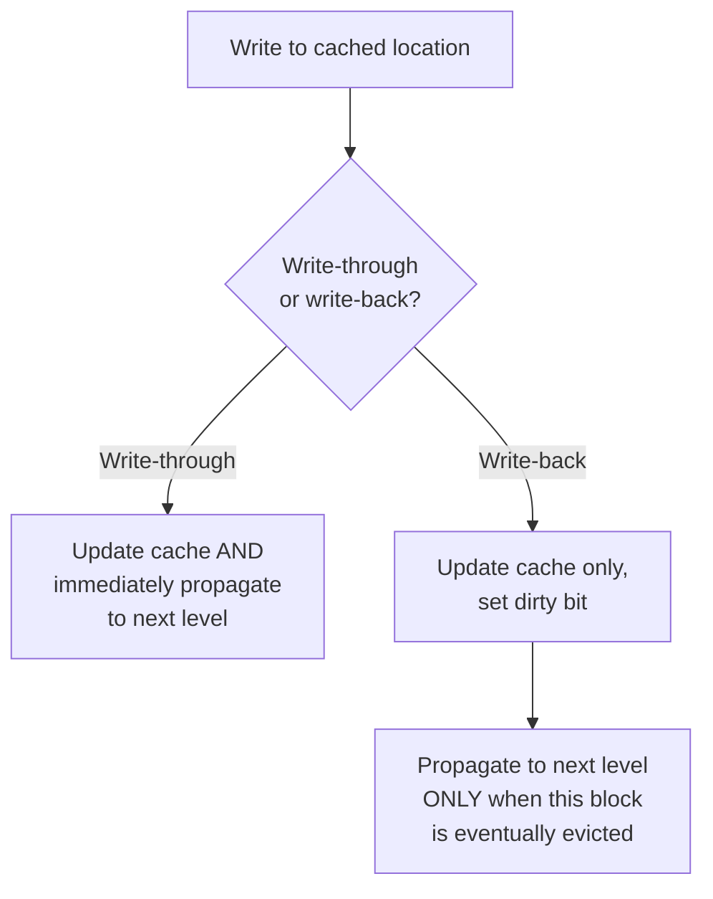

## Learning Objectives

- Distinguish write-through (every write immediately propagates to the next memory level) from write-back (writes accumulate in the cache and propagate only on eviction).
- Explain the dirty bit, and why write-back needs one but write-through does not.
- Distinguish write-allocate (a write miss brings the block into the cache) from no-write-allocate (a write miss goes directly to the next level, bypassing the cache).
- Compute the difference in memory traffic between write-through and write-back for a given access pattern.
- Explain, briefly and honestly, why this same dirty-line bookkeeping becomes the seed of a much harder problem once multiple caches share memory — previewed for the multicore cluster ahead.

## Context & Motivation

Every concept in this cluster so far — mapping, associativity, replacement — has quietly focused on reads. Writes raise a genuinely separate question: when a program writes to a memory location that's cached, does that new value need to reach the actual next level of memory (main memory, or a lower cache) right away, or can it simply sit in the cache for a while, with the "real" copy in memory left temporarily out of date?

This is not an abstract question — it directly determines how much traffic flows between cache levels, which in turn affects both performance and (as the multicore cluster ahead in this discipline will show) correctness once more than one cache can see the same memory. Bryant and O'Hallaron's *Computer Systems: A Programmer's Perspective* covers exactly this pair of policies as one of the last core pieces of single-cache mechanics, right before locality-driven code optimization — the same position this concept occupies in this cluster.

## Core Theory

### Write-through: keep the next level always up to date

Under **write-through**, every single write to a cached location is immediately propagated to the next level of the memory hierarchy as well as updating the cache. This keeps main memory (or the next cache level down) always perfectly consistent with what's in the cache — genuinely simple to reason about, since there is never any question of which copy is the "true" one. The cost is real: every write, even one to a location that gets overwritten again moments later, generates traffic to the slower level below, which can waste significant bandwidth for write-heavy code.

### Write-back: let writes accumulate, and mark the line dirty

Under **write-back**, a write only updates the cached copy; the next level down is left temporarily stale, and the cache marks that block with a **dirty bit** to record "this cached copy has been modified and no longer matches what's in memory." The stale copy in memory is only brought up to date when the dirty block is eventually evicted (at which point its current value must be written back before the slot can be reused for something else) — hence the name. This can dramatically reduce traffic to the next level for code that writes to the same location repeatedly before it's ever evicted, since only the *final* value, not every intermediate write, ever needs to actually reach memory.



### Write-allocate vs. no-write-allocate: what happens on a write miss

A separate, orthogonal question: what happens when a *write* misses — the address being written to isn't currently cached at all? **Write-allocate** treats a write miss like a read miss: fetch the block into the cache first, then apply the write to the now-cached copy (a natural pairing with write-back, since subsequent writes to that same block can then also accumulate in the cache before eventually propagating). **No-write-allocate** instead writes the new value directly to the next level down, without bringing the block into the cache at all (a natural pairing with write-through, since there's no ongoing benefit to caching a block that isn't also being read).

### Why this matters more once multiple caches exist

Everything in this concept has assumed exactly one cache watching one piece of memory. The dirty-bit bookkeeping developed here — knowing precisely which cached copy is the authoritative, most up-to-date one — is exactly the mechanism a multicore system's cache coherence protocol has to generalize across *several* caches simultaneously, each potentially holding its own copy of the same line. `cache-coherence-and-the-mesi-protocol`, later in this discipline's Multicore & Cache Coherence cluster, returns to this exact idea, extended to answer a harder question: not just "is my copy stale relative to memory," but "is my copy stale relative to some *other* core's cache."

## Worked Examples

### Example 1: Counting write-through vs. write-back traffic

A program writes to the same cached memory location 100 times in a row before that block is finally evicted.

```text
Write-through: 100 writes to this location = 100 separate writes propagated
               to the next memory level (one per write, unconditionally).

Write-back:    100 writes to this location = 0 writes propagated during
               those 100 writes (only the dirty bit gets set, once, on
               the first write); exactly 1 write propagated later, when
               the block is eventually evicted, carrying only the FINAL
               value.
```

Write-back reduces 100 potential memory-level writes down to 1 for this access pattern — a 100× reduction in this specific, admittedly favorable, case, illustrating why write-back is the dominant choice in most real processor cache designs.

### Example 2: A case where write-through's simplicity has a real advantage

A system needs a device (say, another processor, or an I/O controller) to be able to observe every write to a specific memory location as soon as it happens, with no delay. Under write-back, a write could sit in the cache, marked dirty, for an arbitrarily long time before eventually being evicted and propagated — the observing device would see a stale value in memory for that entire window. Under write-through, every write reaches memory immediately, so an external observer watching memory directly always sees an up-to-date value with no such delay. This is precisely why some real systems use write-through selectively for specific regions of memory used for device communication, even while using write-back for ordinary program data.

### Example 3: Combining write-allocate and no-write-allocate with the two write policies

```text
Policy combination                  Behavior on a write MISS
-----------------------------------  ---------------------------------------
Write-back + write-allocate          Fetch the block into the cache, apply
  (the common real pairing)          the write there, mark it dirty;
                                       subsequent writes to it accumulate
                                       in the cache as in Example 1.
Write-through + no-write-allocate    Write the new value directly to the
  (the other common real pairing)    next level, WITHOUT bringing the block
                                       into the cache at all — no benefit to
                                       caching a block whose writes propagate
                                       immediately anyway.
```

These two combinations are the ones seen almost exclusively in real designs — write-back naturally wants a resident, dirty-trackable copy (write-allocate); write-through has little reason to cache a block it's going to immediately write straight through regardless (no-write-allocate) — while the other two combinations (write-back + no-write-allocate, write-through + write-allocate) are logically possible but rarely used in practice, since they combine the cost of one policy with little of the corresponding benefit of the other.

## Common Misconceptions & Pitfalls

- **"Write-back is strictly better because it reduces traffic."** Example 2 shows a real, legitimate reason to prefer write-through's immediate consistency — for memory an external observer needs to see updated without delay, write-back's arbitrary staleness window is a genuine correctness problem, not just a performance detail.
- **"The dirty bit records whether a block has ever been written to, permanently."** It specifically tracks whether the *cached* copy currently differs from what's in the next memory level — it's cleared the moment the block is written back (or when the block is first freshly loaded from memory, since a freshly loaded copy is by definition not yet different from memory).
- **"Write-allocate and write-back are the same policy."** They answer different questions — write-back/write-through is about *when* a write propagates downward; write-allocate/no-write-allocate is about whether a write *miss* brings the block into the cache at all. Example 3 shows they're typically paired in specific combinations, but they are conceptually and mechanically separate decisions.
- **"This is only relevant to single-processor performance."** The dirty-bit and staleness concepts developed here are the direct conceptual seed of cache coherence, covered later in this discipline once multiple cores and multiple caches are introduced — understanding this single-cache version first is precisely what makes the multicore version legible rather than an unrelated new topic.

## Summary

Write-through propagates every write immediately to the next memory level, keeping it always consistent at the cost of extra traffic; write-back lets writes accumulate in the cache, marking a block dirty and propagating only on eventual eviction, dramatically reducing traffic for repeatedly written data at the cost of a real staleness window that matters when an external observer needs up-to-date memory. A separate axis, write-allocate versus no-write-allocate, decides whether a write miss brings the block into the cache at all, and in practice pairs naturally with write-back and write-through respectively. This exact dirty-line bookkeeping — tracking which cached copy is authoritative relative to memory — reappears, generalized to several simultaneous caches, in this discipline's later cache coherence concept. Having now covered how a cache is organized, replaced, and written to, the next concept ties hit time, miss rate, and miss penalty together into the single formula this whole cluster has been building toward: average memory access time.

## Documentation Links

- [Bryant & O'Hallaron — Computer Systems: A Programmer's Perspective (CS:APP)](https://csapp.cs.cmu.edu/) — Chapter 6 covers write-through, write-back, and the write-allocate/no-write-allocate pairing.
- [CMU 15-213 — Cache Memories Lecture](http://www.cs.cmu.edu/afs/cs/academic/class/15213-s14/www/lectures/11-cache-memories.pdf) — covers write policies as part of the same cache mechanics sequence.
