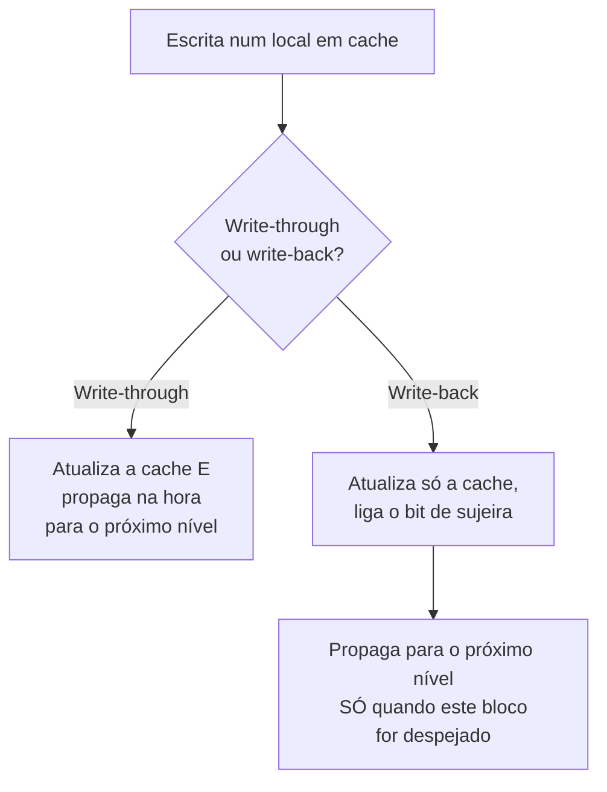

## Objetivos de Aprendizagem

- Distinguir o write-through (toda escrita se propaga imediatamente para o próximo nível de memória) do write-back (as escritas se acumulam na cache e só se propagam no despejo).
- Explicar o bit de sujeira (dirty bit) e por que o write-back precisa dele e o write-through não.
- Distinguir o write-allocate (uma falha de escrita traz o bloco para a cache) do no-write-allocate (uma falha de escrita vai direto para o próximo nível, contornando a cache).
- Calcular a diferença de tráfego de memória entre write-through e write-back para um dado padrão de acesso.
- Explicar, de forma breve e honesta, por que essa mesma contabilidade de linhas sujas vira a semente de um problema muito mais difícil quando várias caches compartilham a memória, antecipado para o bloco de multinúcleo mais adiante.

## Contexto e Motivação

Todo conceito deste bloco até aqui (mapeamento, associatividade, substituição) se concentrou silenciosamente nas leituras. As escritas levantam uma pergunta genuinamente separada: quando um programa escreve num local de memória que está em cache, esse valor novo precisa chegar ao próximo nível real de memória (memória principal, ou uma cache inferior) na hora, ou pode simplesmente ficar na cache por um tempo, com a cópia "real" na memória temporariamente desatualizada?

Essa não é uma pergunta abstrata: ela determina diretamente quanto tráfego flui entre os níveis de cache, o que por sua vez afeta tanto o desempenho quanto (como o bloco de multinúcleo mais adiante nesta disciplina vai mostrar) a correção, quando mais de uma cache consegue ver a mesma memória. O *Computer Systems: A Programmer's Perspective* de Bryant e O'Hallaron cobre exatamente esse par de políticas como uma das últimas peças centrais da mecânica de cache única, logo antes da otimização de código guiada pela localidade, a mesma posição que este conceito ocupa neste bloco.

## Teoria Central

### Write-through: manter o próximo nível sempre atualizado

No **write-through**, toda escrita num local em cache é propagada imediatamente para o próximo nível da hierarquia de memória, além de atualizar a cache. Isso mantém a memória principal (ou o próximo nível de cache abaixo) sempre perfeitamente consistente com o que está na cache, algo genuinamente simples de raciocinar, já que nunca há dúvida sobre qual cópia é a "verdadeira". O custo é real: toda escrita, mesmo uma num local que vai ser sobrescrito de novo momentos depois, gera tráfego para o nível mais lento de baixo, o que pode desperdiçar uma largura de banda significativa em código com muitas escritas.

### Write-back: deixar as escritas se acumularem e marcar a linha como suja

No **write-back**, uma escrita só atualiza a cópia em cache; o próximo nível abaixo fica temporariamente desatualizado, e a cache marca esse bloco com um **bit de sujeira** para registrar "esta cópia em cache foi modificada e não corresponde mais ao que está na memória". A cópia desatualizada na memória só é posta em dia quando o bloco sujo acaba sendo despejado (momento em que seu valor atual precisa ser escrito de volta antes que o slot possa ser reaproveitado para outra coisa), daí o nome. Isso pode reduzir drasticamente o tráfego para o próximo nível em código que escreve repetidamente no mesmo local antes de ele ser despejado, já que só o valor *final*, e não cada escrita intermediária, precisa de fato chegar à memória.



### Write-allocate vs. no-write-allocate: o que acontece numa falha de escrita

Uma pergunta separada e ortogonal: o que acontece quando uma *escrita* falha, ou seja, o endereço sendo escrito nem está na cache? O **write-allocate** trata uma falha de escrita como uma falha de leitura: busca primeiro o bloco para a cache e então aplica a escrita na cópia agora em cache (um par natural com o write-back, já que as escritas seguintes nesse mesmo bloco também podem se acumular na cache antes de acabar se propagando). O **no-write-allocate**, em vez disso, escreve o valor novo diretamente no próximo nível abaixo, sem trazer o bloco para a cache (um par natural com o write-through, já que não há benefício contínuo em guardar em cache um bloco que não está também sendo lido).

### Por que isso importa mais quando existem várias caches

Tudo neste conceito supôs exatamente uma cache observando um pedaço de memória. A contabilidade do bit de sujeira desenvolvida aqui (saber com precisão qual cópia em cache é a mais atualizada e tem autoridade) é exatamente o mecanismo que o protocolo de coerência de cache de um sistema multinúcleo precisa generalizar entre *várias* caches ao mesmo tempo, cada uma podendo guardar sua própria cópia da mesma linha. `cache-coherence-and-the-mesi-protocol`, mais adiante no bloco de Multinúcleo e Coerência de Cache desta disciplina, volta exatamente a essa ideia, estendida para responder uma pergunta mais difícil: não só "minha cópia está desatualizada em relação à memória", mas "minha cópia está desatualizada em relação à cache de algum *outro* núcleo".

## Exemplos Resolvidos

### Exemplo 1: contando o tráfego de write-through vs. write-back

Um programa escreve 100 vezes seguidas no mesmo local de memória em cache antes de esse bloco finalmente ser despejado.

```text
Write-through: 100 escritas neste local = 100 escritas separadas propagadas
               para o próximo nível de memória (uma por escrita, incondicionalmente).

Write-back:    100 escritas neste local = 0 escritas propagadas durante
               essas 100 escritas (só o bit de sujeira é ligado, uma vez, na
               primeira escrita); exatamente 1 escrita propagada depois, quando
               o bloco é finalmente despejado, levando só o valor
               FINAL.
```

O write-back reduz 100 possíveis escritas no nível da memória para 1 neste padrão de acesso, uma redução de 100× neste caso específico, reconhecidamente favorável, ilustrando por que o write-back é a escolha dominante na maioria dos projetos reais de cache de processadores.

### Exemplo 2: um caso em que a simplicidade do write-through tem uma vantagem real

Um sistema precisa que um dispositivo (digamos, outro processador, ou um controlador de E/S) consiga observar toda escrita num local específico de memória assim que ela acontece, sem atraso. No write-back, uma escrita poderia ficar na cache, marcada como suja, por um tempo arbitrariamente longo antes de acabar sendo despejada e propagada; o dispositivo observador veria um valor velho na memória durante toda essa janela. No write-through, toda escrita chega à memória na hora, então um observador externo que olha diretamente para a memória sempre vê um valor atualizado, sem esse atraso. É precisamente por isso que alguns sistemas reais usam o write-through de forma seletiva em regiões específicas de memória usadas para comunicação com dispositivos, mesmo usando write-back para os dados comuns do programa.

### Exemplo 3: combinando write-allocate e no-write-allocate com as duas políticas de escrita

```text
Combinação de políticas               Comportamento numa FALHA de escrita
-------------------------------------  -----------------------------------------
Write-back + write-allocate            Busca o bloco para a cache, aplica
  (o par real comum)                    a escrita ali, marca-o como sujo;
                                         as escritas seguintes nele se acumulam
                                         na cache, como no Exemplo 1.
Write-through + no-write-allocate      Escreve o valor novo diretamente no
  (o outro par real comum)              próximo nível, SEM trazer o bloco
                                         para a cache: não há benefício em
                                         guardar em cache um bloco cujas escritas
                                         se propagam na hora de qualquer jeito.
```

Essas duas combinações são as vistas quase exclusivamente em projetos reais: o write-back naturalmente quer uma cópia residente e com sujeira rastreável (write-allocate); o write-through tem pouco motivo para guardar em cache um bloco que vai escrever direto de qualquer jeito (no-write-allocate). As outras duas combinações (write-back + no-write-allocate, write-through + write-allocate) são logicamente possíveis, mas raramente usadas na prática, já que combinam o custo de uma política com pouco do benefício correspondente da outra.

## Equívocos Comuns e Armadilhas

- **"O write-back é estritamente melhor porque reduz o tráfego."** O Exemplo 2 mostra um motivo real e legítimo para preferir a consistência imediata do write-through: em memória que um observador externo precisa ver atualizada sem atraso, a janela de desatualização arbitrária do write-back é um problema genuíno de correção, e não só um detalhe de desempenho.
- **"O bit de sujeira registra, de forma permanente, se um bloco já foi escrito alguma vez."** Ele acompanha especificamente se a cópia *em cache* difere no momento do que está no próximo nível de memória; é limpo no momento em que o bloco é escrito de volta (ou quando o bloco é carregado do zero da memória, já que uma cópia recém-carregada, por definição, ainda não difere da memória).
- **"Write-allocate e write-back são a mesma política."** Elas respondem perguntas diferentes: write-back/write-through trata de *quando* uma escrita se propaga para baixo; write-allocate/no-write-allocate trata de se uma *falha* de escrita traz ou não o bloco para a cache. O Exemplo 3 mostra que normalmente são combinadas em pares específicos, mas são decisões conceitual e mecanicamente separadas.
- **"Isso só é relevante para o desempenho de um único processador."** Os conceitos de bit de sujeira e de desatualização desenvolvidos aqui são a semente conceitual direta da coerência de cache, vista mais adiante nesta disciplina quando vários núcleos e várias caches forem apresentados. Entender primeiro esta versão de cache única é precisamente o que torna legível a versão multinúcleo, em vez de um tema novo e sem relação.

## Resumo

O write-through propaga toda escrita na hora para o próximo nível de memória, mantendo-o sempre consistente ao custo de tráfego extra; o write-back deixa as escritas se acumularem na cache, marcando o bloco como sujo e propagando só no despejo, o que reduz drasticamente o tráfego de dados escritos repetidamente ao custo de uma janela real de desatualização, que importa quando um observador externo precisa de memória atualizada. Um eixo separado, write-allocate versus no-write-allocate, decide se uma falha de escrita traz ou não o bloco para a cache e, na prática, forma par naturalmente com o write-back e com o write-through, respectivamente. Exatamente essa contabilidade de linhas sujas (acompanhar qual cópia em cache tem autoridade em relação à memória) reaparece, generalizada para várias caches simultâneas, no conceito posterior de coerência de cache desta disciplina. Tendo coberto como uma cache é organizada, substituída e escrita, o próximo conceito amarra o tempo de acerto, a taxa de falha e a penalidade de falha na única fórmula em direção à qual todo este bloco vem construindo: o tempo médio de acesso à memória.

## Documentation Links

- [Bryant & O'Hallaron: Computer Systems: A Programmer's Perspective (CS:APP)](https://csapp.cs.cmu.edu/): o Capítulo 6 cobre write-through, write-back e o par write-allocate/no-write-allocate.
- [CMU 15-213: Cache Memories Lecture](http://www.cs.cmu.edu/afs/cs/academic/class/15213-s14/www/lectures/11-cache-memories.pdf): cobre as políticas de escrita como parte da mesma sequência de mecânica de cache.
