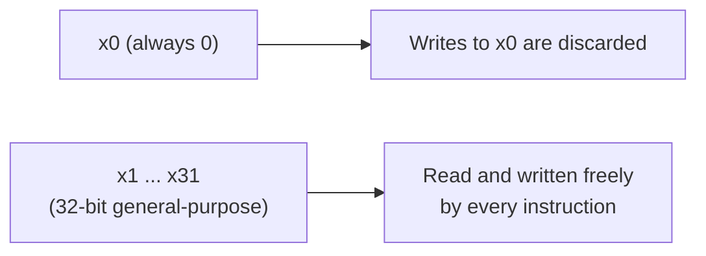
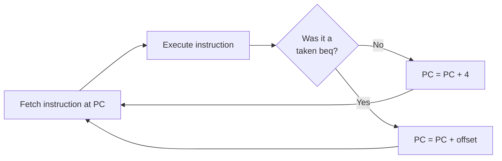

## Learning Objectives

- Describe the register file model of this discipline's teaching ISA: 32 registers x0–x31, each 32 bits wide, with x0 permanently wired to the value 0.
- Describe the memory model: byte-addressable memory holding 32-bit words, and the alignment convention for word accesses.
- Write correct assembly using each instruction group — R-type arithmetic/logic (`add`, `sub`, `and`, `or`, `slt`), `addi`, `lw`/`sw`, and `beq` — with exact mnemonic syntax and semantics.
- State the load-store principle precisely: arithmetic and logic instructions operate only on registers, and only `lw`/`sw` ever access memory.
- Explain why a small, regular instruction set is a deliberate RISC design choice rather than an oversight or limitation.
- Trace how the program counter advances through a short instruction sequence, including how `beq` redirects control flow.

## Context & Motivation

The previous concept established that an instruction set architecture is a contract: a fixed set of programmer-visible state, a fixed set of instructions with exact meanings, and a fixed way of encoding those instructions as bits, all specified independently of how any particular chip implements them. That concept stayed deliberately abstract, since its job was to explain why such a contract matters, not to write one down. This concept writes one down. Every datapath, control unit, and pipeline built for the remainder of this discipline exists to execute exactly the instruction set defined here, so the definitions in this file are load-bearing for everything that follows.

The instruction set introduced here is a small, deliberately reduced subset of RISC-V, the open, royalty-free instruction set architecture whose design Harris & Harris use as the running example throughout *Digital Design and Computer Architecture, RISC-V Edition*. It is not a toy invented for pedagogy alone — it is a genuine, if minimal, slice of a real, widely used ISA, chosen because a handful of instructions (arithmetic, a few logic operations, loads, stores, and one conditional branch) is already enough to write real programs, while remaining small enough that a complete hardware implementation — from register file to ALU to control logic — is achievable within this course. How this instruction set's bits are physically laid out inside a 32-bit word, and how an assembler translates the mnemonic text used here into those bits, is intentionally deferred to the next two concepts; this concept stays at the level of assembly syntax and precise semantics, which is exactly the level at which a compiler or an assembly-language programmer needs to reason.

Two design principles run through every instruction defined below. First, the register file is small and fixed, and every instruction that computes something uses only registers as inputs and outputs — never memory directly. Second, the only way data moves between memory and the register file is through two dedicated instructions, `lw` (load word) and `sw` (store word). This load-store architecture principle is not an incidental detail; it is a core reason RISC-style ISAs keep their hardware implementation simple, regular, and pipeline-friendly, as the remaining sections explain.

## Core Theory

### The register file: x0 through x31

This ISA provides 32 general-purpose registers, named `x0` through `x31`, each holding exactly one 32-bit word. Every instruction that reads or writes register operands reads or writes one or more of these 32 registers; there is no separate accumulator, no implicit stack register built into the arithmetic instructions, and no hidden state beyond the registers, memory, and the program counter.

One register is special: `x0` is hardwired to the constant value 0. It can be read like any other register, and always reads as 0, but any instruction that attempts to write a result into `x0` has no effect — the write is simply discarded. This might look like a wasted register, but a permanently zero register earns its place many times over: it gives the instruction set a cheap, uniform way to express constants and idioms without needing dedicated hardware or extra instructions. Comparing a register to zero, moving a register's value into another register, or materializing the constant zero can all be expressed by ordinary instructions that simply reference `x0` as an operand — no special-case instruction is required. This is a recurring RISC theme: rather than adding a new instruction for every convenient idiom, reuse the existing regular instruction set with a well-chosen operand.



### The memory model

Memory in this ISA is byte-addressable: every byte has its own unique address, and addresses are ordinary 32-bit unsigned numbers. Even though memory is addressed byte by byte, `lw` and `sw` always transfer a full 32-bit word (4 bytes) in a single access. A word access is expected to be aligned — its address should be a multiple of 4 — because a word occupies four consecutive byte addresses (a word stored at address 100 occupies bytes 100–103). Keeping word accesses aligned to multiples of 4 keeps the addressing logic simple and is standard practice in RISC-style ISAs; unaligned accesses, where supported at all, typically require extra hardware support this teaching ISA does not need to consider.

### R-type instructions: register-register arithmetic and logic

R-type instructions take two source registers as input and write a single result into a destination register; no memory access and no immediate constant is involved. This ISA defines five R-type instructions:

```text
add  rd, rs1, rs2     rd = rs1 + rs2                 (signed addition)
sub  rd, rs1, rs2     rd = rs1 - rs2                 (signed subtraction)
and  rd, rs1, rs2     rd = rs1 AND rs2               (bitwise AND, per bit)
or   rd, rs1, rs2     rd = rs1 OR rs2                (bitwise OR, per bit)
slt  rd, rs1, rs2     rd = (rs1 < rs2) ? 1 : 0       (signed comparison)
```

`add` and `sub` perform ordinary signed 32-bit addition and subtraction. `and` and `or` perform bitwise logic independently on each of the 32 bit positions — no carry or borrow between positions, unlike arithmetic. `slt` ("set less than") is a comparison instruction: it writes 1 into `rd` if `rs1` is strictly less than `rs2` (signed comparison), and 0 otherwise. `slt` matters because this ISA has no dedicated "less than" branch instruction — combining `slt` with `beq` (below) is how a compiler synthesizes richer conditional logic (less-than, greater-than, less-or-equal) out of this small instruction set, another example of the RISC philosophy of building complex behavior out of a few regular, composable pieces rather than adding a dedicated instruction for every case.

### I-type instruction: `addi`

`addi` behaves like `add`, except that its second operand is a constant (an "immediate") written directly into the instruction, rather than a value read from a second register:

```text
addi rd, rs1, imm     rd = rs1 + imm     (imm is a signed constant)
```

`addi` is the instruction most commonly used to load a small constant into a register: `addi rd, x0, imm` computes `x0 + imm`, and since `x0` always reads as 0, this simply places the constant `imm` into `rd` — a direct example of the zero register's usefulness described above. `addi` is also the standard way to increment or decrement a register by a fixed amount, for example inside a loop counter.

### Load and store: the only instructions that touch memory

Two instructions move data between memory and the register file, and they are the only instructions in this ISA that ever do so:

```text
lw  rd,  offset(rs1)     rd = Memory[rs1 + offset]        (load word)
sw  rs2, offset(rs1)     Memory[rs1 + offset] = rs2        (store word)
```

Both instructions compute a memory address the same way: take the value in the base register `rs1`, add the constant `offset`, and use the sum as a byte address into memory. `lw` reads the 32-bit word at that address and writes it into destination register `rd`. `sw` writes the 32-bit value held in `rs2` out to memory at that address; `sw`'s second register operand plays the role of a value being written, not a destination, the reverse of every other instruction so far. This base-plus-offset addressing is exactly how array indexing and structure field access are typically compiled: the base register holds a pointer or array address, and the offset selects a specific element or field relative to that base.

### The load-store principle

Notice that none of the R-type instructions or `addi` ever reads or writes memory — they only read and write registers. Only `lw` and `sw` touch memory, and neither performs any arithmetic beyond the address computation. This strict separation is the load-store architecture principle, a deliberate, defining choice of RISC-style instruction sets (as opposed to CISC-style sets, which commonly allow ordinary arithmetic instructions to read an operand directly from memory). Enforcing load-store discipline keeps every instruction's behavior simple and uniform: an instruction either does arithmetic on registers, or moves one word between a register and memory, never both at once. That uniformity is what makes it tractable to design a single, regular datapath capable of executing every instruction in the set, and it is why the datapath built later in this discipline can route data through the same register file and ALU for nearly every instruction, with memory access appearing as one clearly separated, optional stage.

### Branch: `beq` and control flow

```text
beq rs1, rs2, offset     if (rs1 == rs2) PC = PC + offset; else PC = PC + 4
```

`beq` ("branch if equal") compares `rs1` and `rs2` for equality. If equal, control transfers to a different instruction, computed as the current program counter plus the given offset; if not, execution proceeds to the next instruction in memory, exactly as every other instruction does.

### The program counter and sequential execution

The program counter (PC) is a register, not among `x0`–`x31`, that always holds the address of the instruction currently being fetched. Because every instruction in this ISA is exactly 4 bytes (32 bits) wide, ordinary sequential execution advances the PC by exactly 4 after every instruction that is not a taken branch: fetch the instruction at the current PC, execute it, set PC to PC + 4, repeat. `beq` is the sole exception defined so far: when its condition is true, it replaces this default PC + 4 update with PC + offset instead, redirecting execution elsewhere. This is precisely how loops and conditional statements compile down to this instruction set — a `beq` (or a sequence built from `slt` and `beq`) at the bottom or top of a loop body is what makes the program counter jump backward to repeat the loop, or forward to skip it.



## Worked Examples

### Example 1: Summing two array elements and storing the result

Suppose `x10` holds the base address of an integer array, and the goal is to compute `array[0] + array[1]` and store the result back into `array[2]`. Since each array element is a 32-bit word (4 bytes), element 0 is at offset 0, element 1 is at offset 4, and element 2 is at offset 8 from the base address:

```text
lw   x5, 0(x10)       ; x5 = array[0]
lw   x6, 4(x10)       ; x6 = array[1]
add  x7, x5, x6       ; x7 = x5 + x6 = array[0] + array[1]
sw   x7, 8(x10)       ; array[2] = x7
```

Each `lw` reads one word from memory into a register; `add` operates purely on registers, exactly as the load-store principle requires; the final `sw` writes the computed sum back to memory. No instruction here reads two memory operands at once or computes directly on a memory value — every value must first be loaded into a register before it can be used in arithmetic.

### Example 2: Tracing register and memory state line by line

Assume, before execution, `x10 = 100` (a base address), and memory contains the word `20` at address 100 and the word `7` at address 104. Trace the following instructions:

```text
lw   x5, 0(x10)
lw   x6, 4(x10)
sub  x7, x5, x6
addi x7, x7, 1
sw   x7, 8(x10)
```

```text
Instruction              x5    x6    x7    Memory[108]
------------------------ ----- ----- ----- -----------
(initial state)          ?     ?     ?     ?
lw   x5, 0(x10)           20   ?     ?     ?
lw   x6, 4(x10)           20   7     ?     ?
sub  x7, x5, x6           20   7     13    ?
addi x7, x7, 1            20   7     14    ?
sw   x7, 8(x10)           20   7     14    14
```

Each row shows the state immediately after the instruction on that row executes. The two `lw` instructions populate `x5` and `x6` from memory addresses 100 and 104 (base `x10 = 100` plus offsets 0 and 4). `sub` computes `20 - 7 = 13` into `x7`, using only register operands; `addi` then adds `1`, producing `14`, again purely register-to-register. Only the final `sw` touches memory, writing `14` from `x7` out to address 108 (base plus offset 8).

### Example 3: A small loop using `beq`

Suppose `x5` is a loop counter initialized to some positive value, `x0` is the always-zero register, and the goal is to decrement `x5` on each pass until it reaches zero, then fall through to the next instruction after the loop:

```text
loop:   beq  x5, x0, done      ; if x5 == 0, exit the loop
        addi x5, x5, -1        ; x5 = x5 - 1
        beq  x0, x0, loop      ; unconditional jump back to loop
done:   ...                    ; execution continues here once x5 == 0
```

The first `beq` compares the loop counter `x5` against the always-zero register `x0`; when equal (the counter has reached 0), it branches forward to `done`. If not, execution falls through to `addi`, which decrements the counter by one. The second `beq` compares `x0` against itself — always true — making it an unconditional jump back to `loop`, using this ISA's small instruction set to synthesize a loop without a dedicated "jump" instruction. This is the same technique noted with `slt`: a small, regular instruction set gets surprising expressive power by composing a handful of instructions rather than adding a special case for every idiom.

## Common Misconceptions & Pitfalls

- **"`sw rs2, offset(rs1)` stores into `rs2`."** It is the reverse: `rs2` is the source of the value being written to memory, and `rs1` plus `offset` computes the destination address. `sw` is the one instruction where the second register operand is a value being read, not a destination — easy to mix up if every other instruction's operand order is assumed to generalize.
- **"`add` and `sub` can read one operand directly from memory, like some other ISAs allow."** In this load-store ISA they cannot. Every R-type instruction operates exclusively on register operands; a value currently in memory must first be brought into a register with `lw` before any arithmetic or logic instruction can use it.
- **"Writing to `x0` sets it to a new value, at least temporarily."** Writes to `x0` are always discarded, with no exception; `x0` reads as 0 both before and after any instruction that names it as a destination — precisely why `x0` is safe to use as a "don't care" destination or as a source of the constant 0, as in Example 3's unconditional jump.
- **"`beq`'s offset is an absolute target address."** The offset is added to the current program counter, not treated as an absolute address; the same offset value would jump to a different target instruction depending on where the `beq` itself is located in memory.
- **"The program counter always simply advances by 4, with no exceptions."** That is only the default behavior for instructions other than a taken branch. A `beq` whose condition is true replaces the PC + 4 update with PC + offset instead.
- **"This small instruction set is too limited to express real programs."** A handful of arithmetic and logic instructions, `addi`, `lw`/`sw`, and `beq` are already enough, in combination, to express arbitrary integer computation, array access, and loops with conditional exit, exactly as the worked examples demonstrate; richer comparisons and even unconditional jumps are synthesized from this same small set rather than requiring dedicated instructions for every case.

## Summary

This concept fixed the concrete teaching ISA that the rest of this discipline builds toward: 32 registers `x0`–`x31` (with `x0` hardwired to 0), byte-addressable memory holding 32-bit words, and a small instruction set consisting of five R-type instructions (`add`, `sub`, `and`, `or`, `slt`), the register-immediate `addi`, the memory instructions `lw` and `sw` using base-plus-offset addressing, and the conditional branch `beq`, all under a strict load-store discipline in which only `lw` and `sw` ever touch memory. The program counter advances by 4 after every instruction by default, except after a taken `beq`, which redirects it to PC + offset — the mechanism that makes loops and conditionals possible with this small instruction set. How these instructions are laid out as concrete bit patterns inside a 32-bit word remains deliberately unspecified here; the next two concepts, instruction formats and addressing modes followed by assembly-to-machine-code translation, take exactly this assembly-level definition and pin down its precise binary encodings.

## Documentation Links

- [Harris & Harris — Digital Design and Computer Architecture, RISC-V Edition](https://shop.elsevier.com/books/digital-design-and-computer-architecture-risc-v-edition/harris/978-0-12-820064-3) — textbook whose RISC-V instruction set and load-store architecture principle this teaching ISA is directly modeled on.
- [ACM/IEEE CS2013 — Architecture and Organization Knowledge Area](https://csed.acm.org/knowledge-areas-architecture-and-organization-ar-cs2013-version/) — curriculum guidelines covering instruction sets, register files, and memory addressing as core Architecture and Organization topics.
