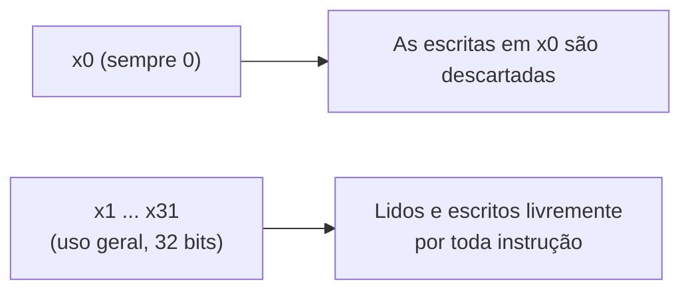
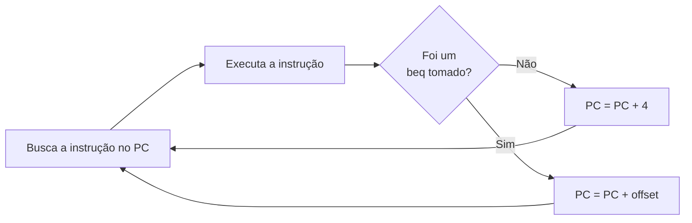

## Objetivos de Aprendizagem

- Descrever o modelo de banco de registradores da ISA didática desta disciplina: 32 registradores, de x0 a x31, cada um com 32 bits, com x0 ligado permanentemente ao valor 0.
- Descrever o modelo de memória: memória endereçável por byte que guarda palavras de 32 bits, e a convenção de alinhamento para acessos a palavras.
- Escrever assembly correto usando cada grupo de instruções (aritméticas/lógicas tipo R `add`, `sub`, `and`, `or`, `slt`; `addi`; `lw`/`sw`; e `beq`), com a sintaxe e a semântica exatas dos mnemônicos.
- Enunciar com precisão o princípio load-store: as instruções aritméticas e lógicas operam só sobre registradores, e só `lw`/`sw` acessam a memória.
- Explicar por que um conjunto de instruções pequeno e regular é uma escolha deliberada de projeto RISC, e não um descuido ou uma limitação.
- Rastrear como o contador de programa avança numa curta sequência de instruções, incluindo como `beq` redireciona o fluxo de controle.

## Contexto e Motivação

O conceito anterior estabeleceu que uma arquitetura de conjunto de instruções é um contrato: um conjunto fixo de estado visível ao programador, um conjunto fixo de instruções com significados exatos e uma forma fixa de codificar essas instruções como bits, tudo especificado independentemente de como um chip específico os implementa. Aquele conceito ficou deliberadamente abstrato, já que seu trabalho era explicar por que esse contrato importa, e não escrever um. Este conceito escreve um. Todo datapath, unidade de controle e pipeline construídos no restante desta disciplina existem para executar exatamente o conjunto de instruções definido aqui, então as definições deste arquivo sustentam tudo o que vem depois.

O conjunto de instruções apresentado aqui é um subconjunto pequeno e deliberadamente reduzido do RISC-V, a arquitetura de conjunto de instruções aberta e livre de royalties cujo projeto Harris & Harris usam como exemplo contínuo em todo o *Digital Design and Computer Architecture, RISC-V Edition*. Não é um brinquedo inventado só para fins didáticos: é uma fatia genuína, ainda que mínima, de uma ISA real e amplamente usada, escolhida porque um punhado de instruções (aritmética, algumas operações lógicas, loads, stores e um desvio condicional) já basta para escrever programas reais, continuando pequeno o bastante para que uma implementação de hardware completa (do banco de registradores à ULA e à lógica de controle) seja alcançável neste curso. Como os bits desse conjunto de instruções são dispostos fisicamente dentro de uma palavra de 32 bits, e como um montador traduz o texto de mnemônicos usado aqui nesses bits, fica intencionalmente para os próximos dois conceitos; este conceito fica no nível da sintaxe de assembly e da semântica precisa, que é exatamente o nível em que um compilador ou um programador de assembly precisa raciocinar.

Dois princípios de projeto atravessam toda instrução definida abaixo. Primeiro, o banco de registradores é pequeno e fixo, e toda instrução que calcula algo usa só registradores como entradas e saídas, nunca a memória diretamente. Segundo, a única forma de os dados se moverem entre a memória e o banco de registradores é por duas instruções dedicadas, `lw` (load word) e `sw` (store word). Esse princípio da arquitetura load-store não é um detalhe incidental; é um motivo central pelo qual as ISAs no estilo RISC mantêm sua implementação de hardware simples, regular e amigável ao pipeline, como as seções seguintes explicam.

## Teoria Central

### O banco de registradores: de x0 a x31

Esta ISA oferece 32 registradores de uso geral, chamados de `x0` a `x31`, cada um guardando exatamente uma palavra de 32 bits. Toda instrução que lê ou escreve operandos de registrador lê ou escreve um ou mais desses 32 registradores; não há acumulador separado, nem registrador de pilha implícito embutido nas instruções aritméticas, nem estado escondido além dos registradores, da memória e do contador de programa.

Um registrador é especial: `x0` é ligado fisicamente à constante 0. Ele pode ser lido como qualquer outro registrador, e sempre lê como 0, mas qualquer instrução que tente escrever um resultado em `x0` não tem efeito: a escrita é simplesmente descartada. Isso pode parecer um registrador desperdiçado, mas um registrador permanentemente zero se paga muitas vezes: ele dá ao conjunto de instruções uma forma barata e uniforme de expressar constantes e idiomas sem precisar de hardware dedicado nem de instruções extras. Comparar um registrador com zero, mover o valor de um registrador para outro ou materializar a constante zero podem todos ser expressos por instruções comuns que simplesmente referenciam `x0` como operando, sem precisar de nenhuma instrução de caso especial. É um tema recorrente do RISC: em vez de acrescentar uma instrução nova para todo idioma conveniente, reaproveitar o conjunto de instruções regular existente com um operando bem escolhido.



### O modelo de memória

A memória nesta ISA é endereçável por byte: todo byte tem seu próprio endereço único, e os endereços são números comuns de 32 bits sem sinal. Mesmo com a memória endereçada byte a byte, `lw` e `sw` sempre transferem uma palavra completa de 32 bits (4 bytes) num único acesso. Espera-se que um acesso a palavra esteja alinhado (seu endereço deve ser múltiplo de 4), porque uma palavra ocupa quatro endereços de byte consecutivos (uma palavra guardada no endereço 100 ocupa os bytes de 100 a 103). Manter os acessos a palavras alinhados em múltiplos de 4 mantém simples a lógica de endereçamento e é prática padrão em ISAs no estilo RISC; acessos desalinhados, quando são sequer suportados, normalmente exigem um suporte extra de hardware que esta ISA didática não precisa considerar.

### Instruções tipo R: aritmética e lógica de registrador para registrador

As instruções tipo R recebem dois registradores de origem como entrada e escrevem um único resultado num registrador de destino; não há acesso à memória nem constante imediata envolvidos. Esta ISA define cinco instruções tipo R:

```text
add  rd, rs1, rs2     rd = rs1 + rs2                 (soma com sinal)
sub  rd, rs1, rs2     rd = rs1 - rs2                 (subtração com sinal)
and  rd, rs1, rs2     rd = rs1 AND rs2               (AND bit a bit, por bit)
or   rd, rs1, rs2     rd = rs1 OR rs2                (OR bit a bit, por bit)
slt  rd, rs1, rs2     rd = (rs1 < rs2) ? 1 : 0       (comparação com sinal)
```

`add` e `sub` fazem soma e subtração comuns de 32 bits com sinal. `and` e `or` fazem lógica bit a bit, de forma independente em cada uma das 32 posições de bit, sem carry nem empréstimo entre posições, ao contrário da aritmética. `slt` ("set less than") é uma instrução de comparação: escreve 1 em `rd` se `rs1` for estritamente menor que `rs2` (comparação com sinal), e 0 caso contrário. `slt` importa porque esta ISA não tem uma instrução de desvio dedicada a "menor que": combinar `slt` com `beq` (abaixo) é como um compilador sintetiza lógica condicional mais rica (menor que, maior que, menor ou igual) a partir deste pequeno conjunto de instruções. É outro exemplo da filosofia RISC de construir comportamento complexo a partir de poucas peças regulares e combináveis, em vez de acrescentar uma instrução dedicada para cada caso.

### Instrução tipo I: `addi`

`addi` se comporta como `add`, exceto que seu segundo operando é uma constante (um "imediato") escrita diretamente na instrução, em vez de um valor lido de um segundo registrador:

```text
addi rd, rs1, imm     rd = rs1 + imm     (imm é uma constante com sinal)
```

`addi` é a instrução mais usada para carregar uma constante pequena num registrador: `addi rd, x0, imm` calcula `x0 + imm`, e como `x0` sempre lê como 0, isso simplesmente coloca a constante `imm` em `rd`, um exemplo direto da utilidade do registrador zero descrita acima. `addi` também é a forma padrão de incrementar ou decrementar um registrador por uma quantidade fixa, por exemplo dentro do contador de um laço.

### Load e store: as únicas instruções que tocam a memória

Duas instruções movem dados entre a memória e o banco de registradores, e são as únicas instruções desta ISA que fazem isso:

```text
lw  rd,  offset(rs1)     rd = Memória[rs1 + offset]        (load word)
sw  rs2, offset(rs1)     Memória[rs1 + offset] = rs2        (store word)
```

As duas instruções calculam um endereço de memória do mesmo jeito: pegam o valor do registrador base `rs1`, somam a constante `offset` e usam a soma como endereço de byte na memória. `lw` lê a palavra de 32 bits nesse endereço e a escreve no registrador de destino `rd`. `sw` escreve o valor de 32 bits guardado em `rs2` na memória, nesse endereço; o segundo operando de registrador de `sw` faz o papel de um valor sendo escrito, e não de um destino, o inverso de todas as outras instruções até aqui. Esse endereçamento base mais deslocamento é exatamente como a indexação de arrays e o acesso a campos de estruturas costumam ser compilados: o registrador base guarda um ponteiro ou o endereço de um array, e o deslocamento seleciona um elemento ou campo específico em relação a essa base.

### O princípio load-store

Repare que nenhuma das instruções tipo R nem `addi` jamais lê ou escreve a memória: elas só leem e escrevem registradores. Só `lw` e `sw` tocam a memória, e nenhuma das duas faz aritmética além do cálculo do endereço. Essa separação estrita é o princípio da arquitetura load-store, uma escolha deliberada e definidora dos conjuntos de instruções no estilo RISC (em oposição aos conjuntos no estilo CISC, que comumente permitem que instruções aritméticas comuns leiam um operando diretamente da memória). Impor a disciplina load-store mantém simples e uniforme o comportamento de toda instrução: uma instrução ou faz aritmética sobre registradores, ou move uma palavra entre um registrador e a memória, nunca as duas coisas ao mesmo tempo. Essa uniformidade é o que torna tratável projetar um único datapath regular capaz de executar toda instrução do conjunto, e é por isso que o datapath construído mais adiante nesta disciplina consegue encaminhar os dados pelo mesmo banco de registradores e pela mesma ULA para quase toda instrução, com o acesso à memória aparecendo como um estágio opcional e claramente separado.

### Desvio: `beq` e o fluxo de controle

```text
beq rs1, rs2, offset     se (rs1 == rs2) PC = PC + offset; senão PC = PC + 4
```

`beq` ("branch if equal") compara `rs1` e `rs2` quanto à igualdade. Se forem iguais, o controle é transferido para outra instrução, calculada como o contador de programa atual mais o deslocamento dado; se não, a execução segue para a próxima instrução na memória, exatamente como toda outra instrução faz.

### O contador de programa e a execução sequencial

O contador de programa (PC) é um registrador, fora dos de `x0` a `x31`, que sempre guarda o endereço da instrução sendo buscada no momento. Como toda instrução desta ISA tem exatamente 4 bytes (32 bits), a execução sequencial comum avança o PC em exatamente 4 depois de toda instrução que não seja um desvio tomado: buscar a instrução no PC atual, executá-la, fazer PC = PC + 4, repetir. `beq` é a única exceção definida até aqui: quando sua condição é verdadeira, ela substitui essa atualização padrão PC + 4 por PC + offset, redirecionando a execução para outro lugar. É precisamente assim que laços e comandos condicionais são compilados para este conjunto de instruções: um `beq` (ou uma sequência construída com `slt` e `beq`) no fim ou no início do corpo de um laço é o que faz o contador de programa saltar para trás para repetir o laço, ou para a frente para pulá-lo.



## Exemplos Resolvidos

### Exemplo 1: somando dois elementos de um array e guardando o resultado

Suponha que `x10` guarde o endereço base de um array de inteiros e que o objetivo seja calcular `array[0] + array[1]` e guardar o resultado de volta em `array[2]`. Como cada elemento do array é uma palavra de 32 bits (4 bytes), o elemento 0 está no deslocamento 0, o elemento 1 no deslocamento 4 e o elemento 2 no deslocamento 8 a partir do endereço base:

```text
lw   x5, 0(x10)       ; x5 = array[0]
lw   x6, 4(x10)       ; x6 = array[1]
add  x7, x5, x6       ; x7 = x5 + x6 = array[0] + array[1]
sw   x7, 8(x10)       ; array[2] = x7
```

Cada `lw` lê uma palavra da memória para um registrador; `add` opera puramente sobre registradores, exatamente como o princípio load-store exige; o `sw` final escreve a soma calculada de volta na memória. Nenhuma instrução aqui lê dois operandos de memória ao mesmo tempo nem calcula diretamente sobre um valor da memória: todo valor precisa primeiro ser carregado num registrador antes de poder ser usado em aritmética.

### Exemplo 2: rastreando o estado dos registradores e da memória linha por linha

Suponha que, antes da execução, `x10 = 100` (um endereço base) e que a memória contenha a palavra `20` no endereço 100 e a palavra `7` no endereço 104. Rastreie as seguintes instruções:

```text
lw   x5, 0(x10)
lw   x6, 4(x10)
sub  x7, x5, x6
addi x7, x7, 1
sw   x7, 8(x10)
```

```text
Instrução                x5    x6    x7    Memória[108]
------------------------ ----- ----- ----- ------------
(estado inicial)         ?     ?     ?     ?
lw   x5, 0(x10)           20   ?     ?     ?
lw   x6, 4(x10)           20   7     ?     ?
sub  x7, x5, x6           20   7     13    ?
addi x7, x7, 1            20   7     14    ?
sw   x7, 8(x10)           20   7     14    14
```

Cada linha mostra o estado logo depois de a instrução daquela linha executar. As duas instruções `lw` preenchem `x5` e `x6` a partir dos endereços de memória 100 e 104 (base `x10 = 100` mais os deslocamentos 0 e 4). `sub` calcula `20 - 7 = 13` em `x7`, usando só operandos de registrador; `addi` então soma `1`, produzindo `14`, de novo puramente de registrador para registrador. Só o `sw` final toca a memória, escrevendo `14`, de `x7`, no endereço 108 (base mais deslocamento 8).

### Exemplo 3: um pequeno laço usando `beq`

Suponha que `x5` seja um contador de laço inicializado com algum valor positivo, que `x0` seja o registrador sempre zero, e que o objetivo seja decrementar `x5` a cada passada até ele chegar a zero e então seguir para a próxima instrução depois do laço:

```text
loop:   beq  x5, x0, done      ; se x5 == 0, sai do laço
        addi x5, x5, -1        ; x5 = x5 - 1
        beq  x0, x0, loop      ; salto incondicional de volta para loop
done:   ...                    ; a execução continua aqui quando x5 == 0
```

O primeiro `beq` compara o contador do laço `x5` com o registrador sempre zero `x0`; quando são iguais (o contador chegou a 0), ele desvia para a frente, até `done`. Se não, a execução segue para `addi`, que decrementa o contador em um. O segundo `beq` compara `x0` com ele mesmo (sempre verdadeiro), tornando-o um salto incondicional de volta para `loop`, usando o pequeno conjunto de instruções desta ISA para sintetizar um laço sem uma instrução dedicada de "salto". É a mesma técnica observada com `slt`: um conjunto de instruções pequeno e regular ganha um poder expressivo surpreendente combinando um punhado de instruções, em vez de acrescentar um caso especial para cada idioma.

## Equívocos Comuns e Armadilhas

- **"`sw rs2, offset(rs1)` guarda em `rs2`."** É o inverso: `rs2` é a origem do valor sendo escrito na memória, e `rs1` mais `offset` calcula o endereço de destino. `sw` é a única instrução em que o segundo operando de registrador é um valor sendo lido, e não um destino; fácil de confundir se a ordem dos operandos de todas as outras instruções for considerada geral.
- **"`add` e `sub` podem ler um operando diretamente da memória, como algumas outras ISAs permitem."** Nesta ISA load-store, não podem. Toda instrução tipo R opera exclusivamente sobre operandos de registrador; um valor que está na memória precisa primeiro ser trazido para um registrador com `lw` antes que qualquer instrução aritmética ou lógica possa usá-lo.
- **"Escrever em `x0` muda seu valor, pelo menos temporariamente."** As escritas em `x0` são sempre descartadas, sem exceção; `x0` lê como 0 tanto antes quanto depois de qualquer instrução que o nomeie como destino, justamente o motivo pelo qual `x0` é seguro de usar como destino "tanto faz" ou como fonte da constante 0, como no salto incondicional do Exemplo 3.
- **"O deslocamento de `beq` é um endereço de destino absoluto."** O deslocamento é somado ao contador de programa atual, e não tratado como endereço absoluto; o mesmo valor de deslocamento saltaria para uma instrução de destino diferente dependendo de onde o próprio `beq` está na memória.
- **"O contador de programa sempre simplesmente avança 4, sem exceções."** Esse é só o comportamento padrão para instruções que não sejam um desvio tomado. Um `beq` cuja condição seja verdadeira substitui a atualização PC + 4 por PC + offset.
- **"Este pequeno conjunto de instruções é limitado demais para expressar programas reais."** Um punhado de instruções aritméticas e lógicas, `addi`, `lw`/`sw` e `beq` já bastam, combinados, para expressar computação inteira arbitrária, acesso a arrays e laços com saída condicional, exatamente como os exemplos resolvidos demonstram; comparações mais ricas e até saltos incondicionais são sintetizados a partir desse mesmo pequeno conjunto, em vez de exigirem instruções dedicadas para cada caso.

## Resumo

Este conceito fixou a ISA didática concreta em direção à qual o resto desta disciplina constrói: 32 registradores, de `x0` a `x31` (com `x0` ligado fisicamente a 0), memória endereçável por byte que guarda palavras de 32 bits, e um pequeno conjunto de instruções formado por cinco instruções tipo R (`add`, `sub`, `and`, `or`, `slt`), a instrução registrador-imediato `addi`, as instruções de memória `lw` e `sw` com endereçamento base mais deslocamento e o desvio condicional `beq`, tudo sob uma disciplina load-store estrita em que só `lw` e `sw` tocam a memória. O contador de programa avança 4 depois de toda instrução por padrão, exceto depois de um `beq` tomado, que o redireciona para PC + offset, o mecanismo que torna possíveis os laços e as condicionais com este pequeno conjunto de instruções. Como essas instruções são dispostas como padrões de bits concretos dentro de uma palavra de 32 bits continua deliberadamente não especificado aqui; os próximos dois conceitos, formatos de instrução e modos de endereçamento e depois a tradução de assembly para código de máquina, pegam exatamente esta definição no nível do assembly e fixam suas codificações binárias precisas.

## Documentation Links

- [Harris & Harris: Digital Design and Computer Architecture, RISC-V Edition](https://shop.elsevier.com/books/digital-design-and-computer-architecture-risc-v-edition/harris/978-0-12-820064-3): livro-texto em cujo conjunto de instruções RISC-V e princípio da arquitetura load-store esta ISA didática se baseia diretamente.
- [ACM/IEEE CS2013: Architecture and Organization Knowledge Area](https://csed.acm.org/knowledge-areas-architecture-and-organization-ar-cs2013-version/): diretrizes curriculares que cobrem conjuntos de instruções, bancos de registradores e endereçamento de memória como temas centrais de Architecture and Organization.
