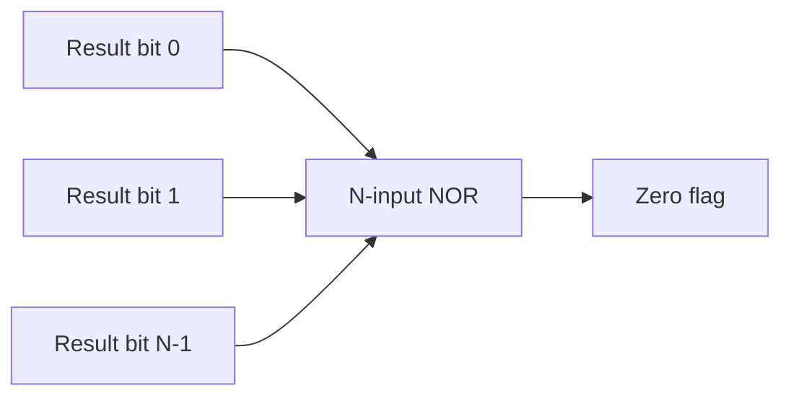

## Learning Objectives

- Read a small ALU-control encoding table and state which control bits select AND, OR, add, subtract, and SLT.
- Define each of the four standard ALU status flags — Zero, Negative, Carry, Overflow — and state exactly which signal inside the ALU produces each one.
- Explain the distinction between the Carry flag (unsigned wraparound) and the Overflow flag (signed wraparound), and give a computation where the two flags disagree.
- Compute all four flags by hand for a specific N-bit addition or subtraction, given only the two operands and the operation selected.
- Describe how a CPU's branch logic — for example, `beq` or `blt` — reads one or more of these flags after an ALU subtraction to decide whether to take a branch.

## Context & Motivation

The previous concept designed an ALU as a circuit that computes several candidate results in parallel and uses a multiplexer, driven by ALU-control lines, to select one of them as output. That design left two things informal: exactly which bit patterns on the control lines correspond to which operation, and what the ALU tells the rest of the CPU beyond the numeric result itself. Both gaps matter enormously in practice. A control unit (the subject of a later concept in this curriculum) has to encode "please compute A − B" as some specific pattern of control bits, and that pattern needs to be fixed and documented, not left as "whichever slice happens to be wired to the adder." And a numeric result alone is not enough information for a CPU to make decisions — comparing two values, testing whether a computation produced zero, or detecting that a signed computation silently produced a wrong answer due to overflow, all require the ALU to expose extra one-bit signals, conventionally called status flags, alongside its main result.

These flags are not a cosmetic afterthought bolted onto the ALU; they are the entire mechanism by which a CPU's control logic implements conditional branching. When a program executes something like `if (a == b) goto L`, the compiled machine code does not contain a general-purpose equality test — it contains an ALU subtraction of a and b, immediately followed by a branch instruction that inspects the Zero flag the subtraction produced. If a − b is exactly 0, the two values were equal, and the branch is taken; nothing about "equality" is computed independently of that flag. RISC-V, MIPS, and the Hack platform in Nand2Tetris each wire the exact same idea into their branch logic, differing only in encoding details, and this pattern is exactly why the ALU flags are covered as their own concept, immediately preceding the ISA (concept 20) and the control unit (concept 25) that consume them.

The subtlest and most commonly confused part of this material is the difference between the Carry flag and the Overflow flag. Both are one-bit signals produced by the same adder inside the ALU, and both are described loosely as "the arithmetic didn't fit" — but they answer two genuinely different questions, meaningful under two different, mutually exclusive interpretations of the same bit pattern. Carry answers "did an unsigned computation wrap around 2ᴺ?" while Overflow answers "did a signed, two's-complement computation produce a mathematically wrong result because it wrapped around the representable signed range?" A single addition can set one of these flags without the other, and conflating them is one of the most persistent sources of subtle arithmetic bugs in low-level programming — this concept works through concrete cases where they diverge.

## Core Theory

### The ALU-control encoding

Building on the previous concept's 1-bit slice (which used a small control code to select among AND, OR, and the adder's Sum), a fully populated ALU control scheme also needs a Binvert line (to select add vs. subtract) and a way to select SLT. A representative encoding, in the spirit of the schemes used in Nand2Tetris and in MIT 6.004's Beta ALU, looks like this:

| ALU control | Binvert | Operation | Result |
|---|---|---|---|
| 000 | 0 | AND | A · B |
| 001 | 0 | OR | A + B (bitwise OR) |
| 010 | 0 | ADD | A + B (arithmetic) |
| 110 | 1 | SUB | A − B |
| 111 | 1 | SLT | 1 if A < B else 0 |

The exact bit patterns are a design choice made by whoever defines the ISA — what matters structurally is that a small, fixed-width control field is decoded, elsewhere in the CPU (by the control unit), into the Binvert and Operation/mux-select signals the ALU's internals actually consume. This table is the concrete artifact a control unit's logic ultimately produces, one entry per distinct instruction the ISA supports.

### The Zero flag

The Zero flag is 1 exactly when every bit of the ALU's result is 0. It is computed by feeding all N result bits into a single N-input NOR gate (equivalently, OR every result bit together, then invert): if any single bit of the result is 1, the OR output is 1 and the NOR output — the Zero flag — is 0; only when all N bits are simultaneously 0 does the NOR produce 1. This is a purely combinational, zero-additional-arithmetic computation performed directly on the already-computed result bits, entirely independent of which operation produced them.



### The Negative (sign) flag

The Negative flag is simply the result's most-significant bit, copied out directly with no extra logic. Under two's-complement representation, the most-significant bit is defined as the sign bit — 1 for negative values, 0 for non-negative values — so this flag literally reports whether the ALU's result, interpreted as signed, is negative. No separate sign-detection circuit exists; the flag is a direct tap of a bit the ALU had already computed as part of its ordinary result.

### The Carry flag

The Carry flag is the carry-out of the most-significant bit position of the ALU's internal adder — the same Cout produced by the top slice of the adder chain from the two preceding concepts. For addition, Carry = 1 means the true, unsigned sum equals or exceeds 2ᴺ (unsigned wraparound). For subtraction implemented as add-the-complement, the adder's raw final Cout is inverted relative to an intuitive "borrow" bit (flagged when the adder was introduced) — many real ALUs re-invert this bit so that, for subtraction, Carry = 1 conventionally means "no borrow occurred," i.e., A ≥ B unsigned. Either way, Carry is meaningful only for the unsigned interpretation; it says nothing correct, by itself, about signed overflow.

### The Overflow flag

The Overflow flag detects signed, two's-complement wraparound, and it is emphatically not the same signal as Carry. The standard, minimal-hardware definition compares the carry generated going into the sign-bit (most-significant-bit) position against the carry generated coming out of that same position:

```
Overflow = Cin_msb ⊕ Cout_msb
```

Equivalently — and this is the intuitive version worth memorizing — signed overflow can only happen when two operands of the same sign produce a result of the opposite sign: adding two positives cannot mathematically yield a negative, and adding two negatives cannot mathematically yield a non-negative, so either outcome, if it occurs, proves the N-bit result is wrong and the true mathematical sum simply did not fit in N bits. Two operands of differing signs can never cause signed overflow when added, because their true sum's magnitude is bounded by the larger operand's magnitude, which already fit in N bits.

| Cin into MSB | Cout out of MSB | Overflow |
|---|---|---|
| 0 | 0 | 0 |
| 0 | 1 | 1 |
| 1 | 0 | 1 |
| 1 | 1 | 0 |

### Carry versus Overflow: two different questions about the same bits

Both flags are derived from the identical adder hardware and the identical bit pattern the adder produces, yet they answer different questions under different assumed representations of the operands:

| Flag | Question answered | Representation assumed | Derived from |
|---|---|---|---|
| Carry | Did the unsigned result wrap around 2ᴺ? | Unsigned | Cout of the MSB |
| Overflow | Did the signed result wrap around the representable signed range? | Two's-complement signed | Cin vs. Cout of the MSB |

Because the two flags are computed from related but distinct signals (Cout alone, versus Cin-vs-Cout of the same bit position), it is entirely possible — and, as Worked Example 3 shows concretely, common — for exactly one of the two flags to be set on a given computation while the other is clear. Treating the bit pattern's correctness as a single yes/no question, rather than two separate representation-dependent questions, is the single most consequential misunderstanding this concept addresses.

### How branch instructions consume these flags

A CPU's control unit (a later concept in this curriculum) decodes a conditional branch's opcode by setting the ALU's control lines to subtract the two compared operands, then routes one or more resulting flags into the branch-decision logic — no separate comparison is ever computed. `beq` ("branch if equal") computes A − B and takes the branch iff Zero = 1. `blt` ("branch if less than") also computes A − B, then reads Negative (validated against Overflow, or via an SLT-style result as in the previous concept) to decide whether A was less than B. The flag, not a freshly computed comparison, is the entire mechanism.

## Worked Examples

### Example 1: All four flags for an 8-bit addition

Goal: compute `A = 1000 0000` (128 unsigned, or −128 signed) plus `B = 1111 1111` (255 unsigned, or −1 signed) on an 8-bit ALU configured for ADD, and report all four flags.

Step 1 — Add bit by bit (ripple-carry, Cin=0 at bit 0):

```
  1000 0000
+ 1111 1111
```

Bits 0–6: each position has a=0, b=1, incoming Cin=0, giving Sum=1, Cout=0. Bit 7 (MSB): a=1, b=1, Cin=0, giving Sum=0, Cout=1.

Step 2 — Assemble the result: `0111 1111` = 127. Final Cout (out of bit 7) = 1.

Step 3 — Zero flag: the result has multiple 1 bits, so NOR of all result bits = 0. Zero = 0.

Step 4 — Negative flag: the result's MSB is 0. Negative = 0.

Step 5 — Carry flag: Cout of the MSB = 1, so Carry = 1. Interpreted as unsigned: 128 + 255 = 383, which exceeds the 8-bit unsigned range (0–255); 383 − 256 = 127, matching the wrapped result. Carry correctly flags unsigned wraparound.

Step 6 — Overflow flag: Cin into the MSB (i.e., Cout of bit 6) = 0; Cout out of the MSB = 1. Overflow = 0 ⊕ 1 = 1. Interpreted as signed: −128 + (−1) = −129, which does not fit in the signed 8-bit range (−128 to 127); the ALU's actual signed result, reading `0111 1111` as signed, is +127 — visibly wrong, exactly as Overflow=1 warns. Cross-check with the same-sign rule: both operands are negative (MSB=1 for both), but the result's MSB is 0 (non-negative) — two negatives producing a non-negative result is precisely the same-sign-in, opposite-sign-out signature of signed overflow.

### Example 2: Flags for A − B with A < B, and how beq/blt use them

Goal: compute `A = 0011` (3) minus `B = 0110` (6) on a 4-bit ALU (Binvert=1, Cin=1 at bit 0), and show how `beq` and `blt` would use the resulting flags.

Step 1 — Invert B: B=0110, ¬B=1001. Compute A + ¬B + 1.

Step 2 (bit 0): a=1, b′=1, Cin=1. Sum=1⊕1⊕1=1. Cout=(1·1)+(1·1)+(1·1)=1.

Step 3 (bit 1): a=1, b′=0, Cin=1. Sum=1⊕0⊕1=0. Cout=(1·0)+(1·1)+(0·1)=1.

Step 4 (bit 2): a=0, b′=0, Cin=1. Sum=0⊕0⊕1=1. Cout=(0·0)+(0·1)+(0·1)=0.

Step 5 (bit 3, MSB): a=0, b′=1, Cin=0. Sum=0⊕1⊕0=1. Cout=(0·1)+(0·0)+(1·0)=0.

Step 6 — Assemble the result: `1101` = −3 in two's complement (MSB=1). Cross-check: 3 − 6 = −3. Matches.

Step 7 — Zero flag: result bits are not all 0, so Zero = 0. Correctly signals A ≠ B (3 ≠ 6).

Step 8 — Negative flag: MSB of result = 1, so Negative = 1. Correctly signals the signed result is negative, i.e., A − B < 0, i.e., A < B.

Step 9 — Overflow flag: Cin into MSB (Cout of bit 2) = 0; Cout out of MSB = 0. Overflow = 0 ⊕ 0 = 0. No signed overflow occurred, so the Negative flag can be trusted as an accurate signed comparison here.

Step 10 — `beq`/`blt`: `beq` inspects Zero; since Zero = 0, no branch — correct, 3 ≠ 6. `blt` inspects Negative with Overflow clear; since Negative = 1 and Overflow = 0, the branch is taken — correct, 3 < 6.

### Example 3: A case where Carry is set but Overflow is not, and vice versa

Goal: exhibit one 4-bit addition where Carry = 1 but Overflow = 0, and one where Overflow = 1 but Carry = 0, proving the two flags are genuinely different signals.

**Case 1 — Carry=1, Overflow=0.** Compute `A = 1111` (15 unsigned / −1 signed) plus `B = 0001` (1, both interpretations agree).

Bit 0: a=1,b=1,Cin=0. Sum=1⊕1⊕0=0, Cout=(1·1)+(1·0)+(1·0)=1. Bit 1: a=1,b=0,Cin=1. Sum=1⊕0⊕1=0, Cout=(1·0)+(1·1)+(0·1)=1. Bit 2: a=1,b=0,Cin=1. Sum=0, Cout=1 (identical to bit 1). Bit 3 (MSB): a=1,b=0,Cin=1. Sum=1⊕0⊕1=0, Cout=(1·0)+(1·1)+(0·1)=1.

Result = `0000`, final Cout = 1. Carry = 1: as unsigned, 15+1=16 exceeds the 4-bit range (0–15) — the true sum wrapped to 0, correctly flagged. Overflow = Cin into MSB (Cout of bit 2 = 1) ⊕ Cout out of MSB (1) = 0. As signed, A=−1 and B=1, so −1+1=0 exactly — the signed result is completely correct, no wraparound. Carry=1 but Overflow=0: the unsigned interpretation wrapped while the signed interpretation did not, because the two representations assign different meanings to the identical bit pattern `1111`.

**Case 2 — Overflow=1, Carry=0.** Compute `A = 0111` (7) plus `B = 0001` (1), both positive signed values.

Bit 0: 1+1+0=Sum 0,Cout 1. Bit 1: 1+0+1=Sum 0,Cout 1. Bit 2: 1+0+1=Sum 0,Cout 1. Bit 3: 0+0+1=Sum 1,Cout 0.

Result=`1000` = −8 signed. Carry = 0: as unsigned, 7+1=8 fits in the 4-bit range (0–15) — no unsigned wraparound. Overflow: Cin into MSB (Cout of bit 2)=1, Cout out of MSB=0, Overflow=1 — correctly flags that two positive operands (7 and 1) produced a negative result (−8), mathematically impossible, proving overflow. Overflow=1 while Carry=0: the mirror case, confirming the two flags track independent conditions on the same adder output.

## Common Misconceptions & Pitfalls

- **"Carry and Overflow are two names for the same event."** They are computed from related but distinct signals — Carry is simply the adder's final Cout, while Overflow compares Cin against Cout at the sign-bit position — and Worked Example 3 exhibits computations where one flag is set while the other is clear, in both directions.
- **"If the Overflow flag is 0, the addition definitely didn't wrap around."** Overflow=0 only guarantees no signed wraparound; the same computation can still have Carry=1, meaning it wrapped around when the operands are interpreted as unsigned. Which flag is "the right one to check" depends entirely on whether the program is treating its operands as signed or unsigned — the ALU computes both regardless.
- **"The Zero flag requires computing an equality check separately from the subtraction."** It does not — Zero is produced by NOR-ing together the bits of a result the ALU had to compute anyway for the requested operation (typically a subtraction, for a comparison); no separate equality circuit exists, which is exactly why `beq` is implemented as "subtract, then look at Zero," not as a dedicated equals instruction.
- **"Signed overflow can happen when adding two numbers of different signs."** It cannot: the true sum of a positive and a negative number always has magnitude bounded by the larger operand's magnitude, which already fit in N bits, so overflow is only possible when both operands share the same sign and the result's sign differs from theirs.
- **"The Negative flag alone tells you whether A < B after a subtraction."** It only does so reliably when Overflow is 0. If a subtraction overflows, the result's sign bit can be misleading — correct signed less-than logic must check Negative together with Overflow (or use a dedicated SLT result, as in the previous concept), not Negative in isolation.

## Summary

A fully specified ALU exposes a small ALU-control encoding — a fixed table mapping control-bit patterns to AND, OR, add, subtract, and SLT — plus four one-bit status flags computed alongside its main result: Zero (a NOR of every result bit), Negative (the result's sign bit, tapped directly), Carry (the adder's final carry-out, meaningful for unsigned interpretation), and Overflow (Cin XOR Cout at the sign-bit position, meaningful for signed interpretation, and equivalently detectable as two same-signed operands producing an opposite-signed result). Carry and Overflow are frequently conflated but answer genuinely different questions about the identical bit pattern, and a single computation can set either flag without the other. A CPU's branch logic never recomputes "equal" or "less than" independently — `beq` reads the Zero flag and `blt` reads the Negative flag (validated against Overflow) after the control unit configures the ALU to subtract the compared operands, making these four flags the entire interface between raw arithmetic and program control flow. With the ALU's operations, control encoding, and flags now fully specified, the next concept, the instruction set architecture, defines the complete vocabulary of operations — arithmetic, memory, and control — that a processor promises to support, resting explicitly on both this ALU and the memory system covered in the RAM organization concept.

## Documentation Links

- [Harris & Harris — Digital Design and Computer Architecture, RISC-V Edition](https://shop.elsevier.com/books/digital-design-and-computer-architecture-risc-v-edition/harris/978-0-12-820064-3) — textbook treatment of ALU control encoding and the Zero, Negative, Carry, and Overflow status flags, including their use in branch condition evaluation.
- [MIT 6.004 — OCW Syllabus](https://ocw.mit.edu/courses/6-004-computation-structures-spring-2017/pages/syllabus/) — course syllabus for Computation Structures, whose datapath and control units cover ALU flag generation and its consumption by branch logic.
