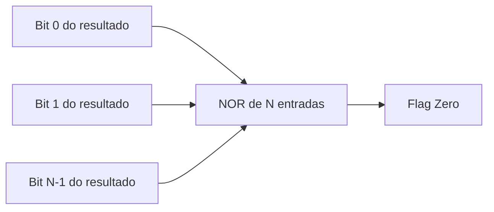

## Objetivos de Aprendizagem

- Ler uma pequena tabela de codificação de controle da ULA e dizer quais bits de controle selecionam AND, OR, soma, subtração e SLT.
- Definir cada uma das quatro flags de status padrão da ULA (Zero, Negativo, Carry, Overflow) e dizer exatamente qual sinal dentro da ULA produz cada uma.
- Explicar a diferença entre a flag Carry (estouro circular sem sinal) e a flag Overflow (estouro circular com sinal), e dar um cálculo em que as duas flags discordam.
- Calcular à mão as quatro flags para uma soma ou subtração específica de N bits, dados só os dois operandos e a operação selecionada.
- Descrever como a lógica de desvio de uma CPU (por exemplo, `beq` ou `blt`) lê uma ou mais dessas flags após uma subtração na ULA para decidir se toma ou não um desvio.

## Contexto e Motivação

O conceito anterior projetou uma ULA como um circuito que calcula vários resultados candidatos em paralelo e usa um multiplexador, comandado pelas linhas de controle da ULA, para selecionar um deles como saída. Esse projeto deixou duas coisas informais: exatamente quais padrões de bits nas linhas de controle correspondem a qual operação, e o que a ULA informa ao resto da CPU além do próprio resultado numérico. As duas lacunas importam enormemente na prática. Uma unidade de controle (assunto de um conceito posterior deste currículo) precisa codificar "por favor, calcule A − B" como algum padrão específico de bits de controle, e esse padrão precisa ser fixo e documentado, não deixado como "a fatia que por acaso estiver ligada ao somador". E um resultado numérico sozinho não é informação suficiente para uma CPU tomar decisões: comparar dois valores, testar se um cálculo produziu zero, ou detectar que um cálculo com sinal produziu silenciosamente uma resposta errada por causa de overflow, tudo isso exige que a ULA exponha sinais extras de um bit, convencionalmente chamados de flags de status, junto com seu resultado principal.

Essas flags não são um enfeite cosmético pregado na ULA; elas são todo o mecanismo pelo qual a lógica de controle de uma CPU implementa desvios condicionais. Quando um programa executa algo como `if (a == b) goto L`, o código de máquina compilado não contém um teste genérico de igualdade: ele contém uma subtração na ULA de a e b, seguida imediatamente por uma instrução de desvio que inspeciona a flag Zero produzida pela subtração. Se a − b for exatamente 0, os dois valores eram iguais, e o desvio é tomado; nada sobre "igualdade" é calculado independentemente dessa flag. RISC-V, MIPS e a plataforma Hack do Nand2Tetris ligam exatamente a mesma ideia à sua lógica de desvio, diferindo só em detalhes de codificação, e esse padrão é exatamente o motivo de as flags da ULA serem tratadas como um conceito próprio, logo antes da ISA (conceito 20) e da unidade de controle (conceito 25) que as consomem.

A parte mais sutil e mais confundida deste material é a diferença entre a flag Carry e a flag Overflow. As duas são sinais de um bit produzidos pelo mesmo somador dentro da ULA, e as duas são descritas vagamente como "a aritmética não coube", mas elas respondem duas perguntas genuinamente diferentes, que fazem sentido sob duas interpretações diferentes e mutuamente exclusivas do mesmo padrão de bits. O Carry responde "um cálculo sem sinal deu a volta em 2ᴺ?", enquanto o Overflow responde "um cálculo com sinal, em complemento de dois, produziu um resultado matematicamente errado porque deu a volta na faixa representável com sinal?". Uma única soma pode ligar uma dessas flags sem a outra, e confundi-las é uma das fontes mais persistentes de bugs aritméticos sutis em programação de baixo nível; este conceito trabalha casos concretos em que elas divergem.

## Teoria Central

### A codificação de controle da ULA

Partindo da fatia de 1 bit do conceito anterior (que usava um pequeno código de controle para selecionar entre AND, OR e a Soma do somador), um esquema completo de controle da ULA também precisa de uma linha Binvert (para selecionar soma ou subtração) e de uma forma de selecionar SLT. Uma codificação representativa, no espírito dos esquemas usados no Nand2Tetris e na ULA Beta do MIT 6.004, fica assim:

| Controle da ULA | Binvert | Operação | Resultado |
|---|---|---|---|
| 000 | 0 | AND | A · B |
| 001 | 0 | OR | A + B (OR bit a bit) |
| 010 | 0 | ADD | A + B (aritmética) |
| 110 | 1 | SUB | A − B |
| 111 | 1 | SLT | 1 se A < B, senão 0 |

Os padrões de bits exatos são uma escolha de projeto de quem define a ISA; o que importa estruturalmente é que um campo de controle pequeno e de largura fixa é decodificado, em outro lugar da CPU (pela unidade de controle), nos sinais Binvert e de Operação/seleção do mux que os internos da ULA de fato consomem. Esta tabela é o artefato concreto que a lógica de uma unidade de controle acaba produzindo, uma entrada por instrução distinta que a ISA suporta.

### A flag Zero

A flag Zero vale 1 exatamente quando todos os bits do resultado da ULA são 0. Ela é calculada alimentando os N bits do resultado numa única porta NOR de N entradas (o equivalente a fazer o OR de todos os bits do resultado e depois inverter): se qualquer bit do resultado for 1, a saída do OR é 1 e a saída do NOR (a flag Zero) é 0; só quando os N bits são 0 ao mesmo tempo o NOR produz 1. É um cálculo puramente combinacional, sem nenhuma aritmética adicional, feito diretamente sobre os bits de resultado já calculados, totalmente independente de qual operação os produziu.



### A flag Negativo (sinal)

A flag Negativo é simplesmente o bit mais significativo do resultado, copiado diretamente sem nenhuma lógica extra. Na representação em complemento de dois, o bit mais significativo é definido como o bit de sinal (1 para valores negativos, 0 para valores não negativos), então essa flag literalmente informa se o resultado da ULA, interpretado com sinal, é negativo. Não existe um circuito separado de detecção de sinal; a flag é uma derivação direta de um bit que a ULA já tinha calculado como parte do seu resultado normal.

### A flag Carry

A flag Carry é o carry-out da posição de bit mais significativa do somador interno da ULA: o mesmo Cout produzido pela fatia de cima da cadeia de somadores dos dois conceitos anteriores. Na soma, Carry = 1 significa que a soma verdadeira sem sinal é maior ou igual a 2ᴺ (estouro circular sem sinal). Na subtração implementada como soma do complemento, o Cout final bruto do somador fica invertido em relação a um bit intuitivo de "empréstimo" (como apontado quando o somador foi apresentado); muitas ULAs reais invertem esse bit de novo para que, na subtração, Carry = 1 signifique por convenção "não houve empréstimo", ou seja, A ≥ B sem sinal. De qualquer forma, o Carry só faz sentido na interpretação sem sinal; por si só, ele não diz nada correto sobre overflow com sinal.

### A flag Overflow

A flag Overflow detecta o estouro circular com sinal, em complemento de dois, e enfaticamente não é o mesmo sinal que o Carry. A definição padrão, com o mínimo de hardware, compara o carry que entra na posição do bit de sinal (bit mais significativo) com o carry que sai dessa mesma posição:

```
Overflow = Cin_msb ⊕ Cout_msb
```

De forma equivalente (e esta é a versão intuitiva que vale memorizar), o overflow com sinal só pode acontecer quando dois operandos do mesmo sinal produzem um resultado de sinal oposto: somar dois positivos não pode matematicamente dar um negativo, e somar dois negativos não pode matematicamente dar um não negativo, então qualquer um desses resultados, se ocorrer, prova que o resultado de N bits está errado e que a soma matemática verdadeira simplesmente não coube em N bits. Dois operandos de sinais diferentes nunca causam overflow com sinal quando somados, porque a magnitude da soma verdadeira é limitada pela magnitude do maior operando, que já cabia em N bits.

| Cin no MSB | Cout do MSB | Overflow |
|---|---|---|
| 0 | 0 | 0 |
| 0 | 1 | 1 |
| 1 | 0 | 1 |
| 1 | 1 | 0 |

### Carry versus Overflow: duas perguntas diferentes sobre os mesmos bits

As duas flags são derivadas do mesmo hardware de somador e do mesmo padrão de bits que o somador produz, mas respondem perguntas diferentes sob representações diferentes assumidas para os operandos:

| Flag | Pergunta respondida | Representação assumida | Derivada de |
|---|---|---|---|
| Carry | O resultado sem sinal deu a volta em 2ᴺ? | Sem sinal | Cout do MSB |
| Overflow | O resultado com sinal deu a volta na faixa representável com sinal? | Com sinal, complemento de dois | Cin vs. Cout do MSB |

Como as duas flags são calculadas a partir de sinais relacionados, mas distintos (só o Cout, versus Cin comparado com Cout na mesma posição de bit), é totalmente possível (e, como o Exemplo Resolvido 3 mostra concretamente, comum) que exatamente uma das duas flags esteja ligada num dado cálculo enquanto a outra está desligada. Tratar a correção do padrão de bits como uma única pergunta de sim ou não, em vez de duas perguntas separadas que dependem da representação, é o equívoco de maior consequência que este conceito trata.

### Como as instruções de desvio consomem essas flags

A unidade de controle de uma CPU (um conceito posterior deste currículo) decodifica o opcode de um desvio condicional configurando as linhas de controle da ULA para subtrair os dois operandos comparados, e então encaminha uma ou mais das flags resultantes para a lógica de decisão do desvio; nenhuma comparação separada é calculada. `beq` ("desvia se igual") calcula A − B e toma o desvio se e somente se Zero = 1. `blt` ("desvia se menor que") também calcula A − B, e então lê o Negativo (validado com o Overflow, ou por meio de um resultado no estilo SLT, como no conceito anterior) para decidir se A era menor que B. A flag, e não uma comparação recém-calculada, é todo o mecanismo.

## Exemplos Resolvidos

### Exemplo 1: as quatro flags numa soma de 8 bits

Objetivo: calcular `A = 1000 0000` (128 sem sinal, ou −128 com sinal) mais `B = 1111 1111` (255 sem sinal, ou −1 com sinal) numa ULA de 8 bits configurada para ADD, e informar as quatro flags.

Passo 1: somar bit a bit (ripple-carry, Cin=0 no bit 0):

```
  1000 0000
+ 1111 1111
```

Bits 0 a 6: cada posição tem a=0, b=1, Cin de entrada=0, dando Sum=1, Cout=0. Bit 7 (MSB): a=1, b=1, Cin=0, dando Sum=0, Cout=1.

Passo 2: montar o resultado: `0111 1111` = 127. Cout final (saindo do bit 7) = 1.

Passo 3: flag Zero: o resultado tem vários bits 1, então o NOR de todos os bits do resultado = 0. Zero = 0.

Passo 4: flag Negativo: o MSB do resultado é 0. Negativo = 0.

Passo 5: flag Carry: o Cout do MSB = 1, então Carry = 1. Interpretado sem sinal: 128 + 255 = 383, que excede a faixa sem sinal de 8 bits (0 a 255); 383 − 256 = 127, batendo com o resultado que deu a volta. O Carry sinaliza corretamente o estouro circular sem sinal.

Passo 6: flag Overflow: o Cin no MSB (ou seja, o Cout do bit 6) = 0; o Cout do MSB = 1. Overflow = 0 ⊕ 1 = 1. Interpretado com sinal: −128 + (−1) = −129, que não cabe na faixa com sinal de 8 bits (−128 a 127); o resultado com sinal real da ULA, lendo `0111 1111` com sinal, é +127, visivelmente errado, exatamente como o Overflow=1 avisa. Conferindo com a regra do mesmo sinal: os dois operandos são negativos (MSB=1 nos dois), mas o MSB do resultado é 0 (não negativo); dois negativos produzindo um resultado não negativo é precisamente a assinatura de overflow com sinal: mesmo sinal na entrada, sinal oposto na saída.

### Exemplo 2: flags de A − B com A < B, e como beq/blt as usam

Objetivo: calcular `A = 0011` (3) menos `B = 0110` (6) numa ULA de 4 bits (Binvert=1, Cin=1 no bit 0), e mostrar como `beq` e `blt` usariam as flags resultantes.

Passo 1: inverter B: B=0110, ¬B=1001. Calcular A + ¬B + 1.

Passo 2 (bit 0): a=1, b′=1, Cin=1. Sum=1⊕1⊕1=1. Cout=(1·1)+(1·1)+(1·1)=1.

Passo 3 (bit 1): a=1, b′=0, Cin=1. Sum=1⊕0⊕1=0. Cout=(1·0)+(1·1)+(0·1)=1.

Passo 4 (bit 2): a=0, b′=0, Cin=1. Sum=0⊕0⊕1=1. Cout=(0·0)+(0·1)+(0·1)=0.

Passo 5 (bit 3, MSB): a=0, b′=1, Cin=0. Sum=0⊕1⊕0=1. Cout=(0·1)+(0·0)+(1·0)=0.

Passo 6: montar o resultado: `1101` = −3 em complemento de dois (MSB=1). Conferindo: 3 − 6 = −3. Bate.

Passo 7: flag Zero: os bits do resultado não são todos 0, então Zero = 0. Sinaliza corretamente que A ≠ B (3 ≠ 6).

Passo 8: flag Negativo: o MSB do resultado = 1, então Negativo = 1. Sinaliza corretamente que o resultado com sinal é negativo, ou seja, A − B < 0, ou seja, A < B.

Passo 9: flag Overflow: o Cin no MSB (Cout do bit 2) = 0; o Cout do MSB = 0. Overflow = 0 ⊕ 0 = 0. Não houve overflow com sinal, então a flag Negativo pode ser confiada aqui como uma comparação com sinal precisa.

Passo 10: `beq`/`blt`: `beq` inspeciona o Zero; como Zero = 0, não há desvio, o que está correto, já que 3 ≠ 6. `blt` inspeciona o Negativo com o Overflow desligado; como Negativo = 1 e Overflow = 0, o desvio é tomado, o que está correto, já que 3 < 6.

### Exemplo 3: um caso em que o Carry liga mas o Overflow não, e vice-versa

Objetivo: exibir uma soma de 4 bits em que Carry = 1 mas Overflow = 0, e uma em que Overflow = 1 mas Carry = 0, provando que as duas flags são sinais genuinamente diferentes.

**Caso 1: Carry=1, Overflow=0.** Calcular `A = 1111` (15 sem sinal / −1 com sinal) mais `B = 0001` (1, as duas interpretações concordam).

Bit 0: a=1,b=1,Cin=0. Sum=1⊕1⊕0=0, Cout=(1·1)+(1·0)+(1·0)=1. Bit 1: a=1,b=0,Cin=1. Sum=1⊕0⊕1=0, Cout=(1·0)+(1·1)+(0·1)=1. Bit 2: a=1,b=0,Cin=1. Sum=0, Cout=1 (idêntico ao bit 1). Bit 3 (MSB): a=1,b=0,Cin=1. Sum=1⊕0⊕1=0, Cout=(1·0)+(1·1)+(0·1)=1.

Resultado = `0000`, Cout final = 1. Carry = 1: sem sinal, 15+1=16 excede a faixa de 4 bits (0 a 15); a soma verdadeira deu a volta para 0, sinalizado corretamente. Overflow = Cin no MSB (Cout do bit 2 = 1) ⊕ Cout do MSB (1) = 0. Com sinal, A=−1 e B=1, então −1+1=0 exatamente: o resultado com sinal está completamente correto, sem estouro circular. Carry=1 mas Overflow=0: a interpretação sem sinal deu a volta e a interpretação com sinal não, porque as duas representações atribuem significados diferentes ao mesmo padrão de bits `1111`.

**Caso 2: Overflow=1, Carry=0.** Calcular `A = 0111` (7) mais `B = 0001` (1), dois valores positivos com sinal.

Bit 0: 1+1+0=Sum 0,Cout 1. Bit 1: 1+0+1=Sum 0,Cout 1. Bit 2: 1+0+1=Sum 0,Cout 1. Bit 3: 0+0+1=Sum 1,Cout 0.

Resultado=`1000` = −8 com sinal. Carry = 0: sem sinal, 7+1=8 cabe na faixa de 4 bits (0 a 15), sem estouro circular sem sinal. Overflow: Cin no MSB (Cout do bit 2)=1, Cout do MSB=0, Overflow=1, sinalizando corretamente que dois operandos positivos (7 e 1) produziram um resultado negativo (−8), o que é matematicamente impossível e prova o overflow. Overflow=1 enquanto Carry=0: o caso espelhado, confirmando que as duas flags acompanham condições independentes sobre a mesma saída do somador.

## Equívocos Comuns e Armadilhas

- **"Carry e Overflow são dois nomes para o mesmo evento."** Eles são calculados a partir de sinais relacionados, mas distintos (o Carry é simplesmente o Cout final do somador, enquanto o Overflow compara o Cin com o Cout na posição do bit de sinal), e o Exemplo Resolvido 3 exibe cálculos em que uma flag está ligada e a outra desligada, nos dois sentidos.
- **"Se a flag Overflow é 0, a soma com certeza não deu a volta."** Overflow=0 só garante que não houve estouro circular com sinal; o mesmo cálculo ainda pode ter Carry=1, significando que deu a volta quando os operandos são interpretados sem sinal. Qual flag é "a certa para checar" depende inteiramente de o programa tratar seus operandos com ou sem sinal; a ULA calcula as duas de qualquer forma.
- **"A flag Zero exige calcular uma checagem de igualdade separada da subtração."** Não exige: o Zero é produzido fazendo o NOR dos bits de um resultado que a ULA teria de calcular de qualquer jeito para a operação pedida (tipicamente uma subtração, numa comparação); não existe circuito separado de igualdade, e é exatamente por isso que `beq` é implementado como "subtrai e depois olha o Zero", e não como uma instrução dedicada de igualdade.
- **"O overflow com sinal pode acontecer ao somar dois números de sinais diferentes."** Não pode: a soma verdadeira de um número positivo e um negativo sempre tem magnitude limitada pela magnitude do maior operando, que já cabia em N bits, então o overflow só é possível quando os dois operandos têm o mesmo sinal e o sinal do resultado difere do deles.
- **"A flag Negativo sozinha diz se A < B após uma subtração."** Ela só faz isso de forma confiável quando o Overflow é 0. Se uma subtração dá overflow, o bit de sinal do resultado pode enganar; uma lógica correta de menor-que com sinal precisa checar o Negativo junto com o Overflow (ou usar um resultado SLT dedicado, como no conceito anterior), não o Negativo isolado.

## Resumo

Uma ULA totalmente especificada expõe uma pequena codificação de controle (uma tabela fixa que mapeia padrões de bits de controle para AND, OR, soma, subtração e SLT) mais quatro flags de status de um bit calculadas junto com seu resultado principal: Zero (um NOR de todos os bits do resultado), Negativo (o bit de sinal do resultado, derivado diretamente), Carry (o carry-out final do somador, que faz sentido na interpretação sem sinal) e Overflow (Cin XOR Cout na posição do bit de sinal, que faz sentido na interpretação com sinal e pode ser detectado, de forma equivalente, como dois operandos de mesmo sinal produzindo um resultado de sinal oposto). Carry e Overflow são frequentemente confundidos, mas respondem perguntas genuinamente diferentes sobre o mesmo padrão de bits, e um único cálculo pode ligar qualquer uma das flags sem a outra. A lógica de desvio de uma CPU nunca recalcula "igual" ou "menor que" de forma independente: `beq` lê a flag Zero e `blt` lê a flag Negativo (validada com o Overflow) depois que a unidade de controle configura a ULA para subtrair os operandos comparados, o que faz dessas quatro flags toda a interface entre a aritmética bruta e o fluxo de controle do programa. Com as operações, a codificação de controle e as flags da ULA agora totalmente especificadas, o próximo conceito, a arquitetura do conjunto de instruções, define o vocabulário completo de operações (aritméticas, de memória e de controle) que um processador promete suportar, apoiando-se explicitamente tanto nesta ULA quanto no sistema de memória visto no conceito de organização da RAM.

## Documentation Links

- [Harris & Harris: Digital Design and Computer Architecture, RISC-V Edition](https://shop.elsevier.com/books/digital-design-and-computer-architecture-risc-v-edition/harris/978-0-12-820064-3): tratamento de livro-texto da codificação de controle da ULA e das flags de status Zero, Negativo, Carry e Overflow, incluindo seu uso na avaliação de condições de desvio.
- [MIT 6.004: OCW Syllabus](https://ocw.mit.edu/courses/6-004-computation-structures-spring-2017/pages/syllabus/): ementa do curso Computation Structures, cujas unidades de datapath e controle cobrem a geração das flags da ULA e seu consumo pela lógica de desvio.
