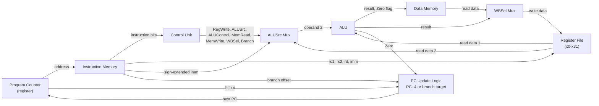

## Learning Objectives

- Identify every piece built in this discipline — gates, adder, ALU, flip-flops, registers, register file, memory, datapath, control unit — and describe the specific role each one plays inside a complete single-cycle CPU.
- Draw and read a block diagram of a complete single-cycle CPU, tracing the flow of PC, instruction bits, register data, ALU results, and memory data around the full datapath.
- Produce a complete cycle-by-cycle execution trace of a short program, showing the program counter, instruction, key control signals, ALU result, and resulting state change for every instruction.
- Identify the critical path of a single-cycle CPU and explain why the clock period must be long enough to accommodate the slowest instruction, even though most instructions could finish faster.
- Explain, at a conceptual level, why a fixed, uniform clock period is wasteful and how this observation motivates pipelining, without needing to describe how a pipelined design works.

## Context & Motivation

This is the capstone concept of the digital-logic-computer-organization discipline. Every concept before this one has built one piece of a computer: Boolean algebra and logic gates gave a way to compute any Boolean function; NAND-as-universal-gate showed that a single primitive gate suffices to build all of them; adders and the ALU gave arithmetic and logic operations; latches, flip-flops, and registers gave a way to store state reliably across time; the register file and RAM organization gave addressable, multi-word storage; the ISA gave a precise vocabulary of instructions; instruction formats and assembly-to-machine-code translation gave a way to encode that vocabulary as bits; the datapath wired registers, ALU, and memory together with buses and multiplexers; the control unit gave the decoding logic that drives those multiplexers correctly; and the fetch-decode-execute cycle described the repeating loop tying fetch, decode, execute, and PC-update into one action per clock period. Nothing new needs to be invented here. What remains is to put every piece in one place, look at the whole machine at once, and then run a program on it and watch, cycle by cycle, exactly what happens.

This is also the exact destination both of this concept's cited sources are built around. Nand2Tetris's "Build a Modern Computer from First Principles" course is organized precisely as a climb from elementary logic gates up to a complete, working general-purpose computer — the same climb this discipline has taken. MIT's 6.004, in "Building the Beta," reaches the identical destination: a complete single-cycle processor, assembled from a datapath and a control unit, that executes a real instruction set. What follows is a victory lap — assembling everything already built, verifying it works by tracing a real program through it instruction by instruction, and then being honest about the one significant limitation of the single-cycle approach, which motivates the pipelined designs studied in the Computer Architecture discipline that follows.

## Core Theory

### Every piece, and its role in the complete machine

A complete single-cycle CPU, built entirely from the pieces developed earlier in this discipline, consists of:

- **Logic gates**, built from NAND (the universal gate), forming the fundamental combinational building block of everything else in the list.
- **A binary adder**, used both inside the ALU (for add, addi, and load/store address computation) and separately to compute PC+4 and branch targets.
- **An ALU (arithmetic logic unit)**, selected by an ALUControl signal to perform addition, subtraction, AND, OR, or set-less-than, and producing both a result and a Zero flag (asserted when the result is exactly zero — the mechanism behind beq).
- **Flip-flops**, the fundamental unit of clocked storage, from which every other piece of state in the machine (registers, the register file, the PC) is built.
- **Registers**, groups of flip-flops sharing a clock and holding a single multi-bit value, used to build both the register file's individual entries and the PC.
- **The register file**, providing two simultaneous read ports (for rs1 and rs2) and one write port (for rd), the storage that holds the 32 general-purpose registers x0 through x31 (with x0 hardwired to the constant 0).
- **Memory (RAM)**, organized as addressable storage with read and write ports, split in this design into instruction memory (read-only from the CPU's perspective, indexed by PC) and data memory (read-write, indexed by an ALU-computed address, used by lw and sw).
- **The datapath**, the wiring — buses and multiplexers (ALUSrc, WBSel) — connecting the register file, the ALU, and memory into the specific paths data must travel for each kind of instruction.
- **The control unit**, combinational logic that reads an instruction's opcode (and funct field, for R-type instructions) and asserts the correct combination of RegWrite, ALUSrc, ALUControl, MemRead, MemWrite, WBSel, and Branch for that instruction.

None of these pieces is new. What is new is seeing them wired together at once, as a single machine, with the PC and the fetch-decode-execute cycle as the animating loop driving the whole assembly, clock period after clock period.

### Running the shared sample program: a full cycle-by-cycle trace

The table below traces all six instructions of the shared sample program through the complete machine, starting from PC = `0x00` with all registers and memory initialized to zero.

| Cycle | PC | Instruction | Key control signals | ALU result (Zero) | State change |
|---|---|---|---|---|---|
| 1 | 0x00 | addi x5, x0, 5 | RegWrite=1, ALUSrc=1, ALUControl=add | 0+5=5 | x5 = 5; PC → 0x04 |
| 2 | 0x04 | addi x6, x0, 10 | RegWrite=1, ALUSrc=1, ALUControl=add | 0+10=10 | x6 = 10; PC → 0x08 |
| 3 | 0x08 | add x7, x5, x6 | RegWrite=1, ALUSrc=0, ALUControl=add | 5+10=15 | x7 = 15; PC → 0x0C |
| 4 | 0x0C | sw x7, 0(x0) | ALUSrc=1, MemWrite=1, ALUControl=add | 0+0=0 | mem[0] = 15; PC → 0x10 |
| 5 | 0x10 | lw x8, 0(x0) | RegWrite=1, ALUSrc=1, MemRead=1, WBSel=mem | addr=0, mem[0]=15 | x8 = 15; PC → 0x14 |
| 6 | 0x14 | beq x7, x8, +8 | Branch=1, ALUSrc=0, ALUControl=subtract | 15-15=0 (Zero=1) | no register/memory change; PC → 0x1C (taken) |

Each row of this table is one full pass through the fetch-decode-execute cycle described in the previous concept: fetch the instruction at the listed PC, decode it to obtain the listed control signals (and read whatever registers it names), execute it through the ALU (and data memory, for cycles 4 and 5), and update the PC as shown in the last column. By cycle 6, the machine has computed 5 + 10, stored the sum to memory, loaded it back into a different register, confirmed by subtraction that the stored and loaded values are equal, and redirected control flow to address `0x1C` — a complete, if small, demonstration of arithmetic, memory access, and conditional control flow, exactly the three categories of operation any instruction set must support.

### The critical path, and why the clock period is fixed by the slowest instruction

A single-cycle CPU must use one fixed clock period for every instruction, because the hardware has no way of knowing, ahead of time, how long any particular instruction's signals will take to settle — and all instructions share the same PC register and clock, so they occupy identical time slots regardless. This means the clock period must accommodate the **critical path**: the longest signal-propagation delay through the combinational logic, over all instructions the ISA supports.

For this datapath, the longest path belongs to `lw`: PC reaches instruction memory and is read; the rs1 field reaches the register file and is read; the resulting value and the sign-extended immediate pass through the ALUSrc mux and are added by the ALU; the ALU's result reaches data memory and is read; and that read data passes through the WBSel mux and reaches the register file's write port in time for the clock edge. This is five sequential stages — instruction memory, register file read, ALU, data memory, and the write-back mux. By contrast, an `add` never touches data memory (four stages: instruction memory, register read, ALU, write-back mux), and a branch never writes back to a register (three stages: instruction memory, register read, ALU). Because the *same* clock period must serve every instruction, the period is dictated entirely by `lw`'s five-stage path, even though `add` and `beq` finish settling well before that period elapses on every cycle they execute.

### The single-cycle design's honest limitation, and a forward pointer to pipelining

This is the central engineering trade-off of a single-cycle design: every instruction, including the simplest ones, is forced to wait out a clock period sized for the slowest instruction in the ISA. `add` and `beq` complete their real work well before the `lw`-sized period elapses, and that unused time is wasted, cycle after cycle, for every instruction that is not a load. Since real programs are typically dominated by arithmetic and branch instructions rather than memory accesses, this waste compounds significantly over a program's life. This single observation — a uniform clock period forces every instruction to run at the speed of the slowest one — is exactly what motivates **pipelining**, a technique that overlaps execution of multiple instructions across shorter, more uniform stages, so different instructions occupy different stages of the datapath simultaneously rather than one instruction occupying the whole datapath for one long cycle. Pipelining is not covered in this discipline; it is the opening topic of the Computer Architecture discipline that follows, and everything built here — the datapath, the control unit, the ISA — is exactly the starting material that discipline's pipelined design builds on top of.

## Worked Examples

### Example 1: The complete cycle-by-cycle trace (already shown above)

The table in the Core Theory section above is itself a fully worked example: it traces the shared sample program's six instructions from a cold-start state (PC = `0x00`, all registers and memory zero) through to the taken branch that redirects PC to `0x1C`. Reading it row by row demonstrates that the complete assembled CPU — every piece listed at the top of Core Theory, wired exactly as shown in the block diagram — is sufficient, with no additional hardware, to correctly execute every instruction category in this ISA: immediate arithmetic (addi), register arithmetic (add), memory store (sw), memory load (lw), and conditional branch (beq).

### Example 2: Identifying the critical path and why `lw` sets the clock period

Compare the signal path for cycle 3 (`add x7, x5, x6`) against cycle 5 (`lw x8, 0(x0)`) from the trace table. In cycle 3: PC reaches instruction memory → x5 and x6 are read from the register file → the ALUSrc mux selects the register value → the ALU adds → the WBSel mux selects the ALU result → the value reaches the register file's write port. Four stages after fetch. In cycle 5, the path additionally passes through data memory after the ALU computes the address: PC reaches instruction memory → x0 is read (0) → the ALUSrc mux selects the immediate (0) → the ALU adds (0+0=0) → data memory is read at that address → the WBSel mux selects the memory data, not the ALU result → the value reaches the write port. Five stages — one more than `add`, due to the data-memory access that only loads and stores require. Since all six cycles must fit within one identical clock period, that period must be at least as long as this five-stage `lw` path — even though cycles 1, 2, 3, and 6 finish settling earlier.

### Example 3: Extending the program by one instruction

Suppose a seventh instruction is appended immediately after the branch target, at address `0x1C`: `addi x9, x8, 1`. Since the branch in cycle 6 was taken, execution proceeds directly to `0x1C` on cycle 7, skipping whatever instruction (if any) occupies `0x18`. Tracing this cycle: fetch reads the instruction at `0x1C`; decode identifies an addi with rs1 = x8, rd = x9, immediate = 1, asserting RegWrite=1, ALUSrc=1, ALUControl=add; the register file returns x8 = 15 (set in cycle 5); the ALU computes 15 + 1 = 16; WBSel selects the ALU result; on the clock edge, x9 is latched with 16, and PC advances to `0x1C + 4 = 0x20`. Extending a program requires no new hardware whatsoever — the same fetch-decode-execute cycle, run once more against whatever new bits occupy the next address, produces the correct new state.

## Common Misconceptions & Pitfalls

- **"A complete CPU requires some additional 'glue' hardware beyond the datapath and control unit."** It does not — the datapath and the control unit, together with the PC and the fetch-decode-execute loop, are the entire machine. Nothing further needs to be added to run real programs; this concept is an assembly and demonstration, not an introduction of new components.
- **"Faster instructions make the whole program run faster in a single-cycle design."** Every instruction, fast or slow, consumes exactly one full clock period, whose length is fixed by the slowest instruction (lw). An add instruction finishing its real work early does not shorten that cycle; the unused time is simply idle, not reclaimed.
- **"The critical path is about the ALU being slow."** The ALU is one stage among several; the critical path is the sum of every sequential stage a signal must traverse in the worst case — instruction memory access, register file read, the ALU, data memory access, and the write-back mux, for lw specifically — not any single component in isolation.
- **"Since single-cycle designs waste time on simple instructions, they must be a poor design choice with no merit."** Single-cycle designs are the simplest possible correct implementation of an ISA, invaluable for understanding correctness with no overlapping-instruction complexity to reason about; their inefficiency is a genuine, well-known limitation, not a design flaw — one addressed by pipelining, not by declaring single-cycle designs wrong.
- **"This machine is a toy that doesn't count as a 'real' computer."** A machine built from NAND gates upward, that correctly fetches, decodes, and executes arithmetic, memory, and branch instructions from a defined ISA, is a genuine general-purpose computer in every meaningful sense — it can, in principle, run any program expressible in that ISA, exactly as a modern superscalar processor can, only slower and with a smaller instruction repertoire.
- **"Pipelining needs to be understood to finish this discipline."** It does not. The forward pointer to pipelining here only motivates why the next discipline (Computer Architecture) exists; the single-cycle CPU assembled in this concept is itself a complete, correct, fully explained machine on its own terms.

## Summary

Assembling a complete single-cycle CPU requires no new components: every gate, adder, ALU, flip-flop, register, register file, memory, datapath wire, and control-unit signal built across this discipline is wired together exactly as shown in the block diagram above, animated cycle after cycle by the fetch-decode-execute loop from the previous concept. Running the shared six-instruction sample program through this assembled machine, traced cycle by cycle from PC = `0x00` to the taken branch that redirects PC to `0x1C`, demonstrates that the machine correctly performs immediate and register arithmetic, memory stores and loads, and conditional control flow — the complete repertoire this ISA supports — using nothing but the pieces already built. The one honest limitation of this design is that its single, fixed clock period must accommodate the critical path of its slowest instruction, `lw`, whose five-stage signal path (instruction memory, register read, ALU, data memory, write-back) forces every other instruction to sit idle for the unused remainder of every cycle; this specific inefficiency, not any flaw in correctness, is exactly what motivates the pipelined CPU designs studied next, in Computer Architecture. What has been built here, though simple, is a genuine general-purpose computer, built from nothing but NAND gates and a clock, capable of running any program expressible in its instruction set.

## Documentation Links

- [MIT 6.004 — Building the Beta](https://computationstructures.org/lectures/beta/beta.html) — presents the complete single-cycle Beta processor, assembled from a datapath and control unit, as the methodological template this concept's assembly and cycle-by-cycle trace follow.
- [Nand2Tetris — Build a Modern Computer from First Principles](https://www.coursera.org/learn/build-a-computer) — the course whose entire arc, from elementary logic gates to a complete working general-purpose computer, is the structural model this discipline's climb to a full single-cycle CPU mirrors.
