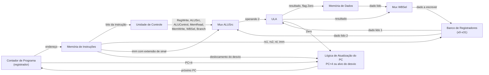

## Objetivos de Aprendizagem

- Identificar cada peça construída nesta disciplina (portas, somador, ULA, flip-flops, registradores, banco de registradores, memória, datapath, unidade de controle) e descrever o papel específico que cada uma desempenha dentro de uma CPU monociclo completa.
- Desenhar e ler um diagrama de blocos de uma CPU monociclo completa, acompanhando o fluxo do PC, dos bits da instrução, dos dados de registradores, dos resultados da ULA e dos dados de memória ao longo de todo o datapath.
- Produzir um traço de execução completo, ciclo a ciclo, de um programa curto, mostrando o contador de programa, a instrução, os principais sinais de controle, o resultado da ULA e a mudança de estado resultante para cada instrução.
- Identificar o caminho crítico de uma CPU monociclo e explicar por que o período de clock precisa ser longo o bastante para acomodar a instrução mais lenta, mesmo que a maioria das instruções pudesse terminar antes.
- Explicar, em nível conceitual, por que um período de clock fixo e uniforme é um desperdício e como essa observação motiva o pipelining, sem precisar descrever como funciona um projeto com pipeline.

## Contexto e Motivação

Este é o conceito de fechamento da disciplina de lógica digital e organização de computadores. Cada conceito anterior construiu uma peça de um computador: a álgebra booleana e as portas lógicas deram uma forma de calcular qualquer função booleana; o NAND como porta universal mostrou que uma única porta primitiva basta para construir todas elas; os somadores e a ULA deram operações aritméticas e lógicas; latches, flip-flops e registradores deram uma forma de guardar estado de modo confiável ao longo do tempo; o banco de registradores e a organização da RAM deram armazenamento endereçável de várias palavras; a ISA deu um vocabulário preciso de instruções; os formatos de instrução e a tradução de assembly para código de máquina deram uma forma de codificar esse vocabulário em bits; o datapath ligou registradores, ULA e memória com barramentos e multiplexadores; a unidade de controle deu a lógica de decodificação que comanda esses multiplexadores corretamente; e o ciclo de busca, decodificação e execução descreveu o laço repetitivo que une busca, decodificação, execução e atualização do PC numa ação por período de clock. Nada novo precisa ser inventado aqui. O que resta é colocar cada peça num só lugar, olhar a máquina inteira de uma vez, e então executar um programa nela e observar, ciclo a ciclo, exatamente o que acontece.

Este é também exatamente o destino em torno do qual as duas fontes citadas neste conceito são construídas. O curso "Build a Modern Computer from First Principles" do Nand2Tetris é organizado precisamente como uma escalada das portas lógicas elementares até um computador de propósito geral completo e funcional, a mesma escalada que esta disciplina fez. O 6.004 do MIT, em "Building the Beta", chega ao mesmo destino: um processador monociclo completo, montado a partir de um datapath e de uma unidade de controle, que executa um conjunto de instruções real. O que vem a seguir é uma volta olímpica: montar tudo o que já foi construído, verificar que funciona acompanhando um programa real instrução por instrução, e então ser honesto sobre a única limitação significativa da abordagem monociclo, que motiva os projetos com pipeline estudados na disciplina de Arquitetura de Computadores, a seguinte.

## Teoria Central

### Cada peça, e seu papel na máquina completa

Uma CPU monociclo completa, construída inteiramente com as peças desenvolvidas antes nesta disciplina, consiste em:

- **Portas lógicas**, construídas a partir do NAND (a porta universal), formando o bloco combinacional fundamental de tudo o mais nesta lista.
- **Um somador binário**, usado tanto dentro da ULA (para add, addi e o cálculo de endereço de load/store) quanto separadamente para calcular PC+4 e alvos de desvio.
- **Uma ULA (unidade lógica e aritmética)**, selecionada por um sinal ALUControl para fazer soma, subtração, AND, OR ou set-less-than, e que produz tanto um resultado quanto uma flag Zero (ligada quando o resultado é exatamente zero, o mecanismo por trás do beq).
- **Flip-flops**, a unidade fundamental de armazenamento com clock, a partir da qual todo outro pedaço de estado da máquina (registradores, o banco de registradores, o PC) é construído.
- **Registradores**, grupos de flip-flops que compartilham um clock e guardam um único valor de vários bits, usados para construir tanto as entradas individuais do banco de registradores quanto o PC.
- **O banco de registradores**, que oferece duas portas de leitura simultâneas (para rs1 e rs2) e uma porta de escrita (para rd), o armazenamento que guarda os 32 registradores de propósito geral, de x0 a x31 (com x0 fixo na constante 0).
- **Memória (RAM)**, organizada como armazenamento endereçável com portas de leitura e escrita, dividida neste projeto em memória de instruções (somente leitura do ponto de vista da CPU, indexada pelo PC) e memória de dados (leitura e escrita, indexada por um endereço calculado pela ULA, usada por lw e sw).
- **O datapath**, a fiação (barramentos e multiplexadores, ALUSrc e WBSel) que liga o banco de registradores, a ULA e a memória nos caminhos específicos que os dados precisam percorrer para cada tipo de instrução.
- **A unidade de controle**, lógica combinacional que lê o opcode de uma instrução (e o campo funct, nas instruções tipo R) e liga a combinação correta de RegWrite, ALUSrc, ALUControl, MemRead, MemWrite, WBSel e Branch para aquela instrução.

Nenhuma dessas peças é nova. O que é novo é vê-las ligadas todas de uma vez, como uma única máquina, com o PC e o ciclo de busca, decodificação e execução como o laço que dá vida ao conjunto todo, período de clock após período de clock.

### Executando o programa de exemplo compartilhado: um traço completo ciclo a ciclo

A tabela abaixo acompanha as seis instruções do programa de exemplo compartilhado pela máquina completa, começando de PC = `0x00` com todos os registradores e a memória inicializados em zero.

| Ciclo | PC | Instrução | Principais sinais de controle | Resultado da ULA (Zero) | Mudança de estado |
|---|---|---|---|---|---|
| 1 | 0x00 | addi x5, x0, 5 | RegWrite=1, ALUSrc=1, ALUControl=add | 0+5=5 | x5 = 5; PC → 0x04 |
| 2 | 0x04 | addi x6, x0, 10 | RegWrite=1, ALUSrc=1, ALUControl=add | 0+10=10 | x6 = 10; PC → 0x08 |
| 3 | 0x08 | add x7, x5, x6 | RegWrite=1, ALUSrc=0, ALUControl=add | 5+10=15 | x7 = 15; PC → 0x0C |
| 4 | 0x0C | sw x7, 0(x0) | ALUSrc=1, MemWrite=1, ALUControl=add | 0+0=0 | mem[0] = 15; PC → 0x10 |
| 5 | 0x10 | lw x8, 0(x0) | RegWrite=1, ALUSrc=1, MemRead=1, WBSel=mem | end=0, mem[0]=15 | x8 = 15; PC → 0x14 |
| 6 | 0x14 | beq x7, x8, +8 | Branch=1, ALUSrc=0, ALUControl=subtract | 15-15=0 (Zero=1) | nenhuma mudança em registrador/memória; PC → 0x1C (tomado) |

Cada linha desta tabela é uma passagem completa pelo ciclo de busca, decodificação e execução descrito no conceito anterior: buscar a instrução no PC indicado, decodificá-la para obter os sinais de controle indicados (e ler os registradores que ela nomeia), executá-la pela ULA (e pela memória de dados, nos ciclos 4 e 5), e atualizar o PC como mostrado na última coluna. No ciclo 6, a máquina já calculou 5 + 10, guardou a soma na memória, carregou-a de volta num registrador diferente, confirmou por subtração que os valores guardado e carregado são iguais, e redirecionou o fluxo de controle para o endereço `0x1C`: uma demonstração completa, ainda que pequena, de aritmética, acesso à memória e fluxo de controle condicional, exatamente as três categorias de operação que qualquer conjunto de instruções precisa suportar.

### O caminho crítico, e por que o período de clock é fixado pela instrução mais lenta

Uma CPU monociclo precisa usar um único período de clock fixo para toda instrução, porque o hardware não tem como saber, antecipadamente, quanto tempo os sinais de uma instrução específica vão levar para se estabilizar, e todas as instruções compartilham o mesmo registrador PC e o mesmo clock, então ocupam intervalos de tempo idênticos de qualquer jeito. Isso significa que o período de clock precisa acomodar o **caminho crítico**: o maior atraso de propagação de sinal pela lógica combinacional, considerando todas as instruções que a ISA suporta.

Neste datapath, o caminho mais longo pertence ao `lw`: o PC chega à memória de instruções e ela é lida; o campo rs1 chega ao banco de registradores e ele é lido; o valor resultante e o imediato com extensão de sinal passam pelo mux ALUSrc e são somados pela ULA; o resultado da ULA chega à memória de dados e ela é lida; e esse dado lido passa pelo mux WBSel e chega à porta de escrita do banco de registradores a tempo da borda do clock. São cinco estágios sequenciais: memória de instruções, leitura do banco de registradores, ULA, memória de dados e o mux de write-back. Em contraste, um `add` nunca toca a memória de dados (quatro estágios: memória de instruções, leitura de registradores, ULA, mux de write-back), e um desvio nunca escreve de volta num registrador (três estágios: memória de instruções, leitura de registradores, ULA). Como o *mesmo* período de clock precisa servir a toda instrução, o período é ditado inteiramente pelo caminho de cinco estágios do `lw`, mesmo que `add` e `beq` terminem de se estabilizar bem antes de esse período acabar, em todo ciclo em que executam.

### A limitação honesta do projeto monociclo, e um aceno para o pipelining

Este é o trade-off de engenharia central de um projeto monociclo: toda instrução, incluindo as mais simples, é forçada a esperar um período de clock dimensionado para a instrução mais lenta da ISA. `add` e `beq` completam seu trabalho real bem antes de o período do tamanho do `lw` acabar, e esse tempo não usado é desperdiçado, ciclo após ciclo, em toda instrução que não é um load. Como programas reais costumam ser dominados por instruções aritméticas e de desvio, e não por acessos à memória, esse desperdício se acumula significativamente ao longo da vida de um programa. Essa única observação (um período de clock uniforme força toda instrução a rodar na velocidade da mais lenta) é exatamente o que motiva o **pipelining**, uma técnica que sobrepõe a execução de várias instruções em estágios mais curtos e mais uniformes, de modo que instruções diferentes ocupem estágios diferentes do datapath ao mesmo tempo, em vez de uma instrução ocupar o datapath inteiro durante um ciclo longo. O pipelining não é coberto nesta disciplina; ele é o tema de abertura da disciplina de Arquitetura de Computadores, a seguinte, e tudo o que foi construído aqui (o datapath, a unidade de controle, a ISA) é exatamente o material de partida sobre o qual o projeto com pipeline daquela disciplina se constrói.

## Exemplos Resolvidos

### Exemplo 1: o traço completo ciclo a ciclo (já mostrado acima)

A tabela da seção Teoria Central acima já é, ela mesma, um exemplo totalmente resolvido: ela acompanha as seis instruções do programa de exemplo compartilhado a partir de um estado inicial a frio (PC = `0x00`, todos os registradores e a memória em zero) até o desvio tomado que redireciona o PC para `0x1C`. Lê-la linha a linha demonstra que a CPU completa montada (cada peça listada no início da Teoria Central, ligada exatamente como no diagrama de blocos) basta, sem nenhum hardware adicional, para executar corretamente toda categoria de instrução desta ISA: aritmética com imediato (addi), aritmética entre registradores (add), escrita na memória (sw), leitura da memória (lw) e desvio condicional (beq).

### Exemplo 2: identificando o caminho crítico e por que o `lw` define o período de clock

Compare o caminho de sinal do ciclo 3 (`add x7, x5, x6`) com o do ciclo 5 (`lw x8, 0(x0)`) na tabela de traço. No ciclo 3: o PC chega à memória de instruções → x5 e x6 são lidos do banco de registradores → o mux ALUSrc seleciona o valor do registrador → a ULA soma → o mux WBSel seleciona o resultado da ULA → o valor chega à porta de escrita do banco de registradores. Quatro estágios após a busca. No ciclo 5, o caminho passa também pela memória de dados depois que a ULA calcula o endereço: o PC chega à memória de instruções → x0 é lido (0) → o mux ALUSrc seleciona o imediato (0) → a ULA soma (0+0=0) → a memória de dados é lida nesse endereço → o mux WBSel seleciona o dado da memória, não o resultado da ULA → o valor chega à porta de escrita. Cinco estágios, um a mais que o `add`, por causa do acesso à memória de dados que só loads e stores exigem. Como os seis ciclos precisam caber num período de clock idêntico, esse período precisa ser pelo menos tão longo quanto esse caminho de cinco estágios do `lw`, mesmo que os ciclos 1, 2, 3 e 6 terminem de se estabilizar antes.

### Exemplo 3: estendendo o programa em uma instrução

Suponha que uma sétima instrução seja acrescentada logo após o alvo do desvio, no endereço `0x1C`: `addi x9, x8, 1`. Como o desvio do ciclo 6 foi tomado, a execução segue diretamente para `0x1C` no ciclo 7, pulando qualquer instrução (se houver) que ocupe `0x18`. Acompanhando este ciclo: a busca lê a instrução em `0x1C`; a decodificação identifica um addi com rs1 = x8, rd = x9, imediato = 1, ligando RegWrite=1, ALUSrc=1, ALUControl=add; o banco de registradores devolve x8 = 15 (definido no ciclo 5); a ULA calcula 15 + 1 = 16; o WBSel seleciona o resultado da ULA; na borda do clock, x9 recebe 16, e o PC avança para `0x1C + 4 = 0x20`. Estender um programa não exige hardware novo algum: o mesmo ciclo de busca, decodificação e execução, rodado mais uma vez sobre os bits novos que ocupam o próximo endereço, produz o novo estado correto.

## Equívocos Comuns e Armadilhas

- **"Uma CPU completa exige algum hardware de 'cola' adicional além do datapath e da unidade de controle."** Não exige: o datapath e a unidade de controle, junto com o PC e o laço de busca, decodificação e execução, são a máquina inteira. Nada mais precisa ser acrescentado para executar programas reais; este conceito é uma montagem e uma demonstração, não a introdução de componentes novos.
- **"Instruções mais rápidas fazem o programa inteiro rodar mais rápido num projeto monociclo."** Toda instrução, rápida ou lenta, consome exatamente um período de clock inteiro, cujo tamanho é fixado pela instrução mais lenta (lw). Uma instrução add que termina cedo seu trabalho real não encurta esse ciclo; o tempo não usado simplesmente fica ocioso, não é recuperado.
- **"O caminho crítico tem a ver com a ULA ser lenta."** A ULA é um estágio entre vários; o caminho crítico é a soma de todos os estágios sequenciais que um sinal precisa atravessar no pior caso (acesso à memória de instruções, leitura do banco de registradores, a ULA, acesso à memória de dados e o mux de write-back, no caso específico do lw), não algum componente isolado.
- **"Como projetos monociclo desperdiçam tempo em instruções simples, eles devem ser uma escolha ruim e sem mérito."** Projetos monociclo são a implementação correta mais simples possível de uma ISA, valiosíssimos para entender a correção sem nenhuma complexidade de instruções sobrepostas para raciocinar; sua ineficiência é uma limitação genuína e bem conhecida, não uma falha de projeto, e é tratada com pipelining, não declarando projetos monociclo errados.
- **"Esta máquina é um brinquedo que não conta como um computador 'de verdade'."** Uma máquina construída a partir de portas NAND, que busca, decodifica e executa corretamente instruções aritméticas, de memória e de desvio de uma ISA definida, é um computador de propósito geral genuíno em todo sentido relevante: ela pode, em princípio, executar qualquer programa expressável nessa ISA, exatamente como um processador superescalar moderno pode, só que mais devagar e com um repertório menor de instruções.
- **"É preciso entender pipelining para terminar esta disciplina."** Não é. O aceno para o pipelining aqui só motiva por que a próxima disciplina (Arquitetura de Computadores) existe; a CPU monociclo montada neste conceito é, por si só, uma máquina completa, correta e totalmente explicada nos seus próprios termos.

## Resumo

Montar uma CPU monociclo completa não exige componentes novos: cada porta, somador, ULA, flip-flop, registrador, banco de registradores, memória, fio do datapath e sinal da unidade de controle construídos ao longo desta disciplina são ligados exatamente como no diagrama de blocos acima, animados ciclo após ciclo pelo laço de busca, decodificação e execução do conceito anterior. Executar o programa de exemplo compartilhado de seis instruções nesta máquina montada, acompanhado ciclo a ciclo de PC = `0x00` até o desvio tomado que redireciona o PC para `0x1C`, demonstra que a máquina faz corretamente aritmética com imediato e entre registradores, escritas e leituras na memória e fluxo de controle condicional (o repertório completo que esta ISA suporta) usando só as peças já construídas. A única limitação honesta deste projeto é que seu período de clock único e fixo precisa acomodar o caminho crítico da instrução mais lenta, `lw`, cujo caminho de sinal de cinco estágios (memória de instruções, leitura de registradores, ULA, memória de dados, write-back) força toda outra instrução a ficar ociosa pelo restante não usado de cada ciclo; essa ineficiência específica, e não alguma falha de correção, é exatamente o que motiva os projetos de CPU com pipeline estudados a seguir, em Arquitetura de Computadores. O que foi construído aqui, embora simples, é um computador de propósito geral genuíno, feito de nada além de portas NAND e um clock, capaz de executar qualquer programa expressável no seu conjunto de instruções.

## Documentation Links

- [MIT 6.004: Building the Beta](https://computationstructures.org/lectures/beta/beta.html): apresenta o processador monociclo Beta completo, montado a partir de um datapath e de uma unidade de controle, como o modelo metodológico que a montagem e o traço ciclo a ciclo deste conceito seguem.
- [Nand2Tetris: Build a Modern Computer from First Principles](https://www.coursera.org/learn/build-a-computer): o curso cujo arco inteiro, das portas lógicas elementares até um computador de propósito geral completo e funcional, é o modelo estrutural que a escalada desta disciplina até uma CPU monociclo completa espelha.
