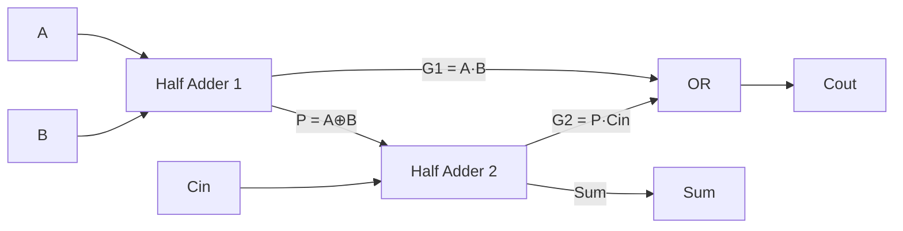
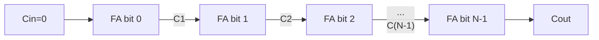

## Learning Objectives

- Derive the truth table and boolean expressions for a half adder (sum = A⊕B, carry = A·B) and explain why it cannot be chained to add multi-bit numbers.
- Derive the truth table and boolean expressions for a full adder (sum = A⊕B⊕Cin, carry-out = majority of A, B, Cin) and describe its gate-level construction from two half adders.
- Chain N full adders into an N-bit ripple-carry adder and trace carry propagation through a concrete addition.
- Explain why ripple-carry propagation delay grows as O(N) and why this motivates carry-lookahead adders, without deriving carry-lookahead in full.
- Configure a ripple-carry adder to perform two's-complement subtraction by inverting one operand and setting the initial carry-in to 1, and correctly interpret its carry-out and overflow signals.

## Context & Motivation

Multiplexers and decoders, the preceding concept, are purely routing components — they select or activate signals but never combine two data values arithmetically. Binary adders are the first combinational building block covered so far that actually computes something: given two binary numbers, an adder produces their sum, entirely from gates, with no notion of a running total or a clock. Addition is not just one arithmetic operation among many — it is the operation most other arithmetic is built on. Two's-complement subtraction, revisited concretely here, reduces to addition of a complemented operand; multiplication and division algorithms are themselves built from repeated addition and shifting. An adder is therefore a load-bearing component of every ALU ever built, and the ALU (concept 18, two concepts ahead) is explicitly described in this curriculum as "using the adder" designed here.

The engineering story behind the adder is also instructive about a recurring tension in hardware design: correctness versus speed. A half adder correctly adds two single bits but has no way to accept a carry from a less-significant position, which makes it unusable on its own for multi-bit numbers. A full adder fixes this by accepting a carry-in, and chaining N full adders together — each one's carry-out feeding the next one's carry-in — produces a completely correct N-bit adder, called a ripple-carry adder because the carry signal "ripples" from the least significant bit toward the most significant one. This design is simple, regular, and easy to build for any width N, but its worst-case delay grows linearly with N, because the most-significant sum bit cannot be trusted stable until every carry below it has propagated through. That a completely correct, simple design can still be too slow for a wide adder is exactly the motivation for the carry-lookahead adder, a faster but structurally more complex design computing carries for many bit positions in parallel rather than waiting for them to ripple. This concept builds that motivation without deriving carry-lookahead's equations, leaving that as a natural next step.

Looking forward, this concept directly depends on the two's-complement representation covered earlier (concept 2): inverting a number's bits and adding 1 produces its negation, which is precisely what makes it possible to reuse one adder circuit for both addition and subtraction, by feeding it a complemented operand and a suitably chosen carry-in. That reuse is exactly what the ALU will do, and it is worked through concretely in Worked Example 3 below.

## Core Theory

### The half adder

A half adder adds two single bits, A and B, producing a sum bit and a carry-out bit, with no carry-in of its own. Its truth table:

| A | B | Sum | Carry |
|---|---|---|---|
| 0 | 0 | 0 | 0 |
| 0 | 1 | 1 | 0 |
| 1 | 0 | 1 | 0 |
| 1 | 1 | 0 | 1 |

Reading the Sum column: it is 1 exactly when A and B differ, which is precisely the definition of the XOR operation. Reading the Carry column: it is 1 exactly when both A and B are 1, which is the AND operation. This gives the compact expressions:

```
Sum   = A ⊕ B
Carry = A · B
```

A half adder is built from exactly one XOR gate and one AND gate — sharing the same two inputs A and B, computed in parallel. Its fundamental limitation is architectural, not just a matter of extra gates: it has no input for a carry arriving from a less-significant bit position, so two half adders cannot simply be placed side by side to add a 2-bit number, because the second (more significant) half adder would have no way to receive the carry the first one produced.

### The full adder

A full adder removes this limitation by accepting three inputs — A, B, and a carry-in, Cin — and producing two outputs, Sum and a carry-out, Cout. Its truth table has 8 rows:

| A | B | Cin | Sum | Cout |
|---|---|---|---|---|
| 0 | 0 | 0 | 0 | 0 |
| 0 | 0 | 1 | 1 | 0 |
| 0 | 1 | 0 | 1 | 0 |
| 0 | 1 | 1 | 0 | 1 |
| 1 | 0 | 0 | 1 | 0 |
| 1 | 0 | 1 | 0 | 1 |
| 1 | 1 | 0 | 0 | 1 |
| 1 | 1 | 1 | 1 | 1 |

The Sum column is 1 exactly when an odd number of the three inputs are 1 — this is the three-input XOR:

```
Sum = A ⊕ B ⊕ Cin
```

The Cout column is 1 exactly when two or more of the three inputs are 1 — this is the majority function of A, B, and Cin, which expands to the sum-of-products form:

```
Cout = A·B + A·Cin + B·Cin
```

(equivalently, Cout = A·B + Cin·(A ⊕ B), a factored form used in the gate-level construction below, since A⊕B is already computed as an intermediate signal).

### Building a full adder from two half adders

A full adder is constructed from exactly two half adders plus one OR gate, making the "half" in "half adder" concrete — it is literally half of what a full adder needs:

1. The first half adder computes A ⊕ B (call it P) and A·B (call it G1).
2. The second half adder takes P and Cin, computing P ⊕ Cin (= A ⊕ B ⊕ Cin, the Sum) and P·Cin (call it G2).
3. An OR gate combines G1 and G2 to produce Cout = G1 + G2 = A·B + (A⊕B)·Cin, matching the factored Cout expression above.



### The N-bit ripple-carry adder

A single full adder adds three bits, but a computer needs to add whole words — 8, 32, or 64 bits at once. The ripple-carry adder places N full adders side by side, one per bit position, wiring the carry-out of bit i directly into the carry-in of bit i+1:

```
bit 0:  FA0(A0, B0, Cin=0)      -> Sum0, C1
bit 1:  FA1(A1, B1, Cin=C1)     -> Sum1, C2
bit 2:  FA2(A2, B2, Cin=C2)     -> Sum2, C3
  ...
bit N-1: FA(N-1)(A(N-1), B(N-1), Cin=C(N-1)) -> Sum(N-1), Cout
```

The least-significant full adder's carry-in is hardwired to 0 (there is no carry coming from a nonexistent bit −1), and the most-significant full adder's carry-out becomes the overall Cout of the whole adder — the signal used to detect unsigned overflow.



### Carry propagation delay and the motivation for carry-lookahead

Every full adder's Sum and Cout outputs depend on its own Cin, which in turn depends on the previous full adder's inputs, all the way back to bit 0. In the worst case — adding `0111...1` to `0000...1`, where a carry generated at bit 0 must ripple through every remaining bit position — the most-significant Sum bit is not guaranteed stable until the carry signal has propagated through all N full adders in sequence. If a single full adder's carry-out takes a fixed gate delay d to become valid after its inputs stabilize, an N-bit ripple-carry adder's worst-case delay is proportional to N·d — O(N). For a 64-bit adder, the critical path is 64 full-adder delays long, a serious bottleneck since the adder's speed directly limits how fast the whole ALU, and therefore the CPU, can run. This is the motivation for the carry-lookahead adder: a design that computes the carry into every bit position directly from the original operand bits, using additional "generate" and "propagate" logic evaluated in parallel, rather than waiting for each carry to ripple sequentially. Carry-lookahead trades gate complexity for a much shorter, closer-to-O(log N), critical path — its generate/propagate equations are a natural extension of this material but are not derived here.

### Reusing the adder for two's-complement subtraction

Two's-complement representation defines the negation of a number x as (¬x) + 1 — invert every bit, then add 1. This means A − B can be computed as A + (¬B) + 1, using the very same ripple-carry adder already built for addition, with two small modifications: every bit of B is first passed through an inverter (gated by a single "subtract" control signal, so the same hardware still performs ordinary addition when that signal is 0), and the adder's initial carry-in (normally 0 for addition) is instead set to 1, supplying the "+1" that two's-complement negation requires. No separate subtractor circuit is needed — the identical array of full adders serves both operations, with only the B-input inverters and the Cin value changing based on the add/subtract control signal. This is exactly the technique the ALU (two concepts ahead) uses to support both addition and subtraction from a single adder datapath.

### Interpreting carry-out and overflow

The most-significant full adder's Cout has two different, non-interchangeable interpretations depending on whether the operands are unsigned or two's-complement signed. For unsigned addition, Cout = 1 signals that the true sum exceeded the N-bit range (an unsigned overflow — the result wrapped around). For signed addition or subtraction, the correct overflow indicator is not Cout by itself, but whether the carry into the most-significant bit differs from the carry out of it (equivalently, whether two same-sign operands produced a result of the opposite sign) — a detail the ALU-flags concept (19) develops further; here it is enough to recognize that Cout's correct interpretation depends on which representation the operands use.

## Worked Examples

### Example 1: Full-adder truth table and expressions, verified

Goal: confirm the full-adder expressions Sum = A⊕B⊕Cin and Cout = A·B + A·Cin + B·Cin against every row of the truth table.

Step 1 — Take row (A,B,Cin) = (1,0,1). Sum = 1⊕0⊕1 = 0 (two of the three bits are 1, an even count, so XOR gives 0). Cout = (1·0)+(1·1)+(0·1) = 1. Cross-check against the truth table row A=1,B=0,Cin=1: Sum=0, Cout=1. Matches.

Step 2 — Take row (A,B,Cin) = (1,1,1), the all-ones case. Sum = 1⊕1⊕1 = 1 (three ones is an odd count). Cout = (1·1)+(1·1)+(1·1) = 1. Cross-check: Sum=1, Cout=1. Matches — this is the maximum-input case, since 1+1+1 = 3 = binary `11`, i.e., Sum=1, Cout=1 read together as a 2-bit result.

Step 3 — Take row (A,B,Cin) = (0,1,0). Sum = 0⊕1⊕0 = 1. Cout = (0·1)+(0·0)+(1·0) = 0. Table says Sum=1, Cout=0. Matches. All three checked rows confirm the boolean expressions exactly reproduce the truth table derived from first principles (odd-parity for Sum, majority for Cout).

### Example 2: Adding two 4-bit numbers with a ripple-carry adder

Goal: compute `A = 0110` (6) plus `B = 0101` (5) using a 4-bit ripple-carry adder, showing the carry generated at each bit position.

Step 0 — Label bits from position 0 (least significant, rightmost) to position 3 (most significant, leftmost): A3A2A1A0 = 0110, B3B2B1B0 = 0101. Initial Cin into bit 0 is 0.

Step 1 (bit 0): A0=0, B0=1, Cin=0. Sum0 = 0⊕1⊕0 = 1. C1 = (0·1)+(0·0)+(1·0) = 0.

Step 2 (bit 1): A1=1, B1=0, Cin=C1=0. Sum1 = 1⊕0⊕0 = 1. C2 = (1·0)+(1·0)+(0·0) = 0.

Step 3 (bit 2): A2=1, B2=1, Cin=C2=0. Sum2 = 1⊕1⊕0 = 0. C3 = (1·1)+(1·0)+(1·0) = 1.

Step 4 (bit 3): A3=0, B3=0, Cin=C3=1. Sum3 = 0⊕0⊕1 = 1. Cout_final = (0·0)+(0·1)+(0·1) = 0.

Step 5 — Assemble the result from most to least significant: Sum3 Sum2 Sum1 Sum0 = `1011`, with final Cout = 0 (no overflow). Convert to decimal: 8+2+1 = 11.

Step 6 — Cross-check: 6 + 5 = 11. The bit-by-bit ripple-carry computation matches direct decimal addition, and the zero final carry-out correctly indicates that 11 fits within the 4-bit unsigned range (0–15).

### Example 3: 4-bit subtraction A − B via add-the-complement

Goal: compute `A = 0111` (7) minus `B = 0011` (3) using the same 4-bit ripple-carry adder from Example 2, by adding A to the two's-complement negation of B.

Step 1 — Invert every bit of B: B = 0011, so ¬B = 1100.

Step 2 — Set the adder's initial carry-in to 1 (instead of 0), supplying the "+1" of two's-complement negation, so the adder effectively computes A + ¬B + 1.

Step 3 (bit 0): A0=1, (¬B)0=0, Cin=1. Sum0 = 1⊕0⊕1 = 0. C1 = (1·0)+(1·1)+(0·1) = 1.

Step 4 (bit 1): A1=1, (¬B)1=0, Cin=C1=1. Sum1 = 1⊕0⊕1 = 0. C2 = (1·0)+(1·1)+(0·1) = 1.

Step 5 (bit 2): A2=1, (¬B)2=1, Cin=C2=1. Sum2 = 1⊕1⊕1 = 1. C3 = (1·1)+(1·1)+(1·1) = 1.

Step 6 (bit 3): A3=0, (¬B)3=1, Cin=C3=1. Sum3 = 0⊕1⊕1 = 0. Cout_final = (0·1)+(0·1)+(1·1) = 1.

Step 7 — Assemble the result: Sum3 Sum2 Sum1 Sum0 = `0100` = 4 in decimal. Final Cout = 1.

Step 8 — Cross-check: 7 − 3 = 4. The result matches directly. Note: for two's-complement subtraction implemented as add-the-complement, a final Cout of 1 here corresponds to "no borrow occurred" — the opposite convention from a genuine borrow flag — exactly the representation-dependent carry/overflow interpretation flagged in Core Theory and developed fully under ALU flags (concept 19). The arithmetic result itself, `0100` = 4, is unambiguous regardless of how the carry-out is labeled.

## Common Misconceptions & Pitfalls

- **"A half adder can add multi-bit numbers if you just place several side by side."** It cannot — a half adder has no carry-in input at all, so a half adder handling bit position 1 would have no way to receive the carry generated at bit position 0. Multi-bit addition requires full adders specifically because they accept a carry-in.
- **"Ripple-carry adders are simply wrong or unusable for wide numbers."** They are completely correct for any width N — every full adder still computes the exact correct Sum and Cout for its local inputs. The issue with wide ripple-carry adders is speed (O(N) worst-case propagation delay), not correctness; carry-lookahead exists to improve speed, not to fix incorrect results.
- **"Two's-complement subtraction needs a completely separate subtractor circuit."** It does not — inverting one operand's bits and setting the adder's carry-in to 1 turns the same full-adder array used for addition into a subtractor, because A − B = A + (¬B) + 1 by the definition of two's-complement negation. This is exactly why ALUs support both operations with one adder plus small extra control logic (input inverters and a Cin mux).
- **"The final carry-out always means the same thing (overflow) regardless of context."** For unsigned addition, Cout=1 does mean the true sum exceeded the representable range. For signed addition or subtraction, correct overflow detection instead compares the carry into the most-significant bit against the carry out of it — the raw Cout bit alone, especially after an add-the-complement subtraction, can even invert the intuitive "borrow" meaning, as shown in Worked Example 3.
- **"Majority function and XOR are just two ways of describing the same relationship for three bits."** They are different functions: three-input XOR (odd parity) produces the correct Sum bit, while majority (two-or-more-are-1) produces the correct Cout bit — a full adder needs both functions computed from the same three inputs, and conflating them produces a circuit that gets Sum or Cout wrong on multiple truth-table rows.

## Summary

A half adder computes Sum = A⊕B and Carry = A·B from two bits but has no carry-in, so it cannot be chained for multi-bit arithmetic; a full adder fixes this by also accepting a carry-in, computing Sum = A⊕B⊕Cin (odd parity) and Cout as the majority of A, B, and Cin, and is itself built from two half adders plus an OR gate. Chaining N full adders, carry-out to carry-in, produces a completely correct N-bit ripple-carry adder, but its worst-case propagation delay grows as O(N), which is the direct engineering motivation for faster, more complex carry-lookahead designs. The same adder hardware performs two's-complement subtraction by inverting one operand and injecting a carry-in of 1 — no separate subtractor circuit is needed — though the resulting carry-out must be interpreted differently for unsigned versus signed operands. Having built the first genuinely arithmetic combinational component from gates, the next concepts turn to sequential circuits — latches and flip-flops — which add the ability to hold state over time, a capability every purely combinational circuit covered so far, including this adder, fundamentally lacks.

## Documentation Links

- [Nand2Tetris — Build a Modern Computer from First Principles](https://www.coursera.org/learn/build-a-computer) — course project building half adders, full adders, and a multi-bit adder from elementary gates.
- [Harris & Harris — Digital Design and Computer Architecture, RISC-V Edition](https://shop.elsevier.com/books/digital-design-and-computer-architecture-risc-v-edition/harris/978-0-12-820064-3) — textbook treatment of half/full adders, ripple-carry addition, carry-lookahead motivation, and two's-complement adder/subtractor design.
