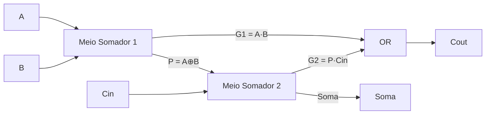
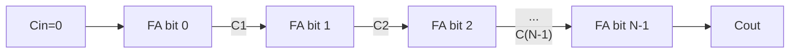

## Objetivos de Aprendizagem

- Derivar a tabela verdade e as expressões booleanas de um meio somador (soma = A⊕B, carry = A·B) e explicar por que ele não pode ser encadeado para somar números de vários bits.
- Derivar a tabela verdade e as expressões booleanas de um somador completo (soma = A⊕B⊕Cin, carry de saída = maioria de A, B, Cin) e descrever sua construção em nível de portas a partir de dois meios somadores.
- Encadear N somadores completos num somador ripple-carry de N bits e acompanhar a propagação do carry numa soma concreta.
- Explicar por que o atraso de propagação do ripple-carry cresce como O(N) e por que isso motiva os somadores carry-lookahead, sem derivar o carry-lookahead por completo.
- Configurar um somador ripple-carry para fazer subtração em complemento de dois invertendo um operando e colocando o carry de entrada inicial em 1, e interpretar corretamente seus sinais de carry de saída e de overflow.

## Contexto e Motivação

Multiplexadores e decodificadores, o conceito anterior, são componentes puramente de roteamento: eles selecionam ou ativam sinais, mas nunca combinam dois valores de dados aritmeticamente. Os somadores binários são o primeiro bloco combinacional visto até aqui que de fato calcula algo: dados dois números binários, um somador produz sua soma, inteiramente com portas, sem noção de total acumulado nem de clock. A soma não é só uma operação aritmética entre muitas: é a operação sobre a qual a maior parte da aritmética é construída. A subtração em complemento de dois, revisitada aqui de forma concreta, se reduz à soma de um operando complementado; os algoritmos de multiplicação e divisão são eles mesmos construídos com somas e deslocamentos repetidos. Um somador é, portanto, um componente estrutural de toda ULA já construída, e a ULA (conceito 18, dois conceitos à frente) é descrita explicitamente neste currículo como "usando o somador" projetado aqui.

A história de engenharia por trás do somador também ensina algo sobre uma tensão recorrente no projeto de hardware: correção versus velocidade. Um meio somador soma corretamente dois bits isolados, mas não tem como aceitar um carry vindo de uma posição menos significativa, o que o torna inutilizável sozinho para números de vários bits. Um somador completo resolve isso aceitando um carry de entrada, e encadear N somadores completos (com o carry de saída de cada um alimentando o carry de entrada do próximo) produz um somador de N bits completamente correto, chamado ripple-carry porque o sinal de carry "ondula" do bit menos significativo em direção ao mais significativo. Esse projeto é simples, regular e fácil de construir para qualquer largura N, mas seu atraso no pior caso cresce linearmente com N, porque o bit de soma mais significativo não pode ser considerado estável até que todo carry abaixo dele tenha se propagado. Que um projeto completamente correto e simples ainda possa ser lento demais para um somador largo é exatamente a motivação do somador carry-lookahead, um projeto mais rápido, mas estruturalmente mais complexo, que calcula os carries de muitas posições de bit em paralelo, em vez de esperar que eles ondulem. Este conceito constrói essa motivação sem derivar as equações do carry-lookahead, deixando isso como um próximo passo natural.

Olhando adiante, este conceito depende diretamente da representação em complemento de dois vista antes (conceito 2): inverter os bits de um número e somar 1 produz sua negação, e é precisamente isso que torna possível reaproveitar um único circuito somador tanto para soma quanto para subtração, alimentando-o com um operando complementado e um carry de entrada escolhido adequadamente. Esse reaproveitamento é exatamente o que a ULA vai fazer, e ele é trabalhado concretamente no Exemplo Resolvido 3 abaixo.

## Teoria Central

### O meio somador

Um meio somador soma dois bits isolados, A e B, produzindo um bit de soma e um bit de carry de saída, sem carry de entrada próprio. Sua tabela verdade:

| A | B | Soma | Carry |
|---|---|---|---|
| 0 | 0 | 0 | 0 |
| 0 | 1 | 1 | 0 |
| 1 | 0 | 1 | 0 |
| 1 | 1 | 0 | 1 |

Lendo a coluna Soma: ela vale 1 exatamente quando A e B são diferentes, que é precisamente a definição da operação XOR. Lendo a coluna Carry: ela vale 1 exatamente quando A e B são ambos 1, que é a operação AND. Isso dá as expressões compactas:

```
Soma  = A ⊕ B
Carry = A · B
```

Um meio somador é construído com exatamente uma porta XOR e uma porta AND, compartilhando as mesmas duas entradas A e B, calculadas em paralelo. Sua limitação fundamental é arquitetural, e não só uma questão de portas a mais: ele não tem entrada para um carry vindo de uma posição de bit menos significativa, então dois meios somadores não podem simplesmente ser colocados lado a lado para somar um número de 2 bits, porque o segundo meio somador (o mais significativo) não teria como receber o carry que o primeiro produziu.

### O somador completo

Um somador completo remove essa limitação aceitando três entradas (A, B e um carry de entrada, Cin) e produzindo duas saídas, Soma e um carry de saída, Cout. Sua tabela verdade tem 8 linhas:

| A | B | Cin | Soma | Cout |
|---|---|---|---|---|
| 0 | 0 | 0 | 0 | 0 |
| 0 | 0 | 1 | 1 | 0 |
| 0 | 1 | 0 | 1 | 0 |
| 0 | 1 | 1 | 0 | 1 |
| 1 | 0 | 0 | 1 | 0 |
| 1 | 0 | 1 | 0 | 1 |
| 1 | 1 | 0 | 0 | 1 |
| 1 | 1 | 1 | 1 | 1 |

A coluna Soma vale 1 exatamente quando um número ímpar das três entradas vale 1: é o XOR de três entradas:

```
Soma = A ⊕ B ⊕ Cin
```

A coluna Cout vale 1 exatamente quando duas ou mais das três entradas valem 1: é a função maioria de A, B e Cin, que se expande na forma soma de produtos:

```
Cout = A·B + A·Cin + B·Cin
```

(de forma equivalente, Cout = A·B + Cin·(A ⊕ B), uma forma fatorada usada na construção em nível de portas abaixo, já que A⊕B já é calculado como sinal intermediário).

### Construindo um somador completo com dois meios somadores

Um somador completo é construído com exatamente dois meios somadores mais uma porta OR, o que torna concreto o "meio" de "meio somador": ele é literalmente metade do que um somador completo precisa:

1. O primeiro meio somador calcula A ⊕ B (chame de P) e A·B (chame de G1).
2. O segundo meio somador recebe P e Cin, calculando P ⊕ Cin (= A ⊕ B ⊕ Cin, a Soma) e P·Cin (chame de G2).
3. Uma porta OR combina G1 e G2 para produzir Cout = G1 + G2 = A·B + (A⊕B)·Cin, batendo com a expressão fatorada de Cout acima.



### O somador ripple-carry de N bits

Um único somador completo soma três bits, mas um computador precisa somar palavras inteiras: 8, 32 ou 64 bits de uma vez. O somador ripple-carry coloca N somadores completos lado a lado, um por posição de bit, ligando o carry de saída do bit i diretamente no carry de entrada do bit i+1:

```
bit 0:  FA0(A0, B0, Cin=0)      -> Soma0, C1
bit 1:  FA1(A1, B1, Cin=C1)     -> Soma1, C2
bit 2:  FA2(A2, B2, Cin=C2)     -> Soma2, C3
  ...
bit N-1: FA(N-1)(A(N-1), B(N-1), Cin=C(N-1)) -> Soma(N-1), Cout
```

O carry de entrada do somador completo menos significativo é fixado em 0 (não há carry vindo de um bit −1 inexistente), e o carry de saída do somador completo mais significativo vira o Cout geral do somador inteiro, o sinal usado para detectar overflow sem sinal.



### Atraso de propagação do carry e a motivação para o carry-lookahead

As saídas Soma e Cout de cada somador completo dependem do seu próprio Cin, que por sua vez depende das entradas do somador completo anterior, até o bit 0. No pior caso (somar `0111...1` com `0000...1`, em que um carry gerado no bit 0 precisa ondular por todas as posições de bit restantes), o bit de Soma mais significativo só fica garantidamente estável depois que o sinal de carry se propagou em sequência pelos N somadores completos. Se o carry de saída de um único somador completo leva um atraso de porta fixo d para ficar válido depois que suas entradas se estabilizam, o atraso no pior caso de um somador ripple-carry de N bits é proporcional a N·d, ou seja, O(N). Num somador de 64 bits, o caminho crítico tem 64 atrasos de somador completo, um gargalo sério, já que a velocidade do somador limita diretamente quão rápido a ULA inteira, e portanto a CPU, consegue rodar. Essa é a motivação do somador carry-lookahead: um projeto que calcula o carry de entrada de cada posição de bit diretamente a partir dos bits originais dos operandos, usando lógica adicional de "geração" e "propagação" avaliada em paralelo, em vez de esperar que cada carry ondule em sequência. O carry-lookahead troca complexidade de portas por um caminho crítico muito mais curto, mais próximo de O(log N); suas equações de geração e propagação são uma extensão natural deste material, mas não são derivadas aqui.

### Reaproveitando o somador para subtração em complemento de dois

A representação em complemento de dois define a negação de um número x como (¬x) + 1: inverter todos os bits e somar 1. Isso significa que A − B pode ser calculado como A + (¬B) + 1, usando exatamente o mesmo somador ripple-carry já construído para a soma, com duas pequenas modificações: cada bit de B passa primeiro por um inversor (controlado por um único sinal de "subtrair", de modo que o mesmo hardware ainda faça a soma comum quando esse sinal vale 0), e o carry de entrada inicial do somador (normalmente 0 na soma) é colocado em 1, fornecendo o "+1" que a negação em complemento de dois exige. Nenhum circuito subtrator separado é necessário: o mesmo arranjo de somadores completos serve às duas operações, mudando só os inversores na entrada B e o valor de Cin conforme o sinal de controle de soma ou subtração. É exatamente essa a técnica que a ULA (dois conceitos à frente) usa para suportar soma e subtração com um único datapath de somador.

### Interpretando o carry de saída e o overflow

O Cout do somador completo mais significativo tem duas interpretações diferentes e não intercambiáveis, dependendo de os operandos serem sem sinal ou com sinal em complemento de dois. Na soma sem sinal, Cout = 1 sinaliza que a soma verdadeira excedeu a faixa de N bits (um overflow sem sinal: o resultado deu a volta). Na soma ou subtração com sinal, o indicador correto de overflow não é o Cout sozinho, mas sim se o carry que entra no bit mais significativo difere do carry que sai dele (de forma equivalente, se dois operandos de mesmo sinal produziram um resultado de sinal oposto), um detalhe que o conceito de flags da ULA (19) desenvolve mais; aqui basta reconhecer que a interpretação correta do Cout depende de qual representação os operandos usam.

## Exemplos Resolvidos

### Exemplo 1: tabela verdade e expressões do somador completo, verificadas

Objetivo: confirmar as expressões do somador completo Soma = A⊕B⊕Cin e Cout = A·B + A·Cin + B·Cin contra as linhas da tabela verdade.

Passo 1: pegue a linha (A,B,Cin) = (1,0,1). Soma = 1⊕0⊕1 = 0 (dois dos três bits valem 1, uma contagem par, então o XOR dá 0). Cout = (1·0)+(1·1)+(0·1) = 1. Conferindo com a linha A=1,B=0,Cin=1 da tabela verdade: Soma=0, Cout=1. Bate.

Passo 2: pegue a linha (A,B,Cin) = (1,1,1), o caso de tudo em um. Soma = 1⊕1⊕1 = 1 (três uns é uma contagem ímpar). Cout = (1·1)+(1·1)+(1·1) = 1. Conferindo: Soma=1, Cout=1. Bate; este é o caso de entrada máxima, já que 1+1+1 = 3 = binário `11`, ou seja, Soma=1 e Cout=1 lidos juntos como um resultado de 2 bits.

Passo 3: pegue a linha (A,B,Cin) = (0,1,0). Soma = 0⊕1⊕0 = 1. Cout = (0·1)+(0·0)+(1·0) = 0. A tabela diz Soma=1, Cout=0. Bate. As três linhas conferidas confirmam que as expressões booleanas reproduzem exatamente a tabela verdade derivada dos primeiros princípios (paridade ímpar para a Soma, maioria para o Cout).

### Exemplo 2: somando dois números de 4 bits com um somador ripple-carry

Objetivo: calcular `A = 0110` (6) mais `B = 0101` (5) com um somador ripple-carry de 4 bits, mostrando o carry gerado em cada posição de bit.

Passo 0: numere os bits da posição 0 (menos significativa, mais à direita) até a posição 3 (mais significativa, mais à esquerda): A3A2A1A0 = 0110, B3B2B1B0 = 0101. O Cin inicial no bit 0 é 0.

Passo 1 (bit 0): A0=0, B0=1, Cin=0. Soma0 = 0⊕1⊕0 = 1. C1 = (0·1)+(0·0)+(1·0) = 0.

Passo 2 (bit 1): A1=1, B1=0, Cin=C1=0. Soma1 = 1⊕0⊕0 = 1. C2 = (1·0)+(1·0)+(0·0) = 0.

Passo 3 (bit 2): A2=1, B2=1, Cin=C2=0. Soma2 = 1⊕1⊕0 = 0. C3 = (1·1)+(1·0)+(1·0) = 1.

Passo 4 (bit 3): A3=0, B3=0, Cin=C3=1. Soma3 = 0⊕0⊕1 = 1. Cout_final = (0·0)+(0·1)+(0·1) = 0.

Passo 5: monte o resultado do mais para o menos significativo: Soma3 Soma2 Soma1 Soma0 = `1011`, com Cout final = 0 (sem overflow). Convertendo para decimal: 8+2+1 = 11.

Passo 6: conferindo: 6 + 5 = 11. O cálculo ripple-carry bit a bit bate com a soma decimal direta, e o carry de saída final zero indica corretamente que 11 cabe na faixa sem sinal de 4 bits (0 a 15).

### Exemplo 3: subtração de 4 bits A − B somando o complemento

Objetivo: calcular `A = 0111` (7) menos `B = 0011` (3) com o mesmo somador ripple-carry de 4 bits do Exemplo 2, somando A à negação em complemento de dois de B.

Passo 1: inverta cada bit de B: B = 0011, então ¬B = 1100.

Passo 2: coloque o carry de entrada inicial do somador em 1 (em vez de 0), fornecendo o "+1" da negação em complemento de dois, de modo que o somador calcule efetivamente A + ¬B + 1.

Passo 3 (bit 0): A0=1, (¬B)0=0, Cin=1. Soma0 = 1⊕0⊕1 = 0. C1 = (1·0)+(1·1)+(0·1) = 1.

Passo 4 (bit 1): A1=1, (¬B)1=0, Cin=C1=1. Soma1 = 1⊕0⊕1 = 0. C2 = (1·0)+(1·1)+(0·1) = 1.

Passo 5 (bit 2): A2=1, (¬B)2=1, Cin=C2=1. Soma2 = 1⊕1⊕1 = 1. C3 = (1·1)+(1·1)+(1·1) = 1.

Passo 6 (bit 3): A3=0, (¬B)3=1, Cin=C3=1. Soma3 = 0⊕1⊕1 = 0. Cout_final = (0·1)+(0·1)+(1·1) = 1.

Passo 7: monte o resultado: Soma3 Soma2 Soma1 Soma0 = `0100` = 4 em decimal. Cout final = 1.

Passo 8: conferindo: 7 − 3 = 4. O resultado bate diretamente. Observação: na subtração em complemento de dois implementada como soma do complemento, um Cout final de 1 aqui corresponde a "não houve empréstimo", a convenção oposta à de uma flag de empréstimo genuína; é exatamente a interpretação de carry/overflow dependente da representação, apontada na Teoria Central e desenvolvida por completo em flags da ULA (conceito 19). O resultado aritmético em si, `0100` = 4, é inequívoco, seja qual for o rótulo dado ao carry de saída.

## Equívocos Comuns e Armadilhas

- **"Um meio somador consegue somar números de vários bits se você colocar vários lado a lado."** Não consegue: um meio somador não tem entrada de carry, então um meio somador cuidando da posição de bit 1 não teria como receber o carry gerado na posição de bit 0. A soma de vários bits exige somadores completos justamente porque eles aceitam um carry de entrada.
- **"Somadores ripple-carry são simplesmente errados ou inutilizáveis para números largos."** Eles são completamente corretos para qualquer largura N: cada somador completo continua calculando a Soma e o Cout exatos para suas entradas locais. O problema dos somadores ripple-carry largos é a velocidade (atraso de propagação O(N) no pior caso), não a correção; o carry-lookahead existe para melhorar a velocidade, não para corrigir resultados errados.
- **"A subtração em complemento de dois precisa de um circuito subtrator completamente separado."** Não precisa: inverter os bits de um operando e colocar o carry de entrada do somador em 1 transforma o mesmo arranjo de somadores completos usado na soma num subtrator, porque A − B = A + (¬B) + 1 pela definição da negação em complemento de dois. É exatamente por isso que as ULAs suportam as duas operações com um único somador mais uma pequena lógica de controle extra (inversores na entrada e um mux de Cin).
- **"O carry de saída final sempre significa a mesma coisa (overflow), seja qual for o contexto."** Na soma sem sinal, Cout=1 de fato significa que a soma verdadeira excedeu a faixa representável. Na soma ou subtração com sinal, a detecção correta de overflow compara o carry que entra no bit mais significativo com o carry que sai dele; o bit Cout bruto sozinho, especialmente depois de uma subtração por soma do complemento, pode até inverter o significado intuitivo de "empréstimo", como mostrado no Exemplo Resolvido 3.
- **"A função maioria e o XOR são só duas formas de descrever a mesma relação entre três bits."** São funções diferentes: o XOR de três entradas (paridade ímpar) produz o bit de Soma correto, enquanto a maioria (dois ou mais valem 1) produz o bit Cout correto. Um somador completo precisa das duas funções calculadas a partir das mesmas três entradas, e confundi-las produz um circuito que erra a Soma ou o Cout em várias linhas da tabela verdade.

## Resumo

Um meio somador calcula Soma = A⊕B e Carry = A·B a partir de dois bits, mas não tem carry de entrada, então não pode ser encadeado para aritmética de vários bits; um somador completo resolve isso aceitando também um carry de entrada, calculando Soma = A⊕B⊕Cin (paridade ímpar) e Cout como a maioria de A, B e Cin, e é ele mesmo construído com dois meios somadores mais uma porta OR. Encadear N somadores completos, carry de saída no carry de entrada, produz um somador ripple-carry de N bits completamente correto, mas seu atraso de propagação no pior caso cresce como O(N), que é a motivação direta de engenharia para projetos carry-lookahead mais rápidos e mais complexos. O mesmo hardware de somador faz a subtração em complemento de dois invertendo um operando e injetando um carry de entrada 1, sem precisar de circuito subtrator separado, embora o carry de saída resultante precise ser interpretado de forma diferente para operandos sem sinal e com sinal. Construído o primeiro componente combinacional genuinamente aritmético a partir de portas, os próximos conceitos se voltam para os circuitos sequenciais (latches e flip-flops), que acrescentam a capacidade de guardar estado ao longo do tempo, algo que falta fundamentalmente a todo circuito puramente combinacional visto até aqui, incluindo este somador.

## Documentation Links

- [Nand2Tetris: Build a Modern Computer from First Principles](https://www.coursera.org/learn/build-a-computer): projeto do curso que constrói meios somadores, somadores completos e um somador de vários bits a partir de portas elementares.
- [Harris & Harris: Digital Design and Computer Architecture, RISC-V Edition](https://shop.elsevier.com/books/digital-design-and-computer-architecture-risc-v-edition/harris/978-0-12-820064-3): tratamento de livro-texto de meios somadores e somadores completos, soma ripple-carry, motivação do carry-lookahead e projeto de somador/subtrator em complemento de dois.
