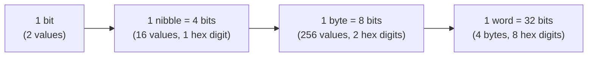
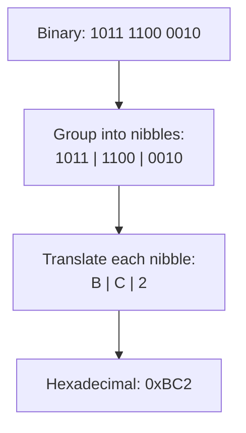

## Learning Objectives

- Define a bit as a two-valued unit of information and explain why physical digital circuits are built around two stable voltage levels rather than more.
- Convert an unsigned N-bit binary number to its decimal value, and convert a non-negative decimal integer to binary using repeated division by 2.
- Convert freely between binary, octal, and hexadecimal by grouping bits in threes and fours, and explain why this grouping works.
- Compute how many distinct values an N-bit field can represent, and state the exact range of unsigned values a byte, a 16-bit word, and a 32-bit word can hold.
- Distinguish a bit, a nibble, a byte, and a word, and identify how many bits each one is.

## Context & Motivation

Every digital computer, from a microcontroller in a thermostat to a warehouse-scale datacenter, is built out of circuits that reliably distinguish only two conditions: a voltage near some reference level (call it 0) and a voltage near a higher reference level (call it 1). This is not an arbitrary design choice made for mathematical convenience — it is an engineering decision about noise margins. A circuit that tried to reliably distinguish ten voltage levels, to work directly in decimal, would need to keep every signal within a much narrower band to avoid misreading a 4 as a 5, and that narrow band would need to survive manufacturing variation, temperature drift, and electrical noise on every wire in the system. A circuit that only has to distinguish "low" from "high" can tolerate enormous noise before a 0 is ever misread as a 1. MIT's 6.004 (Computation Structures) opens on precisely this point: binary is not a mathematical nicety layered on top of computing, it is the physical substrate that makes reliable digital computation possible at all. Claude Shannon's 1937 master's thesis had already shown that Boolean algebra maps directly onto switching circuits built from relays; two-valued logic and two-valued circuits are the same idea seen from two directions.

Because the machine's native alphabet is exactly two symbols, every quantity a computer stores or moves — an integer, a character, a floating-point number, a machine instruction — is, underneath, a string of bits. The number base used to write those bits down for human consumption is a separate, purely notational question. Decimal is convenient for humans because we have ten fingers; binary is what the hardware actually implements; and octal and hexadecimal exist purely as compact, error-resistant shorthand for long bit strings, because no engineer wants to proofread or debug a 32-character string of 0s and 1s by eye. Understanding number bases is therefore not an abstract mathematical exercise bolted onto computer organization — it is the vocabulary needed to read a memory dump, a network packet capture, a register value in a debugger, or a color code in a graphics API, all of which are conventionally displayed in hexadecimal precisely because it packs four bits per readable character with a clean, lossless mapping.

## Core Theory

### Bits and positional number systems

A **bit** (binary digit) is a single unit of information taking one of two values, 0 or 1. Any positional number system represents a quantity as a weighted sum of digits, where the weight of a digit depends on its position. In base `b`, a string of digits `d_(n-1) d_(n-2) ... d_1 d_0` (each `d_i` in the range 0 to `b-1`) represents the value:

```
value = d_(n-1) * b^(n-1) + d_(n-2) * b^(n-2) + ... + d_1 * b^1 + d_0 * b^0
```

Decimal is the familiar case with `b = 10` and digits 0 through 9. Binary is the case with `b = 2` and digits restricted to {0, 1}. For example, the binary string `1011` represents:

```
1*2^3 + 0*2^2 + 1*2^1 + 1*2^0 = 8 + 0 + 2 + 1 = 11
```

This is the exact mechanism behind Learning Objective 2: to convert an unsigned N-bit binary number to decimal, multiply each bit by its positional power of 2 (position 0 is the rightmost, least significant bit) and sum the results.

### Decimal-to-binary conversion by repeated division

To go the other direction — decimal to binary — the standard algorithm is repeated division by 2, keeping the remainders:

1. Divide the decimal value by 2; record the remainder (0 or 1).
2. Replace the value with the integer quotient.
3. Repeat until the quotient reaches 0.
4. Read the remainders in reverse order (last computed remainder first) to get the binary digits from most significant to least significant.

This works because each division-by-2 step strips off the current least-significant bit: a number's parity (even/odd) is exactly its bit-0 value, and integer division by 2 shifts every remaining bit one position to the right, exposing the next bit as the new remainder.

### Bits, nibbles, bytes, and words

Bits are grouped into larger, named units purely by convention, but these conventions are load-bearing throughout computer organization:

| Unit | Size | Typical role |
|---|---|---|
| Bit | 1 bit | Smallest unit of information |
| Nibble | 4 bits | Exactly one hexadecimal digit |
| Byte | 8 bits | Smallest individually addressable unit of memory on virtually all modern machines |
| Word | Architecture-dependent (commonly 32 or 64 bits) | The machine's natural register/operand size |

An N-bit field, taken as an unsigned quantity, can represent exactly `2^N` distinct values, ranging from 0 to `2^N - 1`. This single fact underlies almost every capacity calculation in computer organization: a byte (`N = 8`) represents `2^8 = 256` distinct values, 0 through 255; a 16-bit field represents `2^16 = 65536` values, 0 through 65535; a 32-bit field represents `2^32 = 4294967296` values, 0 through 4294967295.



### Octal and hexadecimal as grouped binary

Octal (base 8) and hexadecimal (base 16) are used almost exclusively as compact stand-ins for binary, and the reason they work so cleanly is that both 8 and 16 are powers of 2: `8 = 2^3` and `16 = 2^4`. Because of this, converting between binary and octal, or between binary and hexadecimal, never requires the general positional-arithmetic conversion algorithm — it reduces to grouping bits and translating each group independently, with no carries or borrows crossing group boundaries.

For hexadecimal: group the bits of a binary number into clusters of 4, starting from the least significant bit (pad the most-significant cluster with leading zeros if needed), and translate each group of 4 bits directly into one hex digit (0–9, then A–F for values 10–15). For octal: group into clusters of 3 and translate each group into one octal digit (0–7).

Why does grouping work? Consider a hex digit at position `k` (counting hex digits from the right starting at 0). Its weight is `16^k = (2^4)^k = 2^(4k)`. That is exactly the weight of the bit 4k positions to the right of the corresponding bit in the full binary expansion. So a group of 4 consecutive bits, interpreted as a 4-bit binary number, always corresponds precisely to one hex digit's contribution to the total value — the grouping is a lossless, carry-free re-encoding of the identical value, not an approximation.



Hexadecimal is preferred over octal in almost all modern systems programming and debugging contexts specifically because 4 divides evenly into byte size (8) and common word sizes (32, 64), so hex digits align exactly on byte boundaries (2 hex digits per byte) — a property octal (3-bit grouping) does not share with 8- or 32-bit quantities.

### Converting the other way: any base to decimal, and hex/octal to binary

To convert a hexadecimal or octal number back to binary, reverse the grouping: replace each digit with its fixed-width binary equivalent (4 bits per hex digit, 3 bits per octal digit) and concatenate. To convert hex or octal directly to decimal, apply the same weighted-sum formula from the "Bits and positional number systems" section above, using `b = 16` or `b = 8` respectively.

## Worked Examples

### Example 1: Converting the byte value 0xB6 to binary and decimal

Start from the hexadecimal representation `0xB6` (two hex digits, so one byte, 8 bits).

Step 1 — expand each hex digit to 4 bits: `B` = 11 in decimal = `1011` in binary; `6` = `0110` in binary.

Step 2 — concatenate: `0xB6 = 1011 0110`.

Step 3 — convert the binary to decimal using positional weights (bit 7 down to bit 0, left to right): `1 0 1 1 0 1 1 0`
```
1*128 + 0*64 + 1*32 + 1*16 + 0*8 + 1*4 + 1*2 + 0*1
= 128 + 32 + 16 + 4 + 2
= 182
```

Cross-check directly from hex: `0xB6 = 11*16 + 6*1 = 176 + 6 = 182`. Both paths agree, confirming the grouping-based hex-to-binary conversion was lossless.

### Example 2: Converting decimal 201 to binary, then to hex and octal

**Decimal to binary**, by repeated division by 2:

```
201 / 2 = 100 remainder 1
100 / 2 = 50  remainder 0
50  / 2 = 25  remainder 0
25  / 2 = 12  remainder 1
12  / 2 = 6   remainder 0
6   / 2 = 3   remainder 0
3   / 2 = 1   remainder 1
1   / 2 = 0   remainder 1
```

Reading the remainders from bottom to top: `1100 1001`. Check: `128 + 64 + 8 + 1 = 201`. Correct.

**Binary to hex**, grouping into nibbles from the right: `1100 | 1001` → `C | 9` → `0xC9`. Check: `12*16 + 9 = 192 + 9 = 201`. Correct.

**Binary to octal**, grouping into groups of 3 from the right (pad the leftmost group with a leading zero since 8 bits is not a multiple of 3): `011 001 001` → `3 1 1` → `0o311`. Check: `3*64 + 1*8 + 1*1 = 192 + 8 + 1 = 201`. Correct.

In Python, these conversions can be verified directly:

```python
n = 201
print(bin(n))
print(hex(n))
print(oct(n))
print(int('11001001', 2))
print(int('C9', 16))
```

## Common Misconceptions & Pitfalls

- **"Binary, octal, and hexadecimal are different kinds of numbers."** They are not — they are three different notations for writing down the same underlying quantity, exactly the way "12", "twelve", and "XII" all denote the identical number in different notations. A value stored in a register does not "become" hexadecimal when a debugger displays it that way; the hex string is just how the display happened to render the same bit pattern.
- **"Converting hex to binary requires the general division/multiplication algorithm."** It does not, and using that heavier machinery obscures why hex is useful in the first place. Because 16 is `2^4`, hex-to-binary conversion is a direct digit-by-digit substitution (each hex digit becomes exactly 4 bits) with no carries — the general positional-conversion algorithm is only needed when the two bases involved do not share a common power-of-2 relationship (for example, converting decimal to hex directly).
- **"An 8-bit byte can hold decimal values 0 through 256."** An 8-bit field has `2^8 = 256` distinct patterns, but since it starts counting at 0, the range is 0 through 255 inclusive — 256 itself requires a 9th bit. This off-by-one is one of the most common practical bugs when reasoning about capacity (e.g., assuming a byte "goes up to 256").
- **"More digits always means a bigger number, regardless of base."** A 4-digit hexadecimal number (up to `0xFFFF` = 65535) represents far more distinct values than a 4-digit binary number (up to `1111` = 15) — digit count only measures magnitude meaningfully within a fixed base; comparing digit counts across different bases says nothing on its own.
- **"Leading zeros change a binary number's value."** Padding `1011` to `00001011` does not change the represented value (both equal 11), because leading zero digits contribute 0 at their respective positional weights. This matters when grouping bits into nibbles or byte-aligned widths, which routinely requires padding the most-significant end with zeros.

## Summary

A bit is the machine's fundamental two-valued unit of information, chosen because binary circuits tolerate far more electrical noise than circuits that would need to distinguish ten or more distinct voltage levels. Any non-negative integer can be written in any positional base `b` as a weighted sum of digits times powers of `b`; binary (`b=2`) is what hardware implements natively, while octal (`b=8`) and hexadecimal (`b=16`) are purely notational conveniences chosen because they are powers of 2, letting bits be translated in fixed-size, carry-free groups (3 bits per octal digit, 4 bits per hex digit) rather than requiring general base-conversion arithmetic. An N-bit field holds exactly `2^N` distinct unsigned values, from 0 to `2^N - 1` — the source of the standard capacities of a byte (8 bits, 256 values), and larger words built from multiple bytes. These are purely notational and capacity facts about bit patterns; the next concept, two's-complement representation, builds on exactly this foundation to explain how the same bit patterns are made to represent negative numbers as well.

## Documentation Links

- [ACM/IEEE CS2013 — Architecture and Organization Knowledge Area](https://csed.acm.org/knowledge-areas-architecture-and-organization-ar-cs2013-version/) — curriculum guidelines covering number representation and digital logic as foundational Architecture and Organization topics.
- [MIT 6.004 — OCW Syllabus](https://ocw.mit.edu/courses/6-004-computation-structures-spring-2017/pages/syllabus/) — course syllabus for Computation Structures, whose opening units motivate binary representation from the physics of noise-tolerant digital circuits.
