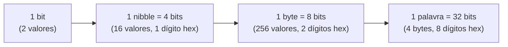
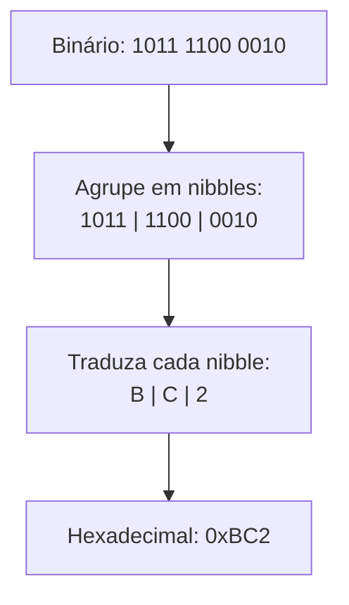

## Objetivos de Aprendizagem

- Definir um bit como uma unidade de informação de dois valores e explicar por que os circuitos digitais físicos são construídos em torno de dois níveis de tensão estáveis, e não de mais.
- Converter um número binário sem sinal de N bits para seu valor decimal, e converter um inteiro decimal não negativo para binário usando divisões sucessivas por 2.
- Converter livremente entre binário, octal e hexadecimal agrupando bits de três em três e de quatro em quatro, e explicar por que esse agrupamento funciona.
- Calcular quantos valores distintos um campo de N bits consegue representar, e dizer a faixa exata de valores sem sinal que um byte, uma palavra de 16 bits e uma palavra de 32 bits conseguem guardar.
- Distinguir bit, nibble, byte e palavra, e identificar quantos bits cada um tem.

## Contexto e Motivação

Todo computador digital, do microcontrolador de um termostato a um datacenter do tamanho de um armazém, é construído com circuitos que distinguem de forma confiável só duas condições: uma tensão perto de algum nível de referência (chame de 0) e uma tensão perto de um nível de referência mais alto (chame de 1). Essa não é uma escolha de projeto arbitrária feita por conveniência matemática: é uma decisão de engenharia sobre margens de ruído. Um circuito que tentasse distinguir de forma confiável dez níveis de tensão, para trabalhar diretamente em decimal, precisaria manter cada sinal numa faixa muito mais estreita para não ler um 4 como um 5, e essa faixa estreita precisaria sobreviver à variação de fabricação, à deriva de temperatura e ao ruído elétrico em cada fio do sistema. Um circuito que só precisa distinguir "baixo" de "alto" tolera um ruído enorme antes de um 0 ser lido como 1. O 6.004 do MIT (Computation Structures) abre exatamente neste ponto: o binário não é um detalhe matemático empilhado sobre a computação, é o substrato físico que torna possível a computação digital confiável. A dissertação de mestrado de Claude Shannon, de 1937, já tinha mostrado que a álgebra booleana corresponde diretamente a circuitos de chaveamento construídos com relés; a lógica de dois valores e os circuitos de dois valores são a mesma ideia vista de dois lados.

Como o alfabeto nativo da máquina tem exatamente dois símbolos, toda grandeza que um computador guarda ou move (um inteiro, um caractere, um número de ponto flutuante, uma instrução de máquina) é, por baixo, uma sequência de bits. A base numérica usada para escrever esses bits para leitura humana é uma questão separada, puramente de notação. O decimal é conveniente para humanos porque temos dez dedos; o binário é o que o hardware de fato implementa; e o octal e o hexadecimal existem puramente como abreviações compactas e resistentes a erros para sequências longas de bits, porque nenhum engenheiro quer revisar ou depurar a olho uma sequência de 32 caracteres de 0s e 1s. Entender bases numéricas não é, portanto, um exercício matemático abstrato pregado na organização de computadores: é o vocabulário necessário para ler um dump de memória, uma captura de pacotes de rede, o valor de um registrador num depurador ou um código de cor numa API gráfica, tudo isso exibido convencionalmente em hexadecimal justamente porque ele empacota quatro bits por caractere legível, com um mapeamento limpo e sem perdas.

## Teoria Central

### Bits e sistemas de numeração posicional

Um **bit** (dígito binário) é uma única unidade de informação que assume um de dois valores, 0 ou 1. Qualquer sistema de numeração posicional representa uma quantidade como uma soma ponderada de dígitos, em que o peso de um dígito depende da sua posição. Na base `b`, uma sequência de dígitos `d_(n-1) d_(n-2) ... d_1 d_0` (cada `d_i` entre 0 e `b-1`) representa o valor:

```
valor = d_(n-1) * b^(n-1) + d_(n-2) * b^(n-2) + ... + d_1 * b^1 + d_0 * b^0
```

O decimal é o caso familiar, com `b = 10` e dígitos de 0 a 9. O binário é o caso com `b = 2` e dígitos restritos a {0, 1}. Por exemplo, a sequência binária `1011` representa:

```
1*2^3 + 0*2^2 + 1*2^1 + 1*2^0 = 8 + 0 + 2 + 1 = 11
```

Esse é exatamente o mecanismo por trás do Objetivo de Aprendizagem 2: para converter um número binário sem sinal de N bits para decimal, multiplique cada bit pela sua potência de 2 posicional (a posição 0 é o bit mais à direita, o menos significativo) e some os resultados.

### Conversão de decimal para binário por divisões sucessivas

Para ir no outro sentido, de decimal para binário, o algoritmo padrão é dividir sucessivamente por 2, guardando os restos:

1. Divida o valor decimal por 2; anote o resto (0 ou 1).
2. Substitua o valor pelo quociente inteiro.
3. Repita até o quociente chegar a 0.
4. Leia os restos na ordem inversa (o último resto calculado primeiro) para obter os dígitos binários do mais significativo para o menos significativo.

Isso funciona porque cada passo de divisão por 2 arranca o bit menos significativo atual: a paridade de um número (par/ímpar) é exatamente o valor do seu bit 0, e a divisão inteira por 2 desloca todos os bits restantes uma posição para a direita, expondo o próximo bit como o novo resto.

### Bits, nibbles, bytes e palavras

Os bits são agrupados em unidades maiores com nome puramente por convenção, mas essas convenções são estruturais em toda a organização de computadores:

| Unidade | Tamanho | Papel típico |
|---|---|---|
| Bit | 1 bit | Menor unidade de informação |
| Nibble | 4 bits | Exatamente um dígito hexadecimal |
| Byte | 8 bits | Menor unidade de memória endereçável individualmente em praticamente todas as máquinas modernas |
| Palavra | Depende da arquitetura (comumente 32 ou 64 bits) | O tamanho natural de registrador/operando da máquina |

Um campo de N bits, tomado como quantidade sem sinal, consegue representar exatamente `2^N` valores distintos, de 0 a `2^N - 1`. Esse único fato está por trás de quase todo cálculo de capacidade em organização de computadores: um byte (`N = 8`) representa `2^8 = 256` valores distintos, de 0 a 255; um campo de 16 bits representa `2^16 = 65536` valores, de 0 a 65535; um campo de 32 bits representa `2^32 = 4294967296` valores, de 0 a 4294967295.



### Octal e hexadecimal como binário agrupado

O octal (base 8) e o hexadecimal (base 16) são usados quase exclusivamente como substitutos compactos do binário, e o motivo de funcionarem tão bem é que 8 e 16 são potências de 2: `8 = 2^3` e `16 = 2^4`. Por isso, converter entre binário e octal, ou entre binário e hexadecimal, nunca exige o algoritmo geral de conversão por aritmética posicional: basta agrupar bits e traduzir cada grupo de forma independente, sem vai-um nem empréstimo cruzando as fronteiras entre grupos.

Para hexadecimal: agrupe os bits de um número binário em blocos de 4, começando pelo bit menos significativo (completando o bloco mais significativo com zeros à esquerda se necessário), e traduza cada grupo de 4 bits diretamente num dígito hex (0 a 9, depois A a F para os valores 10 a 15). Para octal: agrupe em blocos de 3 e traduza cada grupo num dígito octal (0 a 7).

Por que o agrupamento funciona? Considere um dígito hex na posição `k` (contando dígitos hex a partir da direita, começando em 0). Seu peso é `16^k = (2^4)^k = 2^(4k)`. Esse é exatamente o peso do bit que está 4k posições à esquerda do bit 0 na expansão binária completa. Então um grupo de 4 bits consecutivos, interpretado como um número binário de 4 bits, sempre corresponde precisamente à contribuição de um dígito hex para o valor total: o agrupamento é uma recodificação sem perdas e sem vai-um do mesmo valor, não uma aproximação.



O hexadecimal é preferido ao octal em quase todos os contextos modernos de programação de sistemas e depuração especificamente porque 4 divide exatamente o tamanho do byte (8) e os tamanhos comuns de palavra (32, 64), de modo que os dígitos hex se alinham exatamente nas fronteiras de byte (2 dígitos hex por byte), uma propriedade que o octal (agrupamento de 3 bits) não tem com grandezas de 8 ou 32 bits.

### Convertendo no outro sentido: qualquer base para decimal, e hex/octal para binário

Para converter um número hexadecimal ou octal de volta para binário, inverta o agrupamento: substitua cada dígito pelo seu equivalente binário de largura fixa (4 bits por dígito hex, 3 bits por dígito octal) e concatene. Para converter hex ou octal diretamente para decimal, aplique a mesma fórmula de soma ponderada da seção "Bits e sistemas de numeração posicional" acima, usando `b = 16` ou `b = 8`, respectivamente.

## Exemplos Resolvidos

### Exemplo 1: convertendo o valor de byte 0xB6 para binário e decimal

Comece pela representação hexadecimal `0xB6` (dois dígitos hex, portanto um byte, 8 bits).

Passo 1: expanda cada dígito hex para 4 bits: `B` = 11 em decimal = `1011` em binário; `6` = `0110` em binário.

Passo 2: concatene: `0xB6 = 1011 0110`.

Passo 3: converta o binário para decimal usando os pesos posicionais (do bit 7 ao bit 0, da esquerda para a direita): `1 0 1 1 0 1 1 0`
```
1*128 + 0*64 + 1*32 + 1*16 + 0*8 + 1*4 + 1*2 + 0*1
= 128 + 32 + 16 + 4 + 2
= 182
```

Conferindo direto do hex: `0xB6 = 11*16 + 6*1 = 176 + 6 = 182`. Os dois caminhos concordam, confirmando que a conversão de hex para binário por agrupamento não perdeu nada.

### Exemplo 2: convertendo o decimal 201 para binário, e depois para hex e octal

**De decimal para binário**, por divisões sucessivas por 2:

```
201 / 2 = 100 resto 1
100 / 2 = 50  resto 0
50  / 2 = 25  resto 0
25  / 2 = 12  resto 1
12  / 2 = 6   resto 0
6   / 2 = 3   resto 0
3   / 2 = 1   resto 1
1   / 2 = 0   resto 1
```

Lendo os restos de baixo para cima: `1100 1001`. Conferindo: `128 + 64 + 8 + 1 = 201`. Correto.

**De binário para hex**, agrupando em nibbles a partir da direita: `1100 | 1001` → `C | 9` → `0xC9`. Conferindo: `12*16 + 9 = 192 + 9 = 201`. Correto.

**De binário para octal**, agrupando de 3 em 3 a partir da direita (completando o grupo mais à esquerda com um zero, já que 8 bits não é múltiplo de 3): `011 001 001` → `3 1 1` → `0o311`. Conferindo: `3*64 + 1*8 + 1*1 = 192 + 8 + 1 = 201`. Correto.

Em Python, essas conversões podem ser verificadas diretamente:

```python
n = 201
print(bin(n))
print(hex(n))
print(oct(n))
print(int('11001001', 2))
print(int('C9', 16))
```

## Equívocos Comuns e Armadilhas

- **"Binário, octal e hexadecimal são tipos diferentes de números."** Não são: são três notações diferentes para escrever a mesma quantidade subjacente, exatamente como "12", "doze" e "XII" denotam o mesmo número em notações diferentes. Um valor guardado num registrador não "vira" hexadecimal quando um depurador o mostra assim; a sequência hex é só a forma como a tela resolveu exibir o mesmo padrão de bits.
- **"Converter hex para binário exige o algoritmo geral de divisão/multiplicação."** Não exige, e usar esse maquinário mais pesado esconde por que o hex é útil em primeiro lugar. Como 16 é `2^4`, a conversão de hex para binário é uma substituição direta dígito a dígito (cada dígito hex vira exatamente 4 bits) sem vai-um; o algoritmo geral de conversão posicional só é necessário quando as duas bases envolvidas não compartilham uma relação comum de potência de 2 (por exemplo, converter decimal diretamente para hex).
- **"Um byte de 8 bits consegue guardar valores decimais de 0 a 256."** Um campo de 8 bits tem `2^8 = 256` padrões distintos, mas como a contagem começa em 0, a faixa vai de 0 a 255, inclusive; o próprio 256 exige um 9º bit. Esse erro de um a mais é um dos bugs práticos mais comuns ao raciocinar sobre capacidade (por exemplo, supor que um byte "vai até 256").
- **"Mais dígitos sempre significam um número maior, seja qual for a base."** Um número hexadecimal de 4 dígitos (até `0xFFFF` = 65535) representa muito mais valores distintos que um número binário de 4 dígitos (até `1111` = 15): a contagem de dígitos só mede magnitude de forma significativa dentro de uma base fixa; comparar contagens de dígitos entre bases diferentes não diz nada por si só.
- **"Zeros à esquerda mudam o valor de um número binário."** Completar `1011` para `00001011` não muda o valor representado (os dois valem 11), porque dígitos zero à esquerda contribuem 0 nos seus respectivos pesos posicionais. Isso importa ao agrupar bits em nibbles ou em larguras alinhadas a byte, o que rotineiramente exige completar a ponta mais significativa com zeros.

## Resumo

Um bit é a unidade fundamental de informação de dois valores da máquina, escolhida porque circuitos binários toleram muito mais ruído elétrico do que circuitos que precisariam distinguir dez ou mais níveis de tensão distintos. Qualquer inteiro não negativo pode ser escrito em qualquer base posicional `b` como uma soma ponderada de dígitos vezes potências de `b`; o binário (`b=2`) é o que o hardware implementa nativamente, enquanto o octal (`b=8`) e o hexadecimal (`b=16`) são conveniências puramente de notação, escolhidas por serem potências de 2, o que permite traduzir bits em grupos de tamanho fixo e sem vai-um (3 bits por dígito octal, 4 bits por dígito hex) em vez de exigir aritmética geral de conversão de base. Um campo de N bits guarda exatamente `2^N` valores sem sinal distintos, de 0 a `2^N - 1`, a origem das capacidades padrão de um byte (8 bits, 256 valores) e das palavras maiores construídas com vários bytes. Esses são fatos puramente de notação e de capacidade sobre padrões de bits; o próximo conceito, a representação em complemento de dois, se constrói exatamente sobre essa base para explicar como os mesmos padrões de bits passam a representar também números negativos.

## Documentation Links

- [ACM/IEEE CS2013: Architecture and Organization Knowledge Area](https://csed.acm.org/knowledge-areas-architecture-and-organization-ar-cs2013-version/): diretrizes curriculares que cobrem representação numérica e lógica digital como tópicos fundamentais de Arquitetura e Organização.
- [MIT 6.004: OCW Syllabus](https://ocw.mit.edu/courses/6-004-computation-structures-spring-2017/pages/syllabus/): ementa do curso Computation Structures, cujas unidades de abertura motivam a representação binária a partir da física de circuitos digitais tolerantes a ruído.
