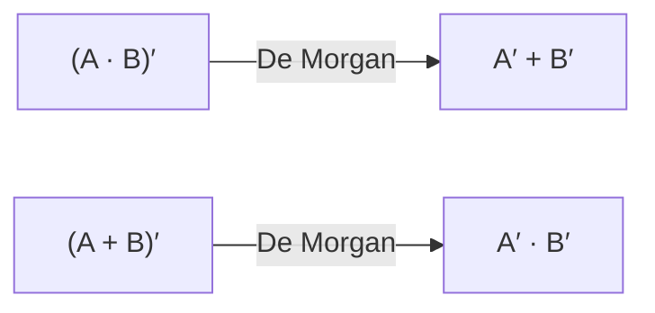

## Learning Objectives

- State the identity, null, idempotent, complement, double-negation, commutative, associative, distributive, and absorption laws of Boolean algebra, and give the dual form of each via the duality principle.
- State both of De Morgan's laws and derive the complement of any Boolean expression by applying them systematically.
- Simplify a multi-term sum-of-products expression into an equivalent expression with fewer literals and gates, naming the law used at each step.
- Prove the absorption law A + A·B = A algebraically, and independently confirm it by truth table.
- Explain why De Morgan's laws are the key tool for converting between AND-based and OR-based expressions, and why that conversion matters for building gates.

## Context & Motivation

The previous concept established that a Boolean expression is simultaneously a mathematical formula and a circuit blueprint, and showed how to read a *canonical* expression — sum-of-products or product-of-sums — directly off any truth table. That canonical expression is always correct, but it is almost never economical: a function of even modest complexity can produce a canonical SOP form with many minterms, each a product of every single variable, adding up to far more AND gates, OR gates, and literal-count than the function actually requires. The gap between "an expression that is guaranteed correct" and "an expression that is cheap to build" is exactly what this concept closes. Boolean algebra comes with a fixed catalog of algebraic laws — the same kind of identities you might use to simplify `x·(y+y)` down to `x` in ordinary algebra, except now every law is provable directly from the AND/OR/NOT truth tables rather than assumed as an axiom of arithmetic. Learning this catalog, and learning to apply it as a sequence of legal rewriting steps, is what turns a correct-but-bloated canonical expression into a small number of gates that a real chip can afford to fabricate.

This work is not new mathematics grafted onto circuits; it is the discrete-math concept of logical equivalence, applied with a different goal. The related concept "Logical Equivalence and Tautologies" in discrete-math-logic proves, for instance, that `¬(P ∧ Q)` is logically equivalent to `¬P ∨ ¬Q` — precisely De Morgan's law — but the motivation there is to establish that two propositions always have the same truth value, often en route to proving some larger statement is a tautology. Here, the exact same equivalence is used for a different purpose: `¬(P∧Q) ≡ ¬P∨¬Q` and `(A·B)′ = A′+B′` are the identical mathematical fact, but in a circuit context it tells you that an AND-then-invert configuration can be replaced by two inverters feeding an OR gate — a genuinely different, sometimes cheaper, physical circuit computing the identical function. The laws in this concept are therefore tools for engineering trade-offs (fewer gates, fewer gate types, less delay), not just tools for proving logical truths.

The payoff of mastering these laws extends well beyond simplification for its own sake. De Morgan's laws in particular are the mechanism that lets any AND/OR/NOT expression be rewritten entirely in terms of AND and NOT, or entirely in terms of OR and NOT — a fact the next concepts exploit directly. Once gates are introduced physically, you will see that a single gate type, NAND (or equivalently NOR), is *universal*: every Boolean function can be built from NAND gates alone. The proof of that universality depends entirely on being able to use De Morgan's laws to convert an OR into a combination of ANDs and NOTs (and vice versa) — which is precisely the algebraic skill this concept builds. Every later concept in this discipline that talks about "minimizing" a circuit, whether by hand with these laws, systematically with Karnaugh maps, or automatically inside a compiler's logic synthesizer, is ultimately applying the same handful of identities covered here.

## Core Theory

### The basic laws of Boolean algebra

Each law below is stated for a single variable or pair of variables A, B (and sometimes C), and each can be verified directly by truth table — none of them are assumed; all are consequences of the AND/OR/NOT truth tables from the previous concept.

**Identity laws**: `A + 0 = A` and `A · 1 = A`. OR-ing with 0 or AND-ing with 1 leaves A unchanged, because 0 contributes nothing to an OR and 1 contributes nothing (as a constraint) to an AND.

**Null (dominance) laws**: `A + 1 = 1` and `A · 0 = 0`. A single 1 in an OR forces the whole term to 1 regardless of A; a single 0 in an AND forces the whole term to 0 regardless of A.

**Idempotent laws**: `A + A = A` and `A · A = A`. Combining a signal with itself changes nothing.

**Complement (inverse) laws**: `A + A′ = 1` and `A · A′ = 0`. A variable and its complement can never both be 0 (so their OR is always 1) or both be 1 (so their AND is always 0).

**Double negation (involution)**: `(A′)′ = A`. Inverting twice returns the original value.

**Commutative laws**: `A + B = B + A` and `A · B = B · A`. Order of operands does not matter.

**Associative laws**: `(A + B) + C = A + (B + C)` and `(A · B) · C = A · (B · C)`. Grouping of three or more operands of the same operation does not matter, which is why `A + B + C` and `A·B·C` can be written unambiguously without parentheses.

**Distributive laws**: `A · (B + C) = A·B + A·C` (AND distributes over OR, exactly like ordinary multiplication over addition) and, less familiar from ordinary arithmetic, `A + (B · C) = (A + B) · (A + C)` (OR also distributes over AND — this second form has no analogue in real-number arithmetic and is a genuinely Boolean phenomenon).

**Absorption laws**: `A + A·B = A` and `A · (A + B) = A`. A term that already covers the case is not enlarged by OR-ing in a more specific sub-case (proved algebraically in Worked Example 3).

The following table summarizes the laws side by side, exhibiting duality (see next section):

| Law | AND/NOT form | OR/NOT form (dual) |
|---|---|---|
| Identity | A · 1 = A | A + 0 = A |
| Null | A · 0 = 0 | A + 1 = 1 |
| Idempotent | A · A = A | A + A = A |
| Complement | A · A′ = 0 | A + A′ = 1 |
| Commutative | A · B = B · A | A + B = B + A |
| Associative | (A·B)·C = A·(B·C) | (A+B)+C = A+(B+C) |
| Distributive | A·(B+C) = A·B + A·C | A+(B·C) = (A+B)·(A+C) |
| Absorption | A·(A+B) = A | A + A·B = A |

### The duality principle

Every law above comes in a pair, and the pairing is not a coincidence: Boolean algebra satisfies a **duality principle** stating that any valid identity remains valid if every `+` is swapped with `·`, every `·` is swapped with `+`, every 0 is swapped with 1, and every 1 is swapped with 0 (variables and complementation are left untouched). This holds because the truth tables for AND and OR are themselves related by exactly this swap together with swapping the roles of 0 and 1, so any proof by truth-table enumeration for one law automatically produces a proof for its dual. Practically, this means the catalog above only needed to be *derived* once per pair — the second law of each pair follows for free.

### De Morgan's laws

De Morgan's laws state:

```
(A · B)′ = A′ + B′
(A + B)′ = A′ · B′
```

In words: the complement of an AND is the OR of the complements, and the complement of an OR is the AND of the complements. These can be verified exhaustively:

| A | B | A·B | (A·B)′ | A′ | B′ | A′+B′ |
|---|---|---|---|---|---|---|
| 0 | 0 | 0 | 1 | 1 | 1 | 1 |
| 0 | 1 | 0 | 1 | 1 | 0 | 1 |
| 1 | 0 | 0 | 1 | 0 | 1 | 1 |
| 1 | 1 | 1 | 0 | 0 | 0 | 0 |

The `(A·B)′` column and the `A′+B′` column match on all four rows, confirming the first law. The second law's table is the dual and matches by the same reasoning (or by direct enumeration).

De Morgan's laws generalize to any number of variables by repeated application: `(A·B·C)′ = A′+B′+C′` and `(A+B+C)′ = A′·B′·C′`. Conceptually, De Morgan's laws are the precise tool for **pushing a NOT through** a compound expression — every time a NOT is pushed past an AND or an OR, that operator flips to its dual, and this is exactly what is needed to rewrite an expression that mixes AND, OR, and NOT into a form using only one of {AND, NOT} or only one of {OR, NOT}. That single-operator-family rewriting is the algebraic fact underlying NAND's and NOR's universality, covered in a later concept: since `A+B = (A′·B′)′`, any OR can be re-expressed using only AND and NOT, and since NAND alone can be wired to emulate both AND and NOT, De Morgan's law is the bridge from "AND, OR, NOT" to "NAND alone."



### Using the laws to simplify circuits

Algebraic simplification is a sequence of rewriting steps, each one an application of a single law from the catalog above, transforming an expression into an equivalent one — same truth table, different (and hopefully smaller) literal and gate count. Because each individual step is a proven identity, the entire chain preserves correctness by transitivity of equality; no step needs to be re-verified by truth table once the underlying laws themselves are trusted. This is the discipline's first concrete demonstration that "prove two expressions equivalent" (the discrete-math skill) and "build a cheaper circuit" (the engineering goal) are the same activity viewed from different angles.

## Worked Examples

### Example 1: Simplifying a messy SOP expression step by step

Simplify `f = A·B·C + A·B·C′ + A′·B`.

Step 1: `A·B·C + A·B·C′ = A·B·(C + C′)` — factoring A·B out of the first two terms is the distributive law (`A·B·C + A·B·C′ = A·B·(C+C′)`, the reverse direction of `X·(Y+Z) = X·Y+X·Z` with X = A·B, Y = C, Z = C′).

Step 2: `C + C′ = 1` — complement law.

Step 3: `A·B·(C+C′) = A·B·1`, which by the identity law `A·B·1 = A·B`. So the expression is now `A·B + A′·B`.

Step 4: `A·B + A′·B = (A+A′)·B` — distributive law again, factoring B out (X·Y + Z·Y = (X+Z)·Y with X=A, Z=A′, Y=B).

Step 5: `A + A′ = 1` — complement law.

Step 6: `(A+A′)·B = 1·B = B` — identity law.

Final result: `f = B`. Cross-check by truth table over all 8 combinations of A, B, C:

| A | B | C | A·B·C | A·B·C′ | A′·B | f (sum) | B |
|---|---|---|---|---|---|---|---|
| 0 | 0 | 0 | 0 | 0 | 0 | 0 | 0 |
| 0 | 0 | 1 | 0 | 0 | 0 | 0 | 0 |
| 0 | 1 | 0 | 0 | 0 | 1 | 1 | 1 |
| 0 | 1 | 1 | 0 | 0 | 1 | 1 | 1 |
| 1 | 0 | 0 | 0 | 0 | 0 | 0 | 0 |
| 1 | 0 | 1 | 0 | 0 | 0 | 0 | 0 |
| 1 | 1 | 0 | 0 | 1 | 0 | 1 | 1 |
| 1 | 1 | 1 | 1 | 0 | 0 | 1 | 1 |

The "f (sum)" column matches the "B" column on all 8 rows, confirming the three-term, three-variable original expression truly reduces to the single literal B — a dramatic reduction from roughly 7 gates (three 3-input ANDs, two ORs, one NOT for C′, one NOT for A′) down to a single wire.

### Example 2: Applying De Morgan's laws to ¬(A·B) and ¬(A+B)

Task: rewrite `¬(A·B)` and `¬(A+B)` using only AND, OR, and NOT applied to A and B individually (i.e., push the outer NOT inward).

For `¬(A·B)`: apply De Morgan's first law directly: `(A·B)′ = A′ + B′`. Verify with a spot check at A=1, B=0: left side `(1·0)′ = 0′ = 1`; right side `1′+0′ = 0+1 = 1`. Match. At A=1, B=1: left side `(1·1)′ = 1′ = 0`; right side `0+0 = 0`. Match.

For `¬(A+B)`: apply De Morgan's second law: `(A+B)′ = A′ · B′`. Verify at A=0, B=1: left side `(0+1)′ = 1′ = 0`; right side `1 · 0 = 0`. Match. At A=0, B=0: left side `(0+0)′ = 1`; right side `1 · 1 = 1`. Match.

The pattern to internalize: negating a product turns it into a sum of negations; negating a sum turns it into a product of negations — the operator always flips (AND↔OR) and the NOT distributes onto each individual literal.

### Example 3: Proving absorption A + A·B = A algebraically and by truth table

**Algebraic proof.** Start from `A + A·B`. Apply the identity law in reverse to rewrite the lone A as `A·1`: `A + A·B = A·1 + A·B`. Apply the distributive law to factor A out: `A·1 + A·B = A·(1+B)`. Apply the null law `1+B = 1`. So `A·(1+B) = A·1`. Apply the identity law once more: `A·1 = A`. Chaining these equalities: `A + A·B = A·1 + A·B = A·(1+B) = A·1 = A`.

**Truth-table confirmation:**

| A | B | A·B | A + A·B |
|---|---|---|---|
| 0 | 0 | 0 | 0 |
| 0 | 1 | 0 | 0 |
| 1 | 0 | 0 | 1 |
| 1 | 1 | 1 | 1 |

The "A + A·B" column is identical to the "A" column on all four rows, matching the algebraic result exactly. As a circuit fact: any wiring that computes `A + A·B` (an AND gate and an OR gate) can be replaced by a single wire carrying A directly — the AND gate and the OR gate were doing no useful work at all.

## Common Misconceptions & Pitfalls

- **"OR distributing over AND, `A+(B·C) = (A+B)·(A+C)`, must be a typo — that's not how real-number arithmetic works."** It is not a typo; Boolean algebra genuinely has two distributive laws where ordinary arithmetic has only one (multiplication over addition, with no analogous "addition over multiplication"). Both Boolean distributive laws are provable by truth table and both are used routinely in simplification.
- **"De Morgan's law just moves the NOT — the operator (AND/OR) stays the same."** The entire content of De Morgan's laws is that the operator *flips*: negating an AND produces an OR of negations, and negating an OR produces an AND of negations. Forgetting to flip the operator while pushing the NOT inward is the single most common De Morgan's-law error.
- **"Absorption, A + A·B = A, must be wrong because the right side 'ignores' B entirely."** The algebraic and truth-table proofs both confirm it is correct: whenever A is already 1, the whole expression is 1 regardless of B; whenever A is 0, `A·B` is also forced to 0, so the sum is 0 regardless of B — B's value never actually changes the outcome once A is fixed either way.
- **"Simplifying an expression algebraically might change what function it computes."** Every law in this catalog is itself a proven equivalence (verifiable by truth table), so any chain of legal law-applications preserves the function exactly; if the simplified form ever disagreed with the original on some input, at least one of the individual steps would have to violate a truth-table-verified law, which cannot happen if each step is applied correctly.
- **"You need to guess a full simplification in one leap."** Simplification is a sequence of small, individually justified steps (as in Worked Example 1), each applying exactly one named law; there is no requirement — and usually no way — to see the final simplified form immediately.
- **"Idempotent and identity laws are the same thing."** Idempotent laws (`A+A=A`, `A·A=A`) combine a variable with itself; identity laws (`A+0=A`, `A·1=A`) combine a variable with a constant. They look superficially similar but involve different operands and serve different simplification purposes.

## Summary

Boolean algebra's laws — identity, null, idempotent, complement, double negation, commutative, associative, both distributive laws, and absorption, each paired with its dual via the duality principle — are the toolkit for rewriting a correct-but-bloated Boolean expression into an equivalent expression built from fewer literals and fewer gates, exactly the same equivalence-proving skill exercised in discrete math's Logical Equivalence and Tautologies but aimed here at circuit economy rather than tautology-proving. De Morgan's laws single-handedly provide the mechanism for pushing a NOT through a compound expression, flipping AND to OR (or OR to AND) as it passes, which is the exact algebraic fact that will later prove NAND (or NOR) alone can build any Boolean function. With both the canonical-form construction from the previous concept and this simplification toolkit in hand, the next concept turns to the physical gates themselves — Logic Gates and Truth Tables — where these purely algebraic expressions finally become concrete hardware components with defined symbols, timing, and truth-table behavior.

## Documentation Links

- [MIT 6.004 — Combinational Logic Unit](https://ocw.mit.edu/courses/6-004-computation-structures-spring-2017/pages/c4/) — MIT's Computation Structures unit covering Boolean algebra laws and simplification as groundwork for combinational circuit design.
- [Harris & Harris — Digital Design and Computer Architecture, RISC-V Edition](https://shop.elsevier.com/books/digital-design-and-computer-architecture-risc-v-edition/harris/978-0-12-820064-3) — textbook reference presenting the full Boolean algebra axiom set, De Morgan's laws, and algebraic simplification technique used throughout digital design.
