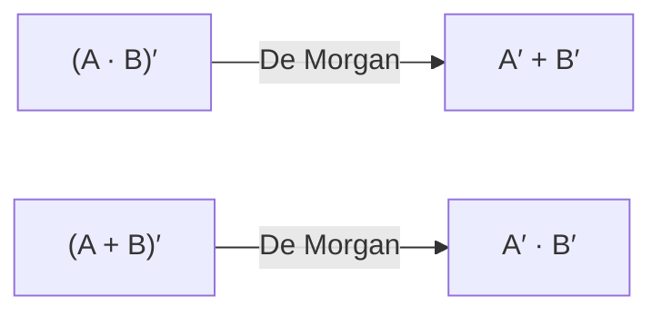

## Objetivos de Aprendizagem

- Enunciar as leis de identidade, nulidade, idempotência, complemento, dupla negação, comutatividade, associatividade, distributividade e absorção da álgebra booleana, e dar a forma dual de cada uma pelo princípio da dualidade.
- Enunciar as duas leis de De Morgan e derivar o complemento de qualquer expressão booleana aplicando-as de forma sistemática.
- Simplificar uma expressão soma de produtos com vários termos numa expressão equivalente com menos literais e portas, nomeando a lei usada em cada passo.
- Provar a lei de absorção A + A·B = A algebricamente, e confirmá-la de forma independente por tabela verdade.
- Explicar por que as leis de De Morgan são a ferramenta-chave para converter entre expressões baseadas em AND e baseadas em OR, e por que essa conversão importa para construir portas.

## Contexto e Motivação

O conceito anterior estabeleceu que uma expressão booleana é ao mesmo tempo uma fórmula matemática e uma planta de circuito, e mostrou como ler uma expressão *canônica* (soma de produtos ou produto de somas) diretamente de qualquer tabela verdade. Essa expressão canônica é sempre correta, mas quase nunca é econômica: uma função de complexidade até modesta pode produzir uma forma SOP canônica com muitos mintermos, cada um um produto de todas as variáveis, somando muito mais portas AND, portas OR e literais do que a função de fato exige. A distância entre "uma expressão garantidamente correta" e "uma expressão barata de construir" é exatamente o que este conceito fecha. A álgebra booleana vem com um catálogo fixo de leis algébricas, o mesmo tipo de identidade que você usaria para simplificar `x·(y+y)` em álgebra comum, só que agora cada lei pode ser provada diretamente a partir das tabelas verdade de AND/OR/NOT, em vez de ser assumida como axioma da aritmética. Aprender esse catálogo, e aprender a aplicá-lo como uma sequência de passos legítimos de reescrita, é o que transforma uma expressão canônica correta, mas inchada, num pequeno número de portas que um chip real pode se dar ao luxo de fabricar.

Este trabalho não é matemática nova enxertada em circuitos; é o conceito de equivalência lógica da matemática discreta, aplicado com outro objetivo. O conceito relacionado "Equivalência Lógica e Tautologias", em discrete-math-logic, prova, por exemplo, que `¬(P ∧ Q)` é logicamente equivalente a `¬P ∨ ¬Q` (exatamente a lei de De Morgan), mas a motivação lá é estabelecer que duas proposições sempre têm o mesmo valor verdade, muitas vezes no caminho de provar que alguma afirmação maior é uma tautologia. Aqui, exatamente a mesma equivalência é usada com outro propósito: `¬(P∧Q) ≡ ¬P∨¬Q` e `(A·B)′ = A′+B′` são o mesmo fato matemático, mas num contexto de circuito ele diz que uma configuração de AND seguido de inversão pode ser substituída por dois inversores alimentando uma porta OR, um circuito físico genuinamente diferente, às vezes mais barato, que calcula a mesma função. As leis deste conceito são, portanto, ferramentas para trade-offs de engenharia (menos portas, menos tipos de porta, menos atraso), e não só ferramentas para provar verdades lógicas.

O retorno de dominar essas leis vai muito além da simplificação por si só. As leis de De Morgan em particular são o mecanismo que permite reescrever qualquer expressão AND/OR/NOT inteiramente em termos de AND e NOT, ou inteiramente em termos de OR e NOT, um fato que os próximos conceitos exploram diretamente. Quando as portas forem apresentadas fisicamente, você vai ver que um único tipo de porta, NAND (ou, de forma equivalente, NOR), é *universal*: toda função booleana pode ser construída só com portas NAND. A prova dessa universalidade depende inteiramente de conseguir usar as leis de De Morgan para converter um OR numa combinação de ANDs e NOTs (e vice-versa), que é precisamente a habilidade algébrica que este conceito constrói. Todo conceito posterior desta disciplina que fala em "minimizar" um circuito, seja à mão com estas leis, seja sistematicamente com mapas de Karnaugh, seja automaticamente dentro do sintetizador lógico de um compilador, está no fundo aplicando o mesmo punhado de identidades visto aqui.

## Teoria Central

### As leis básicas da álgebra booleana

Cada lei abaixo é enunciada para uma variável ou um par de variáveis A, B (e às vezes C), e cada uma pode ser verificada diretamente por tabela verdade: nenhuma é assumida; todas são consequências das tabelas verdade de AND/OR/NOT do conceito anterior.

**Leis de identidade**: `A + 0 = A` e `A · 1 = A`. Fazer OR com 0 ou AND com 1 deixa A inalterado, porque 0 não contribui nada num OR e 1 não contribui nada (como restrição) num AND.

**Leis de nulidade (dominância)**: `A + 1 = 1` e `A · 0 = 0`. Um único 1 num OR força o termo inteiro a 1, seja qual for A; um único 0 num AND força o termo inteiro a 0, seja qual for A.

**Leis de idempotência**: `A + A = A` e `A · A = A`. Combinar um sinal com ele mesmo não muda nada.

**Leis de complemento (inverso)**: `A + A′ = 1` e `A · A′ = 0`. Uma variável e seu complemento nunca podem ser ambos 0 (então seu OR é sempre 1) nem ambos 1 (então seu AND é sempre 0).

**Dupla negação (involução)**: `(A′)′ = A`. Inverter duas vezes devolve o valor original.

**Leis comutativas**: `A + B = B + A` e `A · B = B · A`. A ordem dos operandos não importa.

**Leis associativas**: `(A + B) + C = A + (B + C)` e `(A · B) · C = A · (B · C)`. O agrupamento de três ou mais operandos da mesma operação não importa, e é por isso que `A + B + C` e `A·B·C` podem ser escritos sem ambiguidade e sem parênteses.

**Leis distributivas**: `A · (B + C) = A·B + A·C` (o AND distribui sobre o OR, exatamente como a multiplicação comum sobre a adição) e, menos familiar da aritmética comum, `A + (B · C) = (A + B) · (A + C)` (o OR também distribui sobre o AND; essa segunda forma não tem análogo na aritmética dos números reais e é um fenômeno genuinamente booleano).

**Leis de absorção**: `A + A·B = A` e `A · (A + B) = A`. Um termo que já cobre o caso não aumenta ao fazer OR com um subcaso mais específico (provado algebricamente no Exemplo Resolvido 3).

A tabela a seguir resume as leis lado a lado, exibindo a dualidade (ver a próxima seção):

| Lei | Forma AND/NOT | Forma OR/NOT (dual) |
|---|---|---|
| Identidade | A · 1 = A | A + 0 = A |
| Nulidade | A · 0 = 0 | A + 1 = 1 |
| Idempotência | A · A = A | A + A = A |
| Complemento | A · A′ = 0 | A + A′ = 1 |
| Comutativa | A · B = B · A | A + B = B + A |
| Associativa | (A·B)·C = A·(B·C) | (A+B)+C = A+(B+C) |
| Distributiva | A·(B+C) = A·B + A·C | A+(B·C) = (A+B)·(A+C) |
| Absorção | A·(A+B) = A | A + A·B = A |

### O princípio da dualidade

Cada lei acima vem num par, e o pareamento não é coincidência: a álgebra booleana satisfaz um **princípio da dualidade**, que diz que qualquer identidade válida continua válida se cada `+` for trocado por `·`, cada `·` por `+`, cada 0 por 1 e cada 1 por 0 (as variáveis e a complementação ficam intactas). Isso vale porque as tabelas verdade de AND e OR são elas mesmas relacionadas exatamente por essa troca, junto com a troca dos papéis de 0 e 1, então qualquer prova por enumeração de tabela verdade de uma lei produz automaticamente uma prova da sua dual. Na prática, isso significa que o catálogo acima só precisou ser *derivado* uma vez por par: a segunda lei de cada par vem de graça.

### As leis de De Morgan

As leis de De Morgan dizem:

```
(A · B)′ = A′ + B′
(A + B)′ = A′ · B′
```

Em palavras: o complemento de um AND é o OR dos complementos, e o complemento de um OR é o AND dos complementos. Elas podem ser verificadas de forma exaustiva:

| A | B | A·B | (A·B)′ | A′ | B′ | A′+B′ |
|---|---|---|---|---|---|---|
| 0 | 0 | 0 | 1 | 1 | 1 | 1 |
| 0 | 1 | 0 | 1 | 1 | 0 | 1 |
| 1 | 0 | 0 | 1 | 0 | 1 | 1 |
| 1 | 1 | 1 | 0 | 0 | 0 | 0 |

A coluna `(A·B)′` e a coluna `A′+B′` batem nas quatro linhas, confirmando a primeira lei. A tabela da segunda lei é a dual e bate pelo mesmo raciocínio (ou por enumeração direta).

As leis de De Morgan se generalizam para qualquer número de variáveis por aplicação repetida: `(A·B·C)′ = A′+B′+C′` e `(A+B+C)′ = A′·B′·C′`. Conceitualmente, as leis de De Morgan são a ferramenta precisa para **empurrar um NOT para dentro** de uma expressão composta: toda vez que um NOT passa por um AND ou por um OR, esse operador vira o seu dual, e é exatamente isso que é preciso para reescrever uma expressão que mistura AND, OR e NOT numa forma que usa só {AND, NOT} ou só {OR, NOT}. Essa reescrita numa única família de operadores é o fato algébrico por trás da universalidade do NAND e do NOR, vista num conceito posterior: como `A+B = (A′·B′)′`, qualquer OR pode ser reexpresso usando só AND e NOT, e como o NAND sozinho pode ser ligado para imitar tanto o AND quanto o NOT, a lei de De Morgan é a ponte entre "AND, OR, NOT" e "só NAND".



### Usando as leis para simplificar circuitos

A simplificação algébrica é uma sequência de passos de reescrita, cada um a aplicação de uma única lei do catálogo acima, transformando uma expressão numa equivalente: mesma tabela verdade, contagem de literais e portas diferente (e, de preferência, menor). Como cada passo individual é uma identidade provada, a cadeia inteira preserva a correção pela transitividade da igualdade; nenhum passo precisa ser reverificado por tabela verdade quando as próprias leis subjacentes são confiáveis. Esta é a primeira demonstração concreta da disciplina de que "provar que duas expressões são equivalentes" (a habilidade da matemática discreta) e "construir um circuito mais barato" (o objetivo de engenharia) são a mesma atividade vista de ângulos diferentes.

## Exemplos Resolvidos

### Exemplo 1: simplificando uma expressão SOP bagunçada passo a passo

Simplifique `f = A·B·C + A·B·C′ + A′·B`.

Passo 1: `A·B·C + A·B·C′ = A·B·(C + C′)`: colocar A·B em evidência nos dois primeiros termos é a lei distributiva (`A·B·C + A·B·C′ = A·B·(C+C′)`, o sentido inverso de `X·(Y+Z) = X·Y+X·Z` com X = A·B, Y = C, Z = C′).

Passo 2: `C + C′ = 1`: lei do complemento.

Passo 3: `A·B·(C+C′) = A·B·1`, que pela lei de identidade dá `A·B·1 = A·B`. Então a expressão agora é `A·B + A′·B`.

Passo 4: `A·B + A′·B = (A+A′)·B`: lei distributiva de novo, colocando B em evidência (X·Y + Z·Y = (X+Z)·Y com X=A, Z=A′, Y=B).

Passo 5: `A + A′ = 1`: lei do complemento.

Passo 6: `(A+A′)·B = 1·B = B`: lei de identidade.

Resultado final: `f = B`. Conferindo por tabela verdade nas 8 combinações de A, B, C:

| A | B | C | A·B·C | A·B·C′ | A′·B | f (soma) | B |
|---|---|---|---|---|---|---|---|
| 0 | 0 | 0 | 0 | 0 | 0 | 0 | 0 |
| 0 | 0 | 1 | 0 | 0 | 0 | 0 | 0 |
| 0 | 1 | 0 | 0 | 0 | 1 | 1 | 1 |
| 0 | 1 | 1 | 0 | 0 | 1 | 1 | 1 |
| 1 | 0 | 0 | 0 | 0 | 0 | 0 | 0 |
| 1 | 0 | 1 | 0 | 0 | 0 | 0 | 0 |
| 1 | 1 | 0 | 0 | 1 | 0 | 1 | 1 |
| 1 | 1 | 1 | 1 | 0 | 0 | 1 | 1 |

A coluna "f (soma)" bate com a coluna "B" nas 8 linhas, confirmando que a expressão original de três termos e três variáveis realmente se reduz ao único literal B: uma redução dramática de cerca de 7 portas (três ANDs de 3 entradas, dois ORs, um NOT para C′, um NOT para A′) para um único fio.

### Exemplo 2: aplicando as leis de De Morgan a ¬(A·B) e ¬(A+B)

Tarefa: reescrever `¬(A·B)` e `¬(A+B)` usando só AND, OR e NOT aplicados a A e B individualmente (ou seja, empurrar o NOT externo para dentro).

Para `¬(A·B)`: aplique diretamente a primeira lei de De Morgan: `(A·B)′ = A′ + B′`. Verifique com uma checagem pontual em A=1, B=0: lado esquerdo `(1·0)′ = 0′ = 1`; lado direito `1′+0′ = 0+1 = 1`. Bate. Em A=1, B=1: lado esquerdo `(1·1)′ = 1′ = 0`; lado direito `0+0 = 0`. Bate.

Para `¬(A+B)`: aplique a segunda lei de De Morgan: `(A+B)′ = A′ · B′`. Verifique em A=0, B=1: lado esquerdo `(0+1)′ = 1′ = 0`; lado direito `1 · 0 = 0`. Bate. Em A=0, B=0: lado esquerdo `(0+0)′ = 1`; lado direito `1 · 1 = 1`. Bate.

O padrão a internalizar: negar um produto o transforma numa soma de negações; negar uma soma a transforma num produto de negações. O operador sempre vira (AND↔OR) e o NOT se distribui sobre cada literal individual.

### Exemplo 3: provando a absorção A + A·B = A algebricamente e por tabela verdade

**Prova algébrica.** Comece de `A + A·B`. Aplique a lei de identidade ao contrário para reescrever o A isolado como `A·1`: `A + A·B = A·1 + A·B`. Aplique a lei distributiva para colocar A em evidência: `A·1 + A·B = A·(1+B)`. Aplique a lei de nulidade `1+B = 1`. Então `A·(1+B) = A·1`. Aplique a lei de identidade mais uma vez: `A·1 = A`. Encadeando essas igualdades: `A + A·B = A·1 + A·B = A·(1+B) = A·1 = A`.

**Confirmação por tabela verdade:**

| A | B | A·B | A + A·B |
|---|---|---|---|
| 0 | 0 | 0 | 0 |
| 0 | 1 | 0 | 0 |
| 1 | 0 | 0 | 1 |
| 1 | 1 | 1 | 1 |

A coluna "A + A·B" é idêntica à coluna "A" nas quatro linhas, batendo exatamente com o resultado algébrico. Como fato de circuito: qualquer fiação que calcule `A + A·B` (uma porta AND e uma porta OR) pode ser substituída por um único fio levando A diretamente; a porta AND e a porta OR não estavam fazendo trabalho útil nenhum.

## Equívocos Comuns e Armadilhas

- **"O OR distribuindo sobre o AND, `A+(B·C) = (A+B)·(A+C)`, deve ser um erro de digitação; não é assim que a aritmética dos reais funciona."** Não é erro de digitação; a álgebra booleana tem genuinamente duas leis distributivas onde a aritmética comum tem só uma (multiplicação sobre adição, sem uma "adição sobre multiplicação" análoga). As duas leis distributivas booleanas podem ser provadas por tabela verdade e as duas são usadas rotineiramente na simplificação.
- **"A lei de De Morgan só move o NOT; o operador (AND/OR) continua o mesmo."** Todo o conteúdo das leis de De Morgan é que o operador *vira*: negar um AND produz um OR de negações, e negar um OR produz um AND de negações. Esquecer de virar o operador ao empurrar o NOT para dentro é o erro mais comum com as leis de De Morgan.
- **"A absorção, A + A·B = A, deve estar errada porque o lado direito 'ignora' B por completo."** As provas algébrica e por tabela verdade confirmam que ela está correta: sempre que A já vale 1, a expressão inteira vale 1, seja qual for B; sempre que A vale 0, `A·B` também é forçado a 0, então a soma vale 0, seja qual for B. O valor de B nunca muda de fato o resultado, qualquer que seja o valor fixado de A.
- **"Simplificar uma expressão algebricamente pode mudar a função que ela calcula."** Cada lei deste catálogo é ela mesma uma equivalência provada (verificável por tabela verdade), então qualquer cadeia de aplicações legítimas de leis preserva a função exatamente; se a forma simplificada discordasse da original em alguma entrada, pelo menos um dos passos individuais teria de violar uma lei verificada por tabela verdade, o que não pode acontecer se cada passo for aplicado corretamente.
- **"É preciso adivinhar a simplificação completa num salto só."** A simplificação é uma sequência de passos pequenos, cada um justificado individualmente (como no Exemplo Resolvido 1), cada um aplicando exatamente uma lei nomeada; não há exigência (e normalmente não há como) de enxergar a forma simplificada final de imediato.
- **"As leis de idempotência e de identidade são a mesma coisa."** As leis de idempotência (`A+A=A`, `A·A=A`) combinam uma variável com ela mesma; as leis de identidade (`A+0=A`, `A·1=A`) combinam uma variável com uma constante. Elas parecem superficialmente parecidas, mas envolvem operandos diferentes e servem a propósitos de simplificação diferentes.

## Resumo

As leis da álgebra booleana (identidade, nulidade, idempotência, complemento, dupla negação, comutativa, associativa, as duas leis distributivas e absorção, cada uma pareada com sua dual pelo princípio da dualidade) são o kit de ferramentas para reescrever uma expressão booleana correta, mas inchada, numa expressão equivalente construída com menos literais e menos portas; é exatamente a mesma habilidade de provar equivalências exercitada em Equivalência Lógica e Tautologias da matemática discreta, mas aqui voltada para a economia de circuito em vez da prova de tautologias. As leis de De Morgan, sozinhas, fornecem o mecanismo para empurrar um NOT para dentro de uma expressão composta, virando AND em OR (ou OR em AND) no caminho, que é exatamente o fato algébrico que mais adiante vai provar que só NAND (ou só NOR) consegue construir qualquer função booleana. Com a construção da forma canônica do conceito anterior e este kit de simplificação em mãos, o próximo conceito se volta para as próprias portas físicas (Portas Lógicas e Tabelas Verdade), onde essas expressões puramente algébricas finalmente viram componentes de hardware concretos, com símbolos, temporização e comportamento de tabela verdade definidos.

## Documentation Links

- [MIT 6.004: Combinational Logic Unit](https://ocw.mit.edu/courses/6-004-computation-structures-spring-2017/pages/c4/): unidade de Computation Structures do MIT que cobre as leis da álgebra booleana e a simplificação como base para o projeto de circuitos combinacionais.
- [Harris & Harris: Digital Design and Computer Architecture, RISC-V Edition](https://shop.elsevier.com/books/digital-design-and-computer-architecture-risc-v-edition/harris/978-0-12-820064-3): livro de referência que apresenta o conjunto completo de axiomas da álgebra booleana, as leis de De Morgan e a técnica de simplificação algébrica usada em todo o projeto digital.
