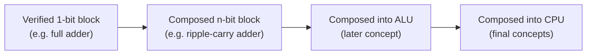

## Learning Objectives

- Define a combinational circuit as one whose output is a pure function of its current inputs only, with no dependence on past inputs or internal state.
- Execute the systematic design pipeline — truth table → canonical sum-of-products expression → gate netlist — for a boolean function of several variables.
- Compose smaller, independently verified circuit blocks into a larger circuit, and explain why this hierarchical decomposition mirrors modular decomposition in software.
- Compute the propagation delay and critical path of a multi-level gate circuit, and identify which path through the circuit determines its worst-case speed.
- Explain fan-in and fan-out as physical limits on gate design, and describe why they constrain how directly a truth table can be translated into gates.

## Context & Motivation

The previous concept showed that a single NAND gate is functionally complete: every boolean function, no matter how complex, can in principle be built from NAND gates alone. That is a powerful existence proof, but it says nothing about *how* to go from "I have a function I want to compute" to "here is a wired network of gates that computes it." Real digital design needs a repeatable procedure, not a one-off clever trick for each new function — a chip designer building a 64-bit adder cannot afford to hand-craft an ad hoc circuit for every one of the astronomically many boolean functions on 128 input bits. This concept supplies that procedure: a mechanical pipeline that turns any truth table into a working gate-level circuit, plus the engineering vocabulary (propagation delay, critical path, fan-in, fan-out) needed to reason about whether the resulting circuit is any good.

The key word in "combinational circuit" is that its output depends only on the *current* values of its inputs — never on what the inputs were a moment ago, and never on anything the circuit "remembers." This is precisely what makes a combinational circuit's behavior fully described by a truth table, and precisely what a later concept (latches and flip-flops) will deliberately violate in order to build memory. Everything built in this concept — adders, comparators, multiplexers, eventually a full arithmetic logic unit — lives on the combinational side of that line; sequential circuits, which do have memory, are a separate and later story.

The other idea this concept introduces is one already familiar from software: build small, verify it, then wire verified pieces together into something bigger, trusting each piece's proven behavior instead of re-deriving everything from individual gates every time. Nand2Tetris organizes its entire hardware course around this discipline — a full computer built in strict layers, where each chip is specified, built once, tested against its specification, and then used as an unquestioned black box by the next layer up. MIT 6.004's Combinational Logic unit formalizes the same pipeline from the opposite direction: given only a truth table, how do you mechanically produce a correct, reasonably efficient gate-level implementation? Both are the subject of what follows.

## Core Theory

### What "combinational" means precisely

A circuit is **combinational** if, for every valid assignment of values to its input wires, its output wires settle to a value that is a function of that input assignment alone. Formally, a combinational circuit implements a boolean function `f: {0,1}^n → {0,1}^m` — n input bits produce m output bits, and the same input pattern always produces the same output pattern, regardless of what inputs the circuit saw before. This is exactly the condition that makes a truth table a complete and sufficient specification of the circuit's behavior: if a fixed input row could produce two different outputs depending on history, no finite table could describe it.

Concretely, a circuit is combinational if and only if it contains no feedback path from a gate's output back to an input that influences that same gate (directly or through other gates), and no clocked storage elements. Feedback and storage are exactly what introduce memory — a dependence on the past — and are deliberately excluded here; they are the subject of sequential circuits later in this course.

### The design pipeline: truth table → canonical SOP → gates

Given any boolean function specified as a truth table, the following procedure always produces a correct circuit:

1. **Write the truth table.** Enumerate all `2^n` input combinations and the desired output for each.
2. **Extract the canonical sum-of-products (SOP) expression.** For every row where the output is 1, form a *minterm* — the AND of all n input variables, each variable appearing complemented if its value in that row is 0, uncomplemented if 1. OR all these minterms together. This expression is guaranteed correct by construction: it evaluates to 1 exactly on the rows the table says should be 1, and to 0 everywhere else, because each minterm is 1 for exactly one input row and 0 for every other row.
3. **Translate to a gate netlist.** Each complemented variable becomes a NOT gate on that input; each minterm becomes an AND gate; the final OR combines the minterm outputs. The result is a two-level (AND-OR) circuit, plus one level of NOT gates on the inputs that need complementing.

This pipeline is mechanical and always terminates in a correct circuit — its only weakness is efficiency: the canonical SOP is rarely the smallest possible circuit, since it uses one AND gate per 1-row of the table, and large tables can have many such rows. The next concept, Karnaugh maps, addresses exactly this weakness by systematically merging minterms that differ in only one variable, without changing the function computed.

### Composition and hierarchy

Once a small circuit (say, a 1-bit adder) has been designed and verified against its truth table, it can be treated as a single reusable block — a labeled box with defined inputs and outputs — and wired together with copies of itself or other verified blocks to build something larger (say, an 8-bit adder), without re-deriving gate-level behavior at the larger scale. This is the identical discipline behind writing a well-tested function once and calling it repeatedly rather than duplicating its logic inline: correctness proven once at a small, checkable scale is inherited by every larger structure built on top, provided the composition itself is done according to the block's specified input/output contract (matching bit widths, matching signal meanings). Nand2Tetris builds an entire computer this way, layer by layer, from NAND up through ALU up through CPU; the payoff is that a bug, if one exists, can be isolated to a specific layer rather than searched for across the entire gate count of the finished machine.



### Propagation delay, critical path, and gate depth

Every real gate takes a nonzero amount of time to produce a correct output after its inputs change; this is the gate's **propagation delay**. In a multi-level circuit, a signal must ripple through however many gate levels lie between an input and an output before the output is guaranteed stable — the number of gates on that route is the route's **gate depth**, and the total delay along it is the sum of the individual gates' propagation delays along that specific route.

Because a circuit generally has many possible input-to-output routes with different depths, the circuit's overall worst-case delay is determined by its **critical path** — the single longest-delay route from any input to any output. The circuit is not "done computing" (all its outputs are not guaranteed stable and correct) until the critical path's total delay has elapsed, even though shorter paths finish sooner. This is why gate depth is treated as a cost metric on par with gate count: a circuit built from fewer gates but arranged in a deep chain can be slower in practice than a slightly larger circuit arranged in a shallow, wide structure — the canonical two-level AND-OR form from the SOP pipeline is attractive specifically because it has gate depth of only 2 (ignoring the input NOT gates), regardless of how many variables the function has.

### Fan-in and fan-out

Real gates cannot have unlimited numbers of inputs or drive unlimited numbers of downstream gates. **Fan-in** is the number of inputs a single gate accepts; a physical AND gate might only be manufactured with 2, 3, or 4 inputs, not an arbitrary number. **Fan-out** is the number of gate inputs a single gate's output can reliably drive, limited by how much electrical load (capacitance, current) the output stage can supply while still switching within its rated delay. These limits matter directly to the design pipeline above: a canonical-SOP minterm for a function of, say, 8 variables would naively need a single AND gate with fan-in 8, which may not exist as a physical part — in practice such a gate is itself built as a small tree of lower-fan-in gates, adding gate depth (and therefore delay) that a purely abstract "AND them all together" description hides. Fan-in and fan-out limits are one more reason gate depth and gate count are both first-class costs, not merely gate count alone.

## Worked Examples

### Example 1: A 3-input majority circuit

Design a circuit whose output `M` is 1 exactly when at least two of its three inputs `A, B, C` are 1 ("majority vote").

**Step 1 — truth table:**

| A | B | C | M |
|---|---|---|---|
| 0 | 0 | 0 | 0 |
| 0 | 0 | 1 | 0 |
| 0 | 1 | 0 | 0 |
| 0 | 1 | 1 | 1 |
| 1 | 0 | 0 | 0 |
| 1 | 0 | 1 | 1 |
| 1 | 1 | 0 | 1 |
| 1 | 1 | 1 | 1 |

**Step 2 — canonical SOP.** Four rows output 1: (0,1,1), (1,0,1), (1,1,0), (1,1,1). Their minterms:

```
M = A′·B·C + A·B′·C + A·B·C′ + A·B·C
```

**Step 3 — gate netlist.** Three NOT gates produce A′, B′, C′. Four 3-input AND gates compute the four minterms. One 4-input OR gate combines them. Gate depth: 1 (NOT) + 1 (AND) + 1 (OR) = 3 levels on the longest route.

**Sanity check** against row (1,1,0): `A′·B·C = 0·1·0=0`; `A·B′·C = 1·0·0=0`; `A·B·C′ = 1·1·1=1`; `A·B·C = 1·1·0=0`. Sum = 1. Matches the table. This canonical circuit uses 3 NOT + 4 AND(3-input) + 1 OR(4-input) = 8 gates; a later concept (Karnaugh maps) will reduce this to just three 2-input AND gates and one OR gate, since majority has the well-known minimized form `M = A·B + B·C + A·C`.

### Example 2: A 2-bit equality comparator, built by composition

Design a circuit that outputs 1 exactly when two 2-bit numbers `A = A1A0` and `B = B1B0` are equal.

**Step 1 — build and verify the 1-bit block.** A single-bit equality checker `EQ1(x, y)` should output 1 when `x = y`. Its truth table has two 1-rows: (0,0) and (1,1), giving canonical SOP `EQ1 = x′·y′ + x·y`. This is exactly the XNOR function (the complement of XOR), and it is a standard, separately verifiable 2-gate-depth block (one 2-input AND for each term, needing x′ and y′ from NOT gates, plus one OR — or, using the XNOR identity, a single XNOR gate if available as a primitive).

**Step 2 — compose.** Two numbers are equal exactly when *both* their bit-0s match *and* their bit-1s match:

```
EQUAL = EQ1(A0, B0) · EQ1(A1, B1)
```

**Step 3 — netlist by composition.** Instantiate two copies of the verified `EQ1` block — one fed (A0, B0), one fed (A1, B1) — then AND their two outputs together with a single 2-input AND gate.

**Verification.** Take A = 10 (A1=1, A0=0), B = 10 (B1=1, B0=0). `EQ1(A0,B0) = EQ1(0,0) = 1`. `EQ1(A1,B1) = EQ1(1,1) = 1`. `EQUAL = 1·1 = 1`. Correct — the numbers match. Now take A = 10, B = 11 (B1=1, B0=1): `EQ1(A0,B0) = EQ1(0,1) = 0`. `EQUAL = 0` — correct, they differ. This generalizes directly: an N-bit equality comparator is N copies of `EQ1` feeding a single N-input AND (or a tree of 2-input ANDs, respecting fan-in limits).

### Example 3: Critical path of the 2-bit comparator

Using the composed circuit from Example 2, trace the longest input-to-output route. Inside each `EQ1` block: input → NOT (level 1) → AND (level 2) → OR (level 3); so `EQ1`'s output is stable after 3 gate levels. Both `EQ1` blocks operate in parallel (they share no gates), so both settle after the same 3 levels of delay. The final AND gate is a 4th level, consuming both `EQ1` outputs. Critical path depth = 3 (inside EQ1) + 1 (final AND) = 4 gate levels. If every gate has propagation delay 1 nanosecond, `EQUAL` is only guaranteed correct 4 nanoseconds after the inputs change, even though each `EQ1` individually "finishes" after only 3 — the final AND still has to wait for both, then add its own delay.

## Common Misconceptions & Pitfalls

- **"A circuit with feedback loops can still be combinational as long as it's built only from AND/OR/NOT."** Gate type is irrelevant; what makes a circuit combinational is the absence of feedback and storage. A NAND-only circuit with a feedback loop (in fact, exactly how a latch is built) is sequential, not combinational, regardless of using "simple" gates.
- **"The canonical SOP circuit from a truth table is already an efficient design."** It is *correct* but usually far from minimal — it uses one AND gate per 1-row of the table, which can be huge for functions with many 1-rows. Canonical SOP is the *starting point* the pipeline guarantees will work, not the destination; minimization (Karnaugh maps, next concept) is a distinct, subsequent step.
- **"Fewer total gates always means a faster circuit."** Speed is governed by the critical path's gate *depth*, not the total gate *count*. Many gates arranged in parallel, shallow branches can be faster than fewer gates chained in a long series, because independent branches finish simultaneously while a chain forces delays to add up serially.
- **"Composing verified blocks means you never need to check the composed circuit."** Verifying each block against its own specification guarantees each is correct in isolation, but the composition itself — are wires connected as intended, are bit widths matched — must still be checked; a correct `EQ1` wired to the wrong bit positions still produces a wrong `EQUAL`.
- **"Any boolean function can be built directly as a single gate if you just pick a big enough gate."** Physical fan-in is limited; "one big AND of everything" is not a real single component but is itself built internally as a tree of smaller gates, which adds real gate depth that a fan-in-agnostic description hides.

## Summary

A combinational circuit's output is a pure function of its present inputs alone — no feedback, no stored state — which is why a truth table fully specifies its behavior, and any truth table can be mechanically converted into a working circuit via the canonical sum-of-products pipeline: minterm per 1-row, AND per minterm, OR to combine. Small circuits, once verified against their own truth tables, become trusted black-box building blocks that compose into larger circuits — the majority gate and the bit-equality checker both illustrate this, the latter scaling from 1 bit to N bits by instantiating N copies of one verified block. A circuit's speed is bounded not by total gate count but by its critical path — the longest chain of propagation delays from any input to any output — and real gates further constrain design through fan-in and fan-out limits, which is why the two-level canonical form, prized for its shallow depth, is rarely the smallest circuit for a given function in gate count. The next concept, Karnaugh maps, gives a systematic visual method for shrinking these canonical circuits to a genuinely minimal number of gates without changing the function they compute.

## Documentation Links

- [MIT 6.004 — Combinational Logic Unit](https://ocw.mit.edu/courses/6-004-computation-structures-spring-2017/pages/c4/) — course unit covering the systematic design of combinational circuits from truth tables and boolean expressions.
- [Nand2Tetris — Build a Modern Computer from First Principles](https://www.coursera.org/learn/build-a-computer) — hardware course building an entire computer layer by layer from NAND gates, illustrating hierarchical composition of verified circuit blocks.
