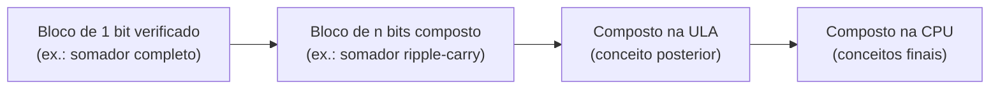

## Objetivos de Aprendizagem

- Definir um circuito combinacional como aquele cuja saída é uma função pura apenas das entradas atuais, sem dependência de entradas passadas nem de estado interno.
- Executar o fluxo sistemático de projeto (tabela verdade → expressão canônica soma de produtos → netlist de portas) para uma função booleana de várias variáveis.
- Compor blocos de circuito menores, verificados de forma independente, num circuito maior, e explicar por que essa decomposição hierárquica espelha a decomposição modular em software.
- Calcular o atraso de propagação e o caminho crítico de um circuito de portas com vários níveis, e identificar qual caminho pelo circuito determina sua velocidade no pior caso.
- Explicar fan-in e fan-out como limites físicos do projeto de portas, e descrever por que eles restringem o quão diretamente uma tabela verdade pode ser traduzida em portas.

## Contexto e Motivação

O conceito anterior mostrou que uma única porta NAND é funcionalmente completa: toda função booleana, por mais complexa que seja, pode em princípio ser construída só com portas NAND. É uma prova de existência poderosa, mas não diz nada sobre *como* ir de "tenho uma função que quero calcular" para "aqui está uma rede de portas ligadas que a calcula". O projeto digital real precisa de um procedimento repetível, não de um truque esperto avulso para cada função nova: um projetista de chips construindo um somador de 64 bits não pode se dar ao luxo de criar à mão um circuito ad hoc para cada uma das astronomicamente muitas funções booleanas de 128 bits de entrada. Este conceito fornece esse procedimento: um fluxo mecânico que transforma qualquer tabela verdade num circuito de portas que funciona, mais o vocabulário de engenharia (atraso de propagação, caminho crítico, fan-in, fan-out) necessário para raciocinar se o circuito resultante presta.

A palavra-chave em "circuito combinacional" é que sua saída depende só dos valores *atuais* das entradas: nunca do que as entradas eram um instante atrás, e nunca de algo que o circuito "lembre". É exatamente isso que faz o comportamento de um circuito combinacional ser totalmente descrito por uma tabela verdade, e é exatamente isso que um conceito posterior (latches e flip-flops) vai violar de propósito para construir memória. Tudo o que é construído neste conceito (somadores, comparadores, multiplexadores e, no fim, uma unidade lógica e aritmética completa) fica do lado combinacional dessa linha; os circuitos sequenciais, que têm memória, são uma história separada e posterior.

A outra ideia que este conceito apresenta já é familiar do software: construa algo pequeno, verifique, e depois ligue peças verificadas em algo maior, confiando no comportamento comprovado de cada peça em vez de rederivar tudo a partir de portas individuais toda vez. O Nand2Tetris organiza todo o seu curso de hardware em torno dessa disciplina: um computador completo construído em camadas estritas, em que cada chip é especificado, construído uma vez, testado contra sua especificação e então usado como caixa-preta inquestionável pela camada de cima. A unidade de Lógica Combinacional do MIT 6.004 formaliza o mesmo fluxo pelo sentido oposto: dada só uma tabela verdade, como produzir mecanicamente uma implementação em portas correta e razoavelmente eficiente? As duas coisas são o assunto do que vem a seguir.

## Teoria Central

### O que "combinacional" significa exatamente

Um circuito é **combinacional** se, para toda atribuição válida de valores aos fios de entrada, seus fios de saída se estabilizam num valor que é função só dessa atribuição de entrada. Formalmente, um circuito combinacional implementa uma função booleana `f: {0,1}^n → {0,1}^m`: n bits de entrada produzem m bits de saída, e o mesmo padrão de entrada sempre produz o mesmo padrão de saída, sejam quais forem as entradas que o circuito viu antes. Essa é exatamente a condição que faz de uma tabela verdade uma especificação completa e suficiente do comportamento do circuito: se uma linha de entrada fixa pudesse produzir duas saídas diferentes dependendo do histórico, nenhuma tabela finita conseguiria descrevê-lo.

Concretamente, um circuito é combinacional se e somente se não contém nenhum caminho de realimentação da saída de uma porta de volta a uma entrada que influencie essa mesma porta (diretamente ou por outras portas), nem elementos de armazenamento com clock. Realimentação e armazenamento são exatamente o que introduz memória (uma dependência do passado) e ficam excluídos de propósito aqui; eles são o assunto dos circuitos sequenciais, mais adiante neste curso.

### O fluxo de projeto: tabela verdade → SOP canônica → portas

Dada qualquer função booleana especificada como tabela verdade, o procedimento a seguir sempre produz um circuito correto:

1. **Escreva a tabela verdade.** Enumere todas as `2^n` combinações de entrada e a saída desejada para cada uma.
2. **Extraia a expressão canônica soma de produtos (SOP).** Para cada linha em que a saída vale 1, forme um *mintermo*: o AND das n variáveis de entrada, cada variável aparecendo complementada se seu valor naquela linha for 0, e sem complemento se for 1. Faça o OR de todos esses mintermos. Essa expressão é garantidamente correta por construção: ela vale 1 exatamente nas linhas em que a tabela diz que deve valer 1, e 0 em todas as outras, porque cada mintermo vale 1 em exatamente uma linha de entrada e 0 em todas as outras.
3. **Traduza para uma netlist de portas.** Cada variável complementada vira uma porta NOT naquela entrada; cada mintermo vira uma porta AND; o OR final combina as saídas dos mintermos. O resultado é um circuito de dois níveis (AND-OR), mais um nível de portas NOT nas entradas que precisam ser complementadas.

Esse fluxo é mecânico e sempre termina num circuito correto; sua única fraqueza é a eficiência: a SOP canônica raramente é o menor circuito possível, já que usa uma porta AND por linha 1 da tabela, e tabelas grandes podem ter muitas dessas linhas. O próximo conceito, mapas de Karnaugh, trata exatamente dessa fraqueza, juntando sistematicamente mintermos que diferem em só uma variável, sem mudar a função calculada.

### Composição e hierarquia

Depois que um circuito pequeno (digamos, um somador de 1 bit) foi projetado e verificado contra sua tabela verdade, ele pode ser tratado como um único bloco reutilizável (uma caixa rotulada com entradas e saídas definidas) e ligado a cópias de si mesmo ou a outros blocos verificados para construir algo maior (digamos, um somador de 8 bits), sem rederivar o comportamento em nível de portas na escala maior. É exatamente a mesma disciplina de escrever uma função bem testada uma vez e chamá-la repetidamente em vez de duplicar sua lógica no meio do código: a correção provada uma vez numa escala pequena e verificável é herdada por toda estrutura maior construída por cima, desde que a composição em si respeite o contrato de entrada e saída especificado do bloco (larguras de bits compatíveis, significados de sinais compatíveis). O Nand2Tetris constrói um computador inteiro assim, camada por camada, do NAND até a ULA e da ULA até a CPU; o retorno é que um bug, se existir, pode ser isolado numa camada específica em vez de procurado em todas as portas da máquina pronta.



### Atraso de propagação, caminho crítico e profundidade de portas

Toda porta real leva um tempo não nulo para produzir uma saída correta depois que suas entradas mudam; esse é o **atraso de propagação** da porta. Num circuito de vários níveis, um sinal precisa atravessar quantos níveis de portas existirem entre uma entrada e uma saída antes que a saída fique garantidamente estável: o número de portas nesse trajeto é a **profundidade de portas** do trajeto, e o atraso total ao longo dele é a soma dos atrasos de propagação das portas individuais desse trajeto específico.

Como um circuito em geral tem muitos trajetos possíveis de entrada para saída com profundidades diferentes, o atraso geral do circuito no pior caso é determinado pelo seu **caminho crítico**: o único trajeto de maior atraso de qualquer entrada para qualquer saída. O circuito não "terminou de calcular" (nem todas as suas saídas estão garantidamente estáveis e corretas) até que o atraso total do caminho crítico tenha passado, mesmo que caminhos mais curtos terminem antes. É por isso que a profundidade de portas é tratada como uma métrica de custo tão importante quanto o número de portas: um circuito construído com menos portas, mas arranjado numa cadeia profunda, pode ser mais lento na prática que um circuito um pouco maior arranjado numa estrutura rasa e larga. A forma canônica de dois níveis AND-OR do fluxo SOP é atraente justamente porque tem profundidade de portas de só 2 (ignorando as portas NOT das entradas), não importa quantas variáveis a função tenha.

### Fan-in e fan-out

Portas reais não podem ter um número ilimitado de entradas nem comandar um número ilimitado de portas seguintes. **Fan-in** é o número de entradas que uma única porta aceita; uma porta AND física pode ser fabricada só com 2, 3 ou 4 entradas, não com um número arbitrário. **Fan-out** é o número de entradas de porta que a saída de uma única porta consegue comandar de forma confiável, limitado por quanta carga elétrica (capacitância, corrente) o estágio de saída consegue fornecer enquanto ainda chaveia dentro do seu atraso nominal. Esses limites importam diretamente para o fluxo de projeto acima: um mintermo de SOP canônica para uma função de, digamos, 8 variáveis precisaria ingenuamente de uma única porta AND com fan-in 8, que pode não existir como peça física; na prática, essa porta é ela mesma construída como uma pequena árvore de portas de fan-in menor, acrescentando profundidade de portas (e, portanto, atraso) que uma descrição puramente abstrata do tipo "faça o AND de tudo" esconde. Os limites de fan-in e fan-out são mais um motivo para a profundidade de portas e o número de portas serem ambos custos de primeira classe, e não só o número de portas.

## Exemplos Resolvidos

### Exemplo 1: um circuito de maioria de 3 entradas

Projete um circuito cuja saída `M` vale 1 exatamente quando pelo menos duas das suas três entradas `A, B, C` valem 1 ("voto da maioria").

**Passo 1: tabela verdade:**

| A | B | C | M |
|---|---|---|---|
| 0 | 0 | 0 | 0 |
| 0 | 0 | 1 | 0 |
| 0 | 1 | 0 | 0 |
| 0 | 1 | 1 | 1 |
| 1 | 0 | 0 | 0 |
| 1 | 0 | 1 | 1 |
| 1 | 1 | 0 | 1 |
| 1 | 1 | 1 | 1 |

**Passo 2: SOP canônica.** Quatro linhas dão saída 1: (0,1,1), (1,0,1), (1,1,0), (1,1,1). Seus mintermos:

```
M = A′·B·C + A·B′·C + A·B·C′ + A·B·C
```

**Passo 3: netlist de portas.** Três portas NOT produzem A′, B′, C′. Quatro portas AND de 3 entradas calculam os quatro mintermos. Uma porta OR de 4 entradas os combina. Profundidade de portas: 1 (NOT) + 1 (AND) + 1 (OR) = 3 níveis no trajeto mais longo.

**Checagem de sanidade** com a linha (1,1,0): `A′·B·C = 0·1·0=0`; `A·B′·C = 1·0·0=0`; `A·B·C′ = 1·1·1=1`; `A·B·C = 1·1·0=0`. Soma = 1. Bate com a tabela. Esse circuito canônico usa 3 NOT + 4 AND (3 entradas) + 1 OR (4 entradas) = 8 portas; um conceito posterior (mapas de Karnaugh) vai reduzi-lo a só três portas AND de 2 entradas e uma porta OR, já que a maioria tem a conhecida forma minimizada `M = A·B + B·C + A·C`.

### Exemplo 2: um comparador de igualdade de 2 bits, construído por composição

Projete um circuito que dá saída 1 exatamente quando dois números de 2 bits `A = A1A0` e `B = B1B0` são iguais.

**Passo 1: construir e verificar o bloco de 1 bit.** Um verificador de igualdade de um bit `EQ1(x, y)` deve dar saída 1 quando `x = y`. Sua tabela verdade tem duas linhas 1: (0,0) e (1,1), dando a SOP canônica `EQ1 = x′·y′ + x·y`. Essa é exatamente a função XNOR (o complemento do XOR), e é um bloco padrão de profundidade 2, verificável separadamente (um AND de 2 entradas para cada termo, precisando de x′ e y′ vindos de portas NOT, mais um OR; ou, usando a identidade do XNOR, uma única porta XNOR, se estiver disponível como primitiva).

**Passo 2: compor.** Dois números são iguais exatamente quando *tanto* seus bits 0 batem *quanto* seus bits 1 batem:

```
EQUAL = EQ1(A0, B0) · EQ1(A1, B1)
```

**Passo 3: netlist por composição.** Instancie duas cópias do bloco `EQ1` verificado (uma alimentada com (A0, B0), a outra com (A1, B1)) e então faça o AND das duas saídas com uma única porta AND de 2 entradas.

**Verificação.** Pegue A = 10 (A1=1, A0=0), B = 10 (B1=1, B0=0). `EQ1(A0,B0) = EQ1(0,0) = 1`. `EQ1(A1,B1) = EQ1(1,1) = 1`. `EQUAL = 1·1 = 1`. Correto: os números batem. Agora pegue A = 10, B = 11 (B1=1, B0=1): `EQ1(A0,B0) = EQ1(0,1) = 0`. `EQUAL = 0`, correto, eles diferem. Isso se generaliza diretamente: um comparador de igualdade de N bits é formado por N cópias de `EQ1` alimentando um único AND de N entradas (ou uma árvore de ANDs de 2 entradas, respeitando os limites de fan-in).

### Exemplo 3: caminho crítico do comparador de 2 bits

Usando o circuito composto do Exemplo 2, acompanhe o trajeto mais longo de entrada para saída. Dentro de cada bloco `EQ1`: entrada → NOT (nível 1) → AND (nível 2) → OR (nível 3); então a saída de `EQ1` fica estável depois de 3 níveis de portas. Os dois blocos `EQ1` operam em paralelo (não compartilham portas), então os dois se estabilizam depois dos mesmos 3 níveis de atraso. A porta AND final é um 4º nível, que consome as duas saídas de `EQ1`. Profundidade do caminho crítico = 3 (dentro de EQ1) + 1 (AND final) = 4 níveis de portas. Se toda porta tiver atraso de propagação de 1 nanossegundo, `EQUAL` só fica garantidamente correto 4 nanossegundos depois que as entradas mudam, mesmo que cada `EQ1` individualmente "termine" depois de só 3: o AND final ainda precisa esperar os dois, e depois somar seu próprio atraso.

## Equívocos Comuns e Armadilhas

- **"Um circuito com laços de realimentação ainda pode ser combinacional, desde que seja construído só com AND/OR/NOT."** O tipo de porta é irrelevante; o que torna um circuito combinacional é a ausência de realimentação e de armazenamento. Um circuito só de NANDs com um laço de realimentação (aliás, exatamente como um latch é construído) é sequencial, não combinacional, mesmo usando portas "simples".
- **"O circuito SOP canônico tirado de uma tabela verdade já é um projeto eficiente."** Ele é *correto*, mas normalmente está longe do mínimo: usa uma porta AND por linha 1 da tabela, o que pode ser enorme para funções com muitas linhas 1. A SOP canônica é o *ponto de partida* que o fluxo garante que funciona, não o destino; a minimização (mapas de Karnaugh, o próximo conceito) é um passo distinto e posterior.
- **"Menos portas no total sempre significa um circuito mais rápido."** A velocidade é governada pela *profundidade* de portas do caminho crítico, não pelo *número* total de portas. Muitas portas arranjadas em ramos paralelos e rasos podem ser mais rápidas que menos portas encadeadas numa série longa, porque ramos independentes terminam ao mesmo tempo, enquanto uma cadeia força os atrasos a se somarem em série.
- **"Compor blocos verificados significa que você nunca precisa conferir o circuito composto."** Verificar cada bloco contra sua própria especificação garante que cada um está correto isoladamente, mas a composição em si (os fios estão ligados como pretendido, as larguras de bits batem?) ainda precisa ser conferida; um `EQ1` correto ligado às posições de bits erradas ainda produz um `EQUAL` errado.
- **"Qualquer função booleana pode ser construída diretamente como uma única porta, é só escolher uma porta grande o bastante."** O fan-in físico é limitado; "um grande AND de tudo" não é um componente único real, mas é ele mesmo construído internamente como uma árvore de portas menores, o que acrescenta profundidade de portas real que uma descrição indiferente ao fan-in esconde.

## Resumo

A saída de um circuito combinacional é uma função pura apenas das suas entradas atuais (sem realimentação, sem estado guardado), e é por isso que uma tabela verdade especifica totalmente seu comportamento; qualquer tabela verdade pode ser convertida mecanicamente num circuito que funciona pelo fluxo canônico de soma de produtos: um mintermo por linha 1, um AND por mintermo, um OR para combinar. Circuitos pequenos, depois de verificados contra suas próprias tabelas verdade, viram blocos de construção de caixa-preta confiáveis que se compõem em circuitos maiores; a porta de maioria e o verificador de igualdade de bits ilustram isso, este último escalando de 1 bit para N bits ao instanciar N cópias de um único bloco verificado. A velocidade de um circuito é limitada não pelo número total de portas, mas pelo seu caminho crítico (a cadeia mais longa de atrasos de propagação de qualquer entrada para qualquer saída), e portas reais restringem ainda mais o projeto com os limites de fan-in e fan-out, e é por isso que a forma canônica de dois níveis, valorizada pela sua profundidade rasa, raramente é o menor circuito em número de portas para uma dada função. O próximo conceito, mapas de Karnaugh, dá um método visual sistemático para encolher esses circuitos canônicos até um número de portas genuinamente mínimo, sem mudar a função que eles calculam.

## Documentation Links

- [MIT 6.004: Combinational Logic Unit](https://ocw.mit.edu/courses/6-004-computation-structures-spring-2017/pages/c4/): unidade do curso que cobre o projeto sistemático de circuitos combinacionais a partir de tabelas verdade e expressões booleanas.
- [Nand2Tetris: Build a Modern Computer from First Principles](https://www.coursera.org/learn/build-a-computer): curso de hardware que constrói um computador inteiro, camada por camada, a partir de portas NAND, ilustrando a composição hierárquica de blocos de circuito verificados.
