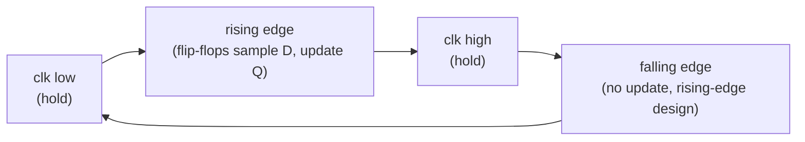
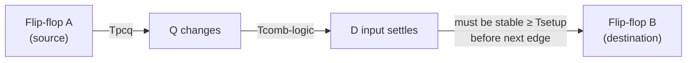

## Learning Objectives

- Explain why a single shared clock signal, distributed to every flip-flop in a circuit, is necessary for the circuit's flip-flops to agree on when the "current" state changes.
- Define clock period and clock frequency, state the relationship between them, and identify the rising edge (or falling edge, for falling-edge-triggered designs) as the instant state actually updates.
- Define setup time and hold time for a flip-flop, and explain what happens — including the risk of metastability — when either constraint is violated.
- State the fundamental synchronous timing constraint (Tclk ≥ Tpcq + Tcomb-logic + Tsetup) and explain why the longest register-to-register path in a circuit determines the maximum usable clock frequency.
- Given per-stage delay values, compute the minimum clock period and the corresponding maximum clock frequency for a synchronous circuit.

## Context & Motivation

The previous concept established that a D flip-flop can hold a single bit of state, updating only at a clock edge rather than continuously. But a real circuit — a register, a CPU datapath, an entire processor — contains not one flip-flop but thousands or millions, and all of them must agree on exactly when "now" advances to "next." If different flip-flops updated at different, independently drifting moments, a value read from one register and combined with a value read from another might combine a fresh, this-cycle result with a stale, last-cycle result — the two halves of the circuit would effectively disagree about what time it is. Synchronous digital design solves this by distributing a single clock signal to every flip-flop, so all of them see the same rising edge at (as close as physically achievable to) the same moment, and update together. This is the sense in which "the clock" is not merely a timing convenience but the mechanism that gives an entire multi-million-transistor chip a single, shared, discrete notion of a "cycle."

Introducing a shared clock, however, does not by itself guarantee correctness — it creates a new set of constraints a working design must satisfy. Any physical flip-flop needs its input stable for a tiny window immediately before and after the clock edge to reliably capture the correct value; sampling a flip-flop while its input is actively changing produces unpredictable, sometimes literally unresolved, output. Any physical combinational circuit, no matter how well minimized (an idea already central to Karnaugh-map simplification), still takes some nonzero time for a signal to propagate from input to output. Put these two facts together and synchronous circuit design becomes an exercise in timing budgeting: the clock cannot tick faster than the slowest chain of "flip-flop → combinational logic → next flip-flop" can settle.

This concept is therefore the direct engineering consequence of the previous one: because flip-flops sample only at an edge and need a brief stable window around it, and combinational logic between them takes real time to compute, the clock period cannot be chosen arbitrarily small — it is lower-bounded by the physical delays already present in the design. Every concept built later in this discipline involving clocked hardware — registers, finite state machines, the register file, RAM, and eventually the single-cycle CPU itself — inherits this same constraint: its maximum operating frequency is fixed the moment its longest register-to-register logic path is fixed.

## Core Theory

### Why a shared clock synchronizes an entire circuit

A synchronous sequential circuit is built from state-holding flip-flops (the previous concept) interleaved with blocks of combinational logic that compute each flip-flop's next input from the current outputs of other flip-flops. Distributing one clock signal to every flip-flop guarantees that all of them treat the same physical instant as the boundary between "this cycle" and "the next cycle." Without this discipline, two flip-flops updating at slightly different times could each briefly hold a value from a different cycle, and any logic combining their outputs would be combining data from two different, undefined points in the circuit's history — a hazard usually called a synchronization or race problem. The shared clock does not eliminate every timing subtlety (clock skew — small differences in when the clock edge physically arrives at different flip-flops — is a related concern in large chips), but it establishes the basic contract that makes reasoning about a synchronous circuit one cycle at a time possible at all.

### Clock period, frequency, and edges

The clock signal itself is a simple, repeating square wave, alternating between low and high. Two numbers characterize it completely for scheduling purposes:

| Quantity | Definition | Relationship |
|---|---|---|
| Clock period (Tclk) | Time from one rising edge to the next rising edge, typically measured in nanoseconds (ns) | Tclk = 1 / frequency |
| Clock frequency (f) | Number of clock cycles per second, measured in Hz (or MHz, GHz) | f = 1 / Tclk |

For example, a clock period of 2 ns corresponds to a frequency of 1 / (2 × 10⁻⁹ s) = 500 × 10⁶ Hz = 500 MHz. Every flip-flop in a rising-edge-triggered design updates its output exactly once per period, at the rising edge; nothing about its output changes at any other instant, including the falling edge (for a falling-edge-triggered design, the roles simply swap).



### Setup time and hold time

A physical flip-flop cannot capture its D input correctly if that input is changing right at the clock edge — it needs D to be stable for a small window of time before the edge and a small window after the edge:

| Timing parameter | Definition |
|---|---|
| Setup time (Tsetup) | The minimum amount of time before the clock edge that D must already be stable |
| Hold time (Thold) | The minimum amount of time after the clock edge that D must remain stable |

If D changes within the setup window (too close to the edge, before it) or within the hold window (too soon after the edge), the flip-flop's behavior is not simply "it captures the old value" or "it captures the new value" — it can enter a prolonged, unpredictable in-between condition called **metastability**, where the output hovers at neither a valid 0 nor a valid 1 voltage level for an indeterminate time before (usually, but without any timing guarantee) resolving to one or the other. A setup or hold violation can propagate an invalid, ambiguous logic value into the rest of the circuit, corrupting subsequent computation. Synchronous design avoids this entirely by guaranteeing, through the constraint developed below, that D is always stable well outside both windows.

### Propagation delay and the register-to-register path

Two more delays complete the picture:

| Delay | Definition |
|---|---|
| Clock-to-Q delay (Tpcq) | Time after a clock edge before a flip-flop's output Q actually changes to reflect the newly captured value |
| Combinational logic delay (Tcomb-logic) | Time for a signal to propagate through the combinational logic sitting between one flip-flop's Q output and the next flip-flop's D input |

A single "register-to-register path" in a synchronous circuit therefore looks like: a source flip-flop's clock edge arrives → after Tpcq, its Q output changes → the new value propagates through combinational logic, taking Tcomb-logic → the result arrives at a destination flip-flop's D input, which must then be stable for at least Tsetup before that destination flip-flop's own next clock edge.

### The fundamental synchronous timing constraint

Stringing these three delays together against the clock period gives the constraint every synchronous design must satisfy:

```
Tclk ≥ Tpcq + Tcomb-logic + Tsetup
```

This says the clock period must be at least as long as the total time it takes a signal to leave one flip-flop, cross the combinational logic, and arrive stable at the next flip-flop with enough margin before that flip-flop's setup window begins. Rearranged, the **minimum** clock period is:

```
Tclk(min) = Tpcq + Tcomb-logic + Tsetup
```

and the **maximum** clock frequency is simply its reciprocal:

```
f(max) = 1 / Tclk(min)
```

Crucially, when a circuit contains many parallel register-to-register paths (as any real datapath does), the constraint must hold for every one of them individually — the clock period must be at least as large as the largest Tcomb-logic among all paths, combined with whichever Tpcq and Tsetup apply on that path. The single slowest path — the **critical path** — is the only one that matters for setting the clock: speeding up every other path has zero effect on the maximum achievable frequency, because the critical path alone determines Tclk(min). This is why timing analysis in real digital design focuses overwhelmingly on identifying and shortening the critical path rather than optimizing typical or short paths.



### Synchronous design discipline

The practical upshot of this constraint is a design discipline followed throughout the rest of this course of study: state changes only at flip-flops, driven by one shared clock; all logic between flip-flops is purely combinational (no additional feedback loops sneaking in "extra" state, which would reintroduce the transparency and race hazards from the previous concept); and the clock is chosen — or the logic redesigned — so the constraint above holds for every register-to-register path, with some safety margin against manufacturing variation and temperature effects. Every sequential structure covered from this point forward — registers, finite state machines, the register file, RAM, and the datapath of the single-cycle CPU itself — applies exactly this discipline at increasing scale, and each one's maximum clock frequency is calculated with the same constraint.

## Worked Examples

### Example 1: Computing the minimum clock period and maximum frequency from per-stage delays

Suppose a synchronous circuit has the following measured delays on its single register-to-register path:

- Tpcq (flip-flop clock-to-Q delay) = 0.3 ns
- Tcomb-logic (combinational logic delay between the two flip-flops) = 1.5 ns
- Tsetup (destination flip-flop's setup time) = 0.2 ns

Apply the constraint directly:

```
Tclk(min) = Tpcq + Tcomb-logic + Tsetup
          = 0.3 ns + 1.5 ns + 0.2 ns
          = 2.0 ns
```

The maximum frequency is the reciprocal:

```
f(max) = 1 / Tclk(min) = 1 / (2.0 × 10⁻⁹ s) = 500 × 10⁶ Hz = 500 MHz
```

Any clock period at or above 2.0 ns is safe; any period shorter than 2.0 ns risks a setup-time violation at the destination flip-flop, since the data would not yet be stable when the next rising edge arrives.

### Example 2: Adding logic on the critical path lowers the maximum frequency

Starting from the same circuit as Example 1 (Tclk(min) = 2.0 ns, f(max) = 500 MHz), suppose a designer inserts an additional stage of combinational logic — say, an extra multiplexer needed to support a new feature — onto that same register-to-register path, adding 0.8 ns of additional propagation delay. The delays become:

- Tpcq = 0.3 ns (unchanged — this is a property of the flip-flop, not the logic)
- Tcomb-logic = 1.5 ns + 0.8 ns = 2.3 ns
- Tsetup = 0.2 ns (unchanged)

Recomputing:

```
Tclk(min) = 0.3 ns + 2.3 ns + 0.2 ns = 2.8 ns
f(max) = 1 / (2.8 × 10⁻⁹ s) ≈ 357 × 10⁶ Hz ≈ 357 MHz
```

Adding roughly 53% more combinational delay to the critical path (0.8 ns out of an original 1.5 ns) drops the maximum frequency from 500 MHz to roughly 357 MHz — a reduction of about 29%. This demonstrates concretely why every added gate, multiplexer, or adder stage placed on the critical path has a direct, computable cost in maximum operating frequency, and why hardware designers care so much about minimizing logic specifically on the critical path (as opposed to logic on other, non-critical paths, whose delay can grow considerably before it affects Tclk(min) at all).

### Example 3: A setup-time check for one specific path

Suppose a circuit is clocked at Tclk = 4 ns, and a particular register-to-register path has Tpcq = 0.4 ns and Tcomb-logic = 3.0 ns. The destination flip-flop requires Tsetup = 0.5 ns. Check whether this path satisfies the timing constraint.

Step 1 — compute the total time the signal takes to become stable at the destination's D input, measured from the source's clock edge:

```
Tpcq + Tcomb-logic = 0.4 ns + 3.0 ns = 3.4 ns
```

Step 2 — add the required setup margin to find the minimum clock period this path can tolerate:

```
Tclk(min for this path) = 3.4 ns + 0.5 ns = 3.9 ns
```

Step 3 — compare against the actual clock period, 4 ns:

```
Tclk(actual) = 4 ns ≥ Tclk(min for this path) = 3.9 ns
```

The constraint holds, with 0.1 ns of slack (margin) to spare (4 ns − 3.9 ns = 0.1 ns). This path is safe at the chosen clock period, though the margin is thin: if this turned out to be the circuit's critical path, any further increase to Tcomb-logic — for example from added logic, or from a slower manufacturing process corner — of more than 0.1 ns would violate the destination flip-flop's setup time and risk metastability.

## Common Misconceptions & Pitfalls

- **"A faster clock is always better, as long as the flip-flops themselves are fast enough."** The clock's maximum safe speed is set by the slowest register-to-register path in the entire circuit, including all of its combinational logic — not merely by how fast the flip-flops can, in isolation, capture a value. Clocking faster than the critical path allows produces setup-time violations regardless of how well the flip-flops are specified.
- **"Setup time and hold time are the same constraint stated two ways."** They are two separate requirements on opposite sides of the clock edge: setup time restricts how late data may arrive before the edge, while hold time restricts how soon data may change after the edge. A design can violate one without violating the other, and each has distinct causes and fixes.
- **"A metastability event just produces a wrong but well-defined output (a stuck 0 or 1)."** Metastability is specifically the failure of the output to settle to a valid logic level within a bounded, predictable time — the output can linger at an intermediate voltage for a duration not fixed in advance, which is precisely what makes it dangerous: downstream logic reading it before it resolves can itself behave unpredictably.
- **"Speeding up the flip-flops (lower Tpcq) alone raises the maximum clock frequency."** It only helps if the flip-flop delay was actually part of the critical path; if the true bottleneck is a slow chain of combinational logic elsewhere, reducing Tpcq on flip-flops not on that critical path changes f(max) not at all.
- **"Only the slowest single gate matters for timing, not the whole path."** The relevant quantity is the total accumulated delay along an entire register-to-register path — clock-to-Q delay plus every gate's propagation delay plus setup time — not any one gate's delay in isolation; a path with many merely-average gates can easily be slower than a path with one unusually slow gate.

## Summary

A synchronous circuit distributes one shared clock signal to every flip-flop so all of them agree on the instant state changes; the clock is characterized by its period Tclk (time between rising edges) and its reciprocal, frequency. Every flip-flop needs its D input to be stable for a setup-time window before the edge and a hold-time window after it, and violating either can produce metastability — an unresolved, unpredictable output rather than a merely-wrong-but-valid one. Because a signal takes real time to leave a source flip-flop (Tpcq), cross intervening combinational logic (Tcomb-logic), and arrive stable at a destination flip-flop before its setup window (Tsetup), every register-to-register path in a circuit must satisfy Tclk ≥ Tpcq + Tcomb-logic + Tsetup, and the single slowest such path — the critical path — alone determines the circuit's maximum usable clock frequency, f(max) = 1 / Tclk(min). This timing budget, and the synchronous design discipline of confining all state to clocked flip-flops with purely combinational logic between them, is the exact framework the next concept, registers, uses when grouping many flip-flops into a single word-wide storage element clocked together as one unit.

## Documentation Links

- [MIT 6.004 — OCW Syllabus](https://ocw.mit.edu/courses/6-004-computation-structures-spring-2017/pages/syllabus/) — course syllabus for Computation Structures, whose timing and synchronous-design units cover clock period, setup/hold time, and critical-path analysis.
- [Harris & Harris — Digital Design and Computer Architecture, RISC-V Edition](https://shop.elsevier.com/books/digital-design-and-computer-architecture-risc-v-edition/harris/978-0-12-820064-3) — textbook chapter deriving the synchronous timing constraint (Tclk ≥ Tpcq + Tcomb-logic + Tsetup) and worked critical-path frequency calculations.
