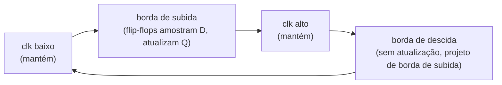
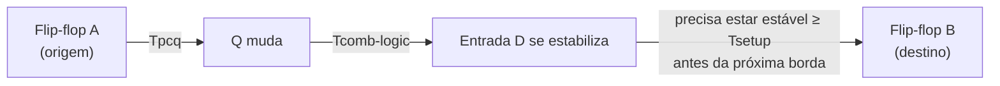

## Objetivos de Aprendizagem

- Explicar por que um único sinal de clock compartilhado, distribuído a todo flip-flop de um circuito, é necessário para que os flip-flops do circuito concordem sobre quando o estado "atual" muda.
- Definir período de clock e frequência de clock, enunciar a relação entre eles, e identificar a borda de subida (ou de descida, em projetos acionados pela borda de descida) como o instante em que o estado de fato se atualiza.
- Definir tempo de setup e tempo de hold de um flip-flop, e explicar o que acontece (incluindo o risco de metaestabilidade) quando qualquer uma dessas restrições é violada.
- Enunciar a restrição fundamental de temporização síncrona (Tclk ≥ Tpcq + Tcomb-logic + Tsetup) e explicar por que o caminho registrador a registrador mais longo de um circuito determina a frequência de clock máxima utilizável.
- Dados valores de atraso por estágio, calcular o período de clock mínimo e a frequência de clock máxima correspondente de um circuito síncrono.

## Contexto e Motivação

O conceito anterior estabeleceu que um flip-flop D consegue guardar um único bit de estado, atualizando só numa borda de clock, e não continuamente. Mas um circuito real (um registrador, um datapath de CPU, um processador inteiro) contém não um flip-flop, mas milhares ou milhões, e todos eles precisam concordar sobre exatamente quando o "agora" avança para o "próximo". Se flip-flops diferentes se atualizassem em momentos diferentes, derivando de forma independente, um valor lido de um registrador e combinado com um valor lido de outro poderia combinar um resultado fresco, deste ciclo, com um resultado velho, do ciclo anterior: as duas metades do circuito efetivamente discordariam sobre que horas são. O projeto digital síncrono resolve isso distribuindo um único sinal de clock a todo flip-flop, de modo que todos vejam a mesma borda de subida no mesmo momento (o mais próximo disso que for fisicamente possível) e se atualizem juntos. É nesse sentido que "o clock" não é só uma conveniência de temporização, mas o mecanismo que dá a um chip inteiro de milhões de transistores uma noção única, compartilhada e discreta de "ciclo".

Introduzir um clock compartilhado, porém, não garante correção por si só: cria um novo conjunto de restrições que um projeto funcional precisa satisfazer. Qualquer flip-flop físico precisa da sua entrada estável numa janela minúscula logo antes e logo depois da borda de clock para capturar o valor correto de forma confiável; amostrar um flip-flop enquanto sua entrada está mudando produz uma saída imprevisível, às vezes literalmente não resolvida. Qualquer circuito combinacional físico, por mais bem minimizado que seja (uma ideia já central na simplificação por mapas de Karnaugh), ainda leva algum tempo não nulo para um sinal se propagar da entrada para a saída. Junte esses dois fatos e o projeto de circuitos síncronos vira um exercício de orçamento de tempo: o clock não pode bater mais rápido do que a cadeia mais lenta de "flip-flop → lógica combinacional → próximo flip-flop" consegue se estabilizar.

Este conceito é, portanto, a consequência de engenharia direta do anterior: como os flip-flops amostram só numa borda e precisam de uma breve janela estável em volta dela, e a lógica combinacional entre eles leva tempo real para calcular, o período de clock não pode ser escolhido arbitrariamente pequeno; ele é limitado por baixo pelos atrasos físicos já presentes no projeto. Todo conceito construído mais adiante nesta disciplina envolvendo hardware com clock (registradores, máquinas de estados finitos, o banco de registradores, a RAM e, no fim, a própria CPU monociclo) herda essa mesma restrição: sua frequência máxima de operação fica fixada no momento em que seu caminho lógico registrador a registrador mais longo é fixado.

## Teoria Central

### Por que um clock compartilhado sincroniza um circuito inteiro

Um circuito sequencial síncrono é construído com flip-flops que guardam estado (o conceito anterior) intercalados com blocos de lógica combinacional que calculam a próxima entrada de cada flip-flop a partir das saídas atuais de outros flip-flops. Distribuir um único sinal de clock a todo flip-flop garante que todos eles tratem o mesmo instante físico como a fronteira entre "este ciclo" e "o próximo ciclo". Sem essa disciplina, dois flip-flops que se atualizam em momentos ligeiramente diferentes poderiam, cada um, guardar brevemente um valor de um ciclo diferente, e qualquer lógica que combinasse suas saídas estaria combinando dados de dois pontos diferentes e indefinidos da história do circuito, um perigo normalmente chamado de problema de sincronização ou de corrida. O clock compartilhado não elimina toda sutileza de temporização (o clock skew, pequenas diferenças no momento em que a borda de clock chega fisicamente a flip-flops diferentes, é uma preocupação relacionada em chips grandes), mas estabelece o contrato básico que torna possível raciocinar sobre um circuito síncrono um ciclo de cada vez.

### Período de clock, frequência e bordas

O sinal de clock em si é uma onda quadrada simples e repetitiva, alternando entre baixo e alto. Dois números o caracterizam completamente para fins de escalonamento:

| Grandeza | Definição | Relação |
|---|---|---|
| Período de clock (Tclk) | Tempo de uma borda de subida até a próxima borda de subida, normalmente medido em nanossegundos (ns) | Tclk = 1 / frequência |
| Frequência de clock (f) | Número de ciclos de clock por segundo, medido em Hz (ou MHz, GHz) | f = 1 / Tclk |

Por exemplo, um período de clock de 2 ns corresponde a uma frequência de 1 / (2 × 10⁻⁹ s) = 500 × 10⁶ Hz = 500 MHz. Todo flip-flop num projeto acionado pela borda de subida atualiza sua saída exatamente uma vez por período, na borda de subida; nada na sua saída muda em nenhum outro instante, incluindo a borda de descida (num projeto acionado pela borda de descida, os papéis simplesmente se invertem).



### Tempo de setup e tempo de hold

Um flip-flop físico não consegue capturar corretamente sua entrada D se ela estiver mudando bem na borda de clock: ele precisa que D esteja estável numa pequena janela de tempo antes da borda e numa pequena janela depois da borda:

| Parâmetro de temporização | Definição |
|---|---|
| Tempo de setup (Tsetup) | O tempo mínimo antes da borda de clock em que D já precisa estar estável |
| Tempo de hold (Thold) | O tempo mínimo depois da borda de clock em que D precisa continuar estável |

Se D muda dentro da janela de setup (perto demais da borda, antes dela) ou dentro da janela de hold (cedo demais depois da borda), o comportamento do flip-flop não é simplesmente "captura o valor velho" ou "captura o valor novo": ele pode entrar numa condição intermediária prolongada e imprevisível chamada **metaestabilidade**, em que a saída fica pairando num nível de tensão que não é um 0 válido nem um 1 válido por um tempo indeterminado, antes de (normalmente, mas sem nenhuma garantia de tempo) se resolver para um ou para o outro. Uma violação de setup ou de hold pode propagar um valor lógico inválido e ambíguo para o resto do circuito, corrompendo o cálculo seguinte. O projeto síncrono evita isso por completo garantindo, por meio da restrição desenvolvida abaixo, que D esteja sempre estável bem fora das duas janelas.

### Atraso de propagação e o caminho registrador a registrador

Mais dois atrasos completam o quadro:

| Atraso | Definição |
|---|---|
| Atraso clock-to-Q (Tpcq) | Tempo depois de uma borda de clock até a saída Q de um flip-flop de fato mudar para refletir o valor recém-capturado |
| Atraso da lógica combinacional (Tcomb-logic) | Tempo para um sinal se propagar pela lógica combinacional que fica entre a saída Q de um flip-flop e a entrada D do próximo flip-flop |

Um único "caminho registrador a registrador" num circuito síncrono, portanto, é assim: chega a borda de clock de um flip-flop de origem → depois de Tpcq, sua saída Q muda → o novo valor se propaga pela lógica combinacional, levando Tcomb-logic → o resultado chega à entrada D de um flip-flop de destino, que então precisa estar estável por pelo menos Tsetup antes da próxima borda de clock desse flip-flop de destino.

### A restrição fundamental de temporização síncrona

Enfileirar esses três atrasos contra o período de clock dá a restrição que todo projeto síncrono precisa satisfazer:

```
Tclk ≥ Tpcq + Tcomb-logic + Tsetup
```

Isso diz que o período de clock precisa ser pelo menos tão longo quanto o tempo total que um sinal leva para sair de um flip-flop, atravessar a lógica combinacional e chegar estável ao próximo flip-flop, com margem suficiente antes de a janela de setup desse flip-flop começar. Rearranjando, o período de clock **mínimo** é:

```
Tclk(min) = Tpcq + Tcomb-logic + Tsetup
```

e a frequência de clock **máxima** é simplesmente seu recíproco:

```
f(max) = 1 / Tclk(min)
```

Crucialmente, quando um circuito contém muitos caminhos registrador a registrador em paralelo (como todo datapath real), a restrição precisa valer para cada um deles individualmente: o período de clock precisa ser pelo menos tão grande quanto o maior Tcomb-logic entre todos os caminhos, somado aos Tpcq e Tsetup que se aplicam nesse caminho. O único caminho mais lento (o **caminho crítico**) é o único que importa para definir o clock: acelerar qualquer outro caminho não tem efeito nenhum sobre a frequência máxima alcançável, porque só o caminho crítico determina Tclk(min). É por isso que a análise de temporização no projeto digital real se concentra esmagadoramente em identificar e encurtar o caminho crítico, em vez de otimizar caminhos típicos ou curtos.



### Disciplina de projeto síncrono

A consequência prática dessa restrição é uma disciplina de projeto seguida no resto deste percurso de estudo: o estado muda só nos flip-flops, comandados por um único clock compartilhado; toda lógica entre flip-flops é puramente combinacional (sem laços de realimentação adicionais introduzindo estado "extra" às escondidas, o que reintroduziria os perigos de transparência e de corrida do conceito anterior); e o clock é escolhido (ou a lógica é reprojetada) para que a restrição acima valha em todo caminho registrador a registrador, com alguma margem de segurança contra variação de fabricação e efeitos de temperatura. Toda estrutura sequencial vista daqui em diante (registradores, máquinas de estados finitos, o banco de registradores, a RAM e o datapath da própria CPU monociclo) aplica exatamente essa disciplina em escala crescente, e a frequência de clock máxima de cada uma é calculada com a mesma restrição.

## Exemplos Resolvidos

### Exemplo 1: calculando o período de clock mínimo e a frequência máxima a partir dos atrasos por estágio

Suponha que um circuito síncrono tenha os seguintes atrasos medidos no seu único caminho registrador a registrador:

- Tpcq (atraso clock-to-Q do flip-flop) = 0,3 ns
- Tcomb-logic (atraso da lógica combinacional entre os dois flip-flops) = 1,5 ns
- Tsetup (tempo de setup do flip-flop de destino) = 0,2 ns

Aplique a restrição diretamente:

```
Tclk(min) = Tpcq + Tcomb-logic + Tsetup
          = 0,3 ns + 1,5 ns + 0,2 ns
          = 2,0 ns
```

A frequência máxima é o recíproco:

```
f(max) = 1 / Tclk(min) = 1 / (2,0 × 10⁻⁹ s) = 500 × 10⁶ Hz = 500 MHz
```

Qualquer período de clock igual ou acima de 2,0 ns é seguro; qualquer período menor que 2,0 ns arrisca uma violação de tempo de setup no flip-flop de destino, já que o dado ainda não estaria estável quando a próxima borda de subida chegasse.

### Exemplo 2: acrescentar lógica no caminho crítico baixa a frequência máxima

Partindo do mesmo circuito do Exemplo 1 (Tclk(min) = 2,0 ns, f(max) = 500 MHz), suponha que um projetista insira um estágio adicional de lógica combinacional (digamos, um multiplexador extra necessário para suportar um recurso novo) nesse mesmo caminho registrador a registrador, acrescentando 0,8 ns de atraso de propagação. Os atrasos passam a ser:

- Tpcq = 0,3 ns (inalterado: é uma propriedade do flip-flop, não da lógica)
- Tcomb-logic = 1,5 ns + 0,8 ns = 2,3 ns
- Tsetup = 0,2 ns (inalterado)

Recalculando:

```
Tclk(min) = 0,3 ns + 2,3 ns + 0,2 ns = 2,8 ns
f(max) = 1 / (2,8 × 10⁻⁹ s) ≈ 357 × 10⁶ Hz ≈ 357 MHz
```

Acrescentar cerca de 53% a mais de atraso combinacional no caminho crítico (0,8 ns sobre os 1,5 ns originais) derruba a frequência máxima de 500 MHz para cerca de 357 MHz, uma redução de uns 29%. Isso demonstra concretamente por que toda porta, multiplexador ou estágio de somador acrescentado no caminho crítico tem um custo direto e calculável na frequência máxima de operação, e por que os projetistas de hardware se preocupam tanto em minimizar a lógica especificamente no caminho crítico (ao contrário da lógica em outros caminhos, não críticos, cujo atraso pode crescer bastante antes de afetar Tclk(min)).

### Exemplo 3: uma checagem de tempo de setup para um caminho específico

Suponha que um circuito tenha clock com Tclk = 4 ns, e que um caminho registrador a registrador específico tenha Tpcq = 0,4 ns e Tcomb-logic = 3,0 ns. O flip-flop de destino exige Tsetup = 0,5 ns. Verifique se esse caminho satisfaz a restrição de temporização.

Passo 1: calcule o tempo total que o sinal leva para ficar estável na entrada D do destino, medido a partir da borda de clock da origem:

```
Tpcq + Tcomb-logic = 0,4 ns + 3,0 ns = 3,4 ns
```

Passo 2: some a margem de setup exigida para achar o período de clock mínimo que esse caminho tolera:

```
Tclk(min para este caminho) = 3,4 ns + 0,5 ns = 3,9 ns
```

Passo 3: compare com o período de clock real, 4 ns:

```
Tclk(real) = 4 ns ≥ Tclk(min para este caminho) = 3,9 ns
```

A restrição vale, com 0,1 ns de folga (margem) sobrando (4 ns − 3,9 ns = 0,1 ns). Esse caminho é seguro no período de clock escolhido, embora a margem seja estreita: se ele fosse o caminho crítico do circuito, qualquer aumento adicional de Tcomb-logic acima de 0,1 ns (por exemplo, por lógica acrescentada, ou por um corner de processo de fabricação mais lento) violaria o tempo de setup do flip-flop de destino e arriscaria metaestabilidade.

## Equívocos Comuns e Armadilhas

- **"Um clock mais rápido é sempre melhor, desde que os próprios flip-flops sejam rápidos o bastante."** A velocidade máxima segura do clock é definida pelo caminho registrador a registrador mais lento do circuito inteiro, incluindo toda a sua lógica combinacional, e não só pela rapidez com que os flip-flops, isoladamente, conseguem capturar um valor. Usar um clock mais rápido do que o caminho crítico permite produz violações de tempo de setup, por melhor que seja a especificação dos flip-flops.
- **"Tempo de setup e tempo de hold são a mesma restrição dita de duas formas."** São dois requisitos separados, em lados opostos da borda de clock: o tempo de setup restringe quão tarde o dado pode chegar antes da borda, enquanto o tempo de hold restringe quão cedo o dado pode mudar depois da borda. Um projeto pode violar um sem violar o outro, e cada um tem causas e correções distintas.
- **"Um evento de metaestabilidade só produz uma saída errada, mas bem definida (um 0 ou 1 travado)."** A metaestabilidade é especificamente a falha da saída em se estabilizar num nível lógico válido dentro de um tempo limitado e previsível: a saída pode ficar numa tensão intermediária por uma duração não fixada de antemão, e é precisamente isso que a torna perigosa, já que a lógica seguinte que a lê antes de ela se resolver pode ela mesma se comportar de forma imprevisível.
- **"Acelerar os flip-flops (Tpcq menor) sozinho aumenta a frequência de clock máxima."** Só ajuda se o atraso do flip-flop fizer parte do caminho crítico; se o verdadeiro gargalo for uma cadeia lenta de lógica combinacional em outro lugar, reduzir o Tpcq de flip-flops fora desse caminho crítico não muda f(max) em nada.
- **"Só a porta individual mais lenta importa para a temporização, não o caminho inteiro."** A grandeza relevante é o atraso total acumulado ao longo de um caminho registrador a registrador inteiro (atraso clock-to-Q mais o atraso de propagação de cada porta mais o tempo de setup), e não o atraso de uma porta isolada; um caminho com muitas portas apenas medianas pode facilmente ser mais lento que um caminho com uma porta excepcionalmente lenta.

## Resumo

Um circuito síncrono distribui um único sinal de clock compartilhado a todo flip-flop para que todos concordem sobre o instante em que o estado muda; o clock é caracterizado pelo seu período Tclk (tempo entre bordas de subida) e pelo recíproco dele, a frequência. Todo flip-flop precisa da sua entrada D estável numa janela de tempo de setup antes da borda e numa janela de tempo de hold depois dela, e violar qualquer uma pode produzir metaestabilidade: uma saída não resolvida e imprevisível, e não apenas errada, mas válida. Como um sinal leva tempo real para sair de um flip-flop de origem (Tpcq), atravessar a lógica combinacional intermediária (Tcomb-logic) e chegar estável a um flip-flop de destino antes da janela de setup dele (Tsetup), todo caminho registrador a registrador de um circuito precisa satisfazer Tclk ≥ Tpcq + Tcomb-logic + Tsetup, e o único caminho mais lento desse tipo (o caminho crítico) determina sozinho a frequência de clock máxima utilizável do circuito, f(max) = 1 / Tclk(min). Esse orçamento de tempo, e a disciplina de projeto síncrono de confinar todo estado a flip-flops com clock, com lógica puramente combinacional entre eles, é exatamente o arcabouço que o próximo conceito, registradores, usa ao agrupar muitos flip-flops num único elemento de armazenamento da largura de uma palavra, com clock comum, como uma só unidade.

## Documentation Links

- [MIT 6.004: OCW Syllabus](https://ocw.mit.edu/courses/6-004-computation-structures-spring-2017/pages/syllabus/): ementa do curso Computation Structures, cujas unidades de temporização e projeto síncrono cobrem período de clock, tempos de setup/hold e análise de caminho crítico.
- [Harris & Harris: Digital Design and Computer Architecture, RISC-V Edition](https://shop.elsevier.com/books/digital-design-and-computer-architecture-risc-v-edition/harris/978-0-12-820064-3): capítulo do livro que deriva a restrição de temporização síncrona (Tclk ≥ Tpcq + Tcomb-logic + Tsetup) e traz cálculos resolvidos de frequência pelo caminho crítico.
