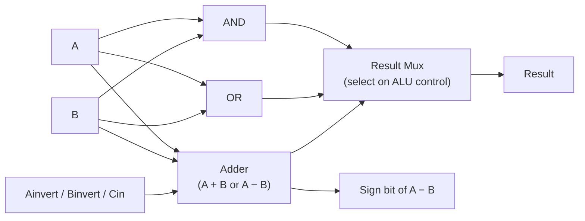
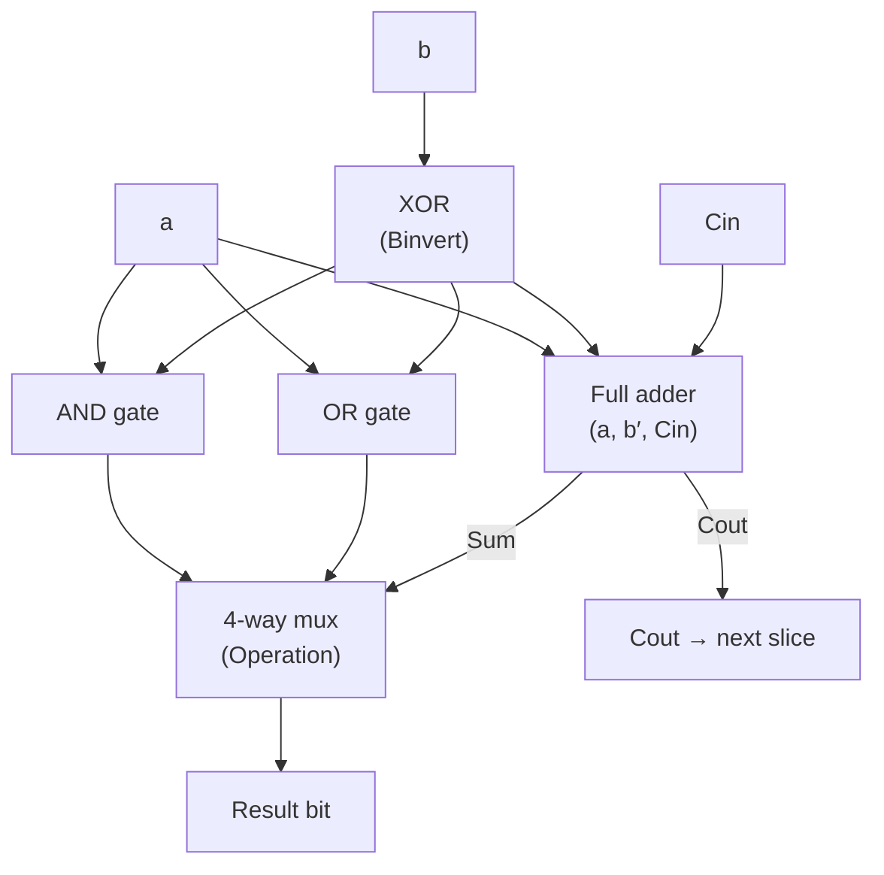

## Learning Objectives

- Explain why an ALU computes several candidate results in parallel and uses a multiplexer, driven by ALU-control bits, to select which one becomes the actual output.
- Describe how the same ripple-carry adder built earlier is reused for both addition and subtraction, by inverting the second operand and setting carry-in to 1.
- Design a 1-bit ALU "slice" supporting AND, OR, and add (selected by a 2-bit control input), and explain how N identical slices compose into an N-bit ALU.
- Derive the SLT (set-less-than) operation from the sign of the subtractor's result, and identify the one extra wire a 1-bit slice needs to support it.
- Trace a concrete N-bit ALU computation end-to-end: candidate generation, control selection, and final output, for both an addition and a subtraction.

## Context & Motivation

The binary adder, covered in the preceding concept, is a genuinely arithmetic circuit — it computes a sum from gates alone, with no notion of a running total. But a real processor does not need "a circuit that adds." Every instruction set requires several different two-operand operations: addition, subtraction, bitwise AND, bitwise OR, and comparisons such as "is A less than B." Building a separate, independent circuit for each of these operations, and separately wiring each one to the register file and to the rest of the datapath, would multiply the CPU's complexity for no real benefit, since only one of these operations is actually needed on any given clock cycle. The arithmetic logic unit (ALU) is the standard engineering answer to this: a single circuit that can compute many different operations on the same two inputs, with an extra control signal telling it, cycle by cycle, which one of its candidate results to actually output. Nand2Tetris's own ALU (built for the Hack platform) and MIT 6.004's treatment of the Beta's ALU are both concrete, buildable instances of exactly this idea.

The central design trick is deceptively simple: rather than building conditional logic that decides in advance which operation to perform and then computes only that one result, the ALU computes several candidate results in parallel, unconditionally, every single cycle — the AND of the two inputs, the OR of the two inputs, their sum, their difference, and so on — and then a multiplexer, driven by a small ALU-control code, simply selects which one of these already-computed candidates is allowed through to the output. This trades extra hardware (several computations happening "for nothing" on any given cycle) for a much simpler, more uniform control structure and a shorter, more predictable critical path, since the mux's delay does not depend on which operation was actually requested. It is the same general pattern seen earlier with multiplexers and decoders — computing broadly and selecting narrowly — now applied to the ALU's own internals rather than to routing a single value.

This concept builds directly and explicitly on the adder: rather than treating subtraction as a wholly separate arithmetic capability, the ALU reuses the very same ripple-carry adder for both addition and subtraction, exploiting the exact two's-complement identity already established — A − B = A + (¬B) + 1 — by adding a B-input inverter and a controllable carry-in to the existing adder hardware. This is not a minor implementation shortcut; it is the reason a real ALU's arithmetic hardware is so much smaller than a naive "one adder plus one separate subtractor" design would require, and it is the template this concept follows in building up a 1-bit ALU slice and composing N of them into a full N-bit ALU, with SLT (set-less-than) falling out of the subtractor's result almost for free.

## Core Theory

### The compute-in-parallel, select-with-a-mux pattern

An ALU's datapath, at the block level, is structured in exactly two stages. First, every candidate operation the ALU is capable of performing is computed unconditionally, from the same two N-bit input operands A and B. Second, a multiplexer selects exactly one of these candidate outputs to actually present as the ALU's result, based on a small set of ALU-control lines. Crucially, every candidate result is computed on every cycle, whether or not it is the one ultimately selected — the "unused" computations are simply discarded by the mux, not skipped. This design keeps the control logic trivial (a mux select code) at the cost of some redundant switching activity, a trade nearly every real ALU makes.

### Reusing the adder for both add and subtract

The adder built in the previous concept computes Sum and Cout from three inputs — A, B, and Cin — for a single bit position, chained N times into a ripple-carry adder. The ALU does not build a second circuit for subtraction; it instead places one controllable inverter on the B input (an XOR gate with a "Binvert" control wire: B XOR 0 passes B through unchanged, B XOR 1 produces ¬B) and wires the adder's very first carry-in to that same Binvert signal, rather than hardwiring it to 0. When Binvert = 0, the adder receives B unmodified and Cin = 0, computing ordinary addition A + B. When Binvert = 1, the adder receives ¬B and Cin = 1, computing A + ¬B + 1 = A − B, exactly the two's-complement identity established when the adder itself was introduced. One adder, one extra XOR gate per bit, and a single control bit — no second arithmetic circuit is needed.

### The 1-bit ALU slice

An N-bit ALU is built, exactly like the ripple-carry adder before it, out of N identical 1-bit slices wired side by side, each handling one bit position of A and B and producing one bit position of the result. A representative 1-bit slice, supporting AND, OR, and add/subtract, takes these inputs: a, b (the two operand bits at this position), Cin (carry-in from the slice to the right, or the controllable subtract signal for bit 0), Binvert (controls whether b is complemented before reaching the adder), and a 2-bit Operation code selecting which candidate result to output. Inside the slice:

| Signal | Computed as |
|---|---|
| b′ | b ⊕ Binvert (b itself if Binvert=0, ¬b if Binvert=1) |
| AND result | a · b |
| OR result | a + b |
| Sum, Cout | full-adder(a, b′, Cin) |

A small 4-way multiplexer, driven by the 2-bit Operation code, then picks one of {AND result, OR result, Sum, …} as this bit's contribution to the overall ALU result; the slice also forwards its Cout to the next slice's Cin, exactly as in the plain ripple-carry adder.

### Composing N slices into an N-bit ALU

Exactly as with the ripple-carry adder, N of these 1-bit slices are placed side by side, one per bit position, with slice i's Cout wired to slice i+1's Cin, the least-significant slice's Cin driven directly by the shared Binvert/subtract control line, and every slice sharing the same Operation and Binvert control lines so that the entire ALU performs one consistent operation across all N bits simultaneously. The Operation and Binvert lines are broadcast identically to every slice; only a, b, and the rippling Cin differ from slice to slice.

### Deriving SLT from the subtractor

SLT (set-less-than) asks a single yes/no question: is A < B? Rather than building a wholly separate comparison circuit, SLT is derived almost for free from the subtractor already present in every slice. If A − B is computed (with no overflow), the sign of the result — its most-significant bit — directly answers the question: a negative result means A − B < 0, i.e., A < B; a non-negative result means A ≥ B. Concretely, the ALU computes A − B via the add-the-complement trick described above, and the sign bit of that result (the most-significant slice's Sum output) is routed, via one extra dedicated wire, all the way down to the least-significant slice, where it is presented as one additional candidate in that slice's result mux — so only the least-significant bit of an SLT result is 1 (indicating "true"), and every other bit is forced to 0. (The subtlety of what happens when A − B genuinely overflows is a signed-arithmetic detail that the next concept, ALU flags, addresses directly with the overflow flag; the basic SLT mechanism described here assumes no overflow.)

## Worked Examples

### Example 1: A 1-bit ALU slice with 2-bit control, and composing to 32 bits

Goal: design a 1-bit ALU slice selecting between AND, OR, and add using a 2-bit Operation code, then explain scaling it to a 32-bit ALU.

Step 1 — Assign Operation codes: `00` selects AND, `01` selects OR, `10` selects add (Binvert = 0, Cin = 0 for this slice's position in the chain). This mirrors the standard convention used in Nand2Tetris's own ALU control scheme, where a handful of control bits select among a small menu of candidate operations.

Step 2 — Build the slice per the Core Theory table: compute a·b (AND) and a+b (OR) directly from a and b; compute Sum and Cout from a full adder taking (a, b′, Cin), where b′ = b ⊕ Binvert.

Step 3 — Wire a 3-way mux (only 3 of the 4 possible 2-bit codes are used here) selecting among {a·b, a+b, Sum} based on the 2-bit Operation code, producing this slice's single result bit; Cout is forwarded unconditionally to the next slice regardless of which operation was selected.

Step 4 — To scale to 32 bits, instantiate 32 identical copies of this slice, indexed 0 (least significant) through 31 (most significant). Wire slice i's Cout to slice i+1's Cin for i = 0..30; wire slice 0's Cin to the shared control input (0 for pure addition here, since Binvert is not used in this example); broadcast the same 2-bit Operation code to all 32 slices simultaneously. The result is a 32-bit value assembled by reading each slice's result bit, slice 31 down to slice 0.

Step 5 — Sanity check the composition rule: this is structurally identical to how N full adders were chained into a ripple-carry adder in the previous concept — only the carry wiring differs (Cin/Cout still ripple), while AND and OR need no carry at all and are computed independently, per bit, with no cross-slice dependency.

### Example 2: Configuring the ALU to compute A − B on 4-bit values

Goal: using the add/subtract mechanism from Core Theory, compute `A = 0110` (6) minus `B = 0011` (3) with a 4-bit ALU, and verify against direct subtraction.

Step 1 — Set Binvert = 1 (this ALU instance is configured to subtract) and set Operation to select the adder's Sum output at every slice.

Step 2 — At every bit position i, compute b′_i = b_i ⊕ 1 = ¬b_i. For B = 0011: ¬B = 1100.

Step 3 — Set the least-significant slice's Cin to 1 (supplied by the shared Binvert control line, per Core Theory), giving the adder chain A + ¬B + 1.

Step 4 (bit 0): a=0, b′=0, Cin=1. Sum = 0⊕0⊕1 = 1. Cout = (0·0)+(0·1)+(0·1) = 0.

Step 5 (bit 1): a=1, b′=0, Cin=0. Sum = 1⊕0⊕0 = 1. Cout = (1·0)+(1·0)+(0·0) = 0.

Step 6 (bit 2): a=1, b′=1, Cin=0. Sum = 1⊕1⊕0 = 0. Cout = (1·1)+(1·0)+(1·0) = 1.

Step 7 (bit 3): a=0, b′=1, Cin=1. Sum = 0⊕1⊕1 = 0. Cout = (0·1)+(0·1)+(1·1) = 1.

Step 8 — Assemble the result, most to least significant: Sum3 Sum2 Sum1 Sum0 = `0011` = 3.

Step 9 — Cross-check: 6 − 3 = 3. Matches. The identical adder hardware from Example 1, with Binvert flipped to 1 and Cin seeded with 1 at the least-significant slice, produced correct subtraction with no separate subtractor circuit.

### Example 3: Implementing SLT from the subtractor's sign

Goal: using the same 4-bit ALU, compute SLT for `A = 0011` (3) and `B = 0110` (6), i.e., determine whether 3 < 6, by reading the sign of A − B.

Step 1 — Configure the ALU exactly as in Example 2 (Binvert = 1, least-significant Cin = 1) to compute A − B, but now with A = 0011 and B = 0110, so ¬B = 1001.

Step 2 (bit 0): a=1, b′=1, Cin=1. Sum = 1⊕1⊕1 = 1. Cout = (1·1)+(1·1)+(1·1) = 1.

Step 3 (bit 1): a=1, b′=0, Cin=1. Sum = 1⊕0⊕1 = 0. Cout = (1·0)+(1·1)+(0·1) = 1.

Step 4 (bit 2): a=0, b′=0, Cin=1. Sum = 0⊕0⊕1 = 1. Cout = (0·0)+(0·1)+(0·1) = 0.

Step 5 (bit 3): a=0, b′=1, Cin=0. Sum = 0⊕1⊕0 = 1. Cout = (0·1)+(0·0)+(1·0) = 0.

Step 6 — Assemble Sum3 Sum2 Sum1 Sum0 = `1101` = −3 in two's complement on 4 bits (since the most-significant bit, the sign bit, is 1). Cross-check directly: 3 − 6 = −3. Matches.

Step 7 — Read the sign bit (Sum3 = 1): this is routed to the least-significant slice's SLT candidate input. Since the sign bit is 1 (negative result, no overflow on these small values), SLT outputs `0001` — only bit 0 is 1, every other result bit forced to 0 — correctly signaling "true": A (3) is indeed less than B (6).

## Common Misconceptions & Pitfalls

- **"The ALU decides in advance which operation to run, then computes only that one."** It does the opposite: every candidate result (AND, OR, add/subtract, SLT) is computed unconditionally, every cycle, from the same two operands, and only afterward does a multiplexer select which candidate becomes the visible output. The "unused" computations are not skipped — they are simply discarded by the mux.
- **"Subtraction needs a separate circuit from addition inside the ALU."** It does not — the identical adder hardware performs both, by inverting the B input (an extra XOR per bit, controlled by Binvert) and setting the adder's least-significant carry-in to 1 instead of 0, exactly the add-the-complement identity established for the standalone adder.
- **"A 1-bit ALU slice needs a completely different design from an ordinary full adder."** It is an ordinary full adder plus a small amount of extra logic (a B-input inverter and a couple of extra gates for AND/OR) sharing the same a, b, Cin inputs, followed by a mux — not a wholly new arithmetic primitive.
- **"SLT requires a dedicated magnitude-comparison circuit."** SLT is derived from the subtractor already built into the ALU: computing A − B and reading the sign (most-significant) bit of the result answers "is A < B?" directly, at the cost of one extra routing wire from the top slice's sign bit down to the bottom slice's mux — no separate comparator is built.
- **"Every slice in an N-bit ALU can operate independently, with no shared control."** The Operation and Binvert control lines must be identical (broadcast) across every slice so the whole ALU performs one consistent operation on all N bits at once; only the rippling Cin actually varies from slice to slice, and only when the selected operation is addition or subtraction.

## Summary

An ALU is a single circuit computing several candidate results — AND, OR, add/subtract, SLT — from the same two operands in parallel every cycle, with a small ALU-control code driving a multiplexer that selects exactly one candidate as the visible output; this compute-broadly, select-narrowly pattern keeps control logic simple at the cost of some redundant, discarded computation. Addition and subtraction are not separate circuits: the same ripple-carry adder handles both, by inverting the B operand (Binvert) and setting the adder's initial carry-in to 1 for subtraction, directly reusing the two's-complement identity A − B = A + (¬B) + 1 from the adder concept. A 1-bit ALU slice packages AND, OR, and a full adder behind a small result mux, and N identical slices, wired exactly like a ripple-carry adder's carry chain, compose into a full N-bit ALU with shared Operation and Binvert control lines. SLT falls out of this same subtractor almost for free, by routing the sign bit of A − B down to the least-significant slice's result mux. The next concept, ALU operation selection and flags, builds directly on this design by giving names to the ALU-control encodings used here and adding the status flags — Zero, Negative, Carry, Overflow — that a CPU's control unit reads to decide whether a conditional branch should actually jump.

## Documentation Links

- [Nand2Tetris — Build a Modern Computer from First Principles](https://www.coursera.org/learn/build-a-computer) — course project building a multi-function ALU from elementary gates, using exactly the compute-in-parallel/select-with-a-mux pattern covered here.
- [MIT 6.004 — OCW Syllabus](https://ocw.mit.edu/courses/6-004-computation-structures-spring-2017/pages/syllabus/) — course syllabus for Computation Structures, whose datapath units cover ALU design, operand selection, and reuse of adder hardware for subtraction.
