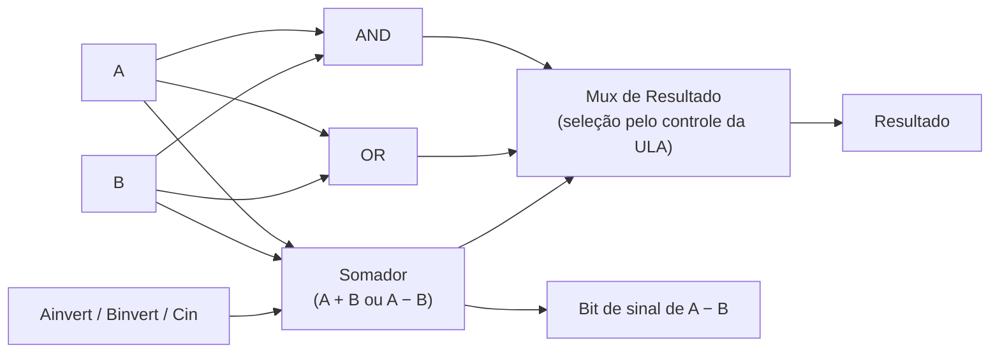
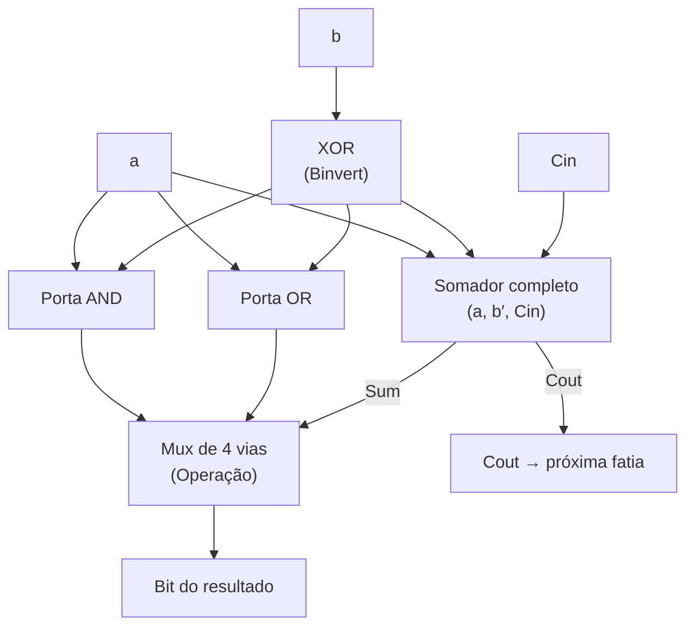

## Objetivos de Aprendizagem

- Explicar por que uma ULA calcula vários resultados candidatos em paralelo e usa um multiplexador, comandado por bits de controle da ULA, para selecionar qual deles vira a saída de fato.
- Descrever como o mesmo somador ripple-carry construído antes é reaproveitado tanto para soma quanto para subtração, invertendo o segundo operando e colocando o carry de entrada em 1.
- Projetar uma "fatia" de ULA de 1 bit que suporta AND, OR e soma (selecionados por uma entrada de controle de 2 bits), e explicar como N fatias idênticas se compõem numa ULA de N bits.
- Derivar a operação SLT (set-less-than) a partir do sinal do resultado do subtrator, e identificar o único fio extra de que uma fatia de 1 bit precisa para suportá-la.
- Acompanhar de ponta a ponta um cálculo concreto numa ULA de N bits (geração de candidatos, seleção pelo controle e saída final) tanto para uma soma quanto para uma subtração.

## Contexto e Motivação

O somador binário, visto no conceito anterior, é um circuito genuinamente aritmético: ele calcula uma soma só com portas, sem noção de total acumulado. Mas um processador real não precisa de "um circuito que soma". Todo conjunto de instruções exige várias operações diferentes de dois operandos: soma, subtração, AND bit a bit, OR bit a bit e comparações como "A é menor que B?". Construir um circuito separado e independente para cada uma dessas operações, e ligar cada um separadamente ao banco de registradores e ao resto do datapath, multiplicaria a complexidade da CPU sem benefício real, já que só uma dessas operações é de fato necessária num dado ciclo de clock. A unidade lógica e aritmética (ULA) é a resposta padrão de engenharia para isso: um único circuito que consegue calcular muitas operações diferentes sobre as mesmas duas entradas, com um sinal de controle extra dizendo, ciclo a ciclo, qual dos seus resultados candidatos deve de fato sair. A ULA do próprio Nand2Tetris (construída para a plataforma Hack) e o tratamento da ULA do Beta no MIT 6.004 são, ambas, instâncias concretas e construíveis exatamente dessa ideia.

O truque central de projeto é enganosamente simples: em vez de construir lógica condicional que decide antecipadamente qual operação fazer e então calcula só aquele resultado, a ULA calcula vários resultados candidatos em paralelo, incondicionalmente, em todo ciclo (o AND das duas entradas, o OR das duas entradas, sua soma, sua diferença e assim por diante) e então um multiplexador, comandado por um pequeno código de controle da ULA, simplesmente seleciona qual desses candidatos já calculados pode passar para a saída. Isso troca hardware extra (vários cálculos acontecendo "à toa" num dado ciclo) por uma estrutura de controle muito mais simples e uniforme e por um caminho crítico mais curto e mais previsível, já que o atraso do mux não depende de qual operação foi de fato pedida. É o mesmo padrão geral visto antes com multiplexadores e decodificadores (calcular de forma ampla e selecionar de forma estreita), agora aplicado aos internos da própria ULA em vez de ao roteamento de um único valor.

Este conceito se constrói direta e explicitamente sobre o somador: em vez de tratar a subtração como uma capacidade aritmética totalmente separada, a ULA reaproveita exatamente o mesmo somador ripple-carry para soma e subtração, explorando a identidade de complemento de dois já estabelecida, A − B = A + (¬B) + 1, ao acrescentar um inversor na entrada B e um carry de entrada controlável ao hardware de somador existente. Isso não é um atalho menor de implementação; é o motivo de o hardware aritmético de uma ULA real ser muito menor do que um projeto ingênuo de "um somador mais um subtrator separado" exigiria, e é o modelo que este conceito segue ao construir uma fatia de ULA de 1 bit e compor N delas numa ULA completa de N bits, com o SLT (set-less-than) saindo do resultado do subtrator quase de graça.

## Teoria Central

### O padrão calcular em paralelo, selecionar com um mux

O datapath de uma ULA, em nível de blocos, é estruturado em exatamente dois estágios. Primeiro, toda operação candidata que a ULA consegue fazer é calculada incondicionalmente, a partir dos mesmos dois operandos de N bits, A e B. Segundo, um multiplexador seleciona exatamente uma dessas saídas candidatas para apresentar de fato como resultado da ULA, com base num pequeno conjunto de linhas de controle da ULA. Crucialmente, todo resultado candidato é calculado em todo ciclo, seja ou não o selecionado no fim: os cálculos "não usados" são simplesmente descartados pelo mux, não pulados. Esse projeto mantém a lógica de controle trivial (um código de seleção do mux) ao custo de alguma atividade de chaveamento redundante, uma troca que quase toda ULA real faz.

### Reaproveitando o somador para somar e subtrair

O somador construído no conceito anterior calcula Sum e Cout a partir de três entradas (A, B e Cin) para uma única posição de bit, encadeado N vezes num somador ripple-carry. A ULA não constrói um segundo circuito para a subtração; em vez disso, ela coloca um inversor controlável na entrada B (uma porta XOR com um fio de controle "Binvert": B XOR 0 deixa B passar inalterado, B XOR 1 produz ¬B) e liga o primeiro carry de entrada do somador a esse mesmo sinal Binvert, em vez de fixá-lo em 0. Quando Binvert = 0, o somador recebe B sem modificação e Cin = 0, calculando a soma comum A + B. Quando Binvert = 1, o somador recebe ¬B e Cin = 1, calculando A + ¬B + 1 = A − B, exatamente a identidade de complemento de dois estabelecida quando o próprio somador foi apresentado. Um somador, uma porta XOR extra por bit e um único bit de controle: nenhum segundo circuito aritmético é necessário.

### A fatia de ULA de 1 bit

Uma ULA de N bits é construída, exatamente como o somador ripple-carry antes dela, com N fatias idênticas de 1 bit ligadas lado a lado, cada uma cuidando de uma posição de bit de A e B e produzindo uma posição de bit do resultado. Uma fatia de 1 bit representativa, que suporta AND, OR e soma/subtração, recebe estas entradas: a, b (os dois bits de operando nesta posição), Cin (carry de entrada da fatia à direita, ou o sinal de subtração controlável no bit 0), Binvert (controla se b é complementado antes de chegar ao somador) e um código de Operação de 2 bits que seleciona qual resultado candidato sai. Dentro da fatia:

| Sinal | Calculado como |
|---|---|
| b′ | b ⊕ Binvert (o próprio b se Binvert=0, ¬b se Binvert=1) |
| Resultado AND | a · b |
| Resultado OR | a + b |
| Sum, Cout | somador completo(a, b′, Cin) |

Um pequeno multiplexador de 4 vias, comandado pelo código de Operação de 2 bits, então escolhe um entre {resultado AND, resultado OR, Sum, …} como a contribuição deste bit para o resultado geral da ULA; a fatia também repassa seu Cout para o Cin da próxima fatia, exatamente como no somador ripple-carry simples.

### Compondo N fatias numa ULA de N bits

Exatamente como no somador ripple-carry, N dessas fatias de 1 bit são colocadas lado a lado, uma por posição de bit, com o Cout da fatia i ligado ao Cin da fatia i+1, o Cin da fatia menos significativa comandado diretamente pela linha de controle compartilhada Binvert/subtração, e todas as fatias compartilhando as mesmas linhas de controle de Operação e Binvert, para que a ULA inteira faça uma única operação consistente nos N bits ao mesmo tempo. As linhas de Operação e Binvert são difundidas de forma idêntica a todas as fatias; só a, b e o Cin que ondula mudam de uma fatia para outra.

### Derivando o SLT a partir do subtrator

O SLT (set-less-than) faz uma única pergunta de sim ou não: A < B? Em vez de construir um circuito de comparação totalmente separado, o SLT é derivado quase de graça a partir do subtrator já presente em toda fatia. Se A − B for calculado (sem overflow), o sinal do resultado, seu bit mais significativo, responde diretamente à pergunta: um resultado negativo significa A − B < 0, ou seja, A < B; um resultado não negativo significa A ≥ B. Concretamente, a ULA calcula A − B pelo truque da soma do complemento descrito acima, e o bit de sinal desse resultado (a saída Sum da fatia mais significativa) é encaminhado, por um fio extra dedicado, até a fatia menos significativa, onde é apresentado como mais um candidato no mux de resultado dessa fatia; assim, só o bit menos significativo de um resultado de SLT vale 1 (indicando "verdadeiro"), e todos os outros bits são forçados a 0. (A sutileza do que acontece quando A − B de fato dá overflow é um detalhe de aritmética com sinal que o próximo conceito, flags da ULA, trata diretamente com a flag de overflow; o mecanismo básico de SLT descrito aqui supõe que não há overflow.)

## Exemplos Resolvidos

### Exemplo 1: uma fatia de ULA de 1 bit com controle de 2 bits, e a composição até 32 bits

Objetivo: projetar uma fatia de ULA de 1 bit que seleciona entre AND, OR e soma usando um código de Operação de 2 bits, e depois explicar como escalá-la para uma ULA de 32 bits.

Passo 1: atribua os códigos de Operação: `00` seleciona AND, `01` seleciona OR, `10` seleciona soma (Binvert = 0, Cin = 0 para a posição desta fatia na cadeia). Isso espelha a convenção padrão usada no esquema de controle da própria ULA do Nand2Tetris, em que alguns poucos bits de controle selecionam entre um pequeno cardápio de operações candidatas.

Passo 2: construa a fatia conforme a tabela da Teoria Central: calcule a·b (AND) e a+b (OR) diretamente de a e b; calcule Sum e Cout com um somador completo que recebe (a, b′, Cin), em que b′ = b ⊕ Binvert.

Passo 3: ligue um mux de 3 vias (só 3 dos 4 códigos possíveis de 2 bits são usados aqui) que seleciona entre {a·b, a+b, Sum} com base no código de Operação de 2 bits, produzindo o único bit de resultado desta fatia; o Cout é repassado incondicionalmente para a próxima fatia, seja qual for a operação selecionada.

Passo 4: para escalar para 32 bits, instancie 32 cópias idênticas desta fatia, indexadas de 0 (menos significativa) a 31 (mais significativa). Ligue o Cout da fatia i ao Cin da fatia i+1 para i = 0..30; ligue o Cin da fatia 0 à entrada de controle compartilhada (0 para soma pura aqui, já que o Binvert não é usado neste exemplo); difunda o mesmo código de Operação de 2 bits para as 32 fatias ao mesmo tempo. O resultado é um valor de 32 bits montado lendo o bit de resultado de cada fatia, da fatia 31 até a fatia 0.

Passo 5: confira a regra de composição: isto é estruturalmente idêntico à forma como N somadores completos foram encadeados num somador ripple-carry no conceito anterior; só a ligação do carry difere (Cin/Cout ainda ondulam), enquanto AND e OR não precisam de carry nenhum e são calculados de forma independente, bit a bit, sem dependência entre fatias.

### Exemplo 2: configurando a ULA para calcular A − B com valores de 4 bits

Objetivo: usando o mecanismo de soma/subtração da Teoria Central, calcular `A = 0110` (6) menos `B = 0011` (3) com uma ULA de 4 bits, e verificar contra a subtração direta.

Passo 1: coloque Binvert = 1 (esta instância da ULA está configurada para subtrair) e coloque a Operação para selecionar a saída Sum do somador em toda fatia.

Passo 2: em cada posição de bit i, calcule b′_i = b_i ⊕ 1 = ¬b_i. Para B = 0011: ¬B = 1100.

Passo 3: coloque o Cin da fatia menos significativa em 1 (fornecido pela linha de controle compartilhada Binvert, conforme a Teoria Central), dando à cadeia de somadores A + ¬B + 1.

Passo 4 (bit 0): a=0, b′=0, Cin=1. Sum = 0⊕0⊕1 = 1. Cout = (0·0)+(0·1)+(0·1) = 0.

Passo 5 (bit 1): a=1, b′=0, Cin=0. Sum = 1⊕0⊕0 = 1. Cout = (1·0)+(1·0)+(0·0) = 0.

Passo 6 (bit 2): a=1, b′=1, Cin=0. Sum = 1⊕1⊕0 = 0. Cout = (1·1)+(1·0)+(1·0) = 1.

Passo 7 (bit 3): a=0, b′=1, Cin=1. Sum = 0⊕1⊕1 = 0. Cout = (0·1)+(0·1)+(1·1) = 1.

Passo 8: monte o resultado, do mais para o menos significativo: Sum3 Sum2 Sum1 Sum0 = `0011` = 3.

Passo 9: conferindo: 6 − 3 = 3. Bate. O mesmo hardware de somador do Exemplo 1, com o Binvert trocado para 1 e o Cin iniciado em 1 na fatia menos significativa, produziu a subtração correta sem nenhum circuito subtrator separado.

### Exemplo 3: implementando o SLT a partir do sinal do subtrator

Objetivo: usando a mesma ULA de 4 bits, calcular o SLT para `A = 0011` (3) e `B = 0110` (6), ou seja, determinar se 3 < 6, lendo o sinal de A − B.

Passo 1: configure a ULA exatamente como no Exemplo 2 (Binvert = 1, Cin menos significativo = 1) para calcular A − B, mas agora com A = 0011 e B = 0110, então ¬B = 1001.

Passo 2 (bit 0): a=1, b′=1, Cin=1. Sum = 1⊕1⊕1 = 1. Cout = (1·1)+(1·1)+(1·1) = 1.

Passo 3 (bit 1): a=1, b′=0, Cin=1. Sum = 1⊕0⊕1 = 0. Cout = (1·0)+(1·1)+(0·1) = 1.

Passo 4 (bit 2): a=0, b′=0, Cin=1. Sum = 0⊕0⊕1 = 1. Cout = (0·0)+(0·1)+(0·1) = 0.

Passo 5 (bit 3): a=0, b′=1, Cin=0. Sum = 0⊕1⊕0 = 1. Cout = (0·1)+(0·0)+(1·0) = 0.

Passo 6: monte Sum3 Sum2 Sum1 Sum0 = `1101` = −3 em complemento de dois com 4 bits (já que o bit mais significativo, o bit de sinal, vale 1). Conferindo diretamente: 3 − 6 = −3. Bate.

Passo 7: leia o bit de sinal (Sum3 = 1): ele é encaminhado à entrada candidata de SLT da fatia menos significativa. Como o bit de sinal vale 1 (resultado negativo, sem overflow com esses valores pequenos), o SLT dá saída `0001` (só o bit 0 vale 1, todos os outros bits do resultado forçados a 0), sinalizando corretamente "verdadeiro": A (3) é de fato menor que B (6).

## Equívocos Comuns e Armadilhas

- **"A ULA decide antecipadamente qual operação rodar, e então calcula só aquela."** Ela faz o contrário: todo resultado candidato (AND, OR, soma/subtração, SLT) é calculado incondicionalmente, em todo ciclo, a partir dos mesmos dois operandos, e só depois um multiplexador seleciona qual candidato vira a saída visível. Os cálculos "não usados" não são pulados: são simplesmente descartados pelo mux.
- **"A subtração precisa de um circuito separado da soma dentro da ULA."** Não precisa: o mesmo hardware de somador faz as duas, invertendo a entrada B (um XOR extra por bit, controlado pelo Binvert) e colocando o carry de entrada menos significativo do somador em 1 em vez de 0, exatamente a identidade de soma do complemento estabelecida para o somador isolado.
- **"Uma fatia de ULA de 1 bit precisa de um projeto completamente diferente de um somador completo comum."** Ela é um somador completo comum mais um pouco de lógica extra (um inversor na entrada B e algumas portas extras para AND/OR) compartilhando as mesmas entradas a, b, Cin, seguido de um mux; não é uma primitiva aritmética totalmente nova.
- **"O SLT exige um circuito dedicado de comparação de magnitude."** O SLT é derivado do subtrator já embutido na ULA: calcular A − B e ler o bit de sinal (mais significativo) do resultado responde diretamente "A < B?", ao custo de um fio de roteamento extra do bit de sinal da fatia de cima até o mux da fatia de baixo; nenhum comparador separado é construído.
- **"Cada fatia de uma ULA de N bits pode operar de forma independente, sem controle compartilhado."** As linhas de controle de Operação e Binvert precisam ser idênticas (difundidas) em todas as fatias, para que a ULA inteira faça uma única operação consistente nos N bits de uma vez; só o Cin que ondula de fato varia de uma fatia para outra, e só quando a operação selecionada é soma ou subtração.

## Resumo

Uma ULA é um único circuito que calcula vários resultados candidatos (AND, OR, soma/subtração, SLT) a partir dos mesmos dois operandos, em paralelo, em todo ciclo, com um pequeno código de controle da ULA comandando um multiplexador que seleciona exatamente um candidato como saída visível; esse padrão de calcular de forma ampla e selecionar de forma estreita mantém a lógica de controle simples ao custo de algum cálculo redundante e descartado. Soma e subtração não são circuitos separados: o mesmo somador ripple-carry cuida das duas, invertendo o operando B (Binvert) e colocando o carry de entrada inicial do somador em 1 para a subtração, reaproveitando diretamente a identidade de complemento de dois A − B = A + (¬B) + 1 do conceito do somador. Uma fatia de ULA de 1 bit empacota AND, OR e um somador completo atrás de um pequeno mux de resultado, e N fatias idênticas, ligadas exatamente como a cadeia de carry de um somador ripple-carry, se compõem numa ULA completa de N bits com linhas de controle de Operação e Binvert compartilhadas. O SLT sai desse mesmo subtrator quase de graça, encaminhando o bit de sinal de A − B até o mux de resultado da fatia menos significativa. O próximo conceito, seleção de operação da ULA e flags, se constrói diretamente sobre este projeto, dando nomes às codificações de controle da ULA usadas aqui e acrescentando as flags de status (Zero, Negativo, Carry, Overflow) que a unidade de controle de uma CPU lê para decidir se um desvio condicional deve de fato saltar.

## Documentation Links

- [Nand2Tetris: Build a Modern Computer from First Principles](https://www.coursera.org/learn/build-a-computer): projeto do curso que constrói uma ULA multifuncional a partir de portas elementares, usando exatamente o padrão de calcular em paralelo e selecionar com um mux visto aqui.
- [MIT 6.004: OCW Syllabus](https://ocw.mit.edu/courses/6-004-computation-structures-spring-2017/pages/syllabus/): ementa do curso Computation Structures, cujas unidades de datapath cobrem o projeto de ULAs, a seleção de operandos e o reaproveitamento do hardware de somador para a subtração.
