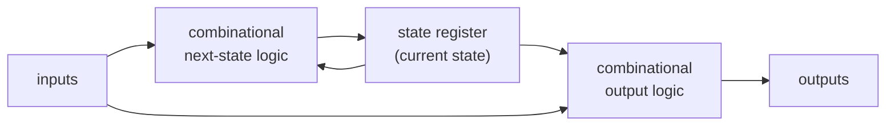
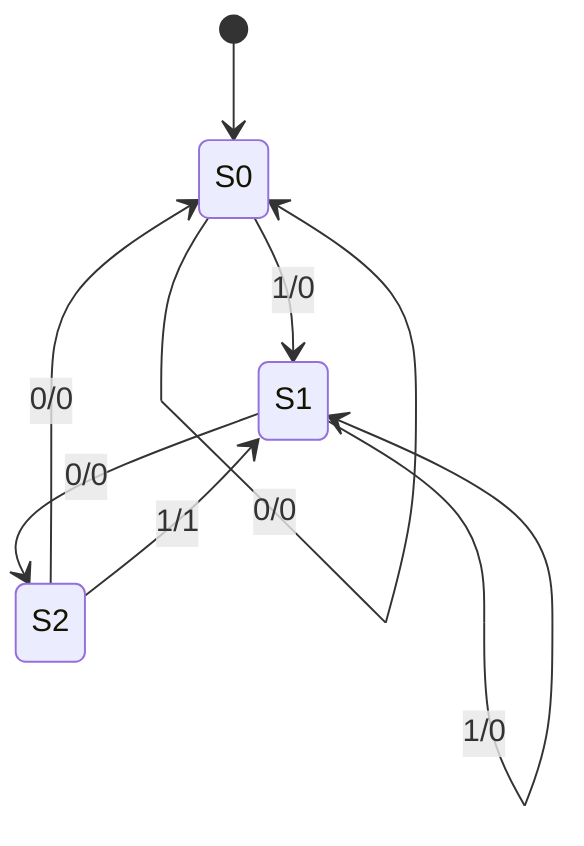

## Learning Objectives

- Describe the general sequential-circuit pattern: a state register, combinational next-state logic, and combinational output logic.
- Distinguish a Moore machine (output depends only on state) from a Mealy machine (output depends on state and input), and identify which style a given diagram uses.
- Follow the design flow — state diagram, transition/output table, state encoding, next-state and output equations, circuit — to build an FSM from a word description.
- Design a sequence detector and a modulo-N counter as FSMs, deriving transition tables and next-state equations from a binary encoding.
- Analyze a given small sequential circuit to recover its state diagram and describe its behavior.
- Explain why a CPU's control unit is itself an FSM, and identify what plays the role of "state," "input," and "output" there.

## Context & Motivation

A register, on its own, is inert: it holds whatever value was last loaded into it, and holds that value forever unless something external supplies a new value and asserts the load signal. Nearly everything interesting a digital circuit does, however, involves behavior that changes over time in response to a pattern of inputs — recognizing a sequence of bits arriving one at a time, counting events, cycling a traffic light through phases, or sequencing the steps a CPU instruction needs across multiple clock cycles. All of these are folded into one uniform structure called a finite state machine (FSM): a state register that remembers "where we are" in some fixed, finite set of possibilities, combined with combinational logic that looks at the current state (and possibly the current input) and computes both what the state should become next and what the circuit should output right now. This is not a new hardware primitive — it is exactly the register from the previous concept, wired so its own "new_data" input is computed by logic examining its own current output. The register supplies memory; the surrounding combinational logic supplies decision-making.

The FSM formalism earns its central place in computer organization because it is precisely the model used to build a CPU's control unit — the circuit sequencing the fetch, decode, and execute steps of instruction processing, and asserting the right control signals to the rest of the datapath each cycle. MIT 6.004 develops FSM design as the direct bridge between "circuits that store values" and "circuits that carry out multi-step processes," precisely because a CPU's control unit is, structurally, nothing more than an FSM: its state encodes which phase of instruction execution is underway, its inputs are things like the fetched opcode bits, and its outputs are the control signals that steer multiplexers, enable registers, and select ALU operations elsewhere in the datapath. Harris & Harris's treatment of digital design builds toward exactly this destination, presenting FSMs as reusable machinery students later recognize, almost unchanged, inside the control unit of the RISC-V processors built later in the same text.

The same design flow used to build a 3-state sequence detector is, without conceptual change, the flow used to build the multi-state control unit of a real processor; only the number of states and the complexity of the inputs and outputs grow. Equally, working backward — given a circuit's flip-flops and gates, reconstructing what behavior it implements — is a core analysis skill for reading unfamiliar hardware descriptions and verifying that a design matches its specification.

## Core Theory

### The general sequential-circuit pattern

Every synchronous sequential circuit with well-defined behavior can be organized into exactly three pieces:

The **state register** is built exactly as described in the previous concept: N flip-flops sharing a clock, holding an N-bit encoding of "which state we are currently in." The **next-state logic** is purely combinational — it has no memory — and computes, from the current state (and, in general, the current inputs), the value that should be loaded into the state register on the next clock edge. The **output logic** is also purely combinational, computing the circuit's current outputs from the current state (and possibly the current inputs). Crucially, the state register's output feeds back into the next-state logic, which is what allows the circuit's future behavior to depend on its own history rather than the immediate input alone — this feedback loop, mediated by synchronous timing, is what makes a sequential circuit fundamentally different from a purely combinational one.

This is the same shape as the load-enable register from the previous concept, generalized: instead of an external "load" bit chosen by some separate control source, the next-state logic itself computes what value the register should capture on every clock edge (an explicit enable input may still exist if the FSM should sometimes hold its state, but the core loop of state feeding next-state computation feeding back into state defines an FSM).

### Moore machines vs. Mealy machines

FSMs come in two standard flavors, distinguished by what the output logic is allowed to look at:

| Style | Output depends on | Consequence |
|---|---|---|
| Moore | Current state only | Output changes only at a clock edge; stable and glitch-free for the entire cycle |
| Mealy | Current state and current input | Output can change immediately with the input, even between edges; may react one cycle sooner but can glitch |

In a Moore machine, the output logic receives only the state register's output. In a Mealy machine, the output logic receives both the state and the external input signals. Both styles are fully general — any Mealy behavior can be re-expressed as an equivalent Moore machine (typically by adding states to "absorb" the input dependency), at the cost of possibly needing more states. The choice is a design tradeoff: Moore machines produce cleaner, glitch-free outputs stable for a full cycle, often preferred in control-unit design; Mealy machines can respond one cycle earlier and sometimes need fewer states, preferable when latency matters more than output cleanliness.

### The design flow: from word description to circuit

Designing an FSM from an informal specification follows a fixed sequence of steps, each mechanically producing the input to the next:

1. **State diagram.** Identify the distinct "states" the machine must remember, draw one node per state, and draw a labeled edge for every transition in response to an input — labeling Moore states with their outputs and Mealy edges with `input / output`.
2. **State-transition and output table.** Rewrite the diagram as a table: one row per (current state, input), listing the next state (and, for Mealy machines, the output on that transition; for Moore machines, output is listed per state).
3. **State encoding.** Assign each state a distinct binary code, using enough bits for a unique pattern (for K states, at least ceil(log2 K) bits, though extra bits are sometimes used for encodings such as one-hot).
4. **Next-state and output equations.** From the encoded table, derive boolean equations for each next-state and output bit as functions of the current-state bits (and, for Mealy outputs, the input bits) — a standard combinational design problem solved with truth tables and boolean simplification.
5. **Circuit.** Wire the equations as gates feeding the D inputs of a state register (one flip-flop per state bit) and, separately, as gates producing the output signals.

Analysis reverses this flow: given a circuit, read off the next-state and output equations directly from the gates, build the encoded table by evaluating those equations for every reachable state/input combination, name each state code to recover a diagram, and describe the behavior in words.

### Why the control unit is a finite state machine

A CPU executing an instruction proceeds through several phases even within what looks like one instruction — fetching the instruction word, decoding the operation, reading operand registers, performing the operation, and writing back a result. In a multicycle processor, the control unit's job is to sequence through these phases, asserting the right control signals (register-write enables, multiplexer selects, ALU operation codes) each cycle. This is exactly an FSM: the state register holds an encoding of "which phase we are in," next-state logic decides the next phase (depending on the current phase and, in general, the fetched opcode), and output logic produces the control signals fed to the datapath. The later control-unit concept develops this fully; the essential point here is that nothing new is needed beyond the FSM design flow already established for sequence detectors and counters — only the number of states and the width of inputs and outputs grow to match a real instruction set.

## Worked Examples

### Example 1: Designing a Mealy sequence detector for the pattern "101"

Specification: build a circuit with one input bit `X`, sampled once per clock cycle, and one output bit `Z`, which should pulse to 1 during the cycle in which the most recently seen three input bits (including the current one) complete the pattern `1, 0, 1` (overlapping matches allowed — after detecting `101`, the machine should be ready to detect another occurrence starting from the last `1` already seen).

Step 1 — state diagram. Define states by how much of the pattern has been matched so far: S0 = no progress, S1 = last bit seen was a `1`, S2 = last two bits seen were `10`. This is a Mealy machine: `Z` is asserted on the transition consuming the third pattern bit, not held for a whole state.

- S0, input 0 → stay in S0, output 0
- S0, input 1 → go to S1, output 0 (matched the leading "1")
- S1, input 0 → go to S2, output 0 (matched "10")
- S1, input 1 → stay in S1, output 0 (the new 1 restarts the match)
- S2, input 1 → go to S1, output 1 (completed "101"; the final "1" can itself start a new match)
- S2, input 0 → go to S0, output 0 ("100" breaks the pattern)

Step 2 — state-transition and output table:

| Current state | Input X | Next state | Output Z |
|---|---|---|---|
| S0 | 0 | S0 | 0 |
| S0 | 1 | S1 | 0 |
| S1 | 0 | S2 | 0 |
| S1 | 1 | S1 | 0 |
| S2 | 0 | S0 | 0 |
| S2 | 1 | S1 | 1 |

Step 3 — state encoding. Three states require at least 2 bits; encode S0=00, S1=01, S2=10 (the unused code 11 is a don't-care).

Step 4 — next-state and output equations. Let the state register hold bits `Q1 Q0` (current state) and produce next-state bits `D1 D0`. Rewriting the table with the encoding:

| Q1 Q0 (state) | X | D1 D0 (next state) | Z |
|---|---|---|---|
| 0 0 (S0) | 0 | 0 0 | 0 |
| 0 0 (S0) | 1 | 0 1 | 0 |
| 0 1 (S1) | 0 | 1 0 | 0 |
| 0 1 (S1) | 1 | 0 1 | 0 |
| 1 0 (S2) | 0 | 0 0 | 0 |
| 1 0 (S2) | 1 | 0 1 | 1 |

D1 is 1 only for Q1Q0=01,X=0, giving `D1 = (NOT Q1) AND Q0 AND (NOT X)`. D0 is 1 for the three rows where X=1 and Q1=0 (11 being an unused don't-care), giving `D0 = (NOT Q1) AND X`. Z is 1 only for Q1Q0=10,X=1, giving `Z = Q1 AND (NOT Q0) AND X`.

Step 5 — circuit: these three boolean equations, built from AND/OR/NOT gates, feed D1 and D0 into a 2-bit state register (two D flip-flops sharing a clock, as in the previous concept), and the Z equation feeds a separate output gate reading the same Q1, Q0, X signals.

### Example 2: Designing a mod-3 counter and deriving its next-state logic

Specification: a Moore machine with no external input beyond the clock, cycling through outputs 0, 1, 2, 0, 1, 2, ... on successive clock edges (a modulo-3 counter). There are three states, one per count value, and this is naturally a Moore machine since the output is simply the current state's identity.

Step 1 — state diagram: three states, C0, C1, C2, each transitioning unconditionally to the next (C0→C1→C2→C0→...), with output equal to the state's count value.

Step 2 — transition/output table:

| Current state | Next state | Output |
|---|---|---|
| C0 | C1 | 0 |
| C1 | C2 | 1 |
| C2 | C0 | 2 |

Step 3 — encoding: since 0, 1, 2 are themselves natural binary numbers, encode C0=00, C1=01, C2=10 directly (this makes the output logic trivial — output = state code; the unused code 11 is a don't-care that should never be reached if the machine starts at C0).

Step 4 — next-state equations. Rewriting with the encoding, state bits Q1 Q0, next-state bits D1 D0:

| Q1 Q0 | D1 D0 |
|---|---|
| 0 0 (C0) | 0 1 |
| 0 1 (C1) | 1 0 |
| 1 0 (C2) | 0 0 |

D1 is 1 only when Q1Q0=01, so `D1 = (NOT Q1) AND Q0`. D0 is 1 only when Q1Q0=00, so `D0 = (NOT Q1) AND (NOT Q0)`. Since the output equals the state code, the output logic is simply `output_bit1 = Q1`, `output_bit0 = Q0` — no additional gates needed beyond wires.

Step 5 — circuit: D1 and D0, computed by the two small gate equations above, feed a 2-bit state register; outputs are taken directly from Q1 and Q0 with no separate output logic, a direct consequence of choosing an encoding that mirrors the desired output values.

### Example 3: Analyzing a given circuit back into a state diagram

Suppose we are handed a circuit (not a specification): a 1-bit state register with output Q, and two combinational equations, with no external input other than the clock: `D = NOT Q` (next-state logic) and `Z = Q` (Moore output logic).

Step 1 — build the encoded transition table by evaluating D for every value of Q: when Q=0, D=1; when Q=1, D=0.

| Q (current state) | D (next state) | Z (output) |
|---|---|---|
| 0 | 1 | 0 |
| 1 | 0 | 1 |

Step 2 — assign readable names: Q=0 is state "A," Q=1 is state "B."

Step 3 — recover the state diagram: from A, the next state is B; from B, the next state is A. There is no external input, so every transition is unconditional.

Step 4 — describe the behavior in words: this is a single-bit toggle circuit (a T flip-flop pattern) with no external input — its output alternates 0, 1, 0, 1, ... on every clock edge, functioning as a divide-by-two frequency divider when Q is viewed as a square wave at half the clock's frequency. This illustrates the general analysis procedure: read equations off the circuit, tabulate next-state and output values for every reachable combination of state (and input) bits, then translate the table into a diagram and a plain-language description.

## Common Misconceptions & Pitfalls

- **"A Moore machine can't react to inputs at all."** A Moore machine's *output* logic ignores the input, but its *next-state* logic typically depends on it — the machine reacts to inputs by changing state (its output changes indirectly once the new state is reached); it simply never lets output logic read the input directly.
- **"Mealy machines are strictly more powerful than Moore machines."** Every Mealy machine has an equivalent Moore machine (possibly with more states) producing the same output sequence, just delayed by one cycle; the two models have identical expressive power, differing only in output timing and typical state count.
- **"The state encoding doesn't matter, only the state diagram does."** The diagram and table are encoding-independent, but the gate-level equations depend entirely on which binary code is assigned to each state — different encodings of the same diagram can produce very different gate counts, which is why encoding choice (as in Example 2) is a real design decision.
- **"Analyzing a circuit means guessing what it's 'supposed' to do."** Analysis is mechanical: write the equations exactly as implemented by the gates, evaluate them for every reachable state/input combination to build a table, and only then translate that table into a diagram — behavior is derived from equations, never assumed from a hunch.
- **"An FSM needs an explicit input wire, and its state register is unlike a plain register."** The mod-3 counter and toggle circuit above have no external input beyond the clock and are still bona fide FSMs, since the defining structure is state register plus next-state logic plus output logic; and that state register is the identical N-flip-flop, shared-clock circuit from the previous concept, only with its D inputs now driven by dedicated next-state logic instead of an externally supplied data bus.

## Summary

Every finite state machine is built from three pieces: a state register (the same N-flip-flop, shared-clock register from the previous concept) that remembers the current state, combinational next-state logic that computes what the register should become on the next clock edge from the current state (and, in general, the current inputs), and combinational output logic computing the current outputs — reading only the state in a Moore machine, or the state and inputs together in a Mealy machine. The standard design flow moves mechanically from an informal state diagram to a state-transition/output table, to a binary state encoding, to boolean next-state and output equations, to a circuit built from that register plus gates; analysis reverses the flow, starting from a circuit's equations and working back to a table, a diagram, and a plain description. This uniform pattern scales without conceptual change from sequence detectors and modulo-N counters up to a CPU's own control unit, which is itself nothing more than an FSM whose states are instruction-execution phases, whose inputs include the fetched opcode, and whose outputs are the control signals steering the datapath — the subject the control-unit concept later in this discipline builds directly on top of everything established here.

## Documentation Links

- [MIT 6.004 — OCW Syllabus](https://ocw.mit.edu/courses/6-004-computation-structures-spring-2017/pages/syllabus/) — course syllabus for Computation Structures, covering the finite state machine design and analysis flow as the bridge from registers to control logic.
- [Harris & Harris — Digital Design and Computer Architecture, RISC-V Edition](https://shop.elsevier.com/books/digital-design-and-computer-architecture-risc-v-edition/harris/978-0-12-820064-3) — presents the Moore/Mealy FSM design methodology used later in the same text to build the control unit of a RISC-V processor.
