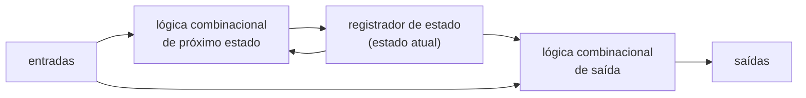
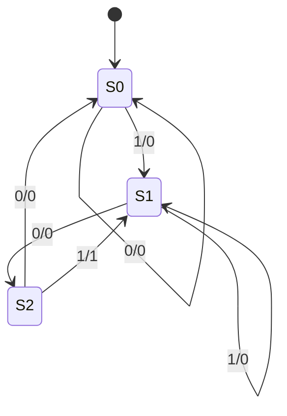

## Objetivos de Aprendizagem

- Descrever o padrão geral de circuito sequencial: um registrador de estado, lógica combinacional de próximo estado e lógica combinacional de saída.
- Distinguir uma máquina de Moore (a saída depende só do estado) de uma máquina de Mealy (a saída depende do estado e da entrada), e identificar qual estilo um dado diagrama usa.
- Seguir o fluxo de projeto (diagrama de estados, tabela de transição/saída, codificação dos estados, equações de próximo estado e de saída, circuito) para construir uma FSM a partir de uma descrição em palavras.
- Projetar um detector de sequência e um contador módulo N como FSMs, derivando tabelas de transição e equações de próximo estado a partir de uma codificação binária.
- Analisar um pequeno circuito sequencial dado para recuperar seu diagrama de estados e descrever seu comportamento.
- Explicar por que a unidade de controle de uma CPU é ela mesma uma FSM, e identificar o que faz o papel de "estado", "entrada" e "saída" ali.

## Contexto e Motivação

Um registrador, sozinho, é inerte: ele guarda o último valor carregado e mantém esse valor para sempre, a não ser que algo externo forneça um valor novo e ative o sinal de carga. Quase tudo de interessante que um circuito digital faz, porém, envolve comportamento que muda ao longo do tempo em resposta a um padrão de entradas: reconhecer uma sequência de bits que chegam um de cada vez, contar eventos, fazer um semáforo percorrer suas fases, ou sequenciar os passos de que uma instrução de CPU precisa ao longo de vários ciclos de clock. Tudo isso cabe numa estrutura uniforme chamada máquina de estados finitos (FSM): um registrador de estado que lembra "onde estamos" num conjunto fixo e finito de possibilidades, combinado com lógica combinacional que olha o estado atual (e possivelmente a entrada atual) e calcula tanto o que o estado deve virar em seguida quanto o que o circuito deve emitir agora. Isso não é uma primitiva de hardware nova: é exatamente o registrador do conceito anterior, ligado de modo que sua própria entrada "new_data" seja calculada por lógica que examina sua própria saída atual. O registrador fornece memória; a lógica combinacional em volta fornece a tomada de decisão.

O formalismo de FSM ganha seu lugar central em organização de computadores porque é precisamente o modelo usado para construir a unidade de controle de uma CPU: o circuito que sequencia os passos de busca, decodificação e execução do processamento de instruções, e que ativa os sinais de controle certos para o resto do datapath a cada ciclo. O MIT 6.004 desenvolve o projeto de FSMs como a ponte direta entre "circuitos que guardam valores" e "circuitos que executam processos de vários passos", justamente porque a unidade de controle de uma CPU é, estruturalmente, nada mais que uma FSM: seu estado codifica qual fase da execução da instrução está em andamento, suas entradas são coisas como os bits do opcode buscado, e suas saídas são os sinais de controle que comandam multiplexadores, habilitam registradores e selecionam operações da ULA em outras partes do datapath. O tratamento de projeto digital de Harris & Harris caminha exatamente para esse destino, apresentando as FSMs como uma maquinaria reutilizável que os estudantes depois reconhecem, quase inalterada, dentro da unidade de controle dos processadores RISC-V construídos mais adiante no mesmo livro.

O mesmo fluxo de projeto usado para construir um detector de sequência de 3 estados é, sem mudança conceitual, o fluxo usado para construir a unidade de controle de muitos estados de um processador real; só o número de estados e a complexidade das entradas e saídas crescem. Da mesma forma, trabalhar de trás para frente (dados os flip-flops e as portas de um circuito, reconstruir que comportamento ele implementa) é uma habilidade central de análise para ler descrições de hardware desconhecidas e verificar se um projeto bate com sua especificação.

## Teoria Central

### O padrão geral de circuito sequencial

Todo circuito sequencial síncrono com comportamento bem definido pode ser organizado em exatamente três peças:

O **registrador de estado** é construído exatamente como descrito no conceito anterior: N flip-flops compartilhando um clock, guardando uma codificação de N bits de "em que estado estamos agora". A **lógica de próximo estado** é puramente combinacional (não tem memória) e calcula, a partir do estado atual (e, em geral, das entradas atuais), o valor que deve ser carregado no registrador de estado na próxima borda de clock. A **lógica de saída** também é puramente combinacional, calculando as saídas atuais do circuito a partir do estado atual (e possivelmente das entradas atuais). Crucialmente, a saída do registrador de estado realimenta a lógica de próximo estado, e é isso que permite que o comportamento futuro do circuito dependa do seu próprio histórico, e não só da entrada imediata; esse laço de realimentação, mediado pela temporização síncrona, é o que torna um circuito sequencial fundamentalmente diferente de um puramente combinacional.

É o mesmo formato do registrador com habilitação de carga do conceito anterior, generalizado: em vez de um bit externo de "carga" escolhido por alguma fonte de controle separada, a própria lógica de próximo estado calcula que valor o registrador deve capturar em toda borda de clock (uma entrada de habilitação explícita ainda pode existir se a FSM precisar às vezes manter seu estado, mas é o laço central de estado alimentando o cálculo do próximo estado, que volta para o estado, que define uma FSM).

### Máquinas de Moore vs. máquinas de Mealy

As FSMs vêm em dois sabores padrão, distinguidos pelo que a lógica de saída pode olhar:

| Estilo | A saída depende de | Consequência |
|---|---|---|
| Moore | Só do estado atual | A saída só muda numa borda de clock; estável e sem glitches durante o ciclo inteiro |
| Mealy | Do estado atual e da entrada atual | A saída pode mudar imediatamente com a entrada, até entre bordas; pode reagir um ciclo antes, mas pode ter glitches |

Numa máquina de Moore, a lógica de saída recebe só a saída do registrador de estado. Numa máquina de Mealy, a lógica de saída recebe tanto o estado quanto os sinais de entrada externos. Os dois estilos são totalmente gerais: qualquer comportamento de Mealy pode ser reexpresso como uma máquina de Moore equivalente (normalmente acrescentando estados para "absorver" a dependência da entrada), ao custo de talvez precisar de mais estados. A escolha é um trade-off de projeto: máquinas de Moore produzem saídas mais limpas, sem glitches e estáveis por um ciclo inteiro, muitas vezes preferidas no projeto de unidades de controle; máquinas de Mealy podem responder um ciclo antes e às vezes precisam de menos estados, preferíveis quando a latência importa mais que a limpeza da saída.

### O fluxo de projeto: da descrição em palavras ao circuito

Projetar uma FSM a partir de uma especificação informal segue uma sequência fixa de passos, cada um produzindo mecanicamente a entrada do seguinte:

1. **Diagrama de estados.** Identifique os "estados" distintos que a máquina precisa lembrar, desenhe um nó por estado e desenhe uma aresta rotulada para cada transição em resposta a uma entrada, rotulando os estados de Moore com suas saídas e as arestas de Mealy com `entrada / saída`.
2. **Tabela de transição de estados e de saída.** Reescreva o diagrama como tabela: uma linha por (estado atual, entrada), listando o próximo estado (e, nas máquinas de Mealy, a saída naquela transição; nas máquinas de Moore, a saída é listada por estado).
3. **Codificação dos estados.** Atribua a cada estado um código binário distinto, usando bits suficientes para um padrão único (para K estados, pelo menos ceil(log2 K) bits, embora bits extras às vezes sejam usados em codificações como one-hot).
4. **Equações de próximo estado e de saída.** A partir da tabela codificada, derive equações booleanas para cada bit de próximo estado e de saída como funções dos bits do estado atual (e, nas saídas de Mealy, dos bits de entrada), um problema padrão de projeto combinacional resolvido com tabelas verdade e simplificação booleana.
5. **Circuito.** Ligue as equações como portas alimentando as entradas D de um registrador de estado (um flip-flop por bit de estado) e, separadamente, como portas que produzem os sinais de saída.

A análise inverte esse fluxo: dado um circuito, leia as equações de próximo estado e de saída diretamente das portas, construa a tabela codificada avaliando essas equações para toda combinação alcançável de estado/entrada, dê nome a cada código de estado para recuperar um diagrama, e descreva o comportamento em palavras.

### Por que a unidade de controle é uma máquina de estados finitos

Uma CPU executando uma instrução passa por várias fases, mesmo dentro do que parece ser uma única instrução: buscar a palavra da instrução, decodificar a operação, ler os registradores dos operandos, fazer a operação e escrever de volta um resultado. Num processador multiciclo, o trabalho da unidade de controle é sequenciar essas fases, ativando os sinais de controle certos (habilitações de escrita em registradores, seleções de multiplexadores, códigos de operação da ULA) a cada ciclo. Isso é exatamente uma FSM: o registrador de estado guarda uma codificação de "em que fase estamos", a lógica de próximo estado decide a próxima fase (dependendo da fase atual e, em geral, do opcode buscado), e a lógica de saída produz os sinais de controle que alimentam o datapath. O conceito posterior de unidade de controle desenvolve isso por completo; o ponto essencial aqui é que nada novo é necessário além do fluxo de projeto de FSMs já estabelecido para detectores de sequência e contadores: só o número de estados e a largura das entradas e saídas crescem para corresponder a um conjunto de instruções real.

## Exemplos Resolvidos

### Exemplo 1: projetando um detector de sequência de Mealy para o padrão "101"

Especificação: construir um circuito com um bit de entrada `X`, amostrado uma vez por ciclo de clock, e um bit de saída `Z`, que deve pulsar para 1 durante o ciclo em que os três bits de entrada vistos mais recentemente (incluindo o atual) completam o padrão `1, 0, 1` (com sobreposição permitida: depois de detectar `101`, a máquina deve estar pronta para detectar outra ocorrência começando pelo último `1` já visto).

Passo 1: diagrama de estados. Defina os estados por quanto do padrão já foi casado: S0 = nenhum progresso, S1 = o último bit visto foi um `1`, S2 = os dois últimos bits vistos foram `10`. Esta é uma máquina de Mealy: `Z` é ativado na transição que consome o terceiro bit do padrão, e não mantido por um estado inteiro.

- S0, entrada 0 → fica em S0, saída 0
- S0, entrada 1 → vai para S1, saída 0 (casou o "1" inicial)
- S1, entrada 0 → vai para S2, saída 0 (casou "10")
- S1, entrada 1 → fica em S1, saída 0 (o novo 1 reinicia o casamento)
- S2, entrada 1 → vai para S1, saída 1 (completou "101"; o "1" final pode ele mesmo começar um novo casamento)
- S2, entrada 0 → vai para S0, saída 0 ("100" quebra o padrão)

Passo 2: tabela de transição de estados e de saída:

| Estado atual | Entrada X | Próximo estado | Saída Z |
|---|---|---|---|
| S0 | 0 | S0 | 0 |
| S0 | 1 | S1 | 0 |
| S1 | 0 | S2 | 0 |
| S1 | 1 | S1 | 0 |
| S2 | 0 | S0 | 0 |
| S2 | 1 | S1 | 1 |

Passo 3: codificação dos estados. Três estados exigem pelo menos 2 bits; codifique S0=00, S1=01, S2=10 (o código não usado 11 é um don't-care).

Passo 4: equações de próximo estado e de saída. Deixe o registrador de estado guardar os bits `Q1 Q0` (estado atual) e produzir os bits de próximo estado `D1 D0`. Reescrevendo a tabela com a codificação:

| Q1 Q0 (estado) | X | D1 D0 (próximo estado) | Z |
|---|---|---|---|
| 0 0 (S0) | 0 | 0 0 | 0 |
| 0 0 (S0) | 1 | 0 1 | 0 |
| 0 1 (S1) | 0 | 1 0 | 0 |
| 0 1 (S1) | 1 | 0 1 | 0 |
| 1 0 (S2) | 0 | 0 0 | 0 |
| 1 0 (S2) | 1 | 0 1 | 1 |

D1 vale 1 só em Q1Q0=01,X=0, dando `D1 = (NOT Q1) AND Q0 AND (NOT X)`. D0 vale 1 nas três linhas em que X=1 e Q1=0 (sendo 11 um don't-care não usado), dando `D0 = (NOT Q1) AND X`. Z vale 1 só em Q1Q0=10,X=1, dando `Z = Q1 AND (NOT Q0) AND X`.

Passo 5: circuito: essas três equações booleanas, construídas com portas AND/OR/NOT, alimentam D1 e D0 num registrador de estado de 2 bits (dois flip-flops D compartilhando um clock, como no conceito anterior), e a equação de Z alimenta uma porta de saída separada que lê os mesmos sinais Q1, Q0, X.

### Exemplo 2: projetando um contador mod 3 e derivando sua lógica de próximo estado

Especificação: uma máquina de Moore sem entrada externa além do clock, que percorre as saídas 0, 1, 2, 0, 1, 2, ... em bordas de clock sucessivas (um contador módulo 3). Há três estados, um por valor de contagem, e esta é naturalmente uma máquina de Moore, já que a saída é simplesmente a identidade do estado atual.

Passo 1: diagrama de estados: três estados, C0, C1, C2, cada um passando incondicionalmente para o próximo (C0→C1→C2→C0→...), com saída igual ao valor de contagem do estado.

Passo 2: tabela de transição/saída:

| Estado atual | Próximo estado | Saída |
|---|---|---|
| C0 | C1 | 0 |
| C1 | C2 | 1 |
| C2 | C0 | 2 |

Passo 3: codificação: como 0, 1, 2 já são números binários naturais, codifique diretamente C0=00, C1=01, C2=10 (isso torna a lógica de saída trivial: saída = código do estado; o código não usado 11 é um don't-care que nunca deve ser alcançado se a máquina começar em C0).

Passo 4: equações de próximo estado. Reescrevendo com a codificação, bits de estado Q1 Q0, bits de próximo estado D1 D0:

| Q1 Q0 | D1 D0 |
|---|---|
| 0 0 (C0) | 0 1 |
| 0 1 (C1) | 1 0 |
| 1 0 (C2) | 0 0 |

D1 vale 1 só quando Q1Q0=01, então `D1 = (NOT Q1) AND Q0`. D0 vale 1 só quando Q1Q0=00, então `D0 = (NOT Q1) AND (NOT Q0)`. Como a saída é igual ao código do estado, a lógica de saída é simplesmente `output_bit1 = Q1`, `output_bit0 = Q0`, sem precisar de portas além de fios.

Passo 5: circuito: D1 e D0, calculados pelas duas pequenas equações de portas acima, alimentam um registrador de estado de 2 bits; as saídas são tiradas diretamente de Q1 e Q0, sem lógica de saída separada, uma consequência direta de escolher uma codificação que espelha os valores de saída desejados.

### Exemplo 3: analisando um circuito dado de volta num diagrama de estados

Suponha que recebemos um circuito (não uma especificação): um registrador de estado de 1 bit com saída Q e duas equações combinacionais, sem entrada externa além do clock: `D = NOT Q` (lógica de próximo estado) e `Z = Q` (lógica de saída de Moore).

Passo 1: construa a tabela de transição codificada avaliando D para cada valor de Q: quando Q=0, D=1; quando Q=1, D=0.

| Q (estado atual) | D (próximo estado) | Z (saída) |
|---|---|---|
| 0 | 1 | 0 |
| 1 | 0 | 1 |

Passo 2: atribua nomes legíveis: Q=0 é o estado "A", Q=1 é o estado "B".

Passo 3: recupere o diagrama de estados: de A, o próximo estado é B; de B, o próximo estado é A. Não há entrada externa, então toda transição é incondicional.

Passo 4: descreva o comportamento em palavras: este é um circuito de alternância de um bit (o padrão de um flip-flop T) sem entrada externa; sua saída alterna 0, 1, 0, 1, ... em toda borda de clock, funcionando como um divisor de frequência por dois quando Q é visto como uma onda quadrada com metade da frequência do clock. Isso ilustra o procedimento geral de análise: leia as equações do circuito, tabule os valores de próximo estado e de saída para toda combinação alcançável de bits de estado (e de entrada), e então traduza a tabela num diagrama e numa descrição em linguagem comum.

## Equívocos Comuns e Armadilhas

- **"Uma máquina de Moore não consegue reagir a entradas."** A lógica de *saída* de uma máquina de Moore ignora a entrada, mas sua lógica de *próximo estado* normalmente depende dela: a máquina reage às entradas mudando de estado (sua saída muda indiretamente quando o novo estado é alcançado); ela simplesmente nunca deixa a lógica de saída ler a entrada diretamente.
- **"Máquinas de Mealy são estritamente mais poderosas que máquinas de Moore."** Toda máquina de Mealy tem uma máquina de Moore equivalente (possivelmente com mais estados) que produz a mesma sequência de saída, só que atrasada um ciclo; os dois modelos têm poder expressivo idêntico, diferindo só no momento da saída e no número típico de estados.
- **"A codificação dos estados não importa, só o diagrama de estados importa."** O diagrama e a tabela independem da codificação, mas as equações em nível de portas dependem inteiramente de qual código binário é atribuído a cada estado; codificações diferentes do mesmo diagrama podem produzir números de portas muito diferentes, e é por isso que a escolha da codificação (como no Exemplo 2) é uma decisão de projeto real.
- **"Analisar um circuito significa adivinhar o que ele 'deveria' fazer."** A análise é mecânica: escreva as equações exatamente como implementadas pelas portas, avalie-as para toda combinação alcançável de estado/entrada para construir uma tabela, e só então traduza essa tabela num diagrama; o comportamento é derivado das equações, nunca suposto por palpite.
- **"Uma FSM precisa de um fio de entrada explícito, e seu registrador de estado é diferente de um registrador comum."** O contador mod 3 e o circuito de alternância acima não têm entrada externa além do clock e ainda assim são FSMs legítimas, já que a estrutura definidora é registrador de estado mais lógica de próximo estado mais lógica de saída; e esse registrador de estado é o mesmo circuito de N flip-flops com clock compartilhado do conceito anterior, só que agora com suas entradas D comandadas por lógica de próximo estado dedicada, em vez de um barramento de dados fornecido externamente.

## Resumo

Toda máquina de estados finitos é construída com três peças: um registrador de estado (o mesmo registrador de N flip-flops com clock compartilhado do conceito anterior) que lembra o estado atual, lógica combinacional de próximo estado que calcula o que o registrador deve virar na próxima borda de clock a partir do estado atual (e, em geral, das entradas atuais), e lógica combinacional de saída que calcula as saídas atuais, lendo só o estado numa máquina de Moore, ou o estado e as entradas juntos numa máquina de Mealy. O fluxo de projeto padrão vai mecanicamente de um diagrama de estados informal para uma tabela de transição/saída, para uma codificação binária dos estados, para equações booleanas de próximo estado e de saída, até um circuito construído com esse registrador mais portas; a análise inverte o fluxo, partindo das equações de um circuito e voltando a uma tabela, um diagrama e uma descrição simples. Esse padrão uniforme escala sem mudança conceitual de detectores de sequência e contadores módulo N até a própria unidade de controle de uma CPU, que não passa de uma FSM cujos estados são fases de execução de instruções, cujas entradas incluem o opcode buscado e cujas saídas são os sinais de controle que comandam o datapath: o assunto sobre o qual o conceito de unidade de controle, mais adiante nesta disciplina, se constrói diretamente, em cima de tudo o que foi estabelecido aqui.

## Documentation Links

- [MIT 6.004: OCW Syllabus](https://ocw.mit.edu/courses/6-004-computation-structures-spring-2017/pages/syllabus/): ementa do curso Computation Structures, que cobre o fluxo de projeto e análise de máquinas de estados finitos como a ponte entre registradores e lógica de controle.
- [Harris & Harris: Digital Design and Computer Architecture, RISC-V Edition](https://shop.elsevier.com/books/digital-design-and-computer-architecture-risc-v-edition/harris/978-0-12-820064-3): apresenta a metodologia de projeto de FSMs de Moore/Mealy usada mais adiante no mesmo livro para construir a unidade de controle de um processador RISC-V.
