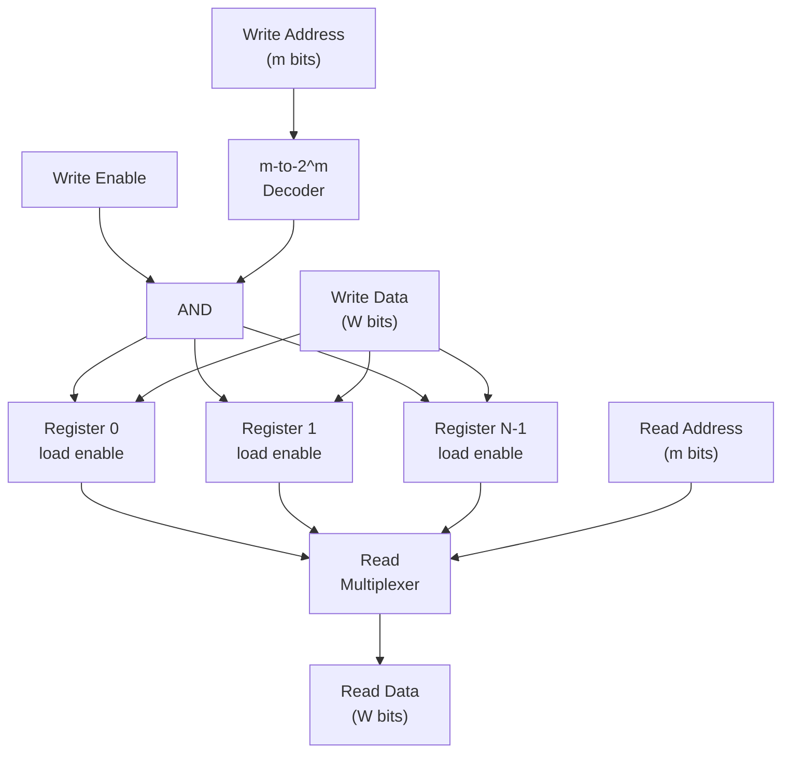

## Learning Objectives

- Define a register file as a bank of N individually addressable registers and explain why a CPU needs this structure rather than N separate, independently named registers wired ad hoc.
- Explain how a write-address decoder guarantees that a write pulse reaches exactly one destination register, and why this is essential for correctness.
- Explain how a read-select mux (or an equivalent read-port decoder) chooses which register's stored value drives a read-data output.
- Justify why a typical register file needs two read ports and one write port simultaneously, tied to how a single CPU instruction consumes two source operands and produces one result.
- Trace a concrete write-then-read sequence through a small register file and predict the exact values that appear on every read-data output.

## Context & Motivation

A single register, built from N flip-flops sharing one clock and one load-enable signal, holds exactly one word of state — the subject of the previous concept. But a real processor never gets by with just one word of fast storage. An arithmetic instruction such as "add register 3 to register 5, store the result in register 2" must read two source operands and write one destination, all inside a single clock cycle, from a small pool of named storage locations. Wiring together thirty-two individual registers with separate load-enable wires and output buses, all controlled by ad hoc external logic, would be wasteful and error-prone: nothing would enforce that exactly one register is written per cycle, and selecting which register's output to read would require bespoke logic repeated at every call site.

The register file solves this by packaging N registers behind a uniform, addressed interface: supply a small binary address, and the hardware handles the rest — routing a write pulse to exactly one destination, and routing exactly one stored value onto each read-data output. This is the same idea already met in "Logic Gates and Truth Tables" and "Finite State Machines," now composed at a larger grain: a decoder, built from the same gates used everywhere else in this discipline, converts an address into a one-hot enable signal, making "write register k" a well-defined, single-target operation instead of a race between competing write-enables.

This structure is also the point at which computer organization directly explains something already familiar from software: the register file is the direct hardware ancestor of the array data structure. An array index and a register address are the same idea — a small integer that a piece of hardware or a runtime turns into a selection of exactly one storage location, with no search and no traversal. Understanding the register file's decoder-plus-mux structure here is what makes the later concept, RAM organization, immediately recognizable as "the same idea, scaled up by orders of magnitude."

## Core Theory

### What a register file is

A **register file** is a small bank of N registers, each W bits wide, exposed through an addressed interface rather than through N separate named wires. Internally it is nothing more than N ordinary registers (as built from D flip-flops in the previous concept) plus two pieces of surrounding combinational logic: a **decoder** that turns a write address into a one-hot enable vector, and a **multiplexer** (mux) that turns a read address into a selected output value. Both pieces are built entirely from gates already covered — AND, OR, NOT — composed at a slightly larger scale.

Concretely, for N = 2^m registers, a write address is m bits wide. An m-to-2^m decoder takes those m bits and produces 2^m output lines, exactly one of which is 1 (asserted) for any given input combination — the one-hot decoder already introduced conceptually in earlier gate-level work, now put to a new purpose. Each decoder output line is ANDed with a global write-enable signal and fed into the load-enable input of exactly one register. The result: asserting "write, address = k" pulses the load-enable of register k and only register k, while every other register's load-enable stays low and holds its previous value.

### The write path

The write path of a register file has three inputs: a write address (m bits), a write-enable signal (1 bit), and write data (W bits, the value to be stored). The write data bus fans out to the data input of every register in the file — every register "sees" the same data value on every cycle — but only the register whose decoder output is asserted actually latches it, because only that register's load-enable is high. This is exactly why the decoder must be one-hot: if two decoder outputs were ever asserted simultaneously, two registers would latch the same data on the same edge, silently corrupting whichever one was not intended as the destination.

| Signal | Width | Role |
|---|---|---|
| Write address | m bits (m = log₂N) | Selects which single register receives the write |
| Write enable | 1 bit | Gates whether a write happens at all this cycle |
| Write data | W bits | The value broadcast to every register's data input |
| Decoder outputs | N bits, one-hot | ANDed with write-enable to drive each register's individual load-enable |

### The read path

Reading works in the opposite direction. Every register's stored value is always available on its own output wires (registers are asynchronous to read — no clock edge is needed to observe a stored value, only to change one). A **read multiplexer** takes a read address (m bits) as its select input and N parallel W-bit data inputs, one per register, and steers exactly one of those N values onto a single W-bit read-data output. Unlike the write path, which must guarantee mutual exclusivity to prevent corruption, the read path only needs one value visible at a time — reading never modifies state, so there is no danger analogous to a double write, and the mux can be an ordinary combinational selector.

### Multiple read ports

A single instruction such as "add rs1 and rs2, write rd" needs to read two independent source registers and write one destination register, all within the same clock cycle. A register file with only one read mux can supply only one value per cycle — insufficient for a two-operand ALU instruction. The standard solution is to duplicate the read-select logic: build two entirely separate read multiplexers, each with its own independent read-address input, wired to the same N register outputs. This is called giving the register file **two read ports**. Because both muxes are purely combinational and simply observe the already-fanned-out register outputs, adding a second read port costs extra multiplexer hardware but requires no change to the write path — reads never contend with each other or with writes for the stored value, only for silicon area.

A register file description is usually written as "N reads, M writes" — a classic RISC-style integer register file is "2 read ports, 1 write port," matching the two-source-one-destination shape of a typical arithmetic instruction. Architectures with more aggressive instruction-level parallelism provision additional ports at a hardware cost that grows correspondingly, since every added read port needs its own full N-to-1 multiplexer, and every added write port needs its own decoder-and-AND-gate write-enable logic (plus a policy for two write ports targeting the same register in the same cycle).

### Why the register file is the CPU's fastest storage

The register file sits physically closest to the ALU inputs and outputs of any storage structure in the machine, and it is deliberately kept small — typically 16 to 32 entries in general-purpose architectures — so that its decoder and muxes stay small and fast. A decoder's fan-out and a mux's fan-in both grow with N, and propagation delay grows correspondingly; keeping N small keeps access fast enough to complete inside a single clock cycle, which is exactly what a single-cycle CPU datapath (covered later) requires from its register file every instruction. Larger, slower storage — main memory — is organized completely differently, precisely because it cannot afford single-cycle-fast decoders when N is enormous; that tradeoff is the subject of the next concept.

## Worked Examples

### Example 1: Designing a 4×4-bit register file

Design a register file holding N = 4 registers, each W = 4 bits wide, with one write port and one read port.

Step 1 — determine the address width: N = 4 = 2², so m = 2 address bits are needed to name every register (addresses 00, 01, 10, 11 for registers 0 through 3).

Step 2 — build the decoder: a 2-to-4 decoder takes the 2-bit write address and produces 4 output lines, D0 through D3, exactly one of which is 1:

| Write address (a1 a0) | D0 | D1 | D2 | D3 |
|---|---|---|---|---|
| 00 | 1 | 0 | 0 | 0 |
| 01 | 0 | 1 | 0 | 0 |
| 10 | 0 | 0 | 1 | 0 |
| 11 | 0 | 0 | 0 | 1 |

Step 3 — gate each decoder output with the global write-enable (WE) using an AND gate, and feed the result into the corresponding register's load-enable input: register k's load-enable = Dk AND WE.

Step 4 — fan the 4-bit write-data bus out to the data input of all four registers uniformly; only the register whose load-enable is asserted will actually capture it on the next clock edge.

Step 5 — build the read mux: a 4-to-1, 4-bit-wide multiplexer takes a 2-bit read address as select and the four registers' 4-bit outputs as data inputs, producing one 4-bit read-data output equal to whichever register the read address names.

This register file now has exactly 2 (write address) + 1 (write enable) + 4 (write data) + 2 (read address) = 9 input wires and 4 output wires (read data), regardless of N growing further, so long as N stays a power of 2.

### Example 2: Tracing a write to register 2, then reads of registers 2 and 0

Assume the 4×4-bit register file from Example 1, all registers initialized to 0000, and read port wired as in Example 1.

Cycle 1 — write: set write address = 10 (binary, register 2), write enable = 1, write data = 1101. The decoder asserts D2 = 1 (all others 0). D2 AND WE = 1, so register 2's load-enable is high; on the rising clock edge, register 2 latches 1101. Registers 0, 1, and 3 see load-enable = 0 and retain their previous values (0000 each).

Cycle 2 — read register 2: set read address = 10. The read mux selects register 2's output. Read-data = 1101, matching exactly what was written in cycle 1.

Cycle 3 — read register 0: set read address = 00, with no write occurring (write enable = 0, so nothing changes state regardless of what address is on the write port). The read mux now selects register 0's output. Read-data = 0000, since register 0 was never written.

This trace demonstrates the essential correctness property: a write to one address changes the state of exactly that register and no other, and a subsequent read of a different address is completely unaffected by that write — reads and writes to different registers are fully independent.

### Example 3: Why two read ports need duplicated read-select logic

Suppose the same 4×4-bit register file must support an instruction that reads registers 1 and 3 in the same cycle (for example, to add their values). With only the single read mux from Example 1, the read address input can hold only one 2-bit value at a time — 01 or 11, never both — so only one of the two needed values could be produced per cycle; retrieving the second would require a second cycle, halving throughput.

The fix is to instantiate a second, completely independent 4-to-1 mux, call it "read port B," wired to the same four register outputs (registers 0 through 3) but driven by its own separate 2-bit read-address input, read-address-B. Read port A's address is set to 01, producing register 1's value (say 0110) on read-data-A; read port B's address is set independently to 11, producing register 3's value (say 1001) on read-data-B, in the very same cycle. No new decoder is needed — decoders exist only on the write side, to guard against corrupting state — but a full second multiplexer is needed, because a mux is stateless selection logic and one mux instance can only make one selection at a time. This is exactly why "2 read ports" is described as a hardware cost measured in duplicated combinational selection logic, not in duplicated storage: the four registers themselves are not copied, only the logic that observes them.

## Common Misconceptions & Pitfalls

- **"A register file needs a decoder to control the reads, just like the writes."** Reads use a multiplexer, not a decoder. A decoder produces a one-hot enable vector used to gate a write so exactly one register's state changes; a mux simply selects which already-available value to output, and outputting a value never changes anything, so there is no analogous mutual-exclusivity hazard on the read side.
- **"Adding a second read port means duplicating the registers themselves."** It does not — the storage stays exactly as it was; only the read-select multiplexer is duplicated, since two independent simultaneous selections require two independent selector circuits observing the same set of stored values.
- **"If the write address and a read address happen to be equal in the same cycle, something breaks."** Reading and writing the same register in the same cycle is well-defined (though the exact value returned depends on the design's timing convention), not a hazard; a register's flip-flops only actually change content at the clock edge, so there is no read/write race that corrupts stored bits.
- **"A bigger register file is always better for CPU performance."** More registers increase both the decoder's fan-out and the read mux's fan-in, increasing propagation delay through both; a slower register file can force a slower clock — the small size (typically 16–32 entries) is a deliberate speed-versus-flexibility tradeoff, not an oversight.
- **"The write-enable signal is redundant since the decoder already picks one register."** Without it, the decoder would assert exactly one line every cycle, forcing some register to be overwritten on every clock edge even when no write was intended; write-enable is what allows "do nothing this cycle" to be an available, correct operation.
- **"Register file addresses and array indices are only superficially similar."** They are the same mechanism at different scales: both are small integers consumed by dedicated selection hardware (a decoder/mux pair here, an address-decoded memory array in the next concept) to reach one storage location directly, with no traversal — the register file is the physical circuit ancestor that random-access arrays are built on.

## Summary

A register file packages N ordinary registers behind a uniform addressed interface: an m-bit write address feeds a decoder that produces a one-hot enable vector, gated by a global write-enable and ANDed into each register's individual load-enable, guaranteeing that a write changes the state of exactly one register per cycle; an m-bit read address feeds a multiplexer that selects exactly one register's already-available output onto a read-data bus, with no such mutual-exclusivity concern because reading never changes state. Because a typical arithmetic instruction consumes two source operands and produces one result within a single cycle, register files are commonly built with two independent read ports (two duplicated multiplexers observing the same registers) and one write port. Kept deliberately small, the register file is the CPU's fastest storage and the direct hardware ancestor of the array data structure — an addressed selection of exactly one entry with no search. The next concept, RAM organization and address decoding, scales this exact decoder-plus-selection pattern from a handful of registers up to millions of addressable words, introducing the row/column matrix organization needed to keep decoding practical at that scale.

## Documentation Links

- [Nand2Tetris — Build a Modern Computer from First Principles](https://www.coursera.org/learn/build-a-computer) — course covering the construction of registers, register files, and memory hierarchies from elementary logic gates upward.
- [MIT 6.004 — OCW Syllabus](https://ocw.mit.edu/courses/6-004-computation-structures-spring-2017/pages/syllabus/) — course syllabus for Computation Structures, whose sequential-logic units cover register banks and the datapath structures built on top of them.
