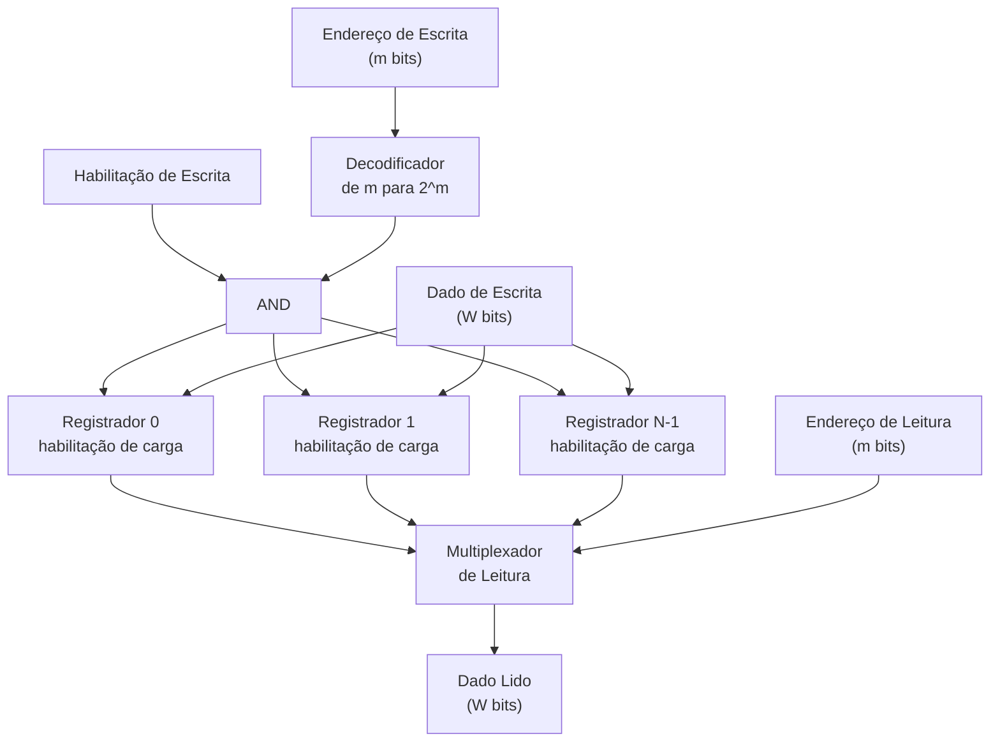

## Objetivos de Aprendizagem

- Definir um banco de registradores como um conjunto de N registradores endereçáveis individualmente e explicar por que uma CPU precisa dessa estrutura, em vez de N registradores separados, com nomes independentes, ligados de forma improvisada.
- Explicar como um decodificador de endereço de escrita garante que um pulso de escrita chegue a exatamente um registrador de destino, e por que isso é essencial para a correção.
- Explicar como um mux de seleção de leitura (ou um decodificador de porta de leitura equivalente) escolhe qual valor guardado num registrador comanda uma saída de dados de leitura.
- Justificar por que um banco de registradores típico precisa de duas portas de leitura e uma porta de escrita ao mesmo tempo, ligando isso à forma como uma única instrução de CPU consome dois operandos de origem e produz um resultado.
- Acompanhar uma sequência concreta de escrita seguida de leitura num pequeno banco de registradores e prever os valores exatos que aparecem em cada saída de dados de leitura.

## Contexto e Motivação

Um único registrador, construído com N flip-flops que compartilham um clock e um sinal de habilitação de carga, guarda exatamente uma palavra de estado, o assunto do conceito anterior. Mas um processador real nunca se vira com só uma palavra de armazenamento rápido. Uma instrução aritmética como "some o registrador 3 ao registrador 5 e guarde o resultado no registrador 2" precisa ler dois operandos de origem e escrever um destino, tudo dentro de um único ciclo de clock, a partir de um pequeno conjunto de locais de armazenamento com nome. Ligar trinta e dois registradores individuais com fios de habilitação de carga e barramentos de saída separados, todos controlados por lógica externa improvisada, seria um desperdício e propenso a erros: nada garantiria que exatamente um registrador fosse escrito por ciclo, e selecionar a saída de qual registrador ler exigiria lógica feita sob medida repetida em cada ponto de uso.

O banco de registradores resolve isso empacotando N registradores atrás de uma interface uniforme e endereçada: forneça um pequeno endereço binário e o hardware cuida do resto, encaminhando um pulso de escrita para exatamente um destino e colocando exatamente um valor guardado em cada saída de dados de leitura. É a mesma ideia já vista em "Portas Lógicas e Tabelas Verdade" e "Máquinas de Estados Finitos", agora composta numa granularidade maior: um decodificador, construído com as mesmas portas usadas em todo o resto desta disciplina, converte um endereço num sinal de habilitação one-hot, tornando "escreva no registrador k" uma operação bem definida e com um único alvo, em vez de uma corrida entre habilitações de escrita concorrentes.

Essa estrutura também é o ponto em que a organização de computadores explica diretamente algo já familiar do software: o banco de registradores é o ancestral direto em hardware da estrutura de dados array. Um índice de array e um endereço de registrador são a mesma ideia: um pequeno inteiro que um pedaço de hardware ou um runtime transforma na seleção de exatamente um local de armazenamento, sem busca e sem percurso. Entender aqui a estrutura de decodificador mais mux do banco de registradores é o que torna o conceito seguinte, organização da RAM, imediatamente reconhecível como "a mesma ideia, ampliada em ordens de grandeza".

## Teoria Central

### O que é um banco de registradores

Um **banco de registradores** é um pequeno conjunto de N registradores, cada um com W bits de largura, exposto por uma interface endereçada, e não por N fios separados com nome. Internamente, não passa de N registradores comuns (construídos com flip-flops D, como no conceito anterior) mais duas peças de lógica combinacional em volta: um **decodificador** que transforma um endereço de escrita num vetor de habilitação one-hot, e um **multiplexador** (mux) que transforma um endereço de leitura num valor de saída selecionado. As duas peças são construídas inteiramente com portas já vistas (AND, OR, NOT), compostas numa escala um pouco maior.

Concretamente, para N = 2^m registradores, um endereço de escrita tem m bits. Um decodificador de m para 2^m recebe esses m bits e produz 2^m linhas de saída, das quais exatamente uma vale 1 (ativada) para qualquer combinação de entrada: o decodificador one-hot já apresentado conceitualmente no trabalho anterior em nível de portas, agora com um propósito novo. Cada linha de saída do decodificador passa por um AND com um sinal global de habilitação de escrita e alimenta a entrada de habilitação de carga de exatamente um registrador. O resultado: ativar "escreva, endereço = k" pulsa a habilitação de carga do registrador k e só do registrador k, enquanto a habilitação de carga de todos os outros registradores fica baixa e eles mantêm seus valores anteriores.

### O caminho de escrita

O caminho de escrita de um banco de registradores tem três entradas: um endereço de escrita (m bits), um sinal de habilitação de escrita (1 bit) e o dado de escrita (W bits, o valor a ser guardado). O barramento de dado de escrita se espalha para a entrada de dados de todos os registradores do banco (todo registrador "vê" o mesmo valor de dado em todo ciclo), mas só o registrador cuja saída do decodificador está ativada de fato o captura, porque só a habilitação de carga desse registrador está alta. É exatamente por isso que o decodificador precisa ser one-hot: se duas saídas do decodificador fossem ativadas ao mesmo tempo, dois registradores capturariam o mesmo dado na mesma borda, corrompendo silenciosamente aquele que não era o destino pretendido.

| Sinal | Largura | Papel |
|---|---|---|
| Endereço de escrita | m bits (m = log₂N) | Seleciona qual registrador recebe a escrita |
| Habilitação de escrita | 1 bit | Controla se há escrita neste ciclo |
| Dado de escrita | W bits | O valor difundido para a entrada de dados de todo registrador |
| Saídas do decodificador | N bits, one-hot | Passam por AND com a habilitação de escrita para comandar a habilitação de carga individual de cada registrador |

### O caminho de leitura

A leitura funciona no sentido oposto. O valor guardado em cada registrador está sempre disponível nos seus próprios fios de saída (registradores são assíncronos para leitura: nenhuma borda de clock é necessária para observar um valor guardado, só para mudá-lo). Um **multiplexador de leitura** recebe um endereço de leitura (m bits) como entrada de seleção e N entradas de dados paralelas de W bits, uma por registrador, e direciona exatamente um desses N valores para uma única saída de dados de leitura de W bits. Ao contrário do caminho de escrita, que precisa garantir exclusividade mútua para evitar corrupção, o caminho de leitura só precisa de um valor visível por vez: ler nunca modifica o estado, então não há perigo análogo a uma escrita dupla, e o mux pode ser um seletor combinacional comum.

### Várias portas de leitura

Uma única instrução como "some rs1 e rs2, escreva em rd" precisa ler dois registradores de origem independentes e escrever um registrador de destino, tudo no mesmo ciclo de clock. Um banco de registradores com só um mux de leitura consegue fornecer só um valor por ciclo, o que é insuficiente para uma instrução de ULA com dois operandos. A solução padrão é duplicar a lógica de seleção de leitura: construir dois multiplexadores de leitura totalmente separados, cada um com sua própria entrada de endereço de leitura independente, ligados às mesmas N saídas de registradores. Isso se chama dar ao banco de registradores **duas portas de leitura**. Como os dois muxes são puramente combinacionais e simplesmente observam as saídas de registradores já espalhadas, acrescentar uma segunda porta de leitura custa hardware extra de multiplexador, mas não exige nenhuma mudança no caminho de escrita: as leituras nunca disputam entre si nem com as escritas pelo valor guardado, só pela área de silício.

Um banco de registradores costuma ser descrito como "N leituras, M escritas"; um banco de registradores inteiros clássico no estilo RISC tem "2 portas de leitura, 1 porta de escrita", correspondendo ao formato de duas origens e um destino de uma instrução aritmética típica. Arquiteturas com paralelismo em nível de instrução mais agressivo provisionam portas adicionais a um custo de hardware que cresce na mesma proporção, já que cada porta de leitura acrescentada precisa do seu próprio multiplexador completo de N para 1, e cada porta de escrita acrescentada precisa da sua própria lógica de habilitação de escrita com decodificador e portas AND (mais uma política para duas portas de escrita mirando o mesmo registrador no mesmo ciclo).

### Por que o banco de registradores é o armazenamento mais rápido da CPU

O banco de registradores fica fisicamente mais perto das entradas e saídas da ULA do que qualquer outra estrutura de armazenamento da máquina, e é mantido pequeno de propósito (tipicamente de 16 a 32 entradas em arquiteturas de propósito geral) para que seu decodificador e seus muxes fiquem pequenos e rápidos. O fan-out de um decodificador e o fan-in de um mux crescem ambos com N, e o atraso de propagação cresce na mesma proporção; manter N pequeno mantém o acesso rápido o bastante para terminar dentro de um único ciclo de clock, que é exatamente o que um datapath de CPU monociclo (visto mais adiante) exige do seu banco de registradores em toda instrução. Armazenamentos maiores e mais lentos, como a memória principal, são organizados de forma completamente diferente, justamente porque não podem se dar ao luxo de decodificadores rápidos o bastante para um único ciclo quando N é enorme; esse trade-off é o assunto do próximo conceito.

## Exemplos Resolvidos

### Exemplo 1: projetando um banco de registradores 4×4 bits

Projete um banco de registradores com N = 4 registradores, cada um com W = 4 bits de largura, com uma porta de escrita e uma porta de leitura.

Passo 1: determine a largura do endereço: N = 4 = 2², então são necessários m = 2 bits de endereço para nomear cada registrador (endereços 00, 01, 10, 11 para os registradores 0 a 3).

Passo 2: construa o decodificador: um decodificador de 2 para 4 recebe o endereço de escrita de 2 bits e produz 4 linhas de saída, D0 a D3, das quais exatamente uma vale 1:

| Endereço de escrita (a1 a0) | D0 | D1 | D2 | D3 |
|---|---|---|---|---|
| 00 | 1 | 0 | 0 | 0 |
| 01 | 0 | 1 | 0 | 0 |
| 10 | 0 | 0 | 1 | 0 |
| 11 | 0 | 0 | 0 | 1 |

Passo 3: passe cada saída do decodificador por uma porta AND com a habilitação de escrita global (WE), e alimente o resultado na entrada de habilitação de carga do registrador correspondente: habilitação de carga do registrador k = Dk AND WE.

Passo 4: espalhe o barramento de dado de escrita de 4 bits de forma uniforme para a entrada de dados dos quatro registradores; só o registrador cuja habilitação de carga estiver ativada vai de fato capturá-lo na próxima borda de clock.

Passo 5: construa o mux de leitura: um multiplexador de 4 para 1, com 4 bits de largura, recebe um endereço de leitura de 2 bits como seleção e as saídas de 4 bits dos quatro registradores como entradas de dados, produzindo uma saída de dado lido de 4 bits igual ao registrador que o endereço de leitura nomear.

Esse banco de registradores agora tem exatamente 2 (endereço de escrita) + 1 (habilitação de escrita) + 4 (dado de escrita) + 2 (endereço de leitura) = 9 fios de entrada e 4 fios de saída (dado lido), para este N específico; o número de fios de endereço cresce só logaritmicamente se N continuar crescendo, desde que N continue sendo uma potência de 2.

### Exemplo 2: acompanhando uma escrita no registrador 2 e depois leituras dos registradores 2 e 0

Suponha o banco de registradores 4×4 bits do Exemplo 1, com todos os registradores inicializados em 0000 e a porta de leitura ligada como no Exemplo 1.

Ciclo 1, escrita: coloque endereço de escrita = 10 (binário, registrador 2), habilitação de escrita = 1, dado de escrita = 1101. O decodificador ativa D2 = 1 (todos os outros 0). D2 AND WE = 1, então a habilitação de carga do registrador 2 fica alta; na borda de subida do clock, o registrador 2 captura 1101. Os registradores 0, 1 e 3 veem habilitação de carga = 0 e mantêm seus valores anteriores (0000 cada).

Ciclo 2, leitura do registrador 2: coloque endereço de leitura = 10. O mux de leitura seleciona a saída do registrador 2. Dado lido = 1101, exatamente o que foi escrito no ciclo 1.

Ciclo 3, leitura do registrador 0: coloque endereço de leitura = 00, sem escrita acontecendo (habilitação de escrita = 0, então nada muda de estado, seja qual for o endereço na porta de escrita). O mux de leitura agora seleciona a saída do registrador 0. Dado lido = 0000, já que o registrador 0 nunca foi escrito.

Esse traço demonstra a propriedade de correção essencial: uma escrita num endereço muda o estado exatamente daquele registrador e de nenhum outro, e uma leitura posterior de um endereço diferente não é afetada em nada por essa escrita; leituras e escritas em registradores diferentes são totalmente independentes.

### Exemplo 3: por que duas portas de leitura precisam de lógica de seleção de leitura duplicada

Suponha que o mesmo banco de registradores 4×4 bits precise suportar uma instrução que lê os registradores 1 e 3 no mesmo ciclo (por exemplo, para somar seus valores). Com só o mux de leitura do Exemplo 1, a entrada de endereço de leitura consegue guardar só um valor de 2 bits por vez (01 ou 11, nunca os dois), então só um dos dois valores necessários poderia ser produzido por ciclo; obter o segundo exigiria um segundo ciclo, cortando a vazão pela metade.

A correção é instanciar um segundo mux de 4 para 1, completamente independente, chamado "porta de leitura B", ligado às mesmas quatro saídas de registradores (registradores 0 a 3), mas comandado pela sua própria entrada separada de endereço de leitura de 2 bits, read-address-B. O endereço da porta de leitura A é colocado em 01, produzindo o valor do registrador 1 (digamos 0110) em read-data-A; o endereço da porta de leitura B é colocado de forma independente em 11, produzindo o valor do registrador 3 (digamos 1001) em read-data-B, no mesmíssimo ciclo. Nenhum decodificador novo é necessário (decodificadores só existem do lado da escrita, para proteger contra a corrupção do estado), mas é preciso um segundo multiplexador completo, porque um mux é lógica de seleção sem estado e uma instância de mux só consegue fazer uma seleção por vez. É exatamente por isso que "2 portas de leitura" é descrito como um custo de hardware medido em lógica de seleção combinacional duplicada, e não em armazenamento duplicado: os quatro registradores em si não são copiados, só a lógica que os observa.

## Equívocos Comuns e Armadilhas

- **"Um banco de registradores precisa de um decodificador para controlar as leituras, assim como as escritas."** As leituras usam um multiplexador, não um decodificador. Um decodificador produz um vetor de habilitação one-hot usado para controlar uma escrita de modo que o estado de exatamente um registrador mude; um mux simplesmente seleciona qual valor já disponível deve sair, e emitir um valor nunca muda nada, então não há perigo análogo de exclusividade mútua do lado da leitura.
- **"Acrescentar uma segunda porta de leitura significa duplicar os próprios registradores."** Não significa: o armazenamento continua exatamente como estava; só o multiplexador de seleção de leitura é duplicado, já que duas seleções simultâneas e independentes exigem dois circuitos seletores independentes observando o mesmo conjunto de valores guardados.
- **"Se o endereço de escrita e um endereço de leitura forem iguais no mesmo ciclo, algo quebra."** Ler e escrever o mesmo registrador no mesmo ciclo é bem definido (embora o valor exato devolvido dependa da convenção de temporização do projeto), e não um perigo; os flip-flops de um registrador só mudam de fato de conteúdo na borda de clock, então não há corrida de leitura/escrita que corrompa os bits guardados.
- **"Um banco de registradores maior é sempre melhor para o desempenho da CPU."** Mais registradores aumentam tanto o fan-out do decodificador quanto o fan-in do mux de leitura, aumentando o atraso de propagação pelos dois; um banco de registradores mais lento pode forçar um clock mais lento. O tamanho pequeno (tipicamente de 16 a 32 entradas) é um trade-off deliberado entre velocidade e flexibilidade, não um descuido.
- **"O sinal de habilitação de escrita é redundante, já que o decodificador já escolhe um registrador."** Sem ele, o decodificador ativaria exatamente uma linha em todo ciclo, forçando algum registrador a ser sobrescrito em toda borda de clock, mesmo quando nenhuma escrita fosse pretendida; a habilitação de escrita é o que permite que "não fazer nada neste ciclo" seja uma operação disponível e correta.
- **"Endereços de banco de registradores e índices de array são só superficialmente parecidos."** São o mesmo mecanismo em escalas diferentes: ambos são inteiros pequenos consumidos por hardware de seleção dedicado (um par decodificador/mux aqui, uma matriz de memória com decodificação de endereço no próximo conceito) para chegar a um local de armazenamento diretamente, sem percurso. O banco de registradores é o ancestral físico, em circuito, sobre o qual os arrays de acesso aleatório são construídos.

## Resumo

Um banco de registradores empacota N registradores comuns atrás de uma interface endereçada uniforme: um endereço de escrita de m bits alimenta um decodificador que produz um vetor de habilitação one-hot, controlado por uma habilitação de escrita global e combinado por AND na habilitação de carga individual de cada registrador, garantindo que uma escrita mude o estado de exatamente um registrador por ciclo; um endereço de leitura de m bits alimenta um multiplexador que seleciona a saída já disponível de exatamente um registrador para um barramento de dado lido, sem essa preocupação de exclusividade mútua, porque ler nunca muda o estado. Como uma instrução aritmética típica consome dois operandos de origem e produz um resultado num único ciclo, os bancos de registradores costumam ser construídos com duas portas de leitura independentes (dois multiplexadores duplicados observando os mesmos registradores) e uma porta de escrita. Mantido pequeno de propósito, o banco de registradores é o armazenamento mais rápido da CPU e o ancestral direto em hardware da estrutura de dados array: uma seleção endereçada de exatamente uma entrada, sem busca. O próximo conceito, organização da RAM e decodificação de endereços, amplia exatamente esse padrão de decodificador mais seleção de um punhado de registradores para milhões de palavras endereçáveis, apresentando a organização em matriz de linhas e colunas necessária para manter a decodificação viável nessa escala.

## Documentation Links

- [Nand2Tetris: Build a Modern Computer from First Principles](https://www.coursera.org/learn/build-a-computer): curso que cobre a construção de registradores, bancos de registradores e hierarquias de memória a partir de portas lógicas elementares.
- [MIT 6.004: OCW Syllabus](https://ocw.mit.edu/courses/6-004-computation-structures-spring-2017/pages/syllabus/): ementa do curso Computation Structures, cujas unidades de lógica sequencial cobrem bancos de registradores e as estruturas de datapath construídas sobre eles.
