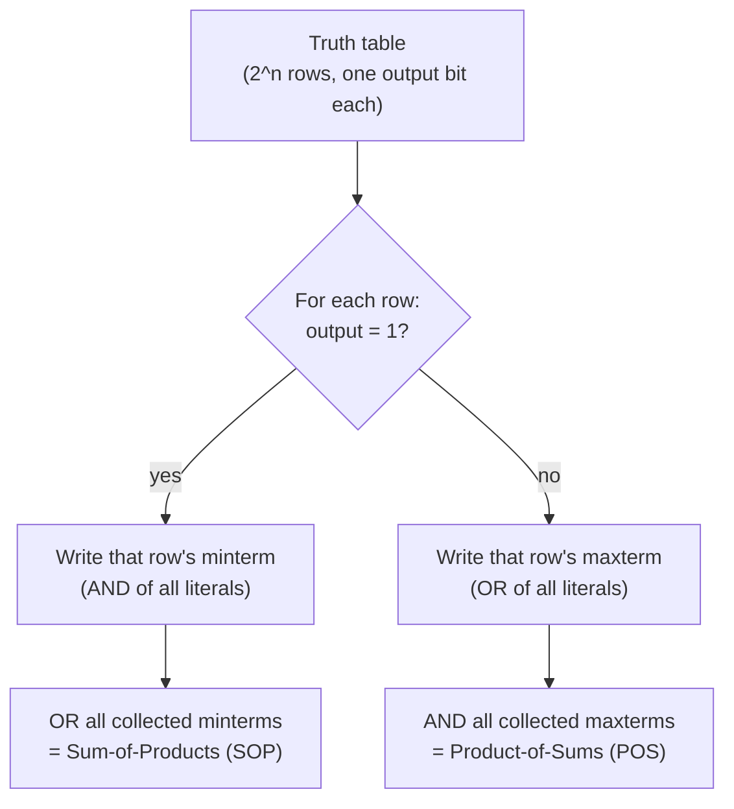

## Learning Objectives

- Define the Boolean domain {0, 1} and the three basic operations AND (·), OR (+), and NOT (′), and reproduce their truth tables from memory.
- State how many distinct Boolean functions exist of n variables (2^(2ⁿ)) and explain what that count is actually counting.
- Derive the canonical sum-of-products (minterm) expression directly from any given truth table.
- Derive the canonical product-of-sums (maxterm) expression directly from any given truth table.
- Explain, precisely, why a Boolean expression is simultaneously a mathematical statement and a blueprint for a physical circuit.
- Determine whether two syntactically different Boolean expressions compute the same function by comparing their truth tables.

## Context & Motivation

This discipline opened with bits: the observation that a digital circuit reliably distinguishes only two voltage levels, which we label 0 and 1. That was a statement about physics and manufacturing tolerance. What was missing so far is a rigorous mathematical language for describing *what a circuit computes* with those two values — not just that a wire carries a 0 or a 1, but how a combination of input wires determines an output wire. That language is Boolean algebra, and it did not have to be invented from scratch for this purpose: it is the same formal system covered in discrete mathematics under the name propositional logic, where ∧ (and), ∨ (or), and ¬ (not) combine propositions that are True or False. The concept "Propositions, Connectives, and Truth Tables" in the discrete-math-logic discipline studies exactly these connectives and exactly this notion of a truth table, but treats True and False as abstract logical values attached to sentences ("it is raining", "the exam is on Tuesday"). Here, the identical mathematical structure is repurposed: True becomes 1, False becomes 0, and a proposition becomes a wire. Boolean algebra is propositional logic wearing an engineer's hat.

This re-framing matters because it moves two-valued logic from "a nice mathematical curiosity" to "buildable out of physical components." George Boole formalized this algebra in the 1850s purely as a tool for symbolic reasoning, with no circuits in mind. It was Claude Shannon, in his 1937 master's thesis, who showed that Boolean algebra maps exactly onto networks of relay switches — that ∧, ∨, and ¬ are not just symbols on paper but operations you can wire together with components that either conduct or do not conduct. Every algebraic result about a Boolean expression — that two expressions are equivalent, or that one can be rewritten as another — is therefore simultaneously a fact about circuits: equivalent expressions describe circuits that always produce the same output for the same inputs, even when one uses far fewer physical gates. This dual identity — a mathematical object you can prove things about, and a wiring diagram you can build — is the single idea this concept exists to establish.

Everything from here forward in this discipline depends on this bridge. The next concept catalogs the algebraic laws (commutativity, associativity, De Morgan's laws, and others) that let an expression be *transformed* into a cheaper, equivalent one — the same equivalences studied in discrete math's "Logical Equivalence and Tautologies," but now put to work minimizing gate count rather than proving a sentence is always true. Later concepts show physical gates that implement AND, OR, and NOT directly, then combinational circuits (adders, multiplexers, decoders) that are nothing more than Boolean expressions realized in silicon. None of that is possible without first fixing, precisely, what a Boolean function is, how many of them exist for a given number of inputs, and how to read one off directly from a truth table — which is exactly what this concept covers.

## Core Theory

### The Boolean domain and the three basic operations

Boolean algebra, as used in digital logic, operates over the two-element domain **B = {0, 1}**. Three operations are defined on this domain:

- **AND**, written `A · B` (or simply `AB`, or `A ∧ B`): equals 1 only when both A and B equal 1.
- **OR**, written `A + B` (or `A ∨ B`): equals 1 when at least one of A or B equals 1.
- **NOT**, written `A′` (or `¬A`, or `A` with an overbar): equals 1 when A equals 0, and vice versa.

Their truth tables:

| A | B | A · B | A + B |
|---|---|---|---|
| 0 | 0 | 0 | 0 |
| 0 | 1 | 0 | 1 |
| 1 | 0 | 0 | 1 |
| 1 | 1 | 1 | 1 |

| A | A′ |
|---|---|
| 0 | 1 |
| 1 | 0 |

These are exactly the truth tables for ∧, ∨, and ¬ from propositional logic, with True relabeled 1 and False relabeled 0. Nothing about the underlying mathematics changes in this relabeling — every tautology, every equivalence, every proof technique from propositional logic (truth-table verification, algebraic manipulation) carries over unchanged. What changes is the intended reading: A and B are no longer declarative sentences but signals — wires that are held at a high or low voltage — and A · B, A + B, A′ describe a physical mechanism for combining those signals, not merely a logical relationship between claims.

### Boolean functions of n variables

A **Boolean function of n variables** is a mapping `f: {0,1}^n → {0,1}` — it takes n Boolean inputs and produces exactly one Boolean output. Because there are n inputs, each ranging over 2 values, there are exactly `2^n` distinct input combinations (rows in the truth table). For each of those `2^n` rows, the function's output can independently be chosen as 0 or 1. The number of distinct functions of n variables is therefore the number of distinct ways to fill in a column of `2^n` output bits, which is:

```
2^(2^n)
```

For n = 1 (a single input A), there are `2^(2^1) = 2^2 = 4` distinct one-variable functions: constant-0, constant-1, identity (f(A) = A), and NOT (f(A) = A′). For n = 2, there are `2^(2^2) = 2^4 = 16` distinct two-variable functions, including AND, OR, NAND, NOR, XOR, XNOR, and ten others (the two constants and both projections among them). For n = 3, there are `2^(2^3) = 2^8 = 256` distinct three-variable functions. This count grows doubly-exponentially — the growth rate itself accelerates, not just the count — which is precisely why no one enumerates Boolean functions by brute force once n exceeds 4 or 5 variables, and why compact algebraic notation is indispensable for describing and manipulating them.

### Minterms and the sum-of-products (SOP) canonical form

A **minterm** of n variables is a product (AND) term that includes every one of the n variables exactly once, either in its uncomplemented form (A) or its complemented form (A′), chosen so that the minterm equals 1 for exactly one specific row of the truth table and 0 for every other row. For three variables A, B, C, the minterm corresponding to the row A=1, B=0, C=1 is `A · B′ · C` — this product is 1 exactly when A=1 and B=0 and C=1, and 0 for any other combination, because any mismatch on a single variable forces that variable's literal to 0, making the whole AND term 0.

Given any truth table for a function f, the **sum-of-products (SOP)** canonical form (also called the **minterm expansion**) is built by a simple mechanical rule: for every row where the output is 1, write the minterm corresponding to that row, then OR all those minterms together. This works because the resulting expression evaluates to 1 exactly on the rows whose minterms were included (each contributes a 1 on its own row and a 0 everywhere else, and ORing preserves any 1 present), and to 0 on every row where the output was specified as 0 (none of the included minterms fire there). Every Boolean function has exactly one minterm-expansion SOP form — it is canonical (unique) precisely because it is read directly, row by row, off the truth table, with no choices left open.

### Maxterms and the product-of-sums (POS) canonical form

The dual construction uses **maxterms**. A maxterm of n variables is a sum (OR) term including every variable exactly once (uncomplemented or complemented), chosen so that it equals 0 for exactly one specific row and 1 for every other row. For the row A=1, B=0, C=1, the corresponding maxterm is `A′ + B + C′` — this is 0 exactly when A=1, B=0, C=1 (each term becomes 0 only when its literal disagrees with that row's value), and 1 for every other combination.

The **product-of-sums (POS)** canonical form is built dually: for every row where the output is 0, write the maxterm corresponding to that row, then AND all those maxterms together. The result is 0 exactly on the rows whose maxterms were included, and 1 everywhere else — matching the truth table by construction. Like the SOP form, the POS form is canonical: it is uniquely determined by the truth table.



### The expression-as-blueprint bridge

A Boolean expression such as `A · B′ + A′ · C` can be read in two completely different but perfectly consistent ways. Mathematically, it is a formula in an algebra over {0,1}; substituting any assignment of 0s and 1s to A, B, C evaluates it to a single Boolean output, and two expressions are "the same" exactly when they agree on every possible assignment. Physically, the identical expression is a blueprint: each variable is a wire, each `·` is an AND-gate, each `+` is an OR-gate, each `′` is a NOT-gate, and the expression as a whole describes how to wire those gates together into a circuit that produces the specified output for every input combination. Because both readings are governed by the exact same truth table, any algebraic fact proved about the expression (two forms are equivalent; a form can be rewritten more compactly) is simultaneously a fact about the circuit (two wirings behave identically; a wiring can be replaced by one using fewer gates). This is why canonical forms matter beyond their tidy uniqueness: the minterm SOP form read off a truth table is a *guaranteed-correct* starting circuit, even though — as the next concept shows — it is very rarely the *cheapest* one.

## Worked Examples

### Example 1: From a 3-variable truth table to the minterm SOP expression

Consider the following truth table for a function f(A, B, C):

| A | B | C | f |
|---|---|---|---|
| 0 | 0 | 0 | 0 |
| 0 | 0 | 1 | 1 |
| 0 | 1 | 0 | 0 |
| 0 | 1 | 1 | 0 |
| 1 | 0 | 0 | 1 |
| 1 | 0 | 1 | 1 |
| 1 | 1 | 0 | 0 |
| 1 | 1 | 1 | 1 |

Step 1 — identify every row where f = 1: rows (0,0,1), (1,0,0), (1,0,1), (1,1,1).

Step 2 — write the minterm for each such row. For (0,0,1): A=0 so use A′, B=0 so use B′, C=1 so use C, giving `A′·B′·C`. For (1,0,0): `A·B′·C′`. For (1,0,1): `A·B′·C`. For (1,1,1): `A·B·C`.

Step 3 — OR them together:

```
f(A,B,C) = A′·B′·C + A·B′·C′ + A·B′·C + A·B·C
```

Cross-check: pick a row not in the "1" list, say (0,1,0). Evaluate each term: `A′·B′·C = 1·0·0 = 0` (B=1 so B′=0); `A·B′·C′ = 0` (A=0); `A·B′·C = 0` (A=0); `A·B·C = 0·1·0 = 0`. Sum = 0, matching the table. Now check row (1,0,1): `A′·B′·C = 0` (A=1 so A′=0); `A·B′·C′ = 1·1·0 = 0` (C=1 so C′=0); `A·B′·C = 1·1·1 = 1`; `A·B·C = 1·0·1 = 0` (B=0). Sum = 1, matching the table.

### Example 2: Showing two different-looking expressions compute the same function

Claim: `f1 = A·B + A·C` and `f2 = A·(B + C)` are the same function. Build both truth tables:

| A | B | C | A·B | A·C | f1 = A·B + A·C | B+C | f2 = A·(B+C) |
|---|---|---|---|---|---|---|---|
| 0 | 0 | 0 | 0 | 0 | 0 | 0 | 0 |
| 0 | 0 | 1 | 0 | 0 | 0 | 1 | 0 |
| 0 | 1 | 0 | 0 | 0 | 0 | 1 | 0 |
| 0 | 1 | 1 | 0 | 0 | 0 | 1 | 0 |
| 1 | 0 | 0 | 0 | 0 | 0 | 0 | 0 |
| 1 | 0 | 1 | 0 | 1 | 1 | 1 | 1 |
| 1 | 1 | 0 | 1 | 0 | 1 | 1 | 1 |
| 1 | 1 | 1 | 1 | 1 | 1 | 1 | 1 |

The f1 column and the f2 column agree on all 8 rows, so f1 and f2 are the same Boolean function despite being syntactically different expressions — one uses two AND operations and one OR, the other uses one OR and one AND. (This particular equivalence is an instance of the distributive law, covered formally in the next concept.) As circuit blueprints, f1 describes two 2-input AND gates feeding a 2-input OR gate (3 gates total), while f2 describes one 2-input OR gate feeding one 2-input AND gate (2 gates total) — same function, cheaper circuit, which is exactly the kind of trade-off algebraic manipulation of Boolean expressions makes possible.

### Example 3: Building the POS/maxterm form of a small function

Consider a 2-variable function g(A, B) with this truth table:

| A | B | g |
|---|---|---|
| 0 | 0 | 1 |
| 0 | 1 | 0 |
| 1 | 0 | 1 |
| 1 | 1 | 1 |

Step 1 — identify every row where g = 0: only row (0, 1).

Step 2 — write the maxterm for that row. A maxterm literal must be 0 exactly when its variable takes the row's value: for A=0, the literal that reads as 0 there is the uncomplemented A; for B=1, the literal that reads as 0 there is B′. So the maxterm for row (0,1) is `A + B′`.

Step 3 — since there is only one row with output 0, the POS form is just that single maxterm:

```
g(A,B) = A + B′
```

Cross-check against every row: (0,0): `0 + 1 = 1`, matches g=1. (0,1): `0 + 0 = 0`, matches g=0. (1,0): `1 + 1 = 1`, matches g=1. (1,1): `1 + 0 = 1`, matches g=1. All four rows agree, confirming the POS expression exactly reproduces the truth table.

## Common Misconceptions & Pitfalls

- **"Boolean algebra is a different subject from the logic I learned with True/False."** It is the identical mathematical structure — {0,1} with AND, OR, NOT satisfying the same laws as {True, False} with ∧, ∨, ¬ — under a different labeling convention chosen because it matches physical voltage levels. Every truth table, equivalence, and proof technique transfers directly.
- **"The canonical SOP or POS form is the best (cheapest) way to build the circuit."** Canonical forms are guaranteed *correct* by construction — read directly off the truth table — but are almost never the cheapest in gate count; they typically include far more literals and gates than an equivalent simplified expression. Canonical form is a reliable starting point, not an endpoint.
- **"If two expressions look different, they must compute different functions."** Syntactic difference says nothing about semantic (functional) equivalence — the only reliable test is comparing full truth tables (or an algebraic proof), as shown in Example 2, where a 3-gate and a 2-gate expression turned out identical.
- **"A minterm is the same as a single variable."** A minterm is a full product of *all n* variables (each appearing complemented or not), not just one variable or a partial term — omitting even one variable means it is not a minterm and will not correspond to exactly one truth-table row.
- **"2^(2ⁿ) and 2ⁿ measure the same thing."** `2^n` counts the number of *input combinations* (rows) for n variables; `2^(2^n)` counts the number of *distinct functions* that can be defined over those rows, since each row's output can independently be chosen. Confusing these two exponents is a common source of error when reasoning about function-counting.
- **"A Boolean expression is just notation — it doesn't correspond to anything physical."** The entire point of this concept is that it does: every AND/OR/NOT in an expression corresponds to a physical gate, and the expression as a whole is a wiring blueprint, which is why algebraic properties of expressions (equivalence, simplification) translate directly into properties of circuits (identical behavior, fewer components).

## Summary

Boolean algebra takes the same ∧, ∨, ¬ connectives and truth-table machinery already studied in propositional logic and reinterprets them over {0, 1} as an algebra whose expressions double as circuit blueprints; a Boolean function of n variables is any mapping from the `2^n` possible input rows to a single output bit, and there are exactly `2^(2^n)` such functions because each row's output can be chosen independently. Every function's truth table yields two unique canonical expressions read off mechanically — the sum-of-products form, ORing together the minterm of every row where the output is 1, and the product-of-sums form, ANDing together the maxterm of every row where the output is 0 — both guaranteed correct, though rarely economical in gate count. This algebra-equals-blueprint correspondence is the foundation the next concept builds on directly: Boolean Algebra Laws and De Morgan's Laws, which supplies the rules for rewriting a correct-but-wasteful canonical expression into an equivalent expression built from far fewer gates.

## Documentation Links

- [MIT 6.004 — Combinational Logic Unit](https://ocw.mit.edu/courses/6-004-computation-structures-spring-2017/pages/c4/) — MIT's Computation Structures unit covering Boolean algebra as the mathematical foundation of combinational circuits.
- [ACM/IEEE CS2013 — Architecture and Organization Knowledge Area](https://csed.acm.org/knowledge-areas-architecture-and-organization-ar-cs2013-version/) — curriculum guidelines identifying Boolean algebra and digital logic as core Architecture and Organization topics.
