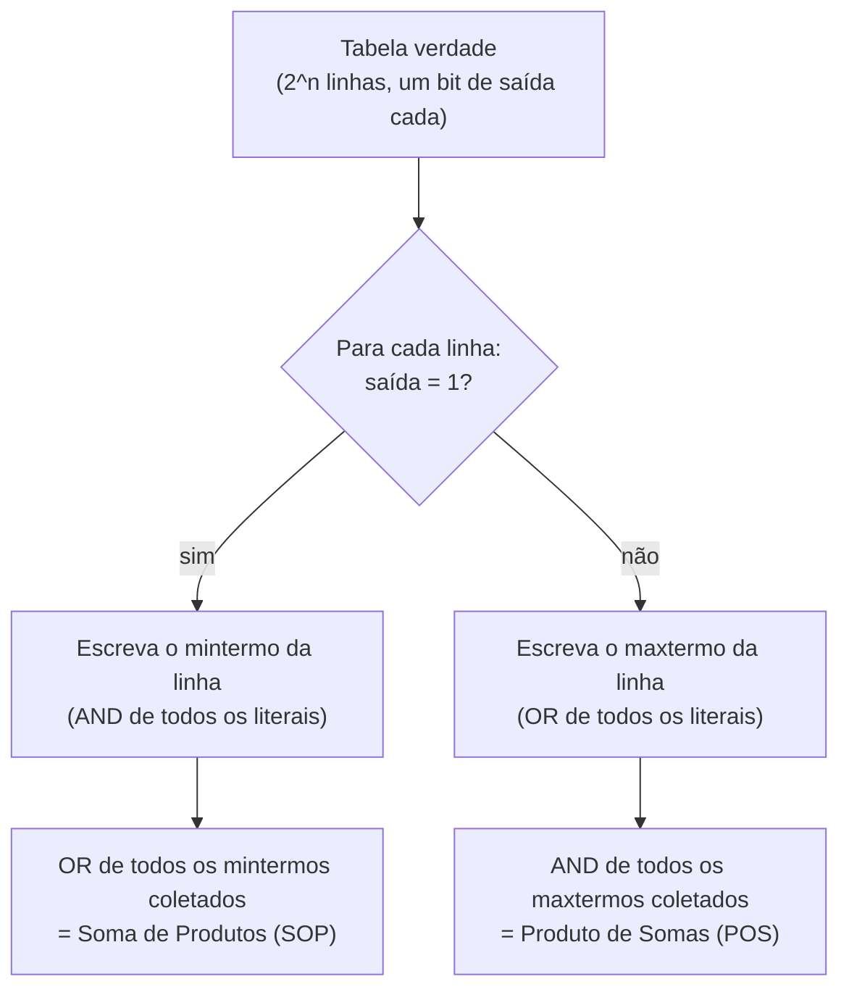

## Objetivos de Aprendizagem

- Definir o domínio booleano {0, 1} e as três operações básicas AND (·), OR (+) e NOT (′), e reproduzir suas tabelas verdade de memória.
- Dizer quantas funções booleanas distintas de n variáveis existem (2^(2ⁿ)) e explicar o que essa contagem está de fato contando.
- Derivar a expressão canônica soma de produtos (mintermos) diretamente de qualquer tabela verdade dada.
- Derivar a expressão canônica produto de somas (maxtermos) diretamente de qualquer tabela verdade dada.
- Explicar, com precisão, por que uma expressão booleana é ao mesmo tempo uma afirmação matemática e uma planta para um circuito físico.
- Determinar se duas expressões booleanas sintaticamente diferentes calculam a mesma função comparando suas tabelas verdade.

## Contexto e Motivação

Esta disciplina começou pelos bits: a observação de que um circuito digital distingue de forma confiável só dois níveis de tensão, que rotulamos 0 e 1. Aquilo era uma afirmação sobre física e tolerância de fabricação. O que faltava até agora é uma linguagem matemática rigorosa para descrever *o que um circuito calcula* com esses dois valores: não só que um fio carrega um 0 ou um 1, mas como uma combinação de fios de entrada determina um fio de saída. Essa linguagem é a álgebra booleana, e ela não precisou ser inventada do zero para este propósito: é o mesmo sistema formal visto em matemática discreta sob o nome de lógica proposicional, em que ∧ (e), ∨ (ou) e ¬ (não) combinam proposições que são Verdadeiras ou Falsas. O conceito "Proposições, Conectivos e Tabelas Verdade" da disciplina discrete-math-logic estuda exatamente esses conectivos e exatamente essa noção de tabela verdade, mas trata Verdadeiro e Falso como valores lógicos abstratos associados a frases ("está chovendo", "a prova é na terça"). Aqui, a mesma estrutura matemática é reaproveitada: Verdadeiro vira 1, Falso vira 0, e uma proposição vira um fio. A álgebra booleana é a lógica proposicional com chapéu de engenheiro.

Essa nova leitura importa porque leva a lógica de dois valores de "uma curiosidade matemática interessante" para "algo construível com componentes físicos". George Boole formalizou essa álgebra nos anos 1850 puramente como ferramenta de raciocínio simbólico, sem pensar em circuitos. Foi Claude Shannon, na sua dissertação de mestrado de 1937, quem mostrou que a álgebra booleana corresponde exatamente a redes de chaves de relé: que ∧, ∨ e ¬ não são só símbolos no papel, mas operações que você pode ligar com componentes que conduzem ou não conduzem. Todo resultado algébrico sobre uma expressão booleana (que duas expressões são equivalentes, ou que uma pode ser reescrita como outra) é, portanto, ao mesmo tempo um fato sobre circuitos: expressões equivalentes descrevem circuitos que sempre produzem a mesma saída para as mesmas entradas, mesmo quando um usa muito menos portas físicas. Essa identidade dupla (um objeto matemático sobre o qual você pode provar coisas, e um diagrama de fiação que você pode construir) é a única ideia que este conceito existe para estabelecer.

Tudo daqui em diante nesta disciplina depende dessa ponte. O próximo conceito cataloga as leis algébricas (comutatividade, associatividade, leis de De Morgan e outras) que permitem *transformar* uma expressão numa equivalente mais barata: as mesmas equivalências estudadas em "Equivalência Lógica e Tautologias" da matemática discreta, mas agora postas para trabalhar minimizando o número de portas, em vez de provar que uma frase é sempre verdadeira. Conceitos posteriores mostram portas físicas que implementam AND, OR e NOT diretamente, e depois circuitos combinacionais (somadores, multiplexadores, decodificadores) que não passam de expressões booleanas realizadas em silício. Nada disso é possível sem antes fixar, com precisão, o que é uma função booleana, quantas delas existem para um dado número de entradas e como ler uma diretamente de uma tabela verdade, que é exatamente o que este conceito cobre.

## Teoria Central

### O domínio booleano e as três operações básicas

A álgebra booleana, como usada em lógica digital, opera sobre o domínio de dois elementos **B = {0, 1}**. Três operações são definidas nesse domínio:

- **AND**, escrito `A · B` (ou simplesmente `AB`, ou `A ∧ B`): vale 1 só quando A e B valem ambos 1.
- **OR**, escrito `A + B` (ou `A ∨ B`): vale 1 quando pelo menos um entre A e B vale 1.
- **NOT**, escrito `A′` (ou `¬A`, ou `A` com uma barra em cima): vale 1 quando A vale 0, e vice-versa.

Suas tabelas verdade:

| A | B | A · B | A + B |
|---|---|---|---|
| 0 | 0 | 0 | 0 |
| 0 | 1 | 0 | 1 |
| 1 | 0 | 0 | 1 |
| 1 | 1 | 1 | 1 |

| A | A′ |
|---|---|
| 0 | 1 |
| 1 | 0 |

Essas são exatamente as tabelas verdade de ∧, ∨ e ¬ da lógica proposicional, com Verdadeiro reetiquetado como 1 e Falso como 0. Nada na matemática subjacente muda com essa troca de rótulos: toda tautologia, toda equivalência, toda técnica de prova da lógica proposicional (verificação por tabela verdade, manipulação algébrica) se transfere sem mudança. O que muda é a leitura pretendida: A e B não são mais frases declarativas, mas sinais (fios mantidos em tensão alta ou baixa), e A · B, A + B, A′ descrevem um mecanismo físico para combinar esses sinais, e não só uma relação lógica entre afirmações.

### Funções booleanas de n variáveis

Uma **função booleana de n variáveis** é um mapeamento `f: {0,1}^n → {0,1}`: ela recebe n entradas booleanas e produz exatamente uma saída booleana. Como há n entradas, cada uma com 2 valores possíveis, há exatamente `2^n` combinações de entrada distintas (linhas na tabela verdade). Para cada uma dessas `2^n` linhas, a saída da função pode ser escolhida de forma independente como 0 ou 1. O número de funções distintas de n variáveis é, portanto, o número de formas distintas de preencher uma coluna de `2^n` bits de saída, que é:

```
2^(2^n)
```

Para n = 1 (uma única entrada A), há `2^(2^1) = 2^2 = 4` funções distintas de uma variável: constante 0, constante 1, identidade (f(A) = A) e NOT (f(A) = A′). Para n = 2, há `2^(2^2) = 2^4 = 16` funções distintas de duas variáveis, incluindo AND, OR, NAND, NOR, XOR, XNOR e outras dez (entre elas as duas constantes e as duas projeções). Para n = 3, há `2^(2^3) = 2^8 = 256` funções distintas de três variáveis. Essa contagem cresce de forma duplamente exponencial (a própria taxa de crescimento acelera, não só a contagem), e é precisamente por isso que ninguém enumera funções booleanas por força bruta quando n passa de 4 ou 5 variáveis, e por isso uma notação algébrica compacta é indispensável para descrevê-las e manipulá-las.

### Mintermos e a forma canônica soma de produtos (SOP)

Um **mintermo** de n variáveis é um termo produto (AND) que inclui cada uma das n variáveis exatamente uma vez, na forma sem complemento (A) ou complementada (A′), escolhidas de modo que o mintermo valha 1 em exatamente uma linha específica da tabela verdade e 0 em todas as outras. Para três variáveis A, B, C, o mintermo correspondente à linha A=1, B=0, C=1 é `A · B′ · C`: esse produto vale 1 exatamente quando A=1 e B=0 e C=1, e 0 em qualquer outra combinação, porque qualquer divergência numa única variável força o literal dessa variável a 0, zerando o termo AND inteiro.

Dada qualquer tabela verdade de uma função f, a forma canônica **soma de produtos (SOP)** (também chamada de **expansão em mintermos**) é construída por uma regra mecânica simples: para cada linha em que a saída vale 1, escreva o mintermo correspondente a essa linha, e então faça o OR de todos esses mintermos. Isso funciona porque a expressão resultante vale 1 exatamente nas linhas cujos mintermos foram incluídos (cada um contribui com um 1 na sua própria linha e um 0 em todas as outras, e o OR preserva qualquer 1 presente), e 0 em toda linha em que a saída foi especificada como 0 (nenhum dos mintermos incluídos dispara ali). Toda função booleana tem exatamente uma forma SOP de expansão em mintermos: ela é canônica (única) justamente porque é lida diretamente, linha por linha, da tabela verdade, sem nenhuma escolha em aberto.

### Maxtermos e a forma canônica produto de somas (POS)

A construção dual usa **maxtermos**. Um maxtermo de n variáveis é um termo soma (OR) que inclui cada variável exatamente uma vez (sem complemento ou complementada), escolhido de modo que valha 0 em exatamente uma linha específica e 1 em todas as outras. Para a linha A=1, B=0, C=1, o maxtermo correspondente é `A′ + B + C′`: ele vale 0 exatamente quando A=1, B=0, C=1 (cada parcela só vira 0 quando seu literal discorda do valor daquela linha), e 1 em qualquer outra combinação.

A forma canônica **produto de somas (POS)** é construída de forma dual: para cada linha em que a saída vale 0, escreva o maxtermo correspondente a essa linha, e então faça o AND de todos esses maxtermos. O resultado vale 0 exatamente nas linhas cujos maxtermos foram incluídos, e 1 em todas as outras, batendo com a tabela verdade por construção. Assim como a forma SOP, a forma POS é canônica: é determinada de forma única pela tabela verdade.



### A ponte entre expressão e planta

Uma expressão booleana como `A · B′ + A′ · C` pode ser lida de duas formas completamente diferentes, mas perfeitamente consistentes. Matematicamente, é uma fórmula numa álgebra sobre {0,1}; substituir A, B, C por qualquer atribuição de 0s e 1s a avalia numa única saída booleana, e duas expressões são "a mesma" exatamente quando concordam em toda atribuição possível. Fisicamente, a mesma expressão é uma planta: cada variável é um fio, cada `·` é uma porta AND, cada `+` é uma porta OR, cada `′` é uma porta NOT, e a expressão inteira descreve como ligar essas portas num circuito que produz a saída especificada para toda combinação de entrada. Como as duas leituras são governadas exatamente pela mesma tabela verdade, qualquer fato algébrico provado sobre a expressão (duas formas são equivalentes; uma forma pode ser reescrita de modo mais compacto) é ao mesmo tempo um fato sobre o circuito (duas fiações se comportam de forma idêntica; uma fiação pode ser substituída por outra com menos portas). É por isso que as formas canônicas importam além da sua unicidade arrumada: a forma SOP em mintermos lida de uma tabela verdade é um circuito inicial *garantidamente correto*, embora, como o próximo conceito mostra, muito raramente seja o *mais barato*.

## Exemplos Resolvidos

### Exemplo 1: de uma tabela verdade de 3 variáveis para a expressão SOP em mintermos

Considere a seguinte tabela verdade de uma função f(A, B, C):

| A | B | C | f |
|---|---|---|---|
| 0 | 0 | 0 | 0 |
| 0 | 0 | 1 | 1 |
| 0 | 1 | 0 | 0 |
| 0 | 1 | 1 | 0 |
| 1 | 0 | 0 | 1 |
| 1 | 0 | 1 | 1 |
| 1 | 1 | 0 | 0 |
| 1 | 1 | 1 | 1 |

Passo 1: identifique toda linha em que f = 1: linhas (0,0,1), (1,0,0), (1,0,1), (1,1,1).

Passo 2: escreva o mintermo de cada uma dessas linhas. Para (0,0,1): A=0, então use A′; B=0, então use B′; C=1, então use C, dando `A′·B′·C`. Para (1,0,0): `A·B′·C′`. Para (1,0,1): `A·B′·C`. Para (1,1,1): `A·B·C`.

Passo 3: faça o OR deles:

```
f(A,B,C) = A′·B′·C + A·B′·C′ + A·B′·C + A·B·C
```

Conferindo: pegue uma linha fora da lista de "1", digamos (0,1,0). Avalie cada termo: `A′·B′·C = 1·0·0 = 0` (B=1, então B′=0); `A·B′·C′ = 0` (A=0); `A·B′·C = 0` (A=0); `A·B·C = 0·1·0 = 0`. Soma = 0, batendo com a tabela. Agora confira a linha (1,0,1): `A′·B′·C = 0` (A=1, então A′=0); `A·B′·C′ = 1·1·0 = 0` (C=1, então C′=0); `A·B′·C = 1·1·1 = 1`; `A·B·C = 1·0·1 = 0` (B=0). Soma = 1, batendo com a tabela.

### Exemplo 2: mostrando que duas expressões de aparência diferente calculam a mesma função

Afirmação: `f1 = A·B + A·C` e `f2 = A·(B + C)` são a mesma função. Construa as duas tabelas verdade:

| A | B | C | A·B | A·C | f1 = A·B + A·C | B+C | f2 = A·(B+C) |
|---|---|---|---|---|---|---|---|
| 0 | 0 | 0 | 0 | 0 | 0 | 0 | 0 |
| 0 | 0 | 1 | 0 | 0 | 0 | 1 | 0 |
| 0 | 1 | 0 | 0 | 0 | 0 | 1 | 0 |
| 0 | 1 | 1 | 0 | 0 | 0 | 1 | 0 |
| 1 | 0 | 0 | 0 | 0 | 0 | 0 | 0 |
| 1 | 0 | 1 | 0 | 1 | 1 | 1 | 1 |
| 1 | 1 | 0 | 1 | 0 | 1 | 1 | 1 |
| 1 | 1 | 1 | 1 | 1 | 1 | 1 | 1 |

A coluna f1 e a coluna f2 concordam nas 8 linhas, então f1 e f2 são a mesma função booleana, apesar de serem expressões sintaticamente diferentes: uma usa duas operações AND e um OR, a outra usa um OR e um AND. (Essa equivalência específica é uma instância da lei distributiva, vista formalmente no próximo conceito.) Como plantas de circuito, f1 descreve duas portas AND de 2 entradas alimentando uma porta OR de 2 entradas (3 portas no total), enquanto f2 descreve uma porta OR de 2 entradas alimentando uma porta AND de 2 entradas (2 portas no total): mesma função, circuito mais barato, exatamente o tipo de trade-off que a manipulação algébrica de expressões booleanas torna possível.

### Exemplo 3: construindo a forma POS/maxtermos de uma função pequena

Considere uma função de 2 variáveis g(A, B) com esta tabela verdade:

| A | B | g |
|---|---|---|
| 0 | 0 | 1 |
| 0 | 1 | 0 |
| 1 | 0 | 1 |
| 1 | 1 | 1 |

Passo 1: identifique toda linha em que g = 0: só a linha (0, 1).

Passo 2: escreva o maxtermo dessa linha. Um literal de maxtermo precisa valer 0 exatamente quando sua variável assume o valor da linha: para A=0, o literal que vale 0 ali é o A sem complemento; para B=1, o literal que vale 0 ali é B′. Então o maxtermo da linha (0,1) é `A + B′`.

Passo 3: como só há uma linha com saída 0, a forma POS é só esse único maxtermo:

```
g(A,B) = A + B′
```

Conferindo com cada linha: (0,0): `0 + 1 = 1`, bate com g=1. (0,1): `0 + 0 = 0`, bate com g=0. (1,0): `1 + 1 = 1`, bate com g=1. (1,1): `1 + 0 = 1`, bate com g=1. As quatro linhas concordam, confirmando que a expressão POS reproduz exatamente a tabela verdade.

## Equívocos Comuns e Armadilhas

- **"A álgebra booleana é um assunto diferente da lógica que aprendi com Verdadeiro/Falso."** É a mesma estrutura matemática ({0,1} com AND, OR, NOT satisfazendo as mesmas leis que {Verdadeiro, Falso} com ∧, ∨, ¬) sob uma convenção de rótulos diferente, escolhida porque corresponde aos níveis de tensão físicos. Toda tabela verdade, equivalência e técnica de prova se transfere diretamente.
- **"A forma canônica SOP ou POS é a melhor (mais barata) forma de construir o circuito."** As formas canônicas são garantidamente *corretas* por construção (lidas diretamente da tabela verdade), mas quase nunca são as mais baratas em número de portas; elas normalmente incluem muito mais literais e portas que uma expressão simplificada equivalente. A forma canônica é um ponto de partida confiável, não um ponto de chegada.
- **"Se duas expressões têm aparência diferente, elas devem calcular funções diferentes."** A diferença sintática não diz nada sobre a equivalência semântica (funcional); o único teste confiável é comparar as tabelas verdade completas (ou uma prova algébrica), como mostrado no Exemplo 2, em que uma expressão de 3 portas e uma de 2 portas se revelaram idênticas.
- **"Um mintermo é a mesma coisa que uma única variável."** Um mintermo é um produto completo de *todas as n* variáveis (cada uma aparecendo complementada ou não), e não só uma variável ou um termo parcial; omitir uma única variável que seja significa que não é um mintermo e não corresponderá a exatamente uma linha da tabela verdade.
- **"2^(2ⁿ) e 2ⁿ medem a mesma coisa."** `2^n` conta o número de *combinações de entrada* (linhas) para n variáveis; `2^(2^n)` conta o número de *funções distintas* que podem ser definidas sobre essas linhas, já que a saída de cada linha pode ser escolhida de forma independente. Confundir esses dois expoentes é uma fonte comum de erro ao raciocinar sobre contagem de funções.
- **"Uma expressão booleana é só notação; ela não corresponde a nada físico."** O ponto central deste conceito é justamente que corresponde: cada AND/OR/NOT numa expressão corresponde a uma porta física, e a expressão inteira é uma planta de fiação, e é por isso que propriedades algébricas das expressões (equivalência, simplificação) se traduzem diretamente em propriedades dos circuitos (comportamento idêntico, menos componentes).

## Resumo

A álgebra booleana pega os mesmos conectivos ∧, ∨, ¬ e o mesmo maquinário de tabelas verdade já estudados na lógica proposicional e os reinterpreta sobre {0, 1} como uma álgebra cujas expressões servem também de plantas de circuito; uma função booleana de n variáveis é qualquer mapeamento das `2^n` linhas de entrada possíveis para um único bit de saída, e existem exatamente `2^(2^n)` funções assim, porque a saída de cada linha pode ser escolhida de forma independente. A tabela verdade de toda função produz duas expressões canônicas únicas, lidas mecanicamente: a forma soma de produtos, que faz o OR do mintermo de cada linha em que a saída vale 1, e a forma produto de somas, que faz o AND do maxtermo de cada linha em que a saída vale 0; ambas garantidamente corretas, embora raramente econômicas em número de portas. Essa correspondência entre álgebra e planta é a base sobre a qual o próximo conceito se constrói diretamente: Leis da Álgebra Booleana e Leis de De Morgan, que fornece as regras para reescrever uma expressão canônica correta, mas esbanjadora, numa expressão equivalente construída com muito menos portas.

## Documentation Links

- [MIT 6.004: Combinational Logic Unit](https://ocw.mit.edu/courses/6-004-computation-structures-spring-2017/pages/c4/): unidade de Computation Structures do MIT que cobre a álgebra booleana como fundamento matemático dos circuitos combinacionais.
- [ACM/IEEE CS2013: Architecture and Organization Knowledge Area](https://csed.acm.org/knowledge-areas-architecture-and-organization-ar-cs2013-version/): diretrizes curriculares que identificam a álgebra booleana e a lógica digital como tópicos centrais de Arquitetura e Organização.
