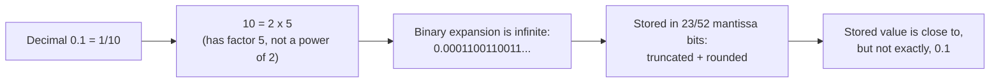

## Learning Objectives

- Define the three fields of an IEEE 754 single-precision number (sign, biased exponent, mantissa) and state the bit width of each.
- Explain why the exponent field uses a bias instead of two's complement, and compute the biased exponent from a true exponent using the bias value 127.
- Derive the decimal value represented by a 32-bit IEEE 754 pattern using the formula (−1)^sign × 1.fraction × 2^(exp−127), including the role of the implicit leading 1.
- Encode a given decimal number into its full 32-bit IEEE 754 single-precision bit pattern, and decode a given 32-bit pattern back into decimal.
- Identify the special encodings (±0, ±∞, NaN, subnormals) and explain what distinguishes each from a normalized number.
- Explain why most decimal fractions, such as 0.1, have no exact finite binary representation, and connect this to observed floating-point rounding artifacts such as 0.1 + 0.2 ≠ 0.3.

## Context & Motivation

Two's complement, the previous concept, solved the problem of representing negative whole numbers within a fixed number of bits by giving the most significant bit a negative weight. But integers alone cannot express the enormous dynamic range and fractional precision that real programs need — a physics simulation tracking distances from nanometers to light-years, a graphics pipeline blending colors between 0.0 and 1.0, a spreadsheet computing a quarterly average. A fixed-point scheme (say, reserving a fixed number of bits for the fractional part) forces every value in a program to share the same trade-off between range and precision, which is far too rigid for general-purpose computing. Floating-point representation solves this by letting the position of the "binary point" float, storing a number as a normalized fraction together with a separate exponent that says how far, and in which direction, to shift that point — exactly the same idea as scientific notation, where 6.25 × 10² and 0.625 × 10³ denote the same value with the decimal point in different places.

IEEE 754, standardized in 1985 and universally implemented in every general-purpose CPU and GPU since, is the concrete bit-level answer to "exactly which bit pattern represents which floating-point number," and it matters for the same engineering reason two's complement mattered for integers: without a single agreed-upon standard, a floating-point value computed on one machine could be silently misinterpreted, or simply fail to reproduce, on another. Harris & Harris situates IEEE 754 as the representation layer directly above integer arithmetic in the datapath, reusing the sign-bit convention from two's complement while introducing two genuinely new ideas — a biased exponent field, and an implicit, unstored leading bit in the mantissa — both chosen for very specific hardware reasons explored below. The ACM/IEEE CS2013 Architecture and Organization knowledge area places floating-point representation alongside integer representation as one of the foundational numeric-representation topics every computer-organization course must cover, precisely because so much of everyday numerical software behavior (including the frequently surprising "0.1 + 0.2 ≠ 0.3") is explained entirely at this representation level, with no bug in any software involved.

Understanding IEEE 754 closes the loop opened by the very first concept in this sequence: bits are the machine's only alphabet, number bases are how humans read strings of those bits, two's complement is how negative integers are carved out of that alphabet, and IEEE 754 is how the same alphabet is stretched to cover fractions and enormous dynamic range, all using a fixed 32 (or 64) bits. Once this representation layer is fully understood, the curriculum turns to the physical building blocks — Boolean algebra and logic gates — needed to actually construct circuits that manipulate these bit patterns.

## Core Theory

### The three fields: sign, exponent, mantissa

An IEEE 754 single-precision (32-bit, "float") number is divided into three contiguous fields:

| Field | Bit width | Bit positions | Role |
|---|---|---|---|
| Sign (S) | 1 bit | bit 31 | 0 = positive, 1 = negative |
| Exponent (E) | 8 bits | bits 30–23 | Biased exponent (bias 127) |
| Mantissa / fraction (M) | 23 bits | bits 22–0 | Fractional part after an implicit leading 1 |

```
 31  30        23  22                     0
+---+------------+-------------------------+
| S |  Exponent  |        Mantissa         |
+---+------------+-------------------------+
  1        8                 23              = 32 bits total
```

Double precision ("double") uses the same three-field layout scaled up: 1 sign bit, 11 exponent bits (bias 1023), and 52 mantissa bits, for 64 bits total. Everything below is explained for single precision; the same reasoning applies to double precision with the wider fields and the larger bias.

### Why a biased exponent instead of two's complement

The exponent must be able to represent both positive and negative true exponents (large numbers need a large positive exponent; small fractional numbers need a negative exponent), so a signed representation is unavoidable. But IEEE 754 deliberately does **not** use two's complement for the exponent field — it uses an excess/biased representation instead, storing `E = true_exponent + 127` rather than the true exponent's two's-complement pattern.

The reason is entirely about hardware comparison, not arithmetic. A central design goal of IEEE 754 is that two non-negative floating-point numbers can be compared for ordering using the exact same integer-comparison circuitry already used to compare unsigned integers, just by comparing their 32-bit patterns as if they were unsigned integers — no floating-point-aware comparator is needed. This only works if increasing bit patterns correspond to increasing exponents in the same direction as increasing magnitude. With a biased (excess-127) representation, the smallest true exponent maps to the all-zeros pattern and the largest true exponent maps to the all-ones-adjacent pattern, so the exponent field's bit pattern increases monotonically with the true exponent, exactly like an ordinary unsigned integer. Two's complement, by contrast, has its bit patterns increase and then wrap around (with the most negative value stored as the pattern with the leading 1), which would break straightforward unsigned magnitude comparison. Biasing trades away the "invert-and-add-1" symmetry that made two's complement ideal for the adder, in exchange for monotonic unsigned-comparable ordering, which is the property that matters for a field that is mostly compared, not added.

For single precision, the bias is 127, so:

```
stored E = true_exponent + 127
true_exponent = stored E - 127
```

The stored exponent field ranges from 1 to 254 for normalized numbers (0 and 255 are reserved for special values, covered below), giving true exponents from −126 to +127.

### The normalized value formula and the implicit leading bit

A normalized (ordinary, non-special) IEEE 754 value is computed as:

```
value = (-1)^S × 1.M × 2^(E - 127)
```

Here `1.M` means: place an implicit, unstored binary 1 immediately before the binary point, followed by the 23 stored mantissa bits as the fractional part. This implicit leading 1 is possible because every nonzero binary number can be normalized to the form `1.xxxxx × 2^k` by choosing k appropriately (shift the binary point until exactly one 1-bit sits to its left) — since that leading bit is *always* 1 for a normalized nonzero value, IEEE 754 simply does not store it, gaining one extra bit of effective precision for free. The 23 stored mantissa bits therefore represent 24 bits of significand precision.

### Special values

Two reserved exponent patterns (all-zeros and all-ones) carve out special encodings outside the normalized formula:

| Exponent field | Mantissa field | Meaning |
|---|---|---|
| 00000000 (0) | 00000000000000000000000 (0) | ±0 (sign bit distinguishes +0 from −0) |
| 00000000 (0) | nonzero | Subnormal (denormalized) number: value = (−1)^S × 0.M × 2^(−126), no implicit leading 1 |
| 00000001 – 11111110 (1–254) | any | Normalized number: (−1)^S × 1.M × 2^(E−127) |
| 11111111 (255) | 00000000000000000000000 (0) | ±∞ |
| 11111111 (255) | nonzero | NaN (Not a Number) — the result of an undefined operation such as 0/0 |

Subnormal numbers exist to let magnitude shrink gradually toward zero rather than jumping abruptly from the smallest normalized magnitude straight to zero, filling in the gap near zero with reduced (but nonzero) precision.

### Why 0.1 has no finite binary representation

A binary fraction `0.b1 b2 b3 ...` represents a sum of negative powers of 2: `b1×2^−1 + b2×2^−2 + ...`. A terminating binary fraction can therefore only ever exactly represent values whose decimal denominator (in lowest terms) is a power of 2 — values like 0.5 (1/2), 0.25 (1/4), 0.125 (1/8). The decimal fraction 0.1 is exactly 1/10, and 10 = 2 × 5; because of the factor of 5, 1/10 cannot be written as a finite sum of negative powers of 2 — its binary expansion is the infinitely repeating pattern `0.0001100110011...` (the group `0011` repeats forever), exactly analogous to how 1/3 cannot be written as a finite decimal (it repeats as 0.333...) because 3 shares no factor with 10. Since IEEE 754 stores only a fixed 23 (or 52) mantissa bits, this infinite repeating pattern must be truncated and rounded to fit, so the stored value for 0.1 is not exactly one-tenth — it is the nearest representable float, off by a tiny but nonzero amount. This rounding error, not any flaw in arithmetic circuitry, is the entire explanation behind results like 0.1 + 0.2 ≠ 0.3 in floating-point code.



## Worked Examples

### Example 1: Encoding −6.25 into 32-bit IEEE 754

**Step 1 — sign bit.** −6.25 is negative, so S = 1.

**Step 2 — binary representation of the magnitude 6.25.** Integer part: 6 = `110`. Fractional part: 0.25 = 2^−2 exactly = `.01`. So 6.25 = `110.01` in binary.

**Step 3 — normalize** to the form `1.xxxxx × 2^k`: shift the binary point 2 places left, `110.01 = 1.1001 × 2^2`. So the true exponent is 2, and the mantissa bits (after the implicit leading 1) are `1001` followed by zeros to fill 23 bits: `10010000000000000000000`.

**Step 4 — biased exponent.** E = true_exponent + 127 = 2 + 127 = 129. In 8-bit binary: 129 = `1000 0001`.

**Step 5 — assemble the 32 bits**: S=1, E=`10000001`, M=`10010000000000000000000`:

```
1 10000001 10010000000000000000000
```

Grouped into hex (4-bit nibbles) for compactness: `1100 0000 1100 1000 0000 0000 0000 0000` = `0xC0C80000`.

**Cross-check** by decoding: (−1)^1 × 1.1001₂ × 2^(129−127) = −1 × 1.5625 × 4 = −6.25. (1.1001₂ = 1 + 1/2 + 1/16 = 1 + 0.5 + 0.0625 = 1.5625.) Matches the original value exactly.

### Example 2: Decoding the 32-bit pattern 0x41480000 to decimal

**Step 1 — split into fields.** `0x41480000` in binary is `0100 0001 0100 1000 0000 0000 0000 0000`. Sign S = `0`. Exponent E = `10000010` (next 8 bits). Mantissa M = `10010000000000000000000` (remaining 23 bits).

**Step 2 — decode the exponent.** E as unsigned binary: `10000010` = 128 + 2 = 130. True exponent = 130 − 127 = 3.

**Step 3 — decode the mantissa.** `1.M` = `1.10010000000000000000000` = 1 + 1/2 + 1/16 = 1 + 0.5 + 0.0625 = 1.5625.

**Step 4 — combine.** value = (−1)^0 × 1.5625 × 2^3 = 1.5625 × 8 = 12.5.

**Cross-check**: 12.5 in binary is `1100.1`, normalized as `1.1001 × 2^3` — same mantissa bits (1001…) and same exponent (3) recovered independently, confirming the decode.

### Example 3: Demonstrating 0.1 + 0.2 ≠ 0.3

Neither 0.1 nor 0.2 has an exact finite binary representation (Core Theory above), so both are stored as the nearest representable double-precision approximations, each carrying a tiny rounding error; adding two already-rounded approximations does not generally cancel out to produce the exact rounded representation of 0.3. This is directly observable:

```python
>>> 0.1 + 0.2
0.30000000000000004
>>> 0.1 + 0.2 == 0.3
False
>>> format(0.1, '.20f')
'0.10000000000000000555'
>>> format(0.3, '.20f')
'0.29999999999999998890'
```

The printed value `0.30000000000000004` is the correctly-rounded double-precision sum of the two stored approximations of 0.1 and 0.2 — it is not equal, bit for bit, to the independently-rounded stored approximation of the literal 0.3, so the equality test correctly reports False. No arithmetic hardware is malfunctioning here; every step (storing 0.1, storing 0.2, adding them, storing 0.3) individually rounds correctly to the nearest representable double, and the tiny residual differences from those independent roundings simply do not cancel.

## Common Misconceptions & Pitfalls

- **"Floating-point addition is buggy because 0.1 + 0.2 doesn't equal 0.3."** There is no bug: 0.1, 0.2, and 0.3 are each already rounded to the nearest representable binary fraction before any addition happens, because none of them has an exact finite binary representation; the observed discrepancy is a direct, fully explained consequence of representation, not of faulty arithmetic circuitry.
- **"The exponent field uses two's complement, just like signed integers do."** It does not — it uses an excess/biased encoding (add 127 for single precision) specifically so that exponent comparison can reuse ordinary unsigned-integer comparison hardware, which requires the stored bit pattern to increase monotonically with the true exponent, a property two's complement does not have across its wraparound point.
- **"The mantissa stores the entire significant digits of the number."** It stores only the fractional part after an implicit, unstored leading 1 (for normalized numbers); the true significand is `1.M`, giving 24 bits of precision (1 implicit + 23 stored) from only 23 stored bits.
- **"Every terminating decimal fraction has a terminating binary representation."** Only decimal fractions whose denominator (in lowest terms) is a power of 2 terminate in binary; 0.1 = 1/10 has a factor of 5 in its denominator and therefore repeats forever in binary, exactly as 1/3 repeats forever in decimal.
- **"NaN and infinity are just very large floating-point numbers."** They are reserved bit patterns (exponent field all 1s) entirely outside the normalized value formula — infinity has a zero mantissa and represents an unbounded value, while NaN has a nonzero mantissa and represents an undefined or unrepresentable result (such as 0/0); neither participates in the (−1)^S × 1.M × 2^(E−127) arithmetic at all.
- **"Increasing the exponent field's bit pattern by 1 always doubles the represented value."** This is true only while the mantissa is held at its minimum (all zeros); more generally the value scales continuously as the mantissa increases within a fixed exponent, and only jumps by a factor of 2 when the mantissa rolls over from all-ones back to all-zeros while the exponent increments — the same way an odometer's tens digit only increments when the ones digit wraps.

## Summary

IEEE 754 single precision packs a floating-point number into 32 bits as a sign bit, an 8-bit biased exponent (bias 127, stored as true_exponent + 127 so that exponent comparisons can reuse unsigned-integer comparison hardware), and a 23-bit mantissa representing the fractional part after an implicit, unstored leading 1 — giving the normalized value (−1)^sign × 1.fraction × 2^(exponent−127). Reserved all-zero and all-one exponent patterns carve out ±0, subnormals, ±∞, and NaN outside that formula. Because most decimal fractions (0.1 included) have no finite binary expansion, they must be rounded to the nearest representable float or double, and this single, well-understood rounding step — not any arithmetic defect — is the entire explanation for results like 0.1 + 0.2 ≠ 0.3. With both integer (two's complement) and fractional (IEEE 754) number representation now established, the curriculum turns next to the Boolean algebra and logic-gate foundations needed to actually build the circuits — adders, comparators, ALUs — that manipulate these bit patterns in hardware.

## Documentation Links

- [ACM/IEEE CS2013 — Architecture and Organization Knowledge Area](https://csed.acm.org/knowledge-areas-architecture-and-organization-ar-cs2013-version/) — curriculum guidelines identifying floating-point representation as a core numeric-representation topic in Architecture and Organization.
- [Harris & Harris — Digital Design and Computer Architecture, RISC-V Edition](https://shop.elsevier.com/books/digital-design-and-computer-architecture-risc-v-edition/harris/978-0-12-820064-3) — presents the IEEE 754 sign/exponent/mantissa layout, biased exponent rationale, and special-value encodings as implemented in real processor floating-point units.
