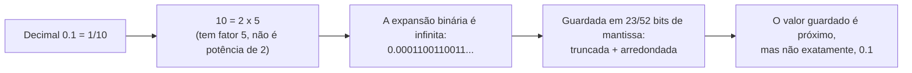

## Objetivos de Aprendizagem

- Definir os três campos de um número IEEE 754 de precisão simples (sinal, expoente enviesado, mantissa) e dizer a largura em bits de cada um.
- Explicar por que o campo do expoente usa um viés em vez de complemento de dois, e calcular o expoente enviesado a partir de um expoente verdadeiro usando o valor de viés 127.
- Derivar o valor decimal representado por um padrão IEEE 754 de 32 bits usando a fórmula (−1)^sinal × 1.fração × 2^(exp−127), incluindo o papel do 1 inicial implícito.
- Codificar um número decimal dado no seu padrão completo de 32 bits IEEE 754 de precisão simples, e decodificar um padrão de 32 bits dado de volta para decimal.
- Identificar as codificações especiais (±0, ±∞, NaN, subnormais) e explicar o que distingue cada uma de um número normalizado.
- Explicar por que a maioria das frações decimais, como 0.1, não tem representação binária finita exata, e ligar isso a artefatos de arredondamento de ponto flutuante observados, como 0.1 + 0.2 ≠ 0.3.

## Contexto e Motivação

O complemento de dois, o conceito anterior, resolveu o problema de representar números inteiros negativos dentro de um número fixo de bits dando ao bit mais significativo um peso negativo. Mas só inteiros não conseguem expressar a enorme faixa dinâmica e a precisão fracionária de que programas reais precisam: uma simulação física acompanhando distâncias de nanômetros a anos-luz, um pipeline gráfico misturando cores entre 0.0 e 1.0, uma planilha calculando uma média trimestral. Um esquema de ponto fixo (digamos, reservando um número fixo de bits para a parte fracionária) força todo valor de um programa a compartilhar o mesmo trade-off entre faixa e precisão, o que é rígido demais para computação de propósito geral. A representação em ponto flutuante resolve isso deixando a posição do "ponto binário" flutuar, guardando um número como uma fração normalizada junto com um expoente separado que diz o quanto, e em que direção, deslocar esse ponto: exatamente a mesma ideia da notação científica, em que 6.25 × 10² e 0.625 × 10³ denotam o mesmo valor com o ponto decimal em lugares diferentes.

O IEEE 754, padronizado em 1985 e implementado universalmente em toda CPU e GPU de propósito geral desde então, é a resposta concreta, em nível de bits, para "exatamente qual padrão de bits representa qual número de ponto flutuante", e importa pelo mesmo motivo de engenharia que o complemento de dois importou para os inteiros: sem um único padrão acordado, um valor de ponto flutuante calculado numa máquina poderia ser silenciosamente mal interpretado, ou simplesmente não se reproduzir, em outra. Harris & Harris situam o IEEE 754 como a camada de representação logo acima da aritmética inteira no datapath, reaproveitando a convenção de bit de sinal do complemento de dois enquanto introduzem duas ideias genuinamente novas (um campo de expoente enviesado e um bit inicial implícito, não guardado, na mantissa), ambas escolhidas por motivos de hardware bem específicos explorados abaixo. A área de conhecimento de Arquitetura e Organização do ACM/IEEE CS2013 coloca a representação em ponto flutuante ao lado da representação de inteiros como um dos tópicos fundamentais de representação numérica que todo curso de organização de computadores precisa cobrir, justamente porque tanto do comportamento cotidiano de software numérico (incluindo o frequentemente surpreendente "0.1 + 0.2 ≠ 0.3") é explicado inteiramente neste nível de representação, sem bug nenhum em software algum.

Entender o IEEE 754 fecha o ciclo aberto pelo primeiríssimo conceito desta sequência: os bits são o único alfabeto da máquina, as bases numéricas são como os humanos leem sequências desses bits, o complemento de dois é como os inteiros negativos são recortados desse alfabeto, e o IEEE 754 é como o mesmo alfabeto é esticado para cobrir frações e uma faixa dinâmica enorme, tudo usando 32 (ou 64) bits fixos. Com essa camada de representação totalmente entendida, o currículo se volta para os blocos de construção físicos (álgebra booleana e portas lógicas) necessários para de fato construir circuitos que manipulam esses padrões de bits.

## Teoria Central

### Os três campos: sinal, expoente, mantissa

Um número IEEE 754 de precisão simples (32 bits, "float") é dividido em três campos contíguos:

| Campo | Largura em bits | Posições de bit | Papel |
|---|---|---|---|
| Sinal (S) | 1 bit | bit 31 | 0 = positivo, 1 = negativo |
| Expoente (E) | 8 bits | bits 30 a 23 | Expoente enviesado (viés 127) |
| Mantissa / fração (M) | 23 bits | bits 22 a 0 | Parte fracionária depois de um 1 inicial implícito |

```
 31  30        23  22                     0
+---+------------+-------------------------+
| S |  Expoente  |        Mantissa         |
+---+------------+-------------------------+
  1        8                 23              = 32 bits no total
```

A precisão dupla ("double") usa o mesmo leiaute de três campos ampliado: 1 bit de sinal, 11 bits de expoente (viés 1023) e 52 bits de mantissa, num total de 64 bits. Tudo abaixo é explicado para precisão simples; o mesmo raciocínio se aplica à precisão dupla, com os campos mais largos e o viés maior.

### Por que um expoente enviesado em vez de complemento de dois

O expoente precisa conseguir representar expoentes verdadeiros positivos e negativos (números grandes precisam de um expoente positivo grande; números fracionários pequenos precisam de um expoente negativo), então uma representação com sinal é inevitável. Mas o IEEE 754 deliberadamente **não** usa complemento de dois no campo do expoente: ele usa uma representação em excesso/enviesada, guardando `E = expoente_verdadeiro + 127` em vez do padrão em complemento de dois do expoente verdadeiro.

O motivo é inteiramente de comparação em hardware, não de aritmética. Um objetivo central de projeto do IEEE 754 é que dois números de ponto flutuante não negativos possam ser comparados quanto à ordem usando exatamente o mesmo circuito de comparação de inteiros já usado para comparar inteiros sem sinal, só comparando seus padrões de 32 bits como se fossem inteiros sem sinal; nenhum comparador específico de ponto flutuante é necessário. Isso só funciona se padrões de bits crescentes corresponderem a expoentes crescentes, na mesma direção da magnitude crescente. Com uma representação enviesada (excesso de 127), o menor expoente verdadeiro corresponde ao padrão de zeros e o maior expoente verdadeiro corresponde ao padrão vizinho ao de uns, então o padrão de bits do campo do expoente cresce monotonicamente com o expoente verdadeiro, exatamente como um inteiro sem sinal comum. O complemento de dois, por outro lado, tem padrões de bits que crescem e depois dão a volta (com o valor mais negativo guardado como o padrão com o 1 inicial), o que quebraria a comparação direta de magnitude sem sinal. O viés abre mão da simetria de "inverter e somar 1" que tornou o complemento de dois ideal para o somador, em troca de uma ordenação monotônica comparável sem sinal, que é a propriedade que importa para um campo que é mais comparado do que somado.

Na precisão simples, o viés é 127, então:

```
E guardado = expoente_verdadeiro + 127
expoente_verdadeiro = E guardado - 127
```

O campo de expoente guardado vai de 1 a 254 nos números normalizados (0 e 255 são reservados para valores especiais, vistos abaixo), dando expoentes verdadeiros de −126 a +127.

### A fórmula do valor normalizado e o bit inicial implícito

Um valor IEEE 754 normalizado (comum, não especial) é calculado como:

```
valor = (-1)^S × 1.M × 2^(E - 127)
```

Aqui `1.M` significa: coloque um 1 binário implícito, não guardado, imediatamente antes do ponto binário, seguido dos 23 bits de mantissa guardados como parte fracionária. Esse 1 inicial implícito é possível porque todo número binário diferente de zero pode ser normalizado na forma `1.xxxxx × 2^k` escolhendo k adequadamente (desloque o ponto binário até sobrar exatamente um bit 1 à sua esquerda); como esse bit inicial é *sempre* 1 num valor normalizado diferente de zero, o IEEE 754 simplesmente não o guarda, ganhando um bit extra de precisão efetiva de graça. Os 23 bits de mantissa guardados representam, portanto, 24 bits de precisão do significando.

### Valores especiais

Dois padrões de expoente reservados (todos zeros e todos uns) recortam codificações especiais fora da fórmula normalizada:

| Campo do expoente | Campo da mantissa | Significado |
|---|---|---|
| 00000000 (0) | 00000000000000000000000 (0) | ±0 (o bit de sinal distingue +0 de −0) |
| 00000000 (0) | diferente de zero | Número subnormal (desnormalizado): valor = (−1)^S × 0.M × 2^(−126), sem 1 inicial implícito |
| 00000001 a 11111110 (1 a 254) | qualquer | Número normalizado: (−1)^S × 1.M × 2^(E−127) |
| 11111111 (255) | 00000000000000000000000 (0) | ±∞ |
| 11111111 (255) | diferente de zero | NaN (Not a Number): o resultado de uma operação indefinida, como 0/0 |

Os números subnormais existem para deixar a magnitude encolher gradualmente em direção a zero, em vez de saltar abruptamente da menor magnitude normalizada direto para zero, preenchendo o vão perto de zero com precisão reduzida (mas não nula).

### Por que 0.1 não tem representação binária finita

Uma fração binária `0.b1 b2 b3 ...` representa uma soma de potências negativas de 2: `b1×2^−1 + b2×2^−2 + ...`. Uma fração binária finita, portanto, só consegue representar exatamente valores cujo denominador decimal (na forma irredutível) é uma potência de 2: valores como 0.5 (1/2), 0.25 (1/4), 0.125 (1/8). A fração decimal 0.1 é exatamente 1/10, e 10 = 2 × 5; por causa do fator 5, 1/10 não pode ser escrito como uma soma finita de potências negativas de 2; sua expansão binária é o padrão infinitamente repetido `0.0001100110011...` (o grupo `0011` se repete para sempre), exatamente análogo a como 1/3 não pode ser escrito como um decimal finito (ele se repete como 0.333...) porque 3 não compartilha fator nenhum com 10. Como o IEEE 754 guarda só 23 (ou 52) bits de mantissa fixos, esse padrão repetido infinito precisa ser truncado e arredondado para caber, então o valor guardado para 0.1 não é exatamente um décimo: é o float representável mais próximo, com um erro minúsculo, mas não nulo. Esse erro de arredondamento, e não alguma falha no circuito aritmético, é a explicação inteira por trás de resultados como 0.1 + 0.2 ≠ 0.3 em código de ponto flutuante.



## Exemplos Resolvidos

### Exemplo 1: codificando −6.25 em IEEE 754 de 32 bits

**Passo 1: bit de sinal.** −6.25 é negativo, então S = 1.

**Passo 2: representação binária da magnitude 6.25.** Parte inteira: 6 = `110`. Parte fracionária: 0.25 = 2^−2 exatamente = `.01`. Então 6.25 = `110.01` em binário.

**Passo 3: normalize** para a forma `1.xxxxx × 2^k`: desloque o ponto binário 2 casas para a esquerda, `110.01 = 1.1001 × 2^2`. Então o expoente verdadeiro é 2, e os bits de mantissa (depois do 1 inicial implícito) são `1001` seguidos de zeros para completar 23 bits: `10010000000000000000000`.

**Passo 4: expoente enviesado.** E = expoente_verdadeiro + 127 = 2 + 127 = 129. Em binário de 8 bits: 129 = `1000 0001`.

**Passo 5: monte os 32 bits**: S=1, E=`10000001`, M=`10010000000000000000000`:

```
1 10000001 10010000000000000000000
```

Agrupado em hex (nibbles de 4 bits) para compactar: `1100 0000 1100 1000 0000 0000 0000 0000` = `0xC0C80000`.

**Conferindo** pela decodificação: (−1)^1 × 1.1001₂ × 2^(129−127) = −1 × 1.5625 × 4 = −6.25. (1.1001₂ = 1 + 1/2 + 1/16 = 1 + 0.5 + 0.0625 = 1.5625.) Bate exatamente com o valor original.

### Exemplo 2: decodificando o padrão de 32 bits 0x41480000 para decimal

**Passo 1: separe nos campos.** `0x41480000` em binário é `0100 0001 0100 1000 0000 0000 0000 0000`. Sinal S = `0`. Expoente E = `10000010` (os 8 bits seguintes). Mantissa M = `10010000000000000000000` (os 23 bits restantes).

**Passo 2: decodifique o expoente.** E como binário sem sinal: `10000010` = 128 + 2 = 130. Expoente verdadeiro = 130 − 127 = 3.

**Passo 3: decodifique a mantissa.** `1.M` = `1.10010000000000000000000` = 1 + 1/2 + 1/16 = 1 + 0.5 + 0.0625 = 1.5625.

**Passo 4: combine.** valor = (−1)^0 × 1.5625 × 2^3 = 1.5625 × 8 = 12.5.

**Conferindo**: 12.5 em binário é `1100.1`, normalizado como `1.1001 × 2^3`: os mesmos bits de mantissa (1001…) e o mesmo expoente (3), recuperados de forma independente, confirmando a decodificação.

### Exemplo 3: demonstrando que 0.1 + 0.2 ≠ 0.3

Nem 0.1 nem 0.2 têm representação binária finita exata (Teoria Central acima), então ambos são guardados como as aproximações de precisão dupla representáveis mais próximas, cada uma carregando um erro de arredondamento minúsculo; somar duas aproximações já arredondadas em geral não se cancela para produzir a representação arredondada exata de 0.3. Isso é diretamente observável:

```python
>>> 0.1 + 0.2
0.30000000000000004
>>> 0.1 + 0.2 == 0.3
False
>>> format(0.1, '.20f')
'0.10000000000000000555'
>>> format(0.3, '.20f')
'0.29999999999999998890'
```

O valor impresso `0.30000000000000004` é a soma de precisão dupla corretamente arredondada das duas aproximações guardadas de 0.1 e 0.2; ela não é igual, bit a bit, à aproximação guardada, arredondada de forma independente, do literal 0.3, então o teste de igualdade informa False corretamente. Nenhum hardware aritmético está com defeito aqui; cada passo (guardar 0.1, guardar 0.2, somá-los, guardar 0.3) arredonda corretamente, isoladamente, para o double representável mais próximo, e as pequenas diferenças residuais desses arredondamentos independentes simplesmente não se cancelam.

## Equívocos Comuns e Armadilhas

- **"A soma de ponto flutuante tem bug porque 0.1 + 0.2 não dá 0.3."** Não há bug: 0.1, 0.2 e 0.3 já estão cada um arredondados para a fração binária representável mais próxima antes de qualquer soma acontecer, porque nenhum deles tem representação binária finita exata; a discrepância observada é uma consequência direta e totalmente explicada da representação, não de circuito aritmético com defeito.
- **"O campo do expoente usa complemento de dois, assim como os inteiros com sinal."** Não usa: ele usa uma codificação em excesso/enviesada (somar 127 na precisão simples) especificamente para que a comparação de expoentes possa reaproveitar o hardware comum de comparação de inteiros sem sinal, o que exige que o padrão de bits guardado cresça monotonicamente com o expoente verdadeiro, uma propriedade que o complemento de dois não tem no seu ponto de volta.
- **"A mantissa guarda todos os dígitos significativos do número."** Ela guarda só a parte fracionária depois de um 1 inicial implícito, não guardado (nos números normalizados); o significando verdadeiro é `1.M`, dando 24 bits de precisão (1 implícito + 23 guardados) a partir de só 23 bits guardados.
- **"Toda fração decimal finita tem uma representação binária finita."** Só as frações decimais cujo denominador (na forma irredutível) é uma potência de 2 terminam em binário; 0.1 = 1/10 tem um fator 5 no denominador e, portanto, se repete para sempre em binário, exatamente como 1/3 se repete para sempre em decimal.
- **"NaN e infinito são só números de ponto flutuante muito grandes."** São padrões de bits reservados (campo do expoente todo em uns) totalmente fora da fórmula do valor normalizado: o infinito tem mantissa zero e representa um valor ilimitado, enquanto o NaN tem mantissa diferente de zero e representa um resultado indefinido ou não representável (como 0/0); nenhum dos dois participa da aritmética (−1)^S × 1.M × 2^(E−127).
- **"Aumentar o padrão de bits do campo do expoente em 1 sempre dobra o valor representado."** Isso só vale enquanto a mantissa estiver no seu mínimo (só zeros); de forma mais geral, o valor cresce de forma contínua conforme a mantissa aumenta dentro de um expoente fixo, e só salta por um fator de 2 quando a mantissa dá a volta de só uns para só zeros enquanto o expoente incrementa, do mesmo jeito que o dígito das dezenas de um hodômetro só incrementa quando o dígito das unidades dá a volta.

## Resumo

O IEEE 754 de precisão simples empacota um número de ponto flutuante em 32 bits como um bit de sinal, um expoente enviesado de 8 bits (viés 127, guardado como expoente_verdadeiro + 127 para que comparações de expoente possam reaproveitar o hardware de comparação de inteiros sem sinal) e uma mantissa de 23 bits que representa a parte fracionária depois de um 1 inicial implícito, não guardado, dando o valor normalizado (−1)^sinal × 1.fração × 2^(expoente−127). Padrões de expoente reservados, só de zeros e só de uns, recortam ±0, subnormais, ±∞ e NaN fora dessa fórmula. Como a maioria das frações decimais (0.1 inclusive) não tem expansão binária finita, elas precisam ser arredondadas para o float ou double representável mais próximo, e esse único passo de arredondamento, bem compreendido, e não algum defeito aritmético, é a explicação inteira para resultados como 0.1 + 0.2 ≠ 0.3. Com a representação de números inteiros (complemento de dois) e fracionários (IEEE 754) agora estabelecida, o currículo se volta em seguida para os fundamentos de álgebra booleana e portas lógicas necessários para de fato construir os circuitos (somadores, comparadores, ULAs) que manipulam esses padrões de bits em hardware.

## Documentation Links

- [ACM/IEEE CS2013: Architecture and Organization Knowledge Area](https://csed.acm.org/knowledge-areas-architecture-and-organization-ar-cs2013-version/): diretrizes curriculares que identificam a representação em ponto flutuante como um tópico central de representação numérica em Arquitetura e Organização.
- [Harris & Harris: Digital Design and Computer Architecture, RISC-V Edition](https://shop.elsevier.com/books/digital-design-and-computer-architecture-risc-v-edition/harris/978-0-12-820064-3): apresenta o leiaute de sinal/expoente/mantissa do IEEE 754, a justificativa do expoente enviesado e as codificações de valores especiais como implementadas nas unidades de ponto flutuante de processadores reais.
