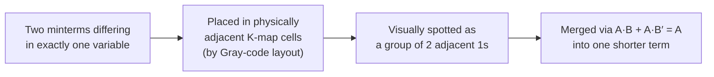

## Learning Objectives

- Explain why minimizing a boolean expression before building it in gates reduces cost, delay, and power, connecting this back to gate count and critical path from the previous concept.
- Lay out a K-map using Gray-code ordering and explain why that ordering guarantees physically adjacent cells differ in exactly one input variable.
- Apply the grouping rules — rectangular, power-of-two size, as large as possible, wraparound allowed — to read a minimal sum-of-products expression directly off a filled K-map.
- Use don't-care conditions to enlarge groups and obtain an even smaller expression when some input combinations are guaranteed never to occur.
- Connect each K-map grouping to the underlying algebraic law A·B + A·B′ = A, showing that a K-map is a visual shortcut for repeated algebraic merging, not a different technique.

## Context & Motivation

The previous concept established a completely mechanical way to turn any truth table into a working circuit: write one minterm per 1-row, OR them together. That pipeline is guaranteed correct, but it is frequently wasteful — a function with many 1-rows produces a canonical sum-of-products expression with just as many AND terms, each a full-width AND of every input variable, even when large chunks of that expression are logically redundant. Redundant gates are not cosmetic: every extra gate is extra silicon area, extra power draw, and — if it lies on the critical path — extra propagation delay. A chip designer who ships the naive canonical circuit for every function pays these costs needlessly, which is why minimization is a mandatory step in real hardware design, not optional polish.

The algebraic laws already supply the tool that makes minimization possible: the identity A·B + A·B′ = A says that two minterms differing in only one variable can be merged into a single, shorter term that drops that variable entirely. Applying this law directly to a large canonical SOP expression is a bookkeeping problem — for a function of five or six variables, spotting every mergeable pair by eye, algebraically, is slow and error-prone. The **Karnaugh map** (K-map), introduced by Maurice Karnaugh in 1953, solves exactly this problem: a grid arranged so every pair of physically neighboring cells corresponds to one legal application of the merging law, turning algebraic search into visual pattern-spotting.

This concept builds directly on "Building Circuits from Gates": it operates on the same canonical SOP expressions produced by that concept's pipeline and produces a smaller SOP expression, translated into gates by the same AND-OR netlist procedure — fewer, shorter AND gates feeding one OR gate. Only the expression being implemented gets smaller. The next concepts (multiplexers, decoders, adders) all benefit from minimized designs, and MIT 6.004's K-map materials work through this exact merging process on realistic multi-variable examples.

## Core Theory

### Why minimization matters

Every AND term dropped from an SOP expression is one fewer gate to fabricate, power, and route wires to. Every variable dropped from a surviving term is one fewer input on that gate, which (recall fan-in limits from the previous concept) can be the difference between needing a single physical gate versus an internal tree of smaller gates to reach the required fan-in. Minimization is a strict win whenever it is achievable — it never makes a circuit worse, and the savings compound on functions with many variables.

### K-map layout and Gray-code adjacency

A K-map for n variables is a grid of `2^n` cells, one per input combination, arranged so that the rows and columns are labeled not in ordinary binary counting order but in **Gray code** — a sequence of binary strings in which every consecutive pair (including wrapping from the last entry back to the first) differs in exactly one bit. For two variables, the Gray-code sequence is `00, 01, 11, 10` (note: not `00, 01, 10, 11` — ordinary counting order changes two bits going from 01 to 10, which would break the adjacency property).

| | Gray-code sequence for 2 bits | Ordinary binary count |
|---|---|---|
| Step 1 | 00 | 00 |
| Step 2 | 01 | 01 |
| Step 3 | 11 | 10 |
| Step 4 | 10 | 11 |

Because Gray code guarantees each step changes exactly one bit, laying a K-map's rows and columns out in Gray-code order guarantees that any two physically adjacent cells — direct left/right or up/down neighbors, including wraparound from the rightmost column back to the leftmost, and from the bottom row back to the top — correspond to input combinations differing in exactly one variable. That is exactly the precondition needed to apply A·B + A·B′ = A: two adjacent cells that are both 1 can always be merged, because they differ in only the one variable the merge eliminates.

### Grouping rules

Once a K-map's cells are filled in with the function's output values (1s, 0s, and possibly don't-cares), minimal groups of 1-cells are identified according to strict rules:

1. **Every group must be rectangular** (including wraparound rectangles across an edge), never an irregular shape.
2. **Every group's size must be a power of two**: 1, 2, 4, 8, ... cells — never 3, 5, 6, etc.
3. **Every group must be as large as possible.** A group of 2 that could have been extended to a group of 4 (all four cells being 1 or don't-care) must be extended; larger groups eliminate more variables.
4. **Groups may wrap around the edges of the map**, because Gray-code adjacency holds at the wraparound boundary exactly as it does everywhere else in the grid — the map is topologically a torus, not a flat rectangle.
5. **Every 1-cell must be covered by at least one group**, and the chosen set of groups, taken together, should be as small in number as possible (avoiding redundant groups that add no new 1-cells not already covered).

A group of `2^k` cells eliminates exactly k variables from the term it produces: the variables that take *both* values 0 and 1 somewhere within the group are dropped, and only the variables that stay constant across every cell in the group appear in the resulting product term (uncomplemented if constantly 1, complemented if constantly 0).

### Reading the minimal SOP off the groups

Once all groups are chosen, each group contributes exactly one product term to the minimal SOP expression: take every variable that is constant across the group's cells, write it uncomplemented if the constant value is 1 or complemented if 0, and AND these together (variables that vary within the group are simply omitted). ORing together one term per group gives the minimized SOP expression — implementable by the same AND-OR netlist procedure as before, but now with fewer and shorter AND terms.

### Don't-care conditions

Some functions have input combinations guaranteed, by the problem's own context, never to occur — for instance, a 4-bit code known to only ever take values 0–9 (as in binary-coded decimal) has six input combinations (10–15) that never actually appear. These are marked in the K-map as **don't-cares** (commonly written `X` or `d`), and — critically — a don't-care may be treated as *either* 0 or 1, whichever helps form a larger group, without changing correctness on any input that can actually occur. Don't-cares are never required to be covered; they are used opportunistically, only when including one lets a group of real 1s grow larger.

### K-maps as a visual form of algebraic simplification

Every merge performed by grouping adjacent K-map cells is a direct visual application of A·B + A·B′ = A (A being the part of the term that stays constant, B the one variable that differs and gets eliminated). A group of 4 is simply two adjacent groups of 2 merged again — two applications of the same law, one eliminating each of two variables. The K-map contributes nothing algebraically new; its value is that Gray-code adjacency turns an algebraic hunting exercise into direct visual pattern recognition, which scales far better to functions of four, five, or six variables.

## Worked Examples

### Example 1: Minimizing a 3-variable function

Minimize `F(A,B,C)` given by the truth table with 1s at minterms A′BC, AB′C, ABC′, ABC (this is the majority function from the previous concept's Example 1).

**K-map layout** (rows = A, columns = BC in Gray-code order 00, 01, 11, 10):

| A \ BC | 00 | 01 | 11 | 10 |
|---|---|---|---|---|
| 0 | 0 | 0 | 1 | 0 |
| 1 | 0 | 1 | 1 | 1 |

**Grouping:** The four 1-cells are at (A=0,BC=11), (A=1,BC=01), (A=1,BC=11), (A=1,BC=10).

- Group 1: (A=1,BC=01) and (A=1,BC=11) are adjacent (differ only in B). This pair has A=1 constant, C=1 constant, B varies → term `A·C`.
- Group 2: (A=1,BC=11) and (A=1,BC=10) are adjacent (differ only in C). This pair has A=1 constant, B=1 constant, C varies → term `A·B`.
- Group 3: (A=0,BC=11) and (A=1,BC=11) are adjacent (differ only in A). This pair has B=1 constant, C=1 constant, A varies → term `B·C`.

All four 1-cells are covered (the cell A=1,BC=11 is covered by all three groups, which is fine — overlap is allowed). No group of 4 exists here (the four 1s are not arranged in a single valid rectangle), so these three groups of 2 are the minimal covering.

**Result:** `F = A·C + A·B + B·C`, matching the well-known minimized majority expression, down from the canonical SOP's four 3-input AND terms plus a 4-input OR to three 2-input AND terms plus a 3-input OR — fewer gates and shallower per-term fan-in.

**Verification** against row A=1,B=0,C=1 (should be 1, from AB′C): `A·C = 1·1 = 1`, so `F = 1`. Correct. Against row A=0,B=1,C=0 (should be 0): `A·C=0`, `A·B=0`, `B·C=0`, so `F=0`. Correct.

### Example 2: A 4-variable function with a wraparound group

Minimize `F(A,B,C,D)` which is 1 for minterms where D=0 and (A,B,C) is any of: 0000, 0100, 1000, 1100 — i.e., F=1 whenever B=0 and D=0, regardless of A and C.

**K-map** (rows = AB in Gray order 00,01,11,10; columns = CD in Gray order 00,01,11,10):

| AB \ CD | 00 | 01 | 11 | 10 |
|---|---|---|---|---|
| 00 | 1 | 0 | 0 | 1 |
| 01 | 0 | 0 | 0 | 0 |
| 11 | 0 | 0 | 0 | 0 |
| 10 | 1 | 0 | 0 | 1 |

**Grouping:** The four 1-cells are at the four corners of the map: (AB=00,CD=00), (AB=00,CD=10), (AB=10,CD=00), (AB=10,CD=10). Because a K-map's edges wrap (top row is adjacent to bottom row, leftmost column is adjacent to rightmost column), these four corner cells are all mutually adjacent and form one valid rectangular group of 4, wrapping both horizontally and vertically.

Across all four cells: A varies (AB=00 has A=0, AB=10 has A=1); B is constant at 0 in both AB=00 and AB=10; C varies (CD=00 has C=0, CD=10 has C=1); D is constant at 0 in both CD=00 and CD=10. So the only two variables constant across the whole group are B (always 0) and D (always 0).

**Result:** `F = B′·D′` — a single 2-literal AND term, down from what would otherwise require four separate 4-literal minterms in the canonical SOP.

**Verification** against AB=11 (A=1,B=1), CD=01 (C=0,D=1), i.e. row (1,1,0,1), expected 0 since B≠0: `B′·D′ = 0·0 = 0`. Correct. Against AB=10 (A=1,B=0), CD=10 (C=1,D=0): `B′·D′ = 1·1 = 1`, and indeed this cell was marked 1. Correct.

### Example 3: Using don't-cares to shrink a result further

A circuit takes a 4-bit input (W,X,Y,Z) guaranteed, by the surrounding system, to never take the six bit patterns for decimal 10–15 (WXYZ = 1010 through 1111) — a typical binary-coded-decimal constraint. `F` must output 1 for decimal 8 and 9 (WXYZ = 1000, 1001) and 0 for decimal 0–7; decimal 10–15 are don't-cares.

**K-map** (rows = WX in Gray order; columns = YZ in Gray order), with `X` marking don't-cares:

| WX \ YZ | 00 | 01 | 11 | 10 |
|---|---|---|---|---|
| 00 | 0 | 0 | 0 | 0 |
| 01 | 0 | 0 | 0 | 0 |
| 11 | X | X | X | X |
| 10 | 1 | 1 | X | X |

**Grouping without don't-cares** would only allow grouping the two real 1s at (WX=10,YZ=00) and (WX=10,YZ=01), a group of 2 giving term `W·X′·Y′` (W=1, X=0, Y=0 constant; Z varies).

**Grouping with don't-cares:** treat the don't-cares at (WX=10,YZ=11) and (WX=10,YZ=10) as 1s, so all four cells of row WX=10 form a group of 4. Across these four, W=1 and X=0 stay constant while Y and Z both vary, giving term `W·X′`.

Going further, fold in the entire WX=11 row's don't-cares too: rows WX=10 (W=1,X=0) and WX=11 (W=1,X=1) together form an 8-cell group spanning all of Y and Z. W=1 is constant across both rows; X, Y, and Z all vary. The only constant is `W`. This is legal — don't-cares may be treated as 1 freely — and correct on every input that can actually occur.

**Result:** `F = W`, a single-literal expression requiring zero gates — every input where W=1 either genuinely requires F=1 (decimal 8, 9) or can never occur (decimal 10–15).

**Verification:** decimal 5 (WXYZ=0101, W=0): `F=0`, correct. Decimal 9 (WXYZ=1001, W=1): `F=1`, correct. Decimal 13 (WXYZ=1101, a don't-care): `F=1`, acceptable since this input never occurs.

## Common Misconceptions & Pitfalls

- **"A K-map's rows and columns should be labeled in ordinary binary counting order."** Ordinary counting order (00, 01, 10, 11) changes two bits between 01 and 10, breaking the single-bit-adjacency property the technique depends on. K-maps use Gray-code order (00, 01, 11, 10) so every adjacent pair — including wraparound pairs — differs in exactly one variable.
- **"Groups can be any shape or size, as long as they cover only 1s."** Groups must be rectangular (wraparound allowed) and a power-of-two size; a group of 3, or an L-shaped group of 4, is not legal even if every cell in it is 1, because such shapes don't correspond to one clean application of the merging law across every included variable.
- **"Bigger groups are only a minor optimization."** A group of 2 that could have been extended to 4 wastes an eliminable variable, producing an unnecessarily long product term (one extra literal, larger gate fan-in) compared to the truly minimal grouping.
- **"Don't-cares must always be included in a group if possible."** A don't-care should only be folded in when doing so actually enlarges the group; one that doesn't help form a larger rectangle should be left out (treated as 0) and never forces extra groups of its own.
- **"K-maps and algebraic simplification are unrelated techniques."** A K-map performs exactly the same simplification as repeatedly applying A·B + A·B′ = A algebraically; it changes nothing about which simplifications are legal, only how easy they are to find, by encoding "differs in one variable" as "physically adjacent."
- **"Edge cells of a K-map have no neighbors on the far side."** The grid wraps: the rightmost column is adjacent to the leftmost, and the top row to the bottom row, because Gray-code adjacency holds across those boundaries exactly as elsewhere — missing wraparound groups is a common source of a non-minimal result.

## Summary

Karnaugh maps solve a bookkeeping problem left by the previous concept's canonical-SOP pipeline: that pipeline is always correct but often wastefully large, and hand-applying A·B + A·B′ = A term-by-term does not scale past a handful of variables. A K-map arranges all `2^n` input rows in a grid whose rows and columns follow Gray-code order so that any two physically adjacent cells — including wraparound pairs across the grid's edges — differ in exactly one variable, turning "find two minterms that merge" into "spot two adjacent filled cells." Grouping rules (rectangular, power-of-two size, as large as possible, wraparound permitted) guarantee that reading one product term per group, keeping only the variables constant across it, produces a provably minimal sum-of-products expression; don't-cares — input combinations guaranteed never to occur — may be folded into a group opportunistically to shrink the result further, exactly as Example 3 collapsed a BCD-style function down to a single literal. This minimized expression feeds into the same AND-OR gate-building procedure from the previous concept, now yielding fewer gates, shallower fan-in per term, and often a shorter critical-path delay. The next concept, multiplexers and decoders, builds two of the most heavily reused combinational blocks in this course on the same design-then-minimize discipline.

## Documentation Links

- [MIT 6.004 — Karnaugh Maps Worked Example](https://ocw.mit.edu/courses/6-004-computation-structures-spring-2017/resources/karnaugh-maps/) — worked K-map examples demonstrating Gray-code layout and grouping on multi-variable boolean functions.
- [Harris & Harris — Digital Design and Computer Architecture, RISC-V Edition](https://shop.elsevier.com/books/digital-design-and-computer-architecture-risc-v-edition/harris/978-0-12-820064-3) — textbook chapter on combinational logic design covering Karnaugh map minimization and don't-care conditions in depth.
