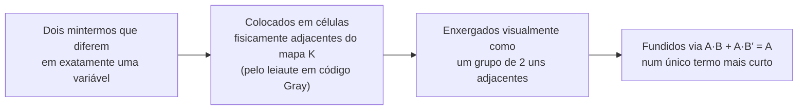

## Objetivos de Aprendizagem

- Explicar por que minimizar uma expressão booleana antes de construí-la em portas reduz custo, atraso e consumo de energia, ligando isso de volta ao número de portas e ao caminho crítico do conceito anterior.
- Montar um mapa K usando a ordem do código Gray e explicar por que essa ordem garante que células fisicamente adjacentes diferem em exatamente uma variável de entrada.
- Aplicar as regras de agrupamento (retangular, tamanho potência de dois, o maior possível, com volta pelas bordas permitida) para ler uma expressão soma de produtos mínima diretamente de um mapa K preenchido.
- Usar condições don't-care para aumentar grupos e obter uma expressão ainda menor quando é garantido que algumas combinações de entrada nunca ocorrem.
- Ligar cada agrupamento do mapa K à lei algébrica subjacente A·B + A·B′ = A, mostrando que um mapa K é um atalho visual para fusões algébricas repetidas, e não uma técnica diferente.

## Contexto e Motivação

O conceito anterior estabeleceu uma forma completamente mecânica de transformar qualquer tabela verdade num circuito que funciona: escreva um mintermo por linha 1 e faça o OR deles. Esse fluxo é garantidamente correto, mas frequentemente esbanjador: uma função com muitas linhas 1 produz uma expressão canônica soma de produtos com o mesmo número de termos AND, cada um um AND completo de todas as variáveis de entrada, mesmo quando grandes pedaços dessa expressão são logicamente redundantes. Portas redundantes não são cosméticas: cada porta extra é área de silício extra, consumo de energia extra e, se estiver no caminho crítico, atraso de propagação extra. Um projetista de chips que entrega o circuito canônico ingênuo para toda função paga esses custos sem necessidade, e é por isso que a minimização é um passo obrigatório no projeto de hardware real, e não um polimento opcional.

As leis algébricas já fornecem a ferramenta que torna a minimização possível: a identidade A·B + A·B′ = A diz que dois mintermos que diferem em só uma variável podem ser fundidos num único termo mais curto, que elimina essa variável por completo. Aplicar essa lei diretamente a uma expressão SOP canônica grande é um problema de contabilidade: para uma função de cinco ou seis variáveis, enxergar a olho, algebricamente, todo par fundível é lento e propenso a erros. O **mapa de Karnaugh** (mapa K), apresentado por Maurice Karnaugh em 1953, resolve exatamente esse problema: uma grade arranjada de modo que todo par de células fisicamente vizinhas corresponde a uma aplicação legítima da lei de fusão, transformando a busca algébrica em reconhecimento visual de padrões.

Este conceito se constrói diretamente sobre "Construindo Circuitos a Partir de Portas": ele opera sobre as mesmas expressões SOP canônicas produzidas pelo fluxo daquele conceito e produz uma expressão SOP menor, traduzida em portas pelo mesmo procedimento de netlist AND-OR (portas AND menos numerosas e mais curtas alimentando uma porta OR). Só a expressão implementada fica menor. Os próximos conceitos (multiplexadores, decodificadores, somadores) se beneficiam todos de projetos minimizados, e o material de mapas K do MIT 6.004 trabalha exatamente esse processo de fusão em exemplos realistas de várias variáveis.

## Teoria Central

### Por que a minimização importa

Cada termo AND eliminado de uma expressão SOP é uma porta a menos para fabricar, alimentar e ligar com fios. Cada variável eliminada de um termo que sobrevive é uma entrada a menos naquela porta, o que (lembre os limites de fan-in do conceito anterior) pode ser a diferença entre precisar de uma única porta física ou de uma árvore interna de portas menores para chegar ao fan-in necessário. A minimização é um ganho estrito sempre que é possível: ela nunca piora um circuito, e a economia se acumula em funções com muitas variáveis.

### Leiaute do mapa K e adjacência pelo código Gray

Um mapa K de n variáveis é uma grade de `2^n` células, uma por combinação de entrada, arranjada de modo que as linhas e colunas sejam rotuladas não na ordem binária comum de contagem, mas em **código Gray**: uma sequência de cadeias binárias em que todo par consecutivo (incluindo a volta da última entrada para a primeira) difere em exatamente um bit. Para duas variáveis, a sequência em código Gray é `00, 01, 11, 10` (repare: não é `00, 01, 10, 11`; a ordem comum de contagem muda dois bits de 01 para 10, o que quebraria a propriedade de adjacência).

| | Sequência em código Gray para 2 bits | Contagem binária comum |
|---|---|---|
| Passo 1 | 00 | 00 |
| Passo 2 | 01 | 01 |
| Passo 3 | 11 | 10 |
| Passo 4 | 10 | 11 |

Como o código Gray garante que cada passo muda exatamente um bit, dispor as linhas e colunas de um mapa K na ordem do código Gray garante que quaisquer duas células fisicamente adjacentes (vizinhas diretas à esquerda/direita ou acima/abaixo, incluindo a volta da coluna mais à direita para a mais à esquerda, e da linha de baixo para a de cima) correspondem a combinações de entrada que diferem em exatamente uma variável. Essa é exatamente a pré-condição necessária para aplicar A·B + A·B′ = A: duas células adjacentes que valem ambas 1 sempre podem ser fundidas, porque diferem só na variável que a fusão elimina.

### Regras de agrupamento

Depois que as células de um mapa K são preenchidas com os valores de saída da função (1s, 0s e possivelmente don't-cares), grupos mínimos de células 1 são identificados segundo regras estritas:

1. **Todo grupo precisa ser retangular** (incluindo retângulos que dão a volta por uma borda), nunca uma forma irregular.
2. **O tamanho de todo grupo precisa ser uma potência de dois**: 1, 2, 4, 8, ... células, nunca 3, 5, 6 etc.
3. **Todo grupo precisa ser o maior possível.** Um grupo de 2 que poderia ser estendido para um grupo de 4 (com as quatro células valendo 1 ou don't-care) precisa ser estendido; grupos maiores eliminam mais variáveis.
4. **Os grupos podem dar a volta pelas bordas do mapa**, porque a adjacência do código Gray vale na fronteira da volta exatamente como em todo o resto da grade: o mapa é topologicamente um toro, não um retângulo plano.
5. **Toda célula 1 precisa ser coberta por pelo menos um grupo**, e o conjunto de grupos escolhido, tomado em conjunto, deve ter o menor número possível de grupos (evitando grupos redundantes que não acrescentam nenhuma célula 1 ainda não coberta).

Um grupo de `2^k` células elimina exatamente k variáveis do termo que produz: as variáveis que assumem *ambos* os valores 0 e 1 em algum lugar do grupo são eliminadas, e só as variáveis que ficam constantes em todas as células do grupo aparecem no termo produto resultante (sem complemento se constantemente 1, complementadas se constantemente 0).

### Lendo a SOP mínima a partir dos grupos

Depois que todos os grupos são escolhidos, cada grupo contribui com exatamente um termo produto para a expressão SOP mínima: pegue toda variável constante nas células do grupo, escreva-a sem complemento se o valor constante for 1 ou complementada se for 0, e faça o AND delas (as variáveis que variam dentro do grupo são simplesmente omitidas). Fazer o OR de um termo por grupo dá a expressão SOP minimizada, implementável pelo mesmo procedimento de netlist AND-OR de antes, mas agora com termos AND menos numerosos e mais curtos.

### Condições don't-care

Algumas funções têm combinações de entrada que, pelo próprio contexto do problema, é garantido que nunca ocorrem: por exemplo, um código de 4 bits que se sabe que só assume os valores de 0 a 9 (como no decimal codificado em binário) tem seis combinações de entrada (de 10 a 15) que nunca aparecem de fato. Elas são marcadas no mapa K como **don't-cares** (normalmente escritas `X` ou `d`), e, crucialmente, um don't-care pode ser tratado *tanto* como 0 quanto como 1, o que ajudar a formar um grupo maior, sem mudar a correção em nenhuma entrada que possa de fato ocorrer. Os don't-cares nunca precisam ser cobertos; eles são usados de forma oportunista, só quando incluir um deles deixa um grupo de 1s reais crescer.

### Mapas K como forma visual de simplificação algébrica

Toda fusão feita ao agrupar células adjacentes de um mapa K é uma aplicação visual direta de A·B + A·B′ = A (sendo A a parte do termo que fica constante e B a única variável que difere e é eliminada). Um grupo de 4 é simplesmente dois grupos adjacentes de 2 fundidos de novo: duas aplicações da mesma lei, cada uma eliminando uma de duas variáveis. O mapa K não contribui com nada algebricamente novo; seu valor é que a adjacência do código Gray transforma um exercício de caça algébrica em reconhecimento visual direto de padrões, o que escala muito melhor para funções de quatro, cinco ou seis variáveis.

## Exemplos Resolvidos

### Exemplo 1: minimizando uma função de 3 variáveis

Minimize `F(A,B,C)` dada pela tabela verdade com 1s nos mintermos A′BC, AB′C, ABC′, ABC (é a função maioria do Exemplo 1 do conceito anterior).

**Leiaute do mapa K** (linhas = A, colunas = BC na ordem do código Gray 00, 01, 11, 10):

| A \ BC | 00 | 01 | 11 | 10 |
|---|---|---|---|---|
| 0 | 0 | 0 | 1 | 0 |
| 1 | 0 | 1 | 1 | 1 |

**Agrupamento:** as quatro células 1 estão em (A=0,BC=11), (A=1,BC=01), (A=1,BC=11), (A=1,BC=10).

- Grupo 1: (A=1,BC=01) e (A=1,BC=11) são adjacentes (diferem só em B). Esse par tem A=1 constante, C=1 constante, B varia → termo `A·C`.
- Grupo 2: (A=1,BC=11) e (A=1,BC=10) são adjacentes (diferem só em C). Esse par tem A=1 constante, B=1 constante, C varia → termo `A·B`.
- Grupo 3: (A=0,BC=11) e (A=1,BC=11) são adjacentes (diferem só em A). Esse par tem B=1 constante, C=1 constante, A varia → termo `B·C`.

As quatro células 1 estão cobertas (a célula A=1,BC=11 é coberta pelos três grupos, o que não tem problema: sobreposição é permitida). Não existe aqui um grupo de 4 (os quatro 1s não estão dispostos num único retângulo válido), então esses três grupos de 2 são a cobertura mínima.

**Resultado:** `F = A·C + A·B + B·C`, batendo com a conhecida expressão minimizada da maioria, reduzida dos quatro termos AND de 3 entradas mais um OR de 4 entradas da SOP canônica para três termos AND de 2 entradas mais um OR de 3 entradas: menos portas e fan-in por termo mais raso.

**Verificação** com a linha A=1,B=0,C=1 (deve valer 1, por AB′C): `A·C = 1·1 = 1`, então `F = 1`. Correto. Com a linha A=0,B=1,C=0 (deve valer 0): `A·C=0`, `A·B=0`, `B·C=0`, então `F=0`. Correto.

### Exemplo 2: uma função de 4 variáveis com um grupo que dá a volta

Minimize `F(A,B,C,D)`, que vale 1 nos mintermos em que D=0 e (A,B,C) é qualquer um de: 0000, 0100, 1000, 1100; ou seja, F=1 sempre que B=0 e D=0, sejam quais forem A e C.

**Mapa K** (linhas = AB na ordem Gray 00,01,11,10; colunas = CD na ordem Gray 00,01,11,10):

| AB \ CD | 00 | 01 | 11 | 10 |
|---|---|---|---|---|
| 00 | 1 | 0 | 0 | 1 |
| 01 | 0 | 0 | 0 | 0 |
| 11 | 0 | 0 | 0 | 0 |
| 10 | 1 | 0 | 0 | 1 |

**Agrupamento:** as quatro células 1 estão nos quatro cantos do mapa: (AB=00,CD=00), (AB=00,CD=10), (AB=10,CD=00), (AB=10,CD=10). Como as bordas de um mapa K dão a volta (a linha de cima é adjacente à de baixo, a coluna mais à esquerda é adjacente à mais à direita), essas quatro células de canto são todas mutuamente adjacentes e formam um único grupo retangular válido de 4, dando a volta na horizontal e na vertical.

Nas quatro células: A varia (AB=00 tem A=0, AB=10 tem A=1); B é constante em 0 tanto em AB=00 quanto em AB=10; C varia (CD=00 tem C=0, CD=10 tem C=1); D é constante em 0 tanto em CD=00 quanto em CD=10. Então as duas únicas variáveis constantes no grupo inteiro são B (sempre 0) e D (sempre 0).

**Resultado:** `F = B′·D′`, um único termo AND de 2 literais, contra o que de outra forma exigiria quatro mintermos separados de 4 literais na SOP canônica.

**Verificação** com AB=11 (A=1,B=1), CD=01 (C=0,D=1), ou seja, a linha (1,1,0,1), esperado 0 já que B≠0: `B′·D′ = 0·0 = 0`. Correto. Com AB=10 (A=1,B=0), CD=10 (C=1,D=0): `B′·D′ = 1·1 = 1`, e de fato essa célula estava marcada com 1. Correto.

### Exemplo 3: usando don't-cares para encolher ainda mais um resultado

Um circuito recebe uma entrada de 4 bits (W,X,Y,Z) que, pelo sistema em volta, é garantido que nunca assume os seis padrões de bits dos decimais 10 a 15 (WXYZ = 1010 a 1111), uma restrição típica de decimal codificado em binário. `F` precisa dar saída 1 para os decimais 8 e 9 (WXYZ = 1000, 1001) e 0 para os decimais 0 a 7; os decimais 10 a 15 são don't-cares.

**Mapa K** (linhas = WX na ordem Gray; colunas = YZ na ordem Gray), com `X` marcando os don't-cares:

| WX \ YZ | 00 | 01 | 11 | 10 |
|---|---|---|---|---|
| 00 | 0 | 0 | 0 | 0 |
| 01 | 0 | 0 | 0 | 0 |
| 11 | X | X | X | X |
| 10 | 1 | 1 | X | X |

**Agrupar sem don't-cares** só permitiria agrupar os dois 1s reais em (WX=10,YZ=00) e (WX=10,YZ=01), um grupo de 2 dando o termo `W·X′·Y′` (W=1, X=0, Y=0 constantes; Z varia).

**Agrupando com don't-cares:** trate os don't-cares em (WX=10,YZ=11) e (WX=10,YZ=10) como 1s, de modo que as quatro células da linha WX=10 formem um grupo de 4. Nessas quatro, W=1 e X=0 ficam constantes enquanto Y e Z variam, dando o termo `W·X′`.

Indo além, incorpore também os don't-cares da linha WX=11 inteira: as linhas WX=10 (W=1,X=0) e WX=11 (W=1,X=1) juntas formam um grupo de 8 células cobrindo todos os Y e Z. W=1 é constante nas duas linhas; X, Y e Z variam. A única constante é `W`. Isso é legítimo (don't-cares podem ser tratados livremente como 1) e correto em toda entrada que pode de fato ocorrer.

**Resultado:** `F = W`, uma expressão de um único literal que exige zero portas: toda entrada em que W=1 ou exige genuinamente F=1 (decimais 8, 9) ou nunca pode ocorrer (decimais 10 a 15).

**Verificação:** decimal 5 (WXYZ=0101, W=0): `F=0`, correto. Decimal 9 (WXYZ=1001, W=1): `F=1`, correto. Decimal 13 (WXYZ=1101, um don't-care): `F=1`, aceitável, já que essa entrada nunca ocorre.

## Equívocos Comuns e Armadilhas

- **"As linhas e colunas de um mapa K devem ser rotuladas na ordem binária comum de contagem."** A ordem comum de contagem (00, 01, 10, 11) muda dois bits entre 01 e 10, quebrando a propriedade de adjacência de um único bit da qual a técnica depende. Os mapas K usam a ordem do código Gray (00, 01, 11, 10), para que todo par adjacente (incluindo os pares da volta) difira em exatamente uma variável.
- **"Os grupos podem ter qualquer forma ou tamanho, desde que cubram só 1s."** Os grupos precisam ser retangulares (com volta permitida) e ter tamanho potência de dois; um grupo de 3, ou um grupo de 4 em forma de L, não é legítimo mesmo que todas as suas células valham 1, porque essas formas não correspondem a uma aplicação limpa da lei de fusão em todas as variáveis incluídas.
- **"Grupos maiores são só uma otimização menor."** Um grupo de 2 que poderia ser estendido para 4 desperdiça uma variável eliminável, produzindo um termo produto desnecessariamente longo (um literal a mais, fan-in maior da porta) em comparação com o agrupamento realmente mínimo.
- **"Os don't-cares sempre devem ser incluídos num grupo, se possível."** Um don't-care só deve ser incorporado quando isso de fato aumenta o grupo; um que não ajuda a formar um retângulo maior deve ficar de fora (tratado como 0) e nunca obriga a criar grupos extras próprios.
- **"Mapas K e simplificação algébrica são técnicas sem relação."** Um mapa K faz exatamente a mesma simplificação que aplicar repetidamente A·B + A·B′ = A algebricamente; ele não muda nada sobre quais simplificações são legítimas, só a facilidade de encontrá-las, ao codificar "difere em uma variável" como "fisicamente adjacente".
- **"As células da borda de um mapa K não têm vizinhos do outro lado."** A grade dá a volta: a coluna mais à direita é adjacente à mais à esquerda, e a linha de cima à de baixo, porque a adjacência do código Gray vale nessas fronteiras exatamente como em todo o resto; esquecer grupos que dão a volta é uma fonte comum de resultado não mínimo.

## Resumo

Os mapas de Karnaugh resolvem um problema de contabilidade deixado pelo fluxo de SOP canônica do conceito anterior: esse fluxo é sempre correto, mas muitas vezes desnecessariamente grande, e aplicar à mão A·B + A·B′ = A termo a termo não escala além de um punhado de variáveis. Um mapa K arranja todas as `2^n` linhas de entrada numa grade cujas linhas e colunas seguem a ordem do código Gray, para que quaisquer duas células fisicamente adjacentes (incluindo os pares que dão a volta pelas bordas da grade) difiram em exatamente uma variável, transformando "achar dois mintermos que se fundem" em "enxergar duas células preenchidas adjacentes". As regras de agrupamento (retangular, tamanho potência de dois, o maior possível, volta permitida) garantem que ler um termo produto por grupo, mantendo só as variáveis constantes nele, produz uma expressão soma de produtos comprovadamente mínima; os don't-cares (combinações de entrada que é garantido que nunca ocorrem) podem ser incorporados a um grupo de forma oportunista para encolher ainda mais o resultado, exatamente como o Exemplo 3 reduziu uma função no estilo BCD a um único literal. Essa expressão minimizada alimenta o mesmo procedimento de construção com portas AND-OR do conceito anterior, agora gerando menos portas, fan-in mais raso por termo e, muitas vezes, um atraso de caminho crítico menor. O próximo conceito, multiplexadores e decodificadores, constrói dois dos blocos combinacionais mais reutilizados deste curso com a mesma disciplina de projetar e depois minimizar.

## Documentation Links

- [MIT 6.004: Karnaugh Maps Worked Example](https://ocw.mit.edu/courses/6-004-computation-structures-spring-2017/resources/karnaugh-maps/): exemplos resolvidos de mapas K demonstrando o leiaute em código Gray e o agrupamento em funções booleanas de várias variáveis.
- [Harris & Harris: Digital Design and Computer Architecture, RISC-V Edition](https://shop.elsevier.com/books/digital-design-and-computer-architecture-risc-v-edition/harris/978-0-12-820064-3): capítulo do livro sobre projeto de lógica combinacional que cobre em profundidade a minimização por mapas de Karnaugh e as condições don't-care.
