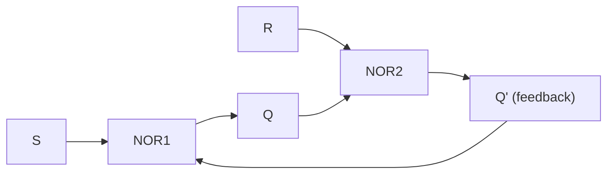
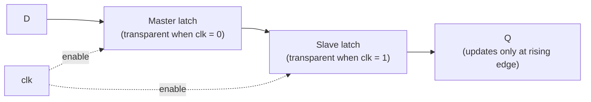

## Learning Objectives

- Explain why every circuit built up through combinational logic and binary adders has no memory, and identify the defining property that separates a sequential circuit (state) from a combinational one (no state).
- Trace the cross-coupled NOR-gate SR latch through set, reset, and hold operation, and identify why the S=1, R=1 combination is forbidden.
- Describe how a gated D latch adds a clock enable to eliminate the SR latch's forbidden state, and explain what "transparent while enabled" means and why it is a liability.
- Explain how an edge-triggered D flip-flop, built as a master–slave pair of latches, samples D only at a clock edge rather than throughout a clock level.
- State the D flip-flop's characteristic table (Q_next = D) and use it to predict the flip-flop's output given a sequence of D values and clock edges.

## Context & Motivation

Every circuit built so far in this discipline — logic gates, Karnaugh-map-minimized Boolean expressions, multiplexers, decoders, and the half, full, and ripple-carry adders — shares one property: its output at any instant is a pure function of its inputs at that same instant. Feed a full adder the same three input bits twice, on Tuesday and again next year, and it produces the identical sum and carry both times. These circuits are called combinational, and no amount of wiring more gates together changes that, because a network of AND, OR, and NOT gates with no feedback path can only ever compute a fixed Boolean function of its present inputs. But a real computer must do something a combinational circuit fundamentally cannot: remember. A running total, a loop counter, the contents of a CPU register, the single bit recording whether an account is currently active — all persist even after the inputs that produced them have changed or disappeared. Combinational logic cannot do this, because it has no notion of "before" and "after"; it only knows "now."

The latch is the smallest possible departure from this rule, and it achieves memory with a strikingly simple trick: feedback. Instead of letting signals flow strictly forward from inputs to outputs, a latch feeds a gate's own output back around into its own input, so the circuit's current output depends on what the output already was — its history, not merely its present inputs. This is a genuine conceptual leap, and it is why "Sequential Circuits" is introduced here as a new topic rather than a variation on combinational design: everything from this point forward (registers, finite state machines, register files, RAM, and ultimately the CPU's own control unit) is built from feedback-holding circuits like the ones introduced here, composed and clocked together at increasing scale.

The path from the plain SR latch to the edge-triggered D flip-flop is also a case study in a recurring engineering pattern: identify a bug (the SR latch's forbidden input combination), patch it with a small addition (a data input and a clock enable, giving the gated D latch), discover the patch has its own hazard (level-sensitive transparency), and resolve that hazard with a structural fix (master–slave edge-triggering). Understanding why each refinement was necessary — not just how the final circuit works — is what makes the next concept, clocking and timing basics, make sense: clock discipline exists to manage the behavior of exactly these bistable, feedback-based circuits at scale.

## Core Theory

### From combinational to sequential: what feedback buys you

A combinational circuit's output is a function only of its current inputs: `output = f(inputs)`. A sequential circuit's output is a function of its current inputs and its current state, where the state is itself held in feedback: `output = f(inputs, state)`, and `state` was itself produced by the circuit's own prior output. The mechanism is deceptively simple — take two gates, and wire the output of each one into an input of the other. That loop is enough to create a circuit with two stable configurations, each of which persists on its own once the inputs stop actively forcing a change. A circuit with this property is called **bistable**, and the cross-coupled SR latch is the canonical example.

### The SR latch: cross-coupled NOR gates

The SR (set-reset) latch can be built from two NOR gates, each one's output feeding back as one input to the other:

| Gate | Inputs | Output |
|---|---|---|
| NOR1 | R, Q′ (feedback from NOR2) | Q |
| NOR2 | S, Q (feedback from NOR1) | Q′ |

Here Q and Q′ are the latch's two outputs, normally complementary. S (set) and R (reset) are the two control inputs.

| S | R | Behavior | Q_next |
|---|---|---|---|
| 0 | 0 | Hold — both gates settle to reproduce the previous state | Q (unchanged) |
| 0 | 1 | Reset | 0 |
| 1 | 0 | Set | 1 |
| 1 | 1 | Forbidden — forces Q = Q′ = 0, breaking the complementary-outputs invariant | undefined |

The hold state (S=0, R=0) is the entire point of the circuit: with no active set or reset command, the feedback loop keeps recirculating whatever value Q currently holds, indefinitely, with no clock and no memory element other than the gates themselves. This is the first time in the discipline that a circuit's output at time t depends on more than its inputs at time t — it depends on Q at time t−1, arbitrarily far back, as long as S and R stay at 0,0.

The S=1, R=1 case is forbidden because it drives both NOR gates' outputs to 0 simultaneously, so Q = Q′ = 0 — but a latch's outputs are supposed to always be complementary (Q′ = ¬Q), and 0 = 0 breaks that invariant. Worse, if S and R both fall to 0 at exactly the same moment afterward, the two NOR gates race to determine which settles to 1 first, and the outcome depends on unpredictable, minute differences in gate delay — the latch's next state becomes genuinely indeterminate.

### The gated D latch: one data input, a clock enable, no forbidden state

The SR latch's forbidden combination is an unforced design flaw — nothing stops a user from driving S=1 and R=1 simultaneously. The gated D latch eliminates the possibility entirely by construction: instead of separate set and reset lines, it takes a single data input D and an enable (clock) input C, with combinational logic ensuring S and R can never both be asserted. Structurally, C gates D and ¬D into the S and R lines of an internal SR latch, so S and R are always complementary whenever C=1, and both forced to 0 (hold) whenever C=0.

| C (enable/clock) | D | Behavior |
|---|---|---|
| 0 | X (don't care) | Hold — output retains its previous value regardless of D |
| 1 | 0 | Q follows D → Q becomes 0 |
| 1 | 1 | Q follows D → Q becomes 1 |

The crucial and, in practice, hazardous property is that while C=1, the latch is **transparent**: Q continuously tracks D in real time, the way a plain wire would, for the entire duration that C stays high, not just at one instant. This is fine in isolated use, but it becomes a serious problem once latches are chained together (as in registers and shift-style circuits later in the discipline): if the same clock enables two cascaded latches at once, a value can "leak" straight through both of them within a single enable pulse, an effect called race-through, defeating the purpose of using discrete storage elements to separate one step of computation from the next.

### The edge-triggered D flip-flop: master–slave construction

The fix for transparency is to make the storage element responsive only at a clock **edge** (the instantaneous transition from 0 to 1, or 1 to 0) rather than throughout an entire clock **level**. The standard way to build this is the master–slave configuration: two gated D latches in series, driven by complementary clock enables.

| Stage | Enabled when clock is | Behavior |
|---|---|---|
| Master latch | Low (clock = 0) | Transparent — tracks D |
| Slave latch | High (clock = 1) | Transparent — tracks the master's held output |

While the clock is low, the master latch is transparent and follows D, but the slave is holding (opaque), so nothing new reaches the flip-flop's output Q. The instant the clock rises, the master latch freezes — capturing whatever value D held at that exact instant — while the slave latch simultaneously becomes transparent and passes that value through to Q. While the clock stays high, the master is frozen, so D can change freely without affecting Q. The net effect is that Q updates only once per clock cycle, exactly at the rising edge, and is insensitive to D at every other instant. (A falling-edge-triggered flip-flop is built the same way with the two enables swapped.)

### The characteristic table

The D flip-flop's behavior, once edge-triggering is in place, collapses to the simplest possible characteristic table of any memory element:

| D | Q_next (at next rising edge) |
|---|---|
| 0 | 0 |
| 1 | 1 |

In words: Q_next = D. All the complexity of the SR latch's four-row table (hold, set, reset, forbidden) and the D latch's level-sensitivity collapses to a single rule, evaluated at one well-defined instant per clock cycle. This simplicity — one bit in, sampled once per cycle, held stable in between — is what makes the D flip-flop the universal building block for registers, counters, and finite state machines in every subsequent concept in this discipline.

## Worked Examples

### Example 1: Tracing an SR latch through a sequence of inputs

Assume the latch starts with Q = 0 (and therefore Q′ = 1), and apply this sequence of (S, R) pairs, one at a time, allowing the latch to settle before the next input is applied:

| Step | S | R | Action | Q after step |
|---|---|---|---|---|
| 1 | 1 | 0 | Set | 1 |
| 2 | 0 | 0 | Hold | 1 (unchanged from step 1) |
| 3 | 0 | 1 | Reset | 0 |
| 4 | 0 | 0 | Hold | 0 (unchanged from step 3) |
| 5 | 1 | 0 | Set | 1 |
| 6 | 1 | 1 | Forbidden | undefined (Q = Q′ = 0, invariant broken) |

Step 2 is the key illustration of memory: with no set or reset command active, the latch does not decay, drift, or reset to a default — it faithfully reproduces the value written in step 1. Step 6 must never be reached in a correctly designed system; it is included only to show that reaching it destroys the complementary-outputs invariant the latch relies on.

### Example 2: Tracing a D latch showing transparency while the clock is high

Assume Q starts at 0, and trace the following timeline of C (clock/enable) and D:

| Time | C | D | Q |
|---|---|---|---|
| t0 | 0 | 1 | 0 (latch is opaque; D is ignored) |
| t1 | 1 | 1 | 1 (transparent; Q follows D) |
| t2 | 1 | 0 | 0 (still transparent; Q immediately follows D's change) |
| t3 | 1 | 1 | 1 (still transparent; Q immediately follows D's change again) |
| t4 | 0 | 0 | 1 (latch just went opaque; Q freezes at its value from t3, ignoring D's new value of 0) |

The essential observation is at t2 and t3: while C stays at 1, Q changes twice in lockstep with D, within a single "clock enable" window — this is the transparency (and race-through risk) that motivates edge-triggering. At t4, the moment C drops to 0, Q freezes at whatever value D held at that instant (1, from t3), and subsequent changes to D have no further effect until C rises again.

### Example 3: Tracing a D flip-flop capturing D only on the rising edge

Assume Q starts at 0, and the following D values are present at successive rising clock edges (with D possibly changing between edges, which the flip-flop ignores):

| Rising edge | D at that instant | Q_next (captured) | D changes afterward, before next edge |
|---|---|---|---|
| Edge 1 | 1 | 1 | D drops to 0 shortly after edge 1 |
| Edge 2 | 0 | 0 | D rises to 1, then falls back to 0, all between edge 2 and edge 3 |
| Edge 3 | 0 | 0 | D rises to 1 and stays there |
| Edge 4 | 1 | 1 | — |

At edge 2, Q captures D = 0, matching the value D held precisely at the edge — the fact that D was 1 at edge 1 is irrelevant, since that value was already consumed. Between edge 2 and edge 3, D's excursion up to 1 and back down to 0 has zero effect on Q, because those transitions occur away from a rising edge — behavior a D latch could not guarantee, since a latch held transparent through that same interval would have chased D's glitch up and back down. Only the value present exactly at each rising edge ever reaches Q, confirming Q_next = D evaluated at, and only at, the clock's rising edge.

## Common Misconceptions & Pitfalls

- **"A latch and a flip-flop are just two names for the same thing."** They are related but distinct: a latch is level-sensitive (transparent for an entire clock level), while a flip-flop is edge-triggered (samples its input only at a clock transition). Substituting a latch where an edge-triggered flip-flop was assumed can introduce race-through.
- **"The S=1, R=1 case just produces Q=0, so it's a valid, if unusual, output."** It momentarily forces Q = Q′ = 0, violating the invariant that the two outputs are always complementary, and if S and R return to 0 simultaneously afterward, the resulting next state is a genuine race with no guaranteed outcome.
- **"A D latch with C=1 needs a stable D to work correctly."** A D latch does not merely tolerate a changing D while C=1 — by design it actively follows every change, which is precisely the transparency property. The problem is not the latch's own correctness but using level-sensitive transparency where discrete, once-per-cycle updates are assumed.
- **"An edge-triggered flip-flop only needs one latch, since it 'only' samples one instant."** A single level-sensitive latch cannot distinguish "the clock just rose" from "the clock is currently high"; that distinction is exactly what the master–slave, two-latch structure with complementary enables provides.
- **"Feedback in a circuit is always a design error to be eliminated."** In every purely combinational circuit built earlier in this discipline, feedback would indeed indicate a mistake. In sequential circuits, feedback is deliberately introduced as the only mechanism by which a digital circuit can hold state at all.

## Summary

Every circuit built through binary adders is combinational — its output is a pure function of its present inputs, with no way to remember anything — but introducing deliberate feedback between gates creates a bistable circuit that can hold one bit of state indefinitely, and the cross-coupled SR latch is the simplest such circuit, with set, reset, and hold behavior but a forbidden S=1, R=1 combination that breaks its complementary-outputs invariant. The gated D latch eliminates that forbidden state by construction using a single data input and a clock enable, but is level-sensitive and transparent for the entire duration the enable is high, which risks race-through when latches are chained. The edge-triggered D flip-flop resolves this with a master–slave pair of latches driven by complementary enables, so that the output updates exactly once per clock cycle, only at the triggering edge, collapsing all prior behavior into the simple characteristic table Q_next = D. This D flip-flop — a single bit, sampled once per cycle, held stable in between — is the atomic memory element that the next concept, clocking and timing basics, builds on directly: it explains the shared clock signal and the timing constraints that let many such flip-flops operate correctly, and in lockstep, across an entire circuit.

## Documentation Links

- [MIT 6.004 — OCW Syllabus](https://ocw.mit.edu/courses/6-004-computation-structures-spring-2017/pages/syllabus/) — course syllabus for Computation Structures, whose sequential-logic units cover the SR latch, gated D latch, and edge-triggered D flip-flop as the foundation for stateful circuit design.
- [Harris & Harris — Digital Design and Computer Architecture, RISC-V Edition](https://shop.elsevier.com/books/digital-design-and-computer-architecture-risc-v-edition/harris/978-0-12-820064-3) — textbook chapter on sequential logic building the SR latch, D latch, and master–slave D flip-flop from first principles with full characteristic tables.
