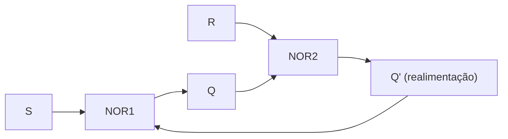
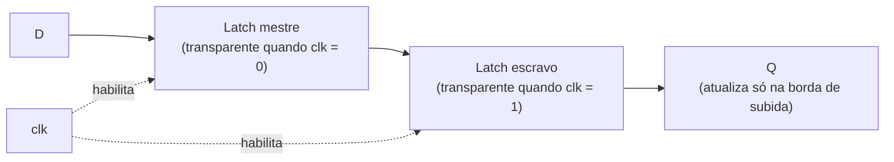

## Objetivos de Aprendizagem

- Explicar por que todo circuito construído com lógica combinacional e somadores binários não tem memória, e identificar a propriedade que define e separa um circuito sequencial (com estado) de um combinacional (sem estado).
- Acompanhar o latch SR de portas NOR com acoplamento cruzado pelas operações de set, reset e manutenção, e identificar por que a combinação S=1, R=1 é proibida.
- Descrever como um latch D controlado acrescenta uma habilitação de clock para eliminar o estado proibido do latch SR, e explicar o que significa "transparente enquanto habilitado" e por que isso é um risco.
- Explicar como um flip-flop D acionado por borda, construído como um par mestre-escravo de latches, amostra D só numa borda de clock, e não durante todo um nível de clock.
- Enunciar a tabela característica do flip-flop D (Q_next = D) e usá-la para prever a saída do flip-flop dada uma sequência de valores de D e bordas de clock.

## Contexto e Motivação

Todo circuito construído até aqui nesta disciplina (portas lógicas, expressões booleanas minimizadas por mapas de Karnaugh, multiplexadores, decodificadores e os meios somadores, somadores completos e somadores ripple-carry) compartilha uma propriedade: sua saída em qualquer instante é uma função pura das suas entradas naquele mesmo instante. Alimente um somador completo com os mesmos três bits de entrada duas vezes, numa terça-feira e de novo no ano que vem, e ele produz a mesma soma e o mesmo carry nas duas vezes. Esses circuitos são chamados de combinacionais, e nenhuma quantidade de portas a mais ligadas muda isso, porque uma rede de portas AND, OR e NOT sem caminho de realimentação só consegue calcular uma função booleana fixa das suas entradas presentes. Mas um computador real precisa fazer algo que um circuito combinacional fundamentalmente não consegue: lembrar. Um total acumulado, um contador de laço, o conteúdo de um registrador da CPU, o único bit que registra se uma conta está ativa no momento: tudo isso persiste mesmo depois que as entradas que o produziram mudaram ou sumiram. A lógica combinacional não consegue fazer isso, porque não tem noção de "antes" e "depois"; ela só conhece o "agora".

O latch é o menor desvio possível dessa regra, e consegue memória com um truque surpreendentemente simples: realimentação. Em vez de deixar os sinais fluírem estritamente para a frente, das entradas para as saídas, um latch leva a saída de uma porta de volta para a sua própria entrada, de modo que a saída atual do circuito dependa do que a saída já era: seu histórico, e não só suas entradas presentes. Esse é um salto conceitual genuíno, e é por isso que "Circuitos Sequenciais" é apresentado aqui como um tópico novo, e não como uma variação do projeto combinacional: tudo daqui em diante (registradores, máquinas de estados finitos, bancos de registradores, RAM e, no fim, a própria unidade de controle da CPU) é construído com circuitos que guardam estado por realimentação, como os apresentados aqui, compostos e sincronizados por clock em escala crescente.

O caminho do latch SR simples até o flip-flop D acionado por borda também é um estudo de caso de um padrão de engenharia recorrente: identificar um bug (a combinação de entrada proibida do latch SR), remendá-lo com um pequeno acréscimo (uma entrada de dados e uma habilitação de clock, dando o latch D controlado), descobrir que o remendo tem seu próprio perigo (a transparência sensível a nível) e resolver esse perigo com uma correção estrutural (o acionamento por borda mestre-escravo). Entender por que cada refinamento foi necessário, e não só como o circuito final funciona, é o que faz o próximo conceito, fundamentos de clock e temporização, fazer sentido: a disciplina de clock existe para gerenciar o comportamento exatamente desses circuitos biestáveis, baseados em realimentação, em grande escala.

## Teoria Central

### Do combinacional ao sequencial: o que a realimentação oferece

A saída de um circuito combinacional é função só das suas entradas atuais: `saida = f(entradas)`. A saída de um circuito sequencial é função das suas entradas atuais e do seu estado atual, em que o estado é ele mesmo mantido por realimentação: `saida = f(entradas, estado)`, e `estado` foi produzido pela própria saída anterior do circuito. O mecanismo é enganosamente simples: pegue duas portas e ligue a saída de cada uma numa entrada da outra. Esse laço basta para criar um circuito com duas configurações estáveis, cada uma das quais persiste sozinha quando as entradas param de forçar ativamente uma mudança. Um circuito com essa propriedade é chamado de **biestável**, e o latch SR com acoplamento cruzado é o exemplo canônico.

### O latch SR: portas NOR com acoplamento cruzado

O latch SR (set-reset) pode ser construído com duas portas NOR, com a saída de cada uma realimentando uma entrada da outra:

| Porta | Entradas | Saída |
|---|---|---|
| NOR1 | R, Q′ (realimentação da NOR2) | Q |
| NOR2 | S, Q (realimentação da NOR1) | Q′ |

Aqui Q e Q′ são as duas saídas do latch, normalmente complementares. S (set) e R (reset) são as duas entradas de controle.

| S | R | Comportamento | Q_next |
|---|---|---|---|
| 0 | 0 | Manter: as duas portas se estabilizam reproduzindo o estado anterior | Q (inalterado) |
| 0 | 1 | Reset | 0 |
| 1 | 0 | Set | 1 |
| 1 | 1 | Proibido: força Q = Q′ = 0, quebrando o invariante de saídas complementares | indefinido |

O estado de manutenção (S=0, R=0) é o propósito inteiro do circuito: sem comando ativo de set ou reset, o laço de realimentação continua recirculando o valor que Q guarda no momento, indefinidamente, sem clock e sem nenhum elemento de memória além das próprias portas. É a primeira vez na disciplina que a saída de um circuito no instante t depende de mais do que suas entradas no instante t: ela depende de Q no instante t−1, arbitrariamente para trás, enquanto S e R ficarem em 0,0.

O caso S=1, R=1 é proibido porque leva as saídas das duas portas NOR a 0 ao mesmo tempo, então Q = Q′ = 0; mas as saídas de um latch deveriam ser sempre complementares (Q′ = ¬Q), e 0 = 0 quebra esse invariante. Pior: se S e R caírem os dois para 0 exatamente no mesmo momento depois disso, as duas portas NOR disputam qual se estabiliza primeiro em 1, e o resultado depende de diferenças minúsculas e imprevisíveis de atraso de porta; o próximo estado do latch fica genuinamente indeterminado.

### O latch D controlado: uma entrada de dados, uma habilitação de clock, nenhum estado proibido

A combinação proibida do latch SR é uma falha de projeto evitável: nada impede um usuário de colocar S=1 e R=1 ao mesmo tempo. O latch D controlado elimina essa possibilidade por construção: em vez de linhas separadas de set e reset, ele recebe uma única entrada de dados D e uma entrada de habilitação (clock) C, com lógica combinacional garantindo que S e R nunca possam ser ativados juntos. Estruturalmente, C controla a passagem de D e ¬D para as linhas S e R de um latch SR interno, então S e R são sempre complementares quando C=1, e ambos forçados a 0 (manter) quando C=0.

| C (habilitação/clock) | D | Comportamento |
|---|---|---|
| 0 | X (don't care) | Manter: a saída conserva seu valor anterior, seja qual for D |
| 1 | 0 | Q segue D → Q vira 0 |
| 1 | 1 | Q segue D → Q vira 1 |

A propriedade crucial e, na prática, perigosa é que, enquanto C=1, o latch é **transparente**: Q acompanha D continuamente, em tempo real, como um fio comum faria, durante todo o tempo em que C ficar alto, e não só num instante. Isso não é problema em uso isolado, mas vira um problema sério quando latches são encadeados (como em registradores e circuitos de deslocamento mais adiante na disciplina): se o mesmo clock habilita dois latches em cascata ao mesmo tempo, um valor pode "vazar" direto pelos dois dentro de um único pulso de habilitação, um efeito chamado race-through, que anula o propósito de usar elementos de armazenamento discretos para separar um passo de cálculo do seguinte.

### O flip-flop D acionado por borda: construção mestre-escravo

A correção para a transparência é fazer o elemento de armazenamento responder só numa **borda** de clock (a transição instantânea de 0 para 1, ou de 1 para 0), e não durante todo um **nível** de clock. A forma padrão de construir isso é a configuração mestre-escravo: dois latches D controlados em série, comandados por habilitações de clock complementares.

| Estágio | Habilitado quando o clock está | Comportamento |
|---|---|---|
| Latch mestre | Baixo (clock = 0) | Transparente: acompanha D |
| Latch escravo | Alto (clock = 1) | Transparente: acompanha a saída mantida pelo mestre |

Enquanto o clock está baixo, o latch mestre é transparente e segue D, mas o escravo está mantendo (opaco), então nada novo chega à saída Q do flip-flop. No instante em que o clock sobe, o latch mestre congela (capturando o valor que D tinha naquele instante exato), enquanto o latch escravo fica transparente ao mesmo tempo e passa esse valor para Q. Enquanto o clock fica alto, o mestre está congelado, então D pode mudar livremente sem afetar Q. O efeito líquido é que Q se atualiza só uma vez por ciclo de clock, exatamente na borda de subida, e é insensível a D em todo outro instante. (Um flip-flop acionado pela borda de descida é construído do mesmo jeito, com as duas habilitações trocadas.)

### A tabela característica

O comportamento do flip-flop D, com o acionamento por borda em vigor, se reduz à tabela característica mais simples possível de qualquer elemento de memória:

| D | Q_next (na próxima borda de subida) |
|---|---|
| 0 | 0 |
| 1 | 1 |

Em palavras: Q_next = D. Toda a complexidade da tabela de quatro linhas do latch SR (manter, set, reset, proibido) e da sensibilidade a nível do latch D se reduz a uma única regra, avaliada num instante bem definido por ciclo de clock. Essa simplicidade (um bit de entrada, amostrado uma vez por ciclo, mantido estável entre amostras) é o que faz do flip-flop D o bloco de construção universal de registradores, contadores e máquinas de estados finitos em todos os conceitos seguintes desta disciplina.

## Exemplos Resolvidos

### Exemplo 1: acompanhando um latch SR por uma sequência de entradas

Suponha que o latch comece com Q = 0 (e, portanto, Q′ = 1), e aplique esta sequência de pares (S, R), um de cada vez, deixando o latch se estabilizar antes de aplicar a próxima entrada:

| Passo | S | R | Ação | Q após o passo |
|---|---|---|---|---|
| 1 | 1 | 0 | Set | 1 |
| 2 | 0 | 0 | Manter | 1 (inalterado desde o passo 1) |
| 3 | 0 | 1 | Reset | 0 |
| 4 | 0 | 0 | Manter | 0 (inalterado desde o passo 3) |
| 5 | 1 | 0 | Set | 1 |
| 6 | 1 | 1 | Proibido | indefinido (Q = Q′ = 0, invariante quebrado) |

O passo 2 é a ilustração-chave da memória: sem comando ativo de set ou reset, o latch não decai, não deriva e não volta a um valor padrão; ele reproduz fielmente o valor escrito no passo 1. O passo 6 nunca deve ser alcançado num sistema projetado corretamente; ele foi incluído só para mostrar que alcançá-lo destrói o invariante de saídas complementares do qual o latch depende.

### Exemplo 2: acompanhando um latch D e mostrando a transparência enquanto o clock está alto

Suponha que Q comece em 0, e acompanhe a seguinte linha do tempo de C (clock/habilitação) e D:

| Instante | C | D | Q |
|---|---|---|---|
| t0 | 0 | 1 | 0 (o latch está opaco; D é ignorado) |
| t1 | 1 | 1 | 1 (transparente; Q segue D) |
| t2 | 1 | 0 | 0 (ainda transparente; Q segue imediatamente a mudança de D) |
| t3 | 1 | 1 | 1 (ainda transparente; Q segue imediatamente a nova mudança de D) |
| t4 | 0 | 0 | 1 (o latch acabou de ficar opaco; Q congela no valor de t3, ignorando o novo valor 0 de D) |

A observação essencial está em t2 e t3: enquanto C fica em 1, Q muda duas vezes junto com D, dentro de uma única janela de "habilitação de clock"; essa é a transparência (e o risco de race-through) que motiva o acionamento por borda. Em t4, no momento em que C cai para 0, Q congela no valor que D tinha naquele instante (1, de t3), e mudanças posteriores de D não têm mais efeito até C subir de novo.

### Exemplo 3: acompanhando um flip-flop D que captura D só na borda de subida

Suponha que Q comece em 0, e que os seguintes valores de D estejam presentes em bordas de subida sucessivas do clock (com D podendo mudar entre as bordas, o que o flip-flop ignora):

| Borda de subida | D naquele instante | Q_next (capturado) | Mudanças de D depois, antes da próxima borda |
|---|---|---|---|
| Borda 1 | 1 | 1 | D cai para 0 logo depois da borda 1 |
| Borda 2 | 0 | 0 | D sobe para 1 e depois volta para 0, tudo entre a borda 2 e a borda 3 |
| Borda 3 | 0 | 0 | D sobe para 1 e fica assim |
| Borda 4 | 1 | 1 | (nenhuma) |

Na borda 2, Q captura D = 0, batendo com o valor que D tinha exatamente na borda; o fato de D valer 1 na borda 1 é irrelevante, já que esse valor já foi consumido. Entre a borda 2 e a borda 3, a excursão de D até 1 e de volta a 0 não tem efeito nenhum sobre Q, porque essas transições acontecem longe de uma borda de subida, um comportamento que um latch D não poderia garantir, já que um latch mantido transparente durante esse mesmo intervalo teria seguido o glitch de D para cima e para baixo. Só o valor presente exatamente em cada borda de subida chega a Q, confirmando que Q_next = D é avaliado na borda de subida do clock, e só nela.

## Equívocos Comuns e Armadilhas

- **"Latch e flip-flop são só dois nomes para a mesma coisa."** São relacionados, mas distintos: um latch é sensível a nível (transparente durante todo um nível de clock), enquanto um flip-flop é acionado por borda (amostra sua entrada só numa transição de clock). Usar um latch onde se supunha um flip-flop acionado por borda pode introduzir race-through.
- **"O caso S=1, R=1 só produz Q=0, então é uma saída válida, ainda que incomum."** Ele força momentaneamente Q = Q′ = 0, violando o invariante de que as duas saídas são sempre complementares, e, se S e R voltarem a 0 ao mesmo tempo depois disso, o próximo estado resultante é uma corrida genuína, sem resultado garantido.
- **"Um latch D com C=1 precisa de um D estável para funcionar corretamente."** Um latch D não apenas tolera um D que muda enquanto C=1: por projeto, ele segue ativamente cada mudança, e essa é precisamente a propriedade de transparência. O problema não é a correção do próprio latch, mas usar transparência sensível a nível onde se supõem atualizações discretas, uma vez por ciclo.
- **"Um flip-flop acionado por borda só precisa de um latch, já que 'só' amostra um instante."** Um único latch sensível a nível não consegue distinguir "o clock acabou de subir" de "o clock está alto agora"; é exatamente essa distinção que a estrutura mestre-escravo de dois latches com habilitações complementares fornece.
- **"Realimentação num circuito é sempre um erro de projeto a eliminar."** Em todo circuito puramente combinacional construído antes nesta disciplina, a realimentação de fato indicaria um erro. Nos circuitos sequenciais, a realimentação é introduzida de propósito como o único mecanismo pelo qual um circuito digital consegue guardar estado.

## Resumo

Todo circuito construído até os somadores binários é combinacional (sua saída é uma função pura das entradas presentes, sem forma de lembrar nada), mas introduzir realimentação deliberada entre portas cria um circuito biestável capaz de guardar um bit de estado indefinidamente, e o latch SR com acoplamento cruzado é o circuito mais simples desse tipo, com comportamento de set, reset e manutenção, mas com uma combinação proibida S=1, R=1 que quebra seu invariante de saídas complementares. O latch D controlado elimina esse estado proibido por construção, usando uma única entrada de dados e uma habilitação de clock, mas é sensível a nível e transparente durante todo o tempo em que a habilitação fica alta, o que arrisca race-through quando latches são encadeados. O flip-flop D acionado por borda resolve isso com um par mestre-escravo de latches comandados por habilitações complementares, de modo que a saída se atualiza exatamente uma vez por ciclo de clock, só na borda de acionamento, reduzindo todo o comportamento anterior à tabela característica simples Q_next = D. Esse flip-flop D (um único bit, amostrado uma vez por ciclo, mantido estável entre amostras) é o elemento de memória atômico sobre o qual o próximo conceito, fundamentos de clock e temporização, se constrói diretamente: ele explica o sinal de clock compartilhado e as restrições de temporização que permitem que muitos desses flip-flops operem corretamente, e em sincronia, por um circuito inteiro.

## Documentation Links

- [MIT 6.004: OCW Syllabus](https://ocw.mit.edu/courses/6-004-computation-structures-spring-2017/pages/syllabus/): ementa do curso Computation Structures, cujas unidades de lógica sequencial cobrem o latch SR, o latch D controlado e o flip-flop D acionado por borda como base do projeto de circuitos com estado.
- [Harris & Harris: Digital Design and Computer Architecture, RISC-V Edition](https://shop.elsevier.com/books/digital-design-and-computer-architecture-risc-v-edition/harris/978-0-12-820064-3): capítulo do livro sobre lógica sequencial que constrói o latch SR, o latch D e o flip-flop D mestre-escravo a partir dos primeiros princípios, com tabelas características completas.
