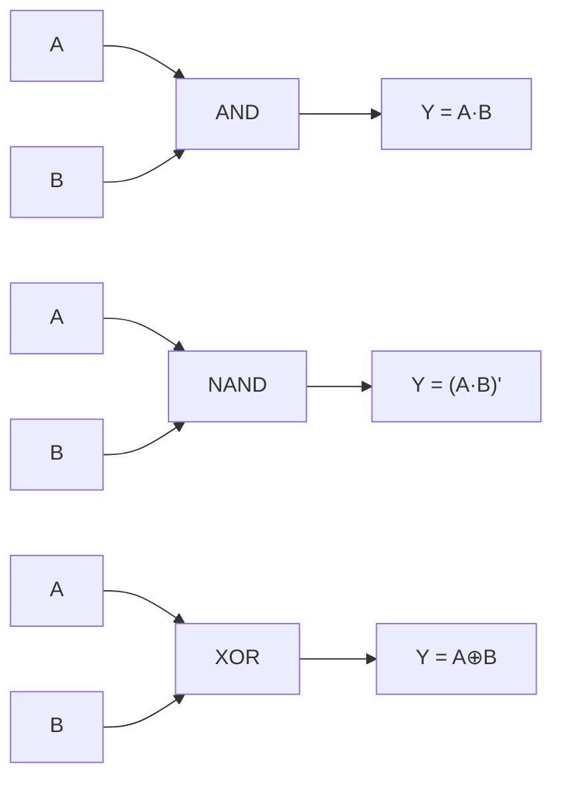
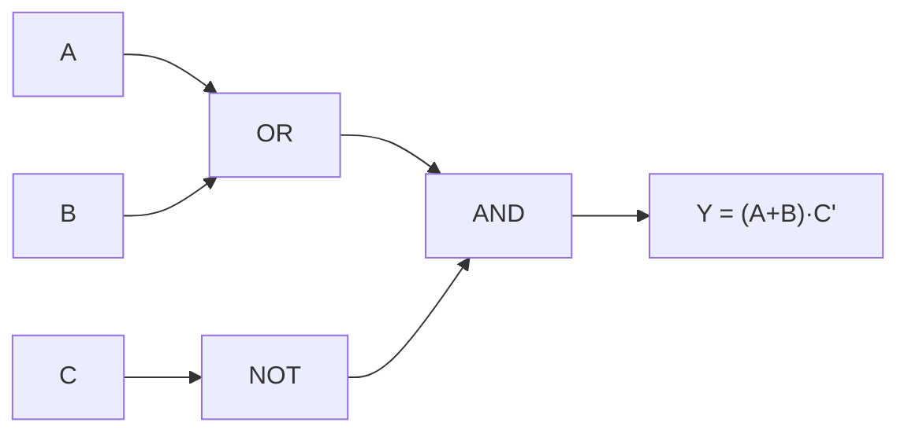

## Learning Objectives

- Define a logic gate as the physical hardware realization of a single boolean connective, and explain what it means for a truth table to serve as both a gate's specification and its acceptance test.
- Draw and interpret the standard schematic symbols and truth tables for AND, OR, NOT, buffer, NAND, NOR, XOR, and XNOR.
- Write the boolean expression corresponding to each of the eight standard gates, and vice versa.
- Extend a 2-input AND, OR, NAND, and NOR gate to 3 or more inputs, and construct the corresponding truth table.
- Derive the XOR truth table from first principles and show that XOR is equivalent to A·B′ + A′·B.
- Explain, at a conceptual level, why NAND and NOR are each built from fewer transistors than AND and OR in CMOS technology, without needing transistor-level detail.

## Context & Motivation

The previous concept treated AND, OR, and NOT purely as algebraic operators, subject to laws like commutativity, associativity, and De Morgan's theorem, manipulated entirely on paper. This concept makes the jump from symbol to circuit: a **logic gate** is a small piece of hardware — historically a relay, later a vacuum tube, and today a handful of transistors — that takes one or more two-valued (0/1) electrical inputs and produces a two-valued output according to exactly one boolean function. Where boolean algebra lets you rewrite `¬(A ∧ B)` as `¬A ∨ ¬B` on paper with total freedom, a gate is committed the moment it is fabricated: a NAND gate physically *is* the function ¬(A∧B), wired in silicon, and it computes nothing else. The algebra tells you which rewritings are valid; gates are what actually exist on the chip once you stop rewriting and start building.

This distinction matters because it is the first place in the discipline where an abstract mathematical object (a boolean function) is paired with a concrete physical implementation and a way of testing that the implementation is correct. A truth table is not merely a teaching aid for reasoning about a connective — for a real, manufactured gate, the truth table *is* the specification the chip is contractually supposed to meet, and it is exactly the acceptance test an engineer would run (apply every input combination, check every output) to verify a batch of fabricated parts. This specification-equals-test relationship reappears at every larger scale in this discipline: a truth table specifies a gate, and later a full ISA specifies a CPU, each checked by exhaustively trying inputs and confirming the promised outputs.

Once the standard gate library — AND, OR, NOT, NAND, NOR, XOR, XNOR, and the plain buffer — is fixed, the next concept in this discipline asks a much sharper question: do you actually need all seven distinct gate types, or can one of them alone build all the others? The answer, covered in "NAND as a Universal Gate," is that a single gate type suffices for everything, which is the entire reason real chips are fabricated from one repeated building block rather than seven different ones. None of that argument is meaningful, however, until the individual gates and their truth tables — the subject of this concept — are precisely nailed down first.

## Core Theory

### A gate as physical hardware for a boolean connective

A **logic gate** is a physical device with one or more binary inputs and exactly one binary output, where the output is a fixed function of the inputs at every instant (ignoring the tiny propagation delay real hardware always has). Gates are the physical embodiment of the boolean connectives (∧, ∨, ¬, ⊕) studied algebraically in the previous concept. In digital logic diagrams, each gate type has a standardized schematic symbol, and each gate is fully described by its **truth table** — an exhaustive list of every possible input combination paired with the corresponding output.

Two properties make the truth table special, beyond being a convenient reference:

1. **It is the specification.** A gate's truth table is the complete, unambiguous definition of what the gate is supposed to do — there is no additional information needed to describe an ideal gate's behavior.
2. **It is the acceptance test.** For an N-input gate there are exactly `2^N` input combinations, a finite and typically small number; testing a fabricated gate by trying every row of its truth table and checking the output is a complete, exhaustive verification, not a sample.

Modern gates are built from transistors (CMOS technology uses networks of PMOS and NMOS transistors), but this discipline treats gates as **primitives** from this point forward — atomic building blocks whose internal transistor structure is not needed to reason about the circuits built on top of them, in the same way a programmer treats a CPU instruction as a primitive without needing to know its microarchitectural implementation.

### The standard single- and two-input gates

**Buffer** (or "driver") is the trivial one-input gate: output equals input, `Y = A`. It is not a logical operation in the boolean-algebra sense (it computes the identity function) but it exists physically to restore signal strength or add controlled delay.

| A | Y = A |
|---|---|
| 0 | 0 |
| 1 | 1 |

**NOT** (inverter) is the one-input gate realizing negation, `Y = A′` (also written ¬A).

| A | Y = A′ |
|---|---|
| 0 | 1 |
| 1 | 0 |

**AND** realizes conjunction, `Y = A · B`, true only when every input is true.

| A | B | Y = A·B |
|---|---|---|
| 0 | 0 | 0 |
| 0 | 1 | 0 |
| 1 | 0 | 0 |
| 1 | 1 | 1 |

**OR** realizes disjunction, `Y = A + B`, true when at least one input is true.

| A | B | Y = A+B |
|---|---|---|
| 0 | 0 | 0 |
| 0 | 1 | 1 |
| 1 | 0 | 1 |
| 1 | 1 | 1 |

**NAND** ("NOT AND") is the composition Y = (A·B)′ — invert whatever AND would output.

| A | B | Y = (A·B)′ |
|---|---|---|
| 0 | 0 | 1 |
| 0 | 1 | 1 |
| 1 | 0 | 1 |
| 1 | 1 | 0 |

**NOR** ("NOT OR") is Y = (A+B)′ — invert whatever OR would output.

| A | B | Y = (A+B)′ |
|---|---|---|
| 0 | 0 | 1 |
| 0 | 1 | 0 |
| 1 | 0 | 0 |
| 1 | 1 | 0 |

**XOR** ("exclusive OR") is true exactly when its inputs differ, Y = A ⊕ B.

| A | B | Y = A⊕B |
|---|---|---|
| 0 | 0 | 0 |
| 0 | 1 | 1 |
| 1 | 0 | 1 |
| 1 | 1 | 0 |

**XNOR** ("exclusive NOR") is true exactly when its inputs agree, Y = (A⊕B)′, the complement of XOR.

| A | B | Y = (A⊕B)′ |
|---|---|---|
| 0 | 0 | 1 |
| 0 | 1 | 0 |
| 1 | 0 | 0 |
| 1 | 1 | 1 |

### Multi-input gates

AND, OR, NAND, and NOR generalize naturally beyond two inputs because ∧ and ∨ are associative: a 3-input AND gate outputs 1 only when all three inputs are 1 (`Y = A·B·C`), and a 3-input OR gate outputs 1 when at least one input is 1 (`Y = A+B+C`). Their truth tables simply grow to `2^N` rows for N inputs, but the defining rule stays "all inputs true" (AND) or "at least one input true" (OR). A 3-input NAND is the complement of the 3-input AND, `Y = (A·B·C)′`, and analogously for a 3-input NOR. Real gate libraries commonly include 2-, 3-, 4-, and 8-input variants of AND, OR, NAND, and NOR because it is cheaper to fabricate one wide gate than to chain several narrow ones when only the final output matters. XOR and XNOR are typically kept 2-input in most gate libraries; wider parity functions are more often built by chaining 2-input XORs than as a single physical gate.

### Why NAND and NOR are the "cheap" gates in CMOS

In CMOS fabrication, NAND and NOR are each built directly from a single stage of transistors (a pull-up network of PMOS transistors and a pull-down network of NMOS transistors), while AND and OR require an additional inverter stage tacked onto a NAND or NOR core (AND = NAND followed by NOT; OR = NOR followed by NOT). A NAND or NOR gate therefore uses fewer transistors and switches faster than the corresponding AND or OR gate built from it. This fact — that "inverted" gates are the physically primitive ones, not the "positive" gates most people find intuitive to reason about first — is the physical seed of the next concept's central claim: that real chips standardize on NAND (or NOR) as their one universal building block rather than AND, OR, and NOT as three separate parts.

## Worked Examples

### Example 1: Deriving XOR's truth table and showing XOR = A·B′ + A′·B

**Step 1 — build the truth table from the definition** "true exactly when the two inputs differ":

| A | B | A⊕B |
|---|---|---|
| 0 | 0 | 0 |
| 0 | 1 | 1 |
| 1 | 0 | 1 |
| 1 | 1 | 0 |

**Step 2 — read off the expression from the rows where the output is 1.** Row 2 (A=0, B=1) contributes the term A′·B (A is 0, so A′ is 1; B is 1). Row 3 (A=1, B=0) contributes the term A·B′. Summing the contributing rows (this is exactly the sum-of-products construction): `Y = A·B′ + A′·B`.

**Step 3 — verify the derived expression against every row of the original truth table.**

- A=0, B=0: `A·B′ = 0·1 = 0`; `A′·B = 1·0 = 0`; sum = 0. Matches table (0). ✓
- A=0, B=1: `A·B′ = 0·0 = 0`; `A′·B = 1·1 = 1`; sum = 1. Matches table (1). ✓
- A=1, B=0: `A·B′ = 1·1 = 1`; `A′·B = 0·0 = 0`; sum = 1. Matches table (1). ✓
- A=1, B=1: `A·B′ = 1·0 = 0`; `A′·B = 0·1 = 0`; sum = 0. Matches table (0). ✓

All four rows agree, so `A⊕B = A·B′ + A′·B` is confirmed — an identity used again later when building adders out of XOR.

### Example 2: Listing the gates and truth table for Y = (A + B) · C′

**Step 1 — identify the gates needed, in the order the signal flows.** The expression has three operations: an OR of A and B, a NOT of C, and an AND combining those two results. So the circuit needs: one 2-input OR gate, one NOT gate (inverter), and one 2-input AND gate — three gates total.

**Step 2 — wire them.** A and B feed the OR gate, producing an intermediate signal `A+B`. C feeds the NOT gate, producing `C′`. The OR gate's output and the NOT gate's output both feed the final AND gate, producing `Y = (A+B)·C′`.

**Step 3 — build the truth table.** There are 3 inputs, so 8 rows.

| A | B | C | A+B | C′ | Y=(A+B)·C′ |
|---|---|---|---|---|---|
| 0 | 0 | 0 | 0 | 1 | 0 |
| 0 | 0 | 1 | 0 | 0 | 0 |
| 0 | 1 | 0 | 1 | 1 | 1 |
| 0 | 1 | 1 | 1 | 0 | 0 |
| 1 | 0 | 0 | 1 | 1 | 1 |
| 1 | 0 | 1 | 1 | 0 | 0 |
| 1 | 1 | 0 | 1 | 1 | 1 |
| 1 | 1 | 1 | 1 | 0 | 0 |

Reading the last column: Y is 1 exactly for the three rows where (A+B) is 1 and C is 0, matching intuition — the output is 1 whenever at least one of A, B is set and C is not set.

### Example 3: Showing NAND's truth table is exactly NOT(AND)

**Step 1 — write out the AND truth table** and, alongside it, invert every output value.

| A | B | A·B | (A·B)′ |
|---|---|---|---|
| 0 | 0 | 0 | 1 |
| 0 | 1 | 0 | 1 |
| 1 | 0 | 0 | 1 |
| 1 | 1 | 1 | 0 |

**Step 2 — compare column-by-column against the standard NAND truth table given earlier** in Core Theory: rows read (0,1), (1,1), (1,1), (0,0) for (A·B, NAND) across the four input combinations — identical to the (A·B, (A·B)′) pairing above in every row.

**Step 3 — conclude.** Since the two truth tables agree on every one of the 4 rows (an exhaustive check, not a sample, per the acceptance-test property from Core Theory), NAND(A,B) = (A·B)′ = ¬(A∧B) is verified as an identity, not merely a naming convention. The same row-by-row comparison, applied to OR's table with every output flipped, would equally verify NOR(A,B) = (A+B)′.

## Common Misconceptions & Pitfalls

- **"A gate and a boolean connective are the same thing."** They are closely related but not identical: ∧, ∨, ¬ are mathematical operators that exist independent of any physical realization, while a gate is a specific piece of hardware built to compute one of them. The distinction matters once propagation delay, fan-out, and power consumption enter the picture — properties a mathematical connective simply does not have.
- **"NAND and NOR are exotic, secondary gates, since AND/OR/NOT feel more fundamental."** In CMOS hardware it is the reverse: NAND and NOR are built directly with one transistor stage, while AND and OR require an extra inverter tacked onto a NAND or NOR core, making NAND/NOR the physically cheaper and faster primitives. Treating AND/OR as "basic" is a habit carried over from math class, not from the fabrication process.
- **"XOR just means 'or,' loosely."** Plain OR is true when at least one input is 1, including when both are 1; XOR is true only when the inputs differ, so XOR(1,1) = 0 while OR(1,1) = 1. Confusing the two is a common source of off-by-one-style logic bugs when XOR is intended to test "exactly one of these conditions holds."
- **"A truth table with N inputs needs N rows."** It needs `2^N` rows — every possible combination of the N binary inputs, not one row per input. A 3-input gate has 8 rows, not 3; missing this is a common source of incomplete truth tables.
- **"XNOR is the same as NOT applied to each input of XOR, i.e., XNOR(A,B) = XOR(A′,B′)."** XNOR is the complement of the *output* of XOR, `(A⊕B)′`, not XOR applied to complemented inputs. It happens that `XOR(A′,B′) = XOR(A,B)` (complementing both inputs doesn't change whether they differ), so this can look accidentally consistent on a 2-input case, but it is not the same construction and does not generalize to other gates.
- **"A buffer gate is pointless since Y=A does nothing."** A buffer performs no boolean transformation, but physically it can restore a weakened signal's voltage levels and add a controlled, predictable delay — real, necessary hardware functions the boolean formula alone does not capture.

## Summary

A logic gate is the physical hardware realization of a single boolean connective, and its truth table serves simultaneously as its complete specification and as the exhaustive test used to verify it — a pattern (specify with a table, test by trying every row) that recurs at every larger scale in this discipline. The standard library covers the buffer and NOT as one-input gates, AND/OR/NAND/NOR/XOR/XNOR as two-input (and, for AND/OR/NAND/NOR, freely extensible to N-input) gates, each with a fixed truth table and boolean expression, and each treated from here on as an atomic primitive whose internal transistor structure need not be revisited. The perhaps-surprising CMOS fact that NAND and NOR are cheaper to fabricate than AND and OR — because AND and OR are literally a NAND or NOR gate plus an extra inverter — sets up the next concept, "NAND as a Universal Gate," which shows that this one physically cheap gate type, alone, suffices to construct every other gate in the library.

## Documentation Links

- [MIT 6.004 — Combinational Logic Unit](https://ocw.mit.edu/courses/6-004-computation-structures-spring-2017/pages/c4/) — course unit covering combinational logic, gates, and truth tables as the hardware realization of boolean functions.
- [Nand2Tetris — Build a Modern Computer from First Principles](https://www.coursera.org/learn/build-a-computer) — course building a computer from elementary logic gates upward, starting from exactly the gate library covered in this concept.
